# DaloRADIUS Python Backend - 数据关系设计文档

## 1. 概述

本文档详细描述了 DaloRADIUS Python 后端的数据库设计和模型关系。系统采用 SQLAlchemy ORM 架构，支持 PostgreSQL 数据库，涵盖用户管理、RADIUS 协议、计费系统、网络访问服务器（NAS）管理、系统配置等核心业务领域。

## 2. 架构概述

### 2.1 模块结构

```
backend/app/models/
├── base.py              # 基础模型类和 Mixin
├── user.py             # 用户管理模型
├── radius.py           # RADIUS 协议相关模型
├── radius_groups.py    # RADIUS 组管理模型
├── accounting.py       # 计费和会话记录模型
├── billing.py          # 业务计费模型
├── nas.py              # NAS 设备管理模型
├── access_control.py   # 访问控制和字典模型
└── system.py           # 系统配置和日志模型
```

### 2.2 设计原则

1. **分层架构**: 清晰的领域分离，每个模块负责特定的业务逻辑
2. **标准化**: 统一的基础模型类和时间戳管理
3. **可扩展性**: 支持未来功能扩展和第三方集成
4. **性能优化**: 合理的索引设计和查询优化
5. **数据完整性**: 外键约束和枚举类型确保数据一致性

## 3. 核心实体关系图

### 3.1 整体系统架构

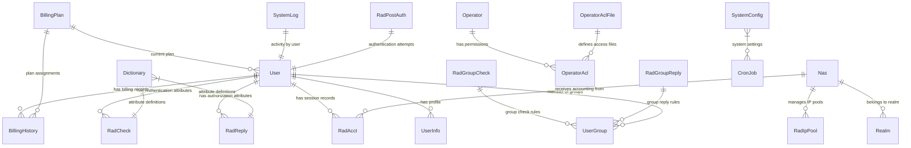

### 3.2 用户管理域

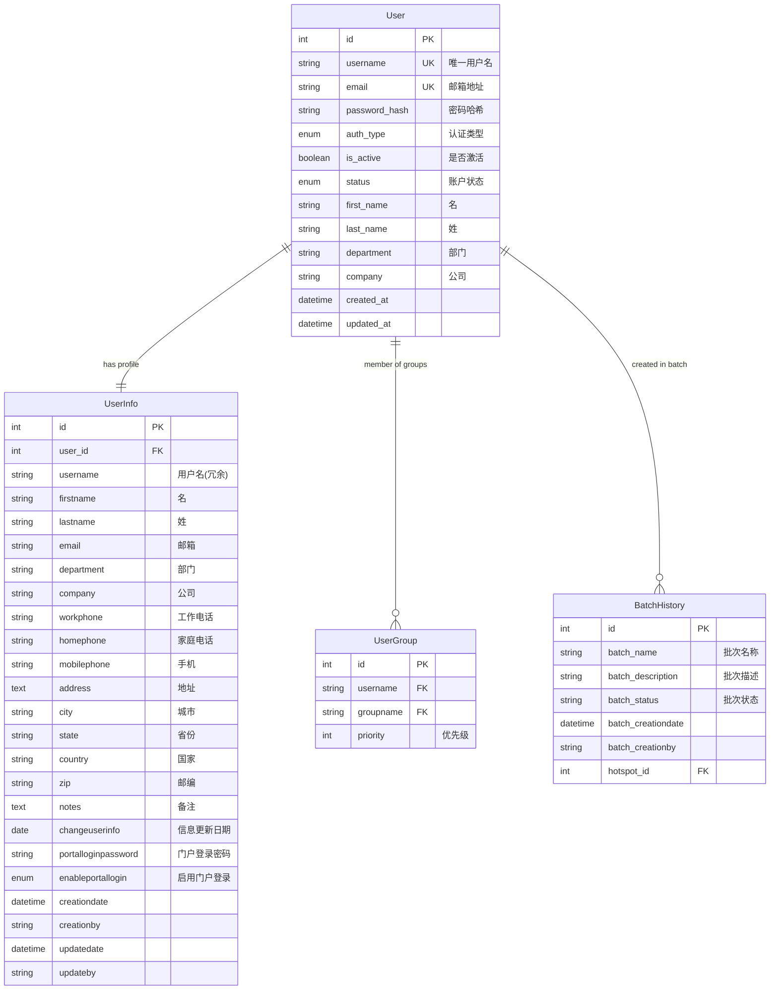

### 3.3 RADIUS 协议域

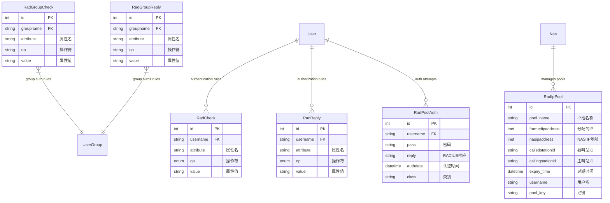

### 3.4 会话计费域

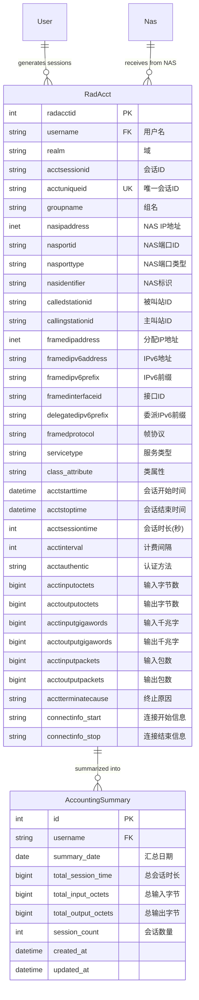

### 3.5 业务计费域


### 3.6 NAS 设备管理域

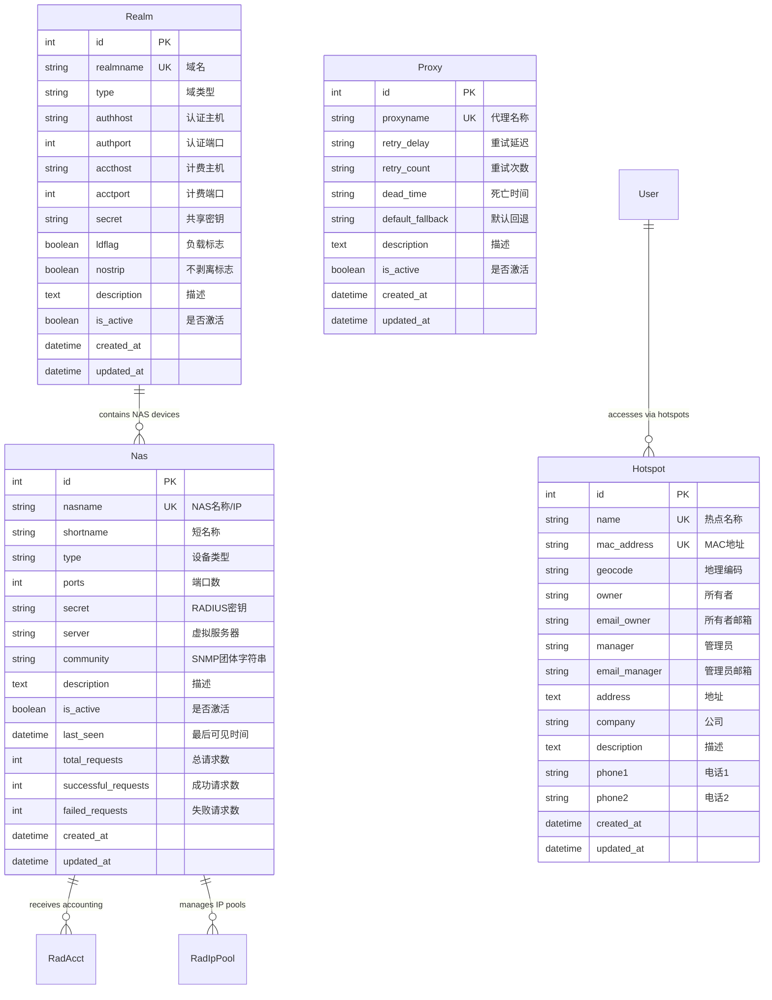

### 3.7 访问控制域

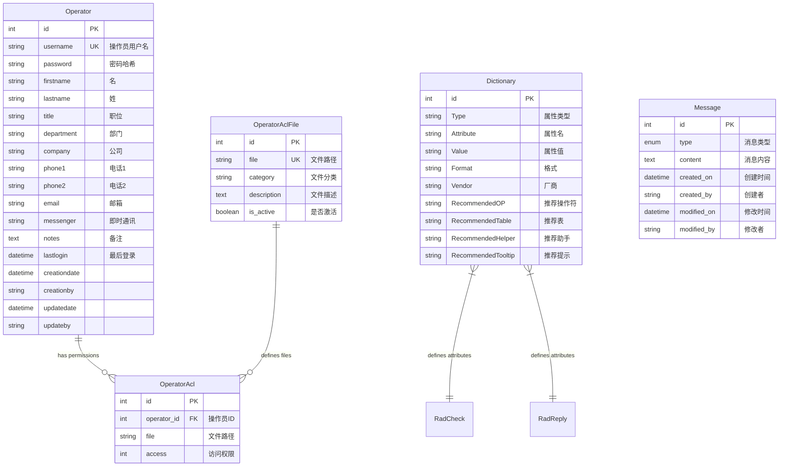

### 3.8 系统管理域

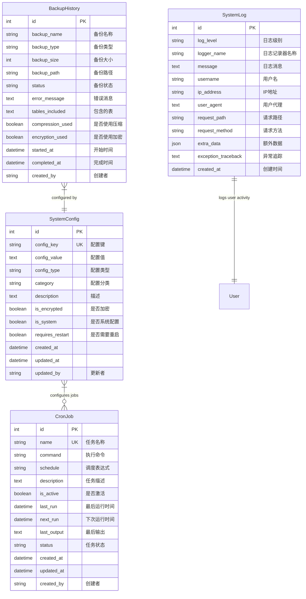

## 4. 数据流图

### 4.1 用户认证流程

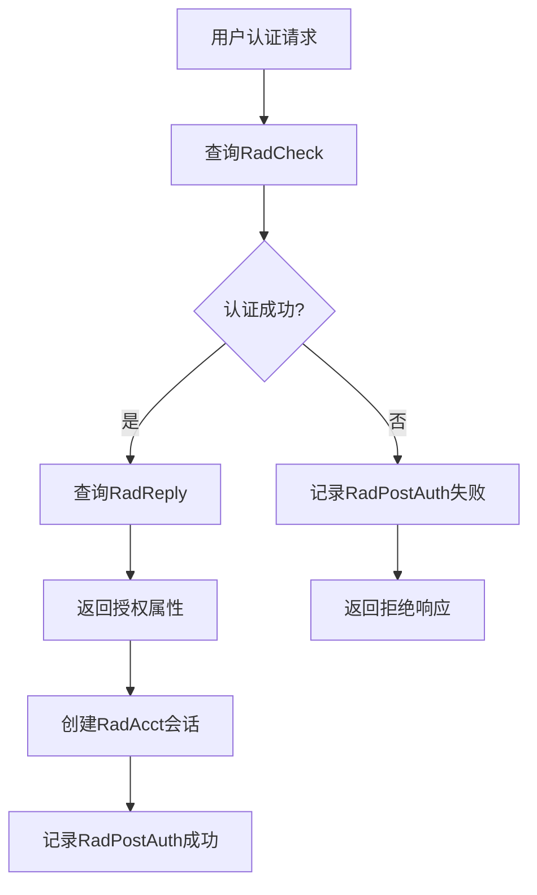

### 4.2 计费数据处理流程

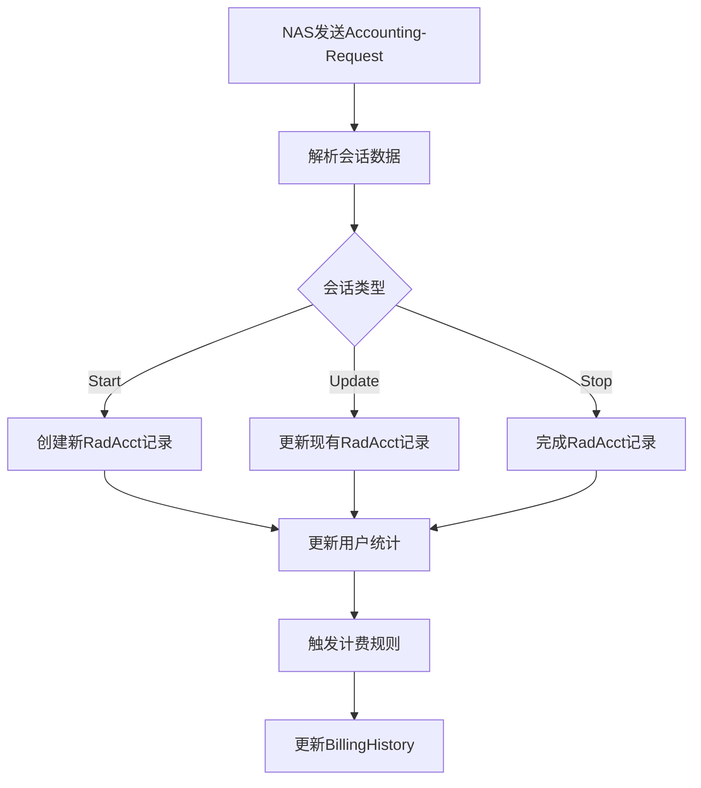

### 4.3 系统配置管理流程

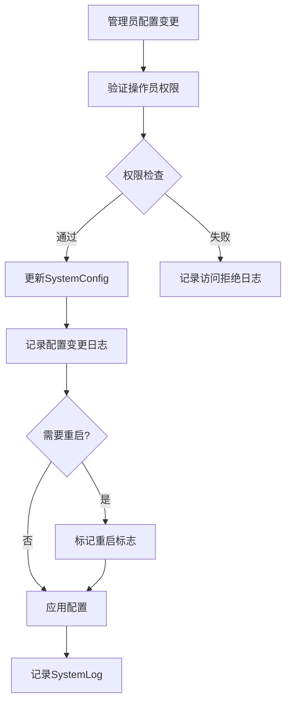

## 5. 性能优化设计

### 5.1 索引策略

1. **主键索引**: 所有表都有自增主键
2. **唯一索引**: 用户名、邮箱等唯一字段
3. **外键索引**: 提高关联查询性能
4. **复合索引**: 常用查询组合字段
5. **时间索引**: 按时间范围查询的字段

### 5.2 分区策略

```sql
-- RadAcct 表按时间分区
CREATE TABLE radacct_y2024m01 PARTITION OF radacct
    FOR VALUES FROM ('2024-01-01') TO ('2024-02-01');

-- SystemLog 表按日志级别分区  
CREATE TABLE systemlog_error PARTITION OF systemlogs
    FOR VALUES IN ('ERROR', 'CRITICAL');
```

### 5.3 查询优化

1. **预加载关联**: 使用 SQLAlchemy 的 `joinedload`
2. **批量操作**: 避免 N+1 查询问题
3. **缓存策略**: Redis 缓存热点数据
4. **连接池**: 数据库连接池管理
5. **读写分离**: 主从数据库架构支持

## 6. 数据完整性约束

### 6.1 外键约束

```sql
-- 用户相关约束
ALTER TABLE radcheck ADD CONSTRAINT fk_radcheck_username 
    FOREIGN KEY (username) REFERENCES users(username) ON DELETE CASCADE;

ALTER TABLE radreply ADD CONSTRAINT fk_radreply_username
    FOREIGN KEY (username) REFERENCES users(username) ON DELETE CASCADE;

-- 计费约束
ALTER TABLE billing_history ADD CONSTRAINT fk_billing_user
    FOREIGN KEY (username) REFERENCES users(username) ON DELETE RESTRICT;
```

### 6.2 业务规则约束

1. **用户名唯一性**: 跨表用户名一致性检查
2. **会话完整性**: RadAcct 记录的开始/结束时间逻辑性
3. **计费一致性**: 使用量与计费记录匹配
4. **权限层次**: 操作员权限继承关系

### 6.3 数据校验

```python
# 用户模型校验示例
class User(BaseModel):
    @validates('email')
    def validate_email(self, key, email):
        if email and not re.match(r'^[\w\.-]+@[\w\.-]+\.\w+$', email):
            raise ValueError("Invalid email format")
        return email
    
    @validates('username') 
    def validate_username(self, key, username):
        if not re.match(r'^[a-zA-Z0-9_-]{3,64}$', username):
            raise ValueError("Username must be 3-64 chars, alphanumeric")
        return username
```

## 7. 安全设计

### 7.1 敏感数据保护

1. **密码加密**: bcrypt 哈希存储
2. **RADIUS 密钥**: AES 加密存储
3. **审计日志**: 所有敏感操作记录
4. **数据脱敏**: 日志中的敏感信息脱敏

### 7.2 访问控制

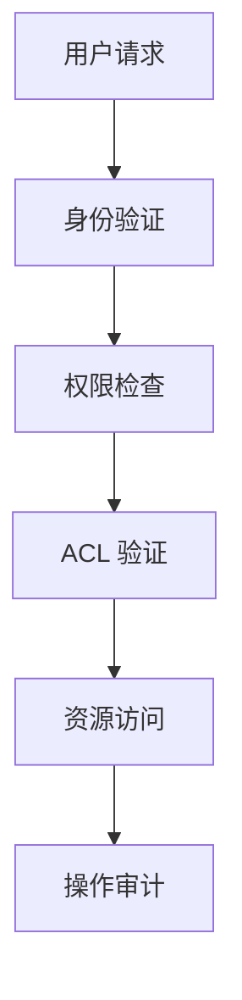

### 7.3 数据备份与恢复

1. **定期备份**: 自动化数据库备份
2. **增量备份**: 减少备份时间和存储
3. **加密备份**: 备份文件加密存储
4. **恢复测试**: 定期恢复测试验证

## 8. 监控与维护

### 8.1 性能监控

```python
# 数据库性能监控指标
class DatabaseMetrics:
    - connection_pool_usage: float
    - query_execution_time: dict
    - slow_query_count: int  
    - active_session_count: int
    - lock_wait_time: float
```

### 8.2 数据质量监控

1. **数据一致性检查**: 定期检查外键完整性
2. **业务规则验证**: 自动化业务逻辑检查
3. **异常数据告警**: 异常模式检测和告警
4. **数据清理**: 过期数据自动清理

## 9. 扩展性设计

### 9.1 水平扩展

1. **分库分表**: 按用户或时间维度分片
2. **读写分离**: 主从复制架构
3. **缓存层**: Redis 集群缓存
4. **消息队列**: 异步处理计费数据

### 9.2 功能扩展

1. **插件架构**: 支持第三方插件集成
2. **API 版本控制**: REST API 版本化管理
3. **事件驱动**: 基于事件的松耦合架构
4. **微服务准备**: 模块化设计便于微服务拆分

## 10. 总结

DaloRADIUS Python 后端的数据库设计遵循了现代化的架构原则，通过合理的表结构设计、索引优化、约束定义和安全机制，确保了系统的高性能、高可用性和数据安全性。设计充分考虑了 RADIUS 协议的复杂性和网络计费系统的业务需求，为构建可扩展的网络认证计费平台提供了坚实的数据基础。

### 关键特性

- ✅ **完整的 RADIUS 协议支持**: 包括认证、授权、计费的完整流程
- ✅ **灵活的计费系统**: 支持多种计费模式和业务规则  
- ✅ **强大的用户管理**: 用户生命周期管理和批量操作
- ✅ **细粒度权限控制**: 基于文件和操作的访问控制
- ✅ **全面的审计跟踪**: 完整的操作日志和审计记录
- ✅ **高性能设计**: 合理的索引和查询优化
- ✅ **可扩展架构**: 支持水平扩展和功能扩展

该设计为 DaloRADIUS 系统的 Python 重构提供了现代化、可维护的数据层基础，能够支撑大规模网络环境下的认证计费需求。