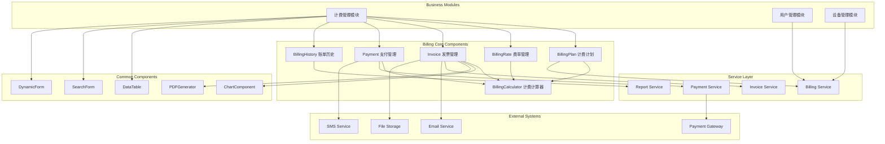
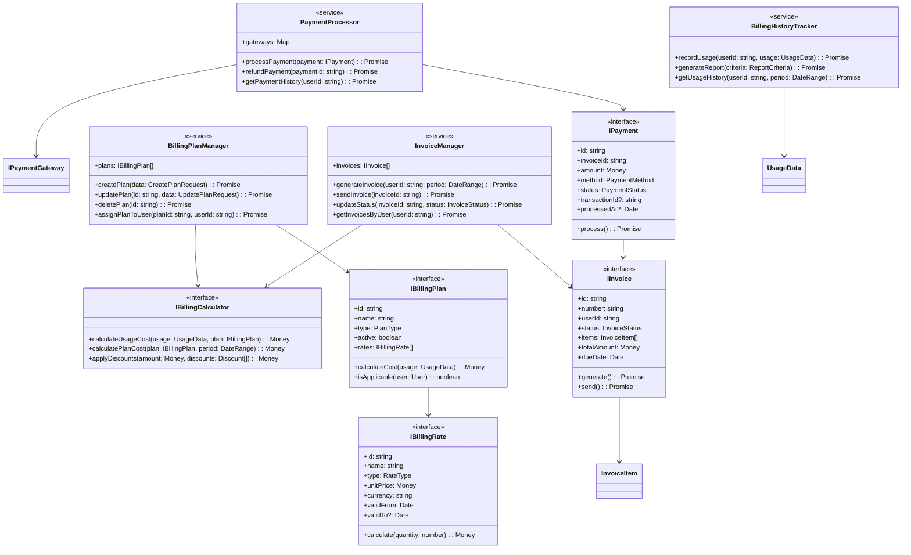
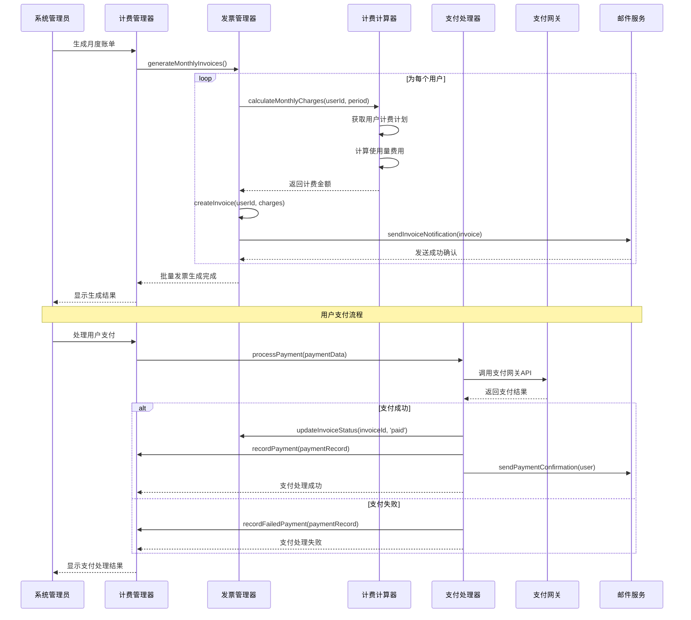
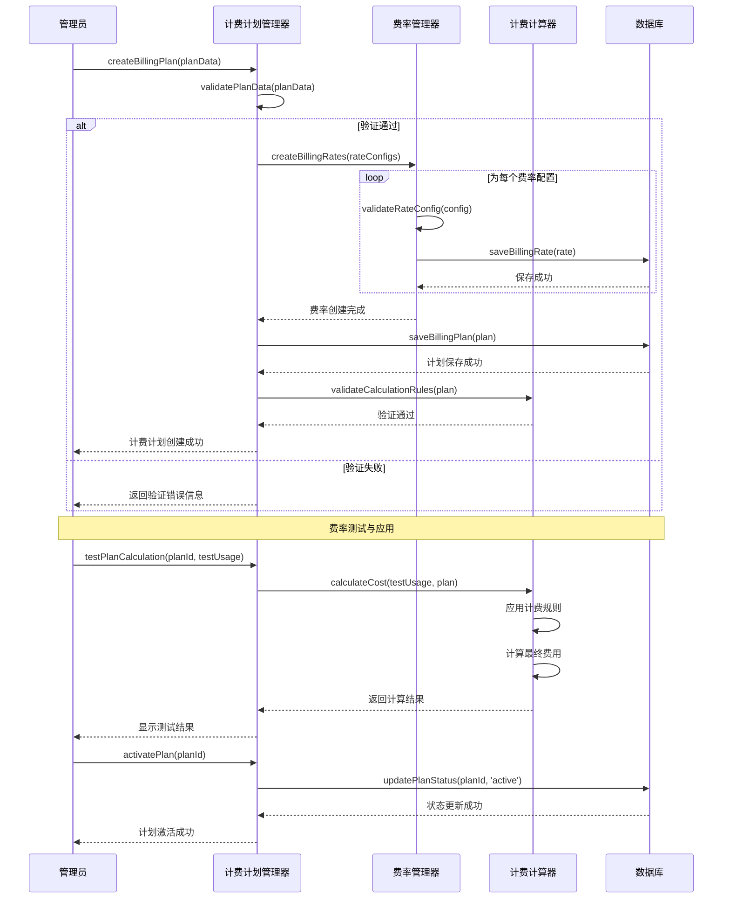
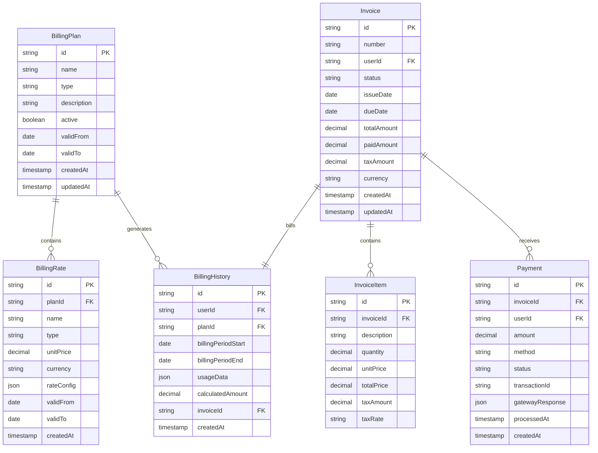
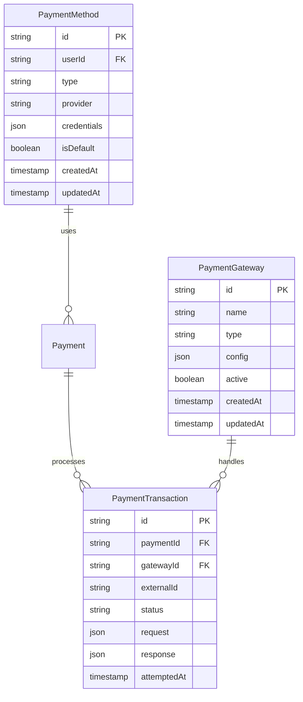

# daloRADIUS 计费管理模块设计文档

## 1. 模块概述 (Module Overview)

### 职责
计费管理模块负责处理 daloRADIUS 系统中的完整计费业务流程，专注于费率管理、计费计划、发票生成、支付处理和账单历史等核心财务功能的抽象封装与业务逻辑实现。

### 设计目标
- **业务完整性**：覆盖从费率定义到账单收款的完整计费生命周期
- **数据一致性**：确保财务数据的准确性和一致性，支持事务处理
- **可扩展性**：支持多种计费模式、支付方式和发票类型的扩展
- **审计追踪**：提供完整的操作审计和财务报表功能

## 2. 设计原则与模式 (Design Principles & Patterns)

### 原则应用

**SRP (单一职责原则)**：每个模块专注于特定的计费功能领域
- `BillingPlan`：专注于计费计划的定义和管理
- `BillingRate`：专注于费率配置和计算逻辑
- `Invoice`：专注于发票的生成、管理和状态跟踪
- `Payment`：专注于支付处理和记录管理

**OCP (开闭原则)**：通过策略模式支持业务规则扩展
- 费率计算策略：支持固定费率、阶梯费率、时段费率等多种算法
- 支付网关抽象：支持不同支付方式的无侵入式集成
- 发票模板系统：支持自定义发票格式和字段

**DIP (依赖倒置原则)**：核心业务逻辑依赖抽象接口
- 所有计费组件通过 TypeScript 接口定义业务契约
- 数据持久化通过 Repository 模式抽象数据访问
- 外部服务通过适配器模式集成

**ISP (接口隔离原则)**：接口设计职责清晰且最小化
- `IBillingCalculator` 专注于费用计算
- `IInvoiceGenerator` 专注于发票生成
- `IPaymentProcessor` 专注于支付处理

**KISS & YAGNI**：基于 PHP 系统分析的实际业务需求设计
- 组件功能严格基于现有计费业务流程
- 避免引入当前不需要的复杂金融算法

### 设计模式

**策略模式 (Strategy Pattern)**：用于费率计算和支付处理
- `BillingCalculator` 根据计费类型选择不同的计算策略
- `PaymentProcessor` 支持多种支付网关的策略切换

**工厂模式 (Factory Pattern)**：用于发票和支付对象创建
- `InvoiceFactory` 根据业务类型创建不同类型的发票
- `PaymentFactory` 创建对应支付方式的处理器

**观察者模式 (Observer Pattern)**：用于计费状态变更通知
- 发票状态变更触发邮件通知和审计记录
- 支付成功触发账户余额更新和服务激活

**命令模式 (Command Pattern)**：用于复杂的计费操作
- 批量计费操作的事务管理
- 计费回滚和补偿机制

## 3. 架构视图 (Architectural Views)

### 组件图 (Component Diagram)



### 类图 (Class Diagram)



### 序列图 (Sequence Diagram)

#### 核心流程1：发票生成与支付处理



#### 核心流程2：计费计划管理与费率配置



## 4. 关键接口与契约 (Key Interfaces & Contracts)

### IBillingPlan - 计费计划接口

**职责**：定义计费计划的核心属性和行为

**方法签名**：
```typescript
interface IBillingPlan {
  id: string                    // 计划唯一标识
  name: string                  // 计划名称
  type: PlanType               // 计划类型 (monthly, usage, hybrid)
  description?: string         // 计划描述
  active: boolean             // 是否激活
  rates: IBillingRate[]       // 关联费率列表
  validFrom: Date             // 生效日期
  validTo?: Date              // 失效日期
  
  calculateCost(usage: UsageData): Promise<Money>      // 计算使用费用
  isApplicable(user: User, date?: Date): boolean       // 判断是否适用于用户
  getEffectiveRates(date: Date): IBillingRate[]        // 获取指定日期有效费率
}
```

**行为契约**：
- `calculateCost` 必须基于当前有效的费率进行计算
- `isApplicable` 在计划未激活时必须返回 false
- 费率变更时必须保证历史账单的准确性

### IInvoice - 发票管理接口

**职责**：管理发票的完整生命周期，从生成到支付完成

**方法签名**：
```typescript
interface IInvoice {
  id: string                    // 发票ID
  number: string               // 发票号码
  userId: string               // 用户ID
  status: InvoiceStatus        // 发票状态
  issueDate: Date             // 开票日期
  dueDate: Date               // 到期日期
  items: InvoiceItem[]        // 发票明细
  totalAmount: Money          // 总金额
  paidAmount: Money           // 已付金额
  
  generate(): Promise<Buffer>                    // 生成PDF发票
  send(method?: NotificationMethod): Promise<boolean>  // 发送发票
  addPayment(payment: IPayment): Promise<void>   // 记录支付
  markAsPaid(): Promise<void>                    // 标记为已付
  markAsOverdue(): Promise<void>                 // 标记为逾期
}
```

**行为契约**：
- 发票一旦生成，金额不可修改
- 支付金额累计不能超过发票总金额
- 状态变更必须触发相应的业务事件

### IPaymentProcessor - 支付处理接口

**职责**：处理各种支付方式的统一接口抽象

**方法签名**：
```typescript
interface IPaymentProcessor {
  supportedMethods: PaymentMethod[]             // 支持的支付方式
  
  processPayment(request: PaymentRequest): Promise<PaymentResult>     // 处理支付
  refundPayment(paymentId: string, amount?: Money): Promise<RefundResult>  // 退款处理
  queryPaymentStatus(transactionId: string): Promise<PaymentStatus>   // 查询支付状态
  validatePaymentData(data: PaymentData): ValidationResult            // 验证支付数据
}
```

**行为契约**：
- 支付处理必须是幂等操作
- 失败的支付必须记录详细错误信息
- 所有支付操作必须有审计日志

### IBillingCalculator - 计费计算器接口

**职责**：提供统一的费用计算逻辑

**方法签名**：
```typescript
interface IBillingCalculator {
  calculateUsageCost(usage: UsageData, rates: IBillingRate[]): Money     // 计算使用费用
  calculatePlanCost(plan: IBillingPlan, period: DateRange): Money        // 计算计划费用  
  applyDiscounts(amount: Money, discounts: Discount[]): Money            // 应用折扣
  calculateTax(amount: Money, taxRules: TaxRule[]): Money               // 计算税费
  prorateCost(fullAmount: Money, usage: Partial<DateRange>): Money      // 按比例计费
}
```

**行为契约**：
- 计算结果必须精确到货币最小单位
- 计算过程必须可重现和可审计
- 错误输入必须抛出明确的异常

## 5. 数据模型 (Data Model)

### 计费核心实体模型



### 支付网关集成模型



## 6. 演进性与考量 (Evolution & Considerations)

### 已知限制

1. **货币精度处理**：当前设计基于 decimal 类型，对于复杂的汇率换算可能存在精度损失
2. **并发计费处理**：高并发场景下的账单生成可能存在性能瓶颈
3. **历史数据迁移**：费率变更时的历史数据一致性保证复杂度较高
4. **税务合规性**：当前税务计算较为简化，未考虑复杂的国际税务规则

### 扩展方案

**基于 OCP 原则的扩展点**：

1. **新计费模式支持**：通过实现 `IBillingCalculator` 接口添加新的计费算法
```typescript
// 扩展示例：阶梯费率计算器
class TieredRateCalculator implements IBillingCalculator {
  calculateUsageCost(usage: UsageData, rates: IBillingRate[]): Money {
    // 实现阶梯费率计算逻辑
  }
}
```

2. **支付网关扩展**：通过适配器模式集成新的支付服务商
```typescript
// 扩展示例：新支付网关适配器
class NewPaymentGatewayAdapter implements IPaymentGateway {
  async processPayment(request: PaymentRequest): Promise<PaymentResult> {
    // 适配新支付网关的API调用
  }
}
```

3. **发票模板系统**：通过模板引擎支持自定义发票格式
```typescript
// 扩展示例：自定义发票模板
interface IInvoiceTemplate {
  render(invoice: IInvoice, options?: RenderOptions): Promise<Buffer>
}
```

4. **审计和合规扩展**：通过事件系统支持复杂的审计需求
```typescript
// 扩展示例：审计事件处理器
class ComplianceAuditor implements IBillingEventHandler {
  handleBillingEvent(event: BillingEvent): Promise<void> {
    // 实现合规性检查和记录
  }
}
```

### 性能考量

**计费性能**：
- 使用批量处理减少数据库访问次数
- 实现费率缓存机制避免重复计算
- 采用异步队列处理大批量账单生成

**数据一致性**：
- 使用数据库事务保证财务数据一致性
- 实现乐观锁机制防止并发修改冲突
- 建立数据备份和恢复机制

**扩展性设计**：
- 支持分库分表应对大数据量场景
- 实现读写分离优化查询性能
- 设计缓存策略减少数据库压力

### 安全考量

**数据安全**：
- 敏感财务数据的加密存储
- 支付信息的 PCI DSS 合规处理
- 审计日志的完整性保护

**业务安全**：
- 费率修改的多级审批机制
- 大额支付的人工审核流程
- 异常交易的实时监控和告警

**系统安全**：
- API 访问的身份验证和授权
- 支付接口的防重放攻击机制
- 财务报表的访问权限控制

---

## 结论

本计费管理模块设计严格遵循 SOLID 原则，通过抽象接口实现了高度的模块化和可扩展性。设计涵盖了从费率定义到支付完成的完整计费业务流程，为 daloRADIUS 系统提供了强大而灵活的财务管理能力。

模块架构的分层设计确保了业务逻辑与技术实现的分离，完善的接口契约保证了系统的可维护性和测试性。通过合理的扩展点设计，该模块能够适应未来复杂的计费需求和支付场景的变化。