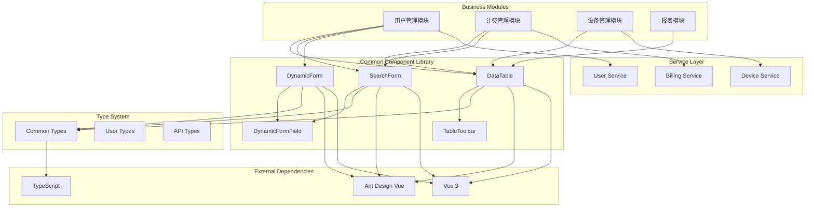
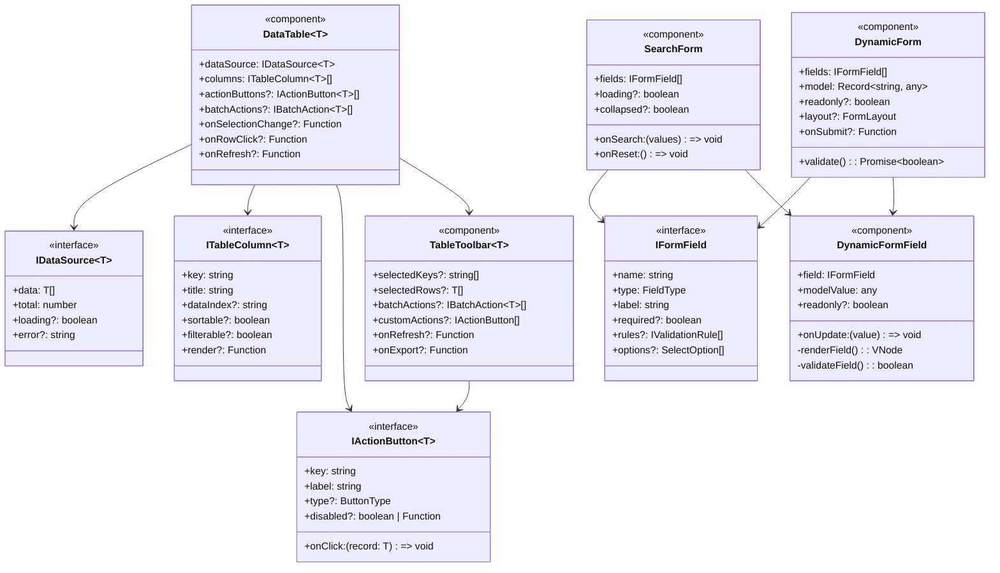
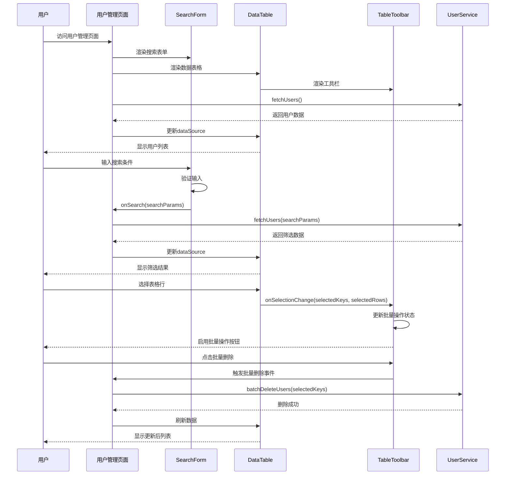
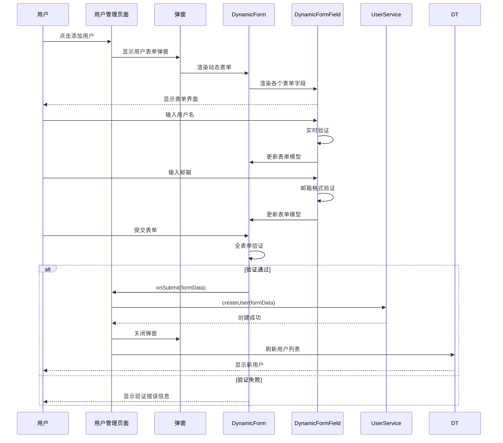
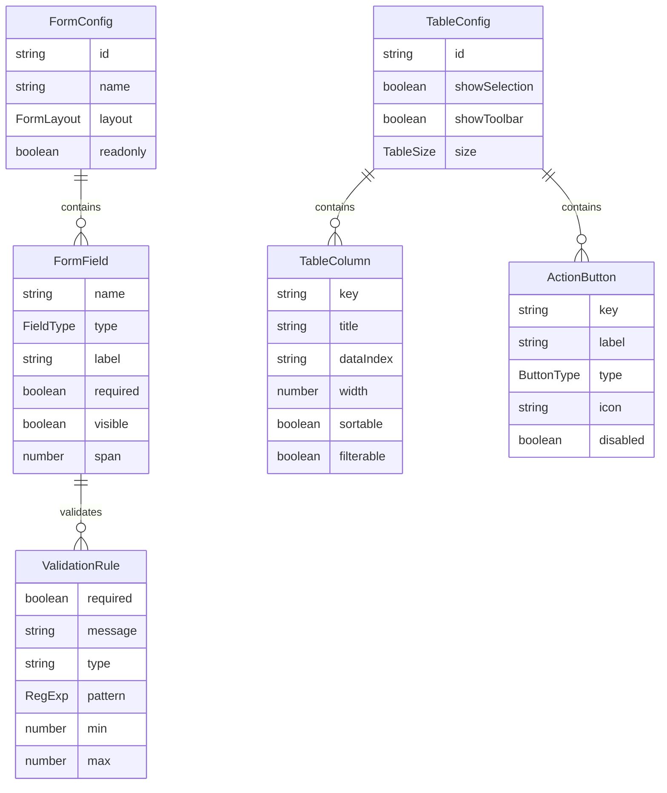
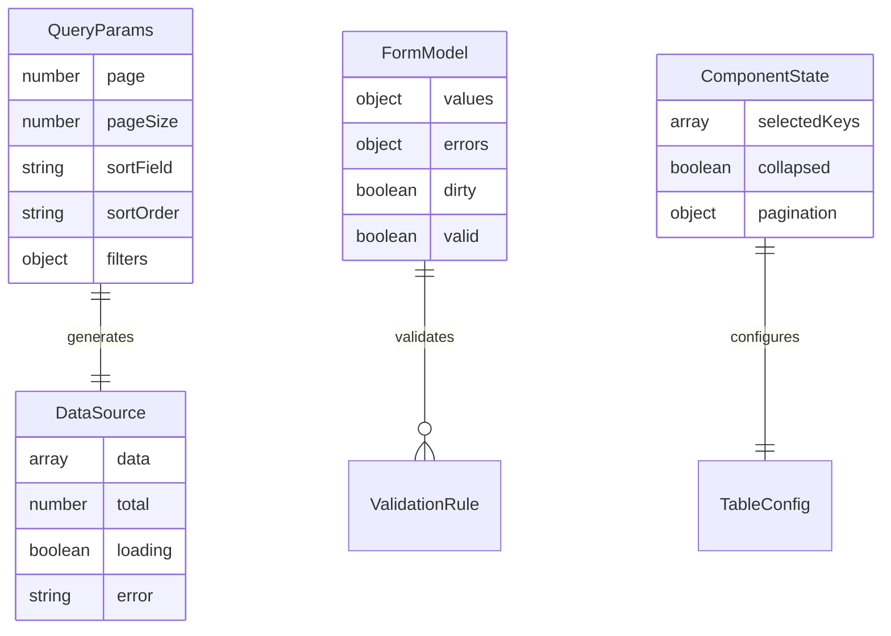

# daloRADIUS 前端通用组件库设计文档

## 1. 模块概述 (Module Overview)

### 职责
本通用组件库负责为 daloRADIUS 前端系统提供高度可复用、类型安全的 UI 组件集合，专注于数据交互、表单处理和表格展示等核心业务场景的抽象封装。

### 设计目标
- **高复用性**：通过 DRY 原则消除跨业务模块的代码重复
- **类型安全**：基于 TypeScript 提供完整的编译时类型检查
- **高扩展性**：遵循 OCP 原则，支持业务特定需求的无侵入式扩展
- **解耦合**：通过依赖倒置实现组件间的松耦合架构

## 2. 设计原则与模式 (Design Principles & Patterns)

### 原则应用

**SRP (单一职责原则)**：每个组件专注于单一功能领域
- `DataTable`：专注于数据表格渲染和交互
- `SearchForm`：专注于搜索条件的收集和验证
- `DynamicForm`：专注于动态表单的生成和管理

**OCP (开闭原则)**：通过插槽、渲染函数和配置项支持扩展
- 自定义渲染函数支持列的个性化展示
- 插槽机制允许注入自定义内容
- 配置驱动的架构支持新功能无代码添加

**DIP (依赖倒置原则)**：组件依赖抽象接口而非具体实现
- 所有组件通过 TypeScript 接口定义契约
- 数据源通过 `IDataSource` 接口抽象，支持任意数据提供方式
- 验证规则通过 `IValidationRule` 接口抽象

**ISP (接口隔离原则)**：接口设计小而专一
- `ITableColumn` 专注于列配置
- `IFormField` 专注于表单字段定义
- `IActionButton` 专注于操作按钮配置

**KISS & YAGNI**：基于当前明确需求进行设计，避免过度抽象
- 组件功能严格基于 PHP 系统分析的实际需求
- 不引入未使用的配置选项或抽象层

### 设计模式

**组合模式 (Composite Pattern)**：用于构建复杂表单和表格结构
- `DynamicForm` 组合 `DynamicFormField` 构建复杂表单
- `DataTable` 组合 `TableToolbar` 实现完整数据管理界面

**策略模式 (Strategy Pattern)**：用于字段类型和验证规则的动态选择
- `DynamicFormField` 根据字段类型动态选择渲染策略
- 验证规则通过策略模式支持多种验证算法

**观察者模式 (Observer Pattern)**：用于组件间的事件通信
- 表格选择变化通知工具栏更新
- 表单字段变化触发依赖字段更新

## 3. 架构视图 (Architectural Views)

### 组件图 (Component Diagram)



### 类图 (Class Diagram)



### 序列图 (Sequence Diagram)

#### 核心流程1：用户管理页面数据加载与交互



#### 核心流程2：动态表单创建与验证



## 4. 关键接口与契约 (Key Interfaces & Contracts)

### IDataSource<T> - 数据源抽象

**职责**：定义数据表格的统一数据接口

**方法签名**：
```typescript
interface IDataSource<T = any> {
  data: T[]           // 当前页面数据数组
  total: number       // 总数据量，用于分页计算
  loading?: boolean   // 加载状态，控制表格loading效果
  error?: string      // 错误信息，用于错误状态展示
}
```

**行为契约**：
- `data` 数组包含当前页的完整数据
- `total` 必须反映筛选后的真实总数
- 数据更新时必须同时更新 `loading` 状态

### ITableColumn<T> - 表格列配置

**职责**：定义表格列的渲染和交互行为

**方法签名**：
```typescript
interface ITableColumn<T = any> {
  key: string                    // 唯一标识符
  title: string                  // 列标题
  dataIndex?: string             // 数据字段路径
  width?: number | string        // 列宽度
  sortable?: boolean             // 是否支持排序
  filterable?: boolean           // 是否支持过滤
  render?: (value: any, record: T, index: number) => string | JSX.Element
}
```

**行为契约**：
- `key` 必须在同一表格内唯一
- `render` 函数优先级高于 `dataIndex`
- 启用 `sortable` 时必须处理排序事件

### IFormField - 表单字段抽象

**职责**：定义动态表单字段的完整配置

**方法签名**：
```typescript
interface IFormField {
  name: string                   // 字段名称，对应表单模型的键
  type: FieldType               // 字段类型，决定渲染方式
  label: string                 // 字段标签
  required?: boolean            // 是否必填
  disabled?: boolean            // 是否禁用
  visible?: boolean             // 是否可见
  rules?: IValidationRule[]     // 验证规则数组
  options?: SelectOption[]      // 选择类型字段的选项
  dependencies?: string[]       // 依赖字段名称数组
}
```

**行为契约**：
- `name` 必须与表单模型中的字段名对应
- `dependencies` 中的字段变化时，当前字段应重新渲染
- 验证规则按数组顺序执行，遇到错误即停止

### IActionButton<T> - 操作按钮接口

**职责**：定义表格行操作和批量操作的统一接口

**方法签名**：
```typescript
interface IActionButton<T = any> {
  key: string                           // 按钮唯一标识
  label: string                         // 按钮文本
  type?: ButtonType                     // 按钮类型，影响样式
  icon?: string                         // 图标名称
  disabled?: boolean | ((record: T) => boolean)  // 禁用状态或函数
  onClick: (record: T, index?: number) => void | Promise<void>  // 点击处理函数
}
```

**行为契约**：
- `onClick` 函数必须处理异步操作的错误
- `disabled` 函数在每次渲染时重新计算
- 异步操作期间应显示加载状态

## 5. 数据模型 (Data Model)

### 组件配置数据模型



### 数据流模型



## 6. 演进性与考量 (Evolution & Considerations)

### 已知限制

1. **表单字段依赖**：当前实现仅支持简单的字段显隐依赖，不支持复杂的联动计算
2. **表格虚拟滚动**：对于超大数据集（>10k条）的性能优化尚未实现
3. **国际化支持**：组件内置文本暂未支持多语言动态切换
4. **主题定制**：样式系统依赖 Ant Design Vue，自定义主题能力有限

### 扩展方案

**基于 OCP 原则的扩展点**：

1. **自定义字段类型**：通过实现 `IFormField` 接口和注册机制添加新字段类型
```typescript
// 扩展示例：添加富文本编辑器字段
interface RichTextField extends IFormField {
  type: 'richtext'
  toolbar?: string[]
  height?: number
}
```

2. **自定义表格列渲染器**：通过 `render` 函数实现业务特定的列展示
```typescript
// 扩展示例：添加状态徽章列
const statusColumn: ITableColumn = {
  key: 'status',
  title: '状态',
  render: (status) => <StatusBadge status={status} />
}
```

3. **插件化验证器**：通过扩展 `IValidationRule` 支持自定义验证逻辑
```typescript
// 扩展示例：添加异步验证器
interface AsyncValidationRule extends IValidationRule {
  asyncValidator: (value: any) => Promise<boolean>
}
```

4. **数据源适配器**：通过实现 `IDataSource` 接口支持不同的数据获取方式
```typescript
// 扩展示例：WebSocket 实时数据源
class WebSocketDataSource<T> implements IDataSource<T> {
  // 实现实时数据推送
}
```

### 性能考量

**渲染性能**：
- 使用 Vue 3 的 `shallowRef` 优化大数据集渲染
- 实现虚拟滚动支持超大表格
- 表单字段的条件渲染避免不必要的组件实例化

**内存管理**：
- 组件销毁时清理事件监听器和定时器
- 大数据集使用分页策略避免内存泄漏
- 图片等资源的懒加载机制

### 安全考量

**数据安全**：
- 表单输入的 XSS 防护
- 敏感数据的脱敏显示
- 文件上传的类型和大小限制

**权限控制**：
- 组件级别的权限验证
- 操作按钮的权限过滤
- 字段级别的访问控制

**网络安全**：
- API 调用的请求签名
- 敏感操作的二次确认
- 防止 CSRF 攻击的 token 验证

---

## 结论

本组件库设计严格遵循 SOLID 原则，通过抽象接口实现高度的可复用性和扩展性。基于当前 daloRADIUS 系统的实际需求，提供了完整的数据交互组件解决方案，为后续业务模块开发奠定了坚实的技术基础。

组件架构的模块化设计确保了系统的可维护性，而完善的类型系统则保证了开发期间的类型安全。通过合理的抽象层次和扩展点设计，该组件库能够适应未来业务需求的变化和技术栈的演进。