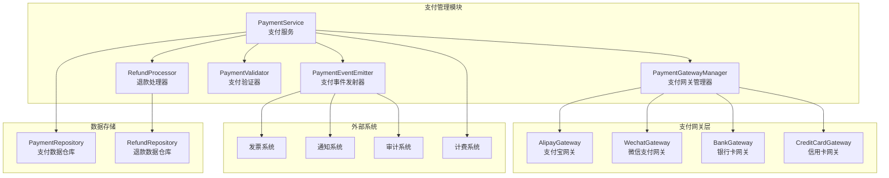
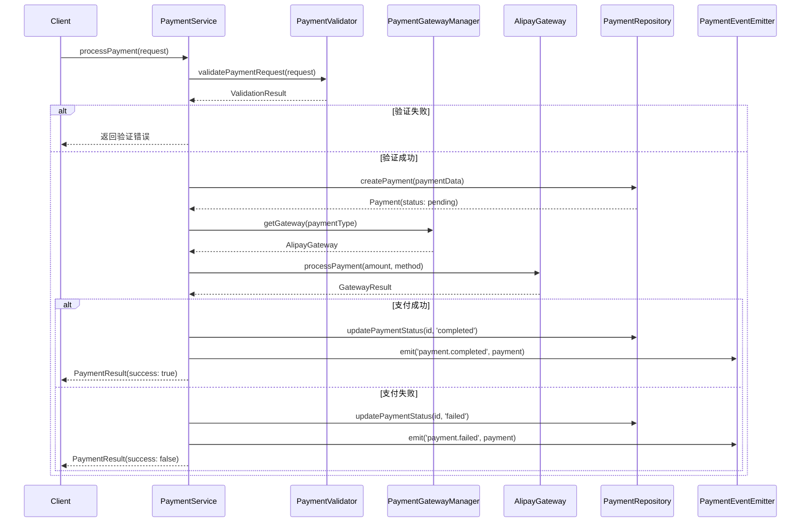
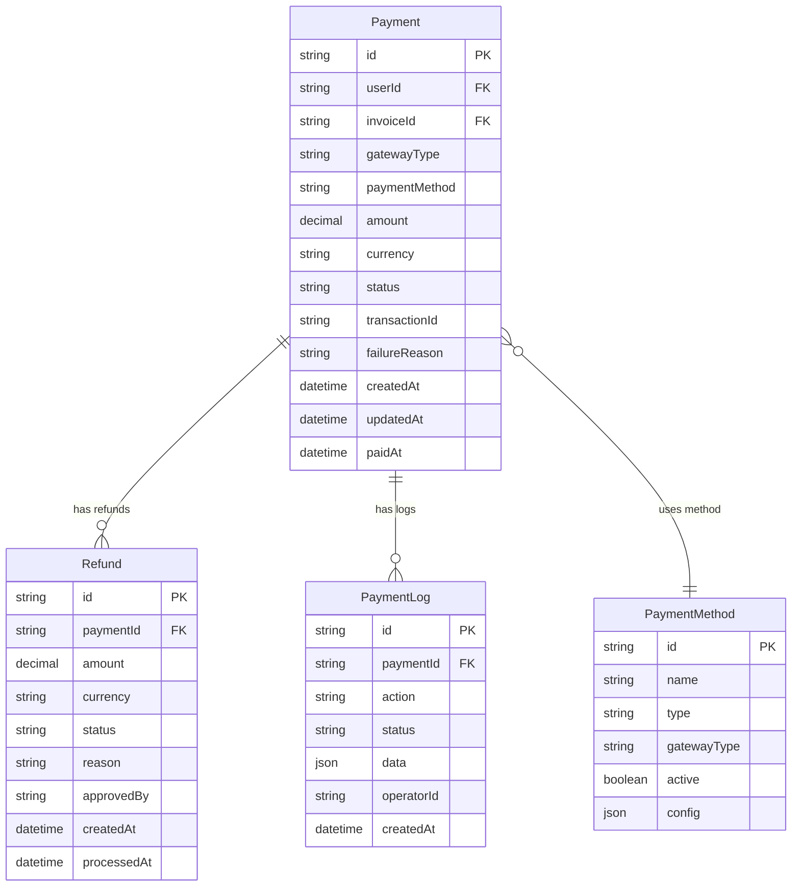

# daloRADIUS 支付管理模块设计文档

## 1. 模块概述 (Module Overview)

### 职责
支付管理模块负责处理系统中所有与支付相关的业务逻辑，包括支付记录管理、多种支付方式集成、支付状态跟踪、退款处理以及支付安全验证。

### 设计目标
- **高可扩展性**: 支持多种支付网关的无缝集成
- **数据一致性**: 确保支付流程中的事务完整性
- **安全性**: 实现支付敏感信息的安全处理
- **可审计性**: 完整的支付操作日志和追踪能力
- **高可用性**: 支持支付失败重试和降级处理

## 2. 设计原则与模式 (Design Principles & Patterns)

### 原则应用

**SRP (单一职责原则)**
- PaymentService: 专注于支付业务逻辑
- PaymentGatewayManager: 专责支付网关管理
- RefundProcessor: 独立处理退款逻辑
- PaymentValidator: 专门负责支付数据验证

**OCP (开闭原则)**
- 通过 PaymentGateway 接口支持新支付方式的扩展
- PaymentStrategy 模式允许添加新的支付处理策略
- 事件驱动架构支持支付流程的自定义扩展

**DIP (依赖倒置原则)**
- 高层支付服务依赖 PaymentGateway 抽象接口
- 支付处理器依赖 PaymentRepository 接口而非具体实现
- 通知系统依赖 NotificationService 抽象

**ISP (接口隔离原则)**
- PaymentGateway: 专注支付网关操作
- RefundableGateway: 专门处理退款能力
- PaymentEventListener: 独立的事件监听接口

### 设计模式

**策略模式 (Strategy Pattern)**
- 不同支付方式使用不同的支付策略实现
- 解决问题: 支付方式的多样性和动态选择

**工厂模式 (Factory Pattern)**
- PaymentGatewayFactory 根据配置创建对应的支付网关实例
- 解决问题: 支付网关实例的统一创建和管理

**观察者模式 (Observer Pattern)**
- 支付状态变更时通知相关订阅者（发票系统、用户通知等）
- 解决问题: 系统间的松耦合通信

## 3. 架构视图 (Architectural Views)

### 组件图 (Component Diagram)



### 类图 (Class Diagram)

```mermaid
classDiagram
    class PaymentService {
        <<service>>
        +processPayment(request: PaymentRequest): PaymentResult
        +getPayments(query: PaymentQuery): PaymentList
        +getPaymentStatus(id: string): PaymentStatus
        +cancelPayment(id: string): boolean
    }
    
    class PaymentGateway {
        <<interface>>
        +processPayment(amount: Money, method: PaymentMethod): GatewayResult
        +queryPayment(transactionId: string): PaymentStatus
        +verifyCallback(data: any): boolean
    }
    
    class RefundableGateway {
        <<interface>>
        +processRefund(paymentId: string, amount: Money): RefundResult
        +queryRefund(refundId: string): RefundStatus
    }
    
    class PaymentGatewayManager {
        +getGateway(type: PaymentType): PaymentGateway
        +registerGateway(type: PaymentType, gateway: PaymentGateway): void
        +getSupportedMethods(): PaymentMethod[]
    }
    
    class RefundProcessor {
        +processRefund(request: RefundRequest): RefundResult
        +getRefunds(query: RefundQuery): RefundList
        +approveRefund(id: string): boolean
    }
    
    class PaymentValidator {
        +validatePaymentRequest(request: PaymentRequest): ValidationResult
        +validateRefundRequest(request: RefundRequest): ValidationResult
        +validateAmount(amount: Money): boolean
    }
    
    class AlipayGateway {
        +processPayment(amount: Money, method: PaymentMethod): GatewayResult
        +queryPayment(transactionId: string): PaymentStatus
        +verifyCallback(data: any): boolean
        +processRefund(paymentId: string, amount: Money): RefundResult
    }
    
    class WechatGateway {
        +processPayment(amount: Money, method: PaymentMethod): GatewayResult
        +queryPayment(transactionId: string): PaymentStatus
        +verifyCallback(data: any): boolean
    }
    
    PaymentService --> PaymentGatewayManager
    PaymentService --> RefundProcessor
    PaymentService --> PaymentValidator
    PaymentGatewayManager --> PaymentGateway
    AlipayGateway ..|> PaymentGateway
    AlipayGateway ..|> RefundableGateway
    WechatGateway ..|> PaymentGateway
    RefundProcessor --> RefundableGateway
```



### 序列图 (Sequence Diagram)

#### 支付处理流程


## 4. 关键接口与契约 (Key Interfaces & Contracts)

### PaymentService 接口

**职责**: 支付业务流程的核心协调者

**方法签名**:
```typescript
interface IPaymentService {
  processPayment(request: PaymentRequest): Promise<PaymentResult>
  getPayments(query: PaymentQueryParams): Promise<PaymentListResponse>
  getPaymentDetails(id: string): Promise<Payment>
  cancelPayment(id: string): Promise<boolean>
  retryPayment(id: string): Promise<PaymentResult>
}
```

**行为契约**: 
- processPayment 调用前必须验证用户身份和支付权限
- 支付失败时必须记录详细的失败原因
- 所有状态变更必须触发相应的事件通知

### PaymentGateway 接口

**职责**: 抽象不同支付网关的统一接口

**方法签名**:
```typescript
interface PaymentGateway {
  processPayment(amount: Money, method: PaymentMethod): Promise<GatewayResult>
  queryPayment(transactionId: string): Promise<PaymentStatus>
  verifyCallback(data: any): Promise<boolean>
  getSupportedMethods(): PaymentMethod[]
}
```

**行为契约**:
- processPayment 必须返回唯一的交易标识符
- verifyCallback 必须验证回调数据的完整性和真实性
- 网络异常时必须返回可重试的错误标识

### RefundProcessor 接口

**职责**: 统一的退款处理逻辑

**方法签名**:
```typescript
interface IRefundProcessor {
  processRefund(request: RefundRequest): Promise<RefundResult>
  getRefunds(query: RefundQueryParams): Promise<RefundListResponse>
  approveRefund(id: string): Promise<boolean>
  rejectRefund(id: string, reason: string): Promise<boolean>
}
```

**行为契约**:
- 退款金额不能超过原支付金额
- 退款操作必须记录完整的操作轨迹
- 部分退款时必须更新原支付记录的可退余额

## 5. 数据模型 (Data Model)

### 核心实体关系图



## 6. 演进性与考量 (Evolution & Considerations)

### 已知限制

1. **网络依赖**: 当前设计依赖外部支付网关的网络可用性，网络异常时可能影响支付处理
2. **并发处理**: 高并发场景下可能存在支付状态的竞态条件
3. **数据一致性**: 跨系统的事务一致性依赖于事件机制，存在最终一致性的时延

### 扩展方案

**新支付网关集成**:
- 实现 PaymentGateway 接口
- 在 PaymentGatewayFactory 中注册新网关
- 添加对应的配置项和验证逻辑

**支付流程自定义**:
- 通过实现 PaymentEventListener 接口添加自定义处理逻辑
- 利用策略模式扩展特殊场景的支付处理

**国际化支付支持**:
- 扩展 Money 类型支持多币种
- 实现汇率转换服务接口
- 添加地区特定的支付方式

### 性能考量

**缓存策略**:
- 支付方式配置采用本地缓存，减少数据库查询
- 支付状态查询结果短期缓存，避免频繁的网关请求

**异步处理**:
- 支付结果通知采用异步事件处理
- 退款处理使用队列机制，避免阻塞主流程

### 安全考量

**敏感信息保护**:
- 支付密码和令牌采用加密存储
- API 通信使用 HTTPS 和请求签名验证
- 支付回调验证采用双重验证机制（签名+白名单）

**防重放攻击**:
- 支付请求包含唯一的幂等性标识
- 回调处理检查请求的时效性和唯一性
- 关键操作记录详细的审计日志

**权限控制**:
- 支付操作需要用户身份验证
- 退款操作需要管理员权限审批
- 敏感操作支持多重身份验证