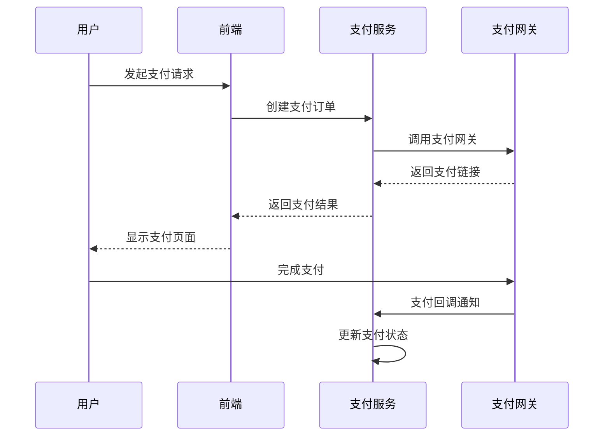
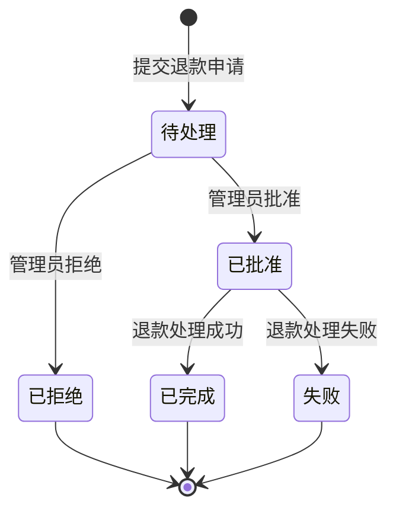

# 支付管理模块

本模块提供完整的支付和退款管理功能，包括支付处理、退款审核、统计分析等核心业务功能。

## 🚀 功能特性

### 支付管理
- ✅ **支付创建**: 支持多种支付方式（支付宝、微信、银行卡等）
- ✅ **支付处理**: 自动化支付流程处理
- ✅ **支付查询**: 灵活的筛选和搜索功能
- ✅ **支付状态**: 实时状态跟踪和更新
- ✅ **支付重试**: 失败支付自动重试机制

### 退款管理
- ✅ **退款申请**: 完整的退款申请流程
- ✅ **退款审核**: 多级审核和批准机制
- ✅ **退款处理**: 自动化退款处理流程
- ✅ **退款追踪**: 完整的操作历史记录

### 统计分析
- ✅ **支付统计**: 实时支付数据统计
- ✅ **转化率分析**: 支付成功率统计
- ✅ **支付方式统计**: 各支付方式使用情况
- ✅ **趋势分析**: 支持时间范围筛选

## 🏗️ 架构设计

### 设计原则
本模块严格遵循 **SOLID 原则**：

- **SRP (单一职责原则)**: 每个组件只负责一个特定的业务功能
- **OCP (开闭原则)**: 支持新的支付网关和支付方式扩展
- **DIP (依赖倒置原则)**: 通过接口抽象实现松耦合设计
- **ISP (接口隔离原则)**: 细粒度的接口设计
- **LSP (里氏替换原则)**: 支付网关的可替换性

### 核心组件

```
支付管理模块/
├── 📄 PAYMENT_MODULE_DESIGN.md     # 专业架构设计文档
├── 🔧 services/
│   └── paymentService.ts           # 支付服务层 (业务逻辑)
├── 🎯 composables/
│   └── usePayments.ts              # 支付管理 Composable (状态管理)
├── 🎨 views/
│   ├── PaymentsView.vue            # 支付管理主视图
│   ├── PaymentForm.vue             # 支付表单组件
│   ├── PaymentDetail.vue           # 支付详情组件
│   ├── RefundsView.vue             # 退款管理视图
│   ├── RefundForm.vue              # 退款表单组件
│   └── RefundDetail.vue            # 退款详情组件
└── 🧪 tests/
    ├── PaymentsView.test.ts        # 组件单元测试
    └── paymentService.test.ts      # 服务层单元测试
```

### 类型系统

```typescript
// 核心支付类型
interface PaymentRecord {
  id: string
  paymentNumber: string
  userId: string
  amount: Money
  status: ExtendedPaymentStatus
  paymentMethodType: PaymentMethodType
  gatewayType: PaymentGatewayType
  // ... 更多字段
}

// 退款类型
interface Refund {
  id: string
  refundNumber: string
  paymentId: string
  amount: Money
  status: RefundStatus
  reason: string
  // ... 更多字段
}
```

## 📖 使用指南

### 基础用法

```vue
<template>
  <div>
    <!-- 支付管理视图 -->
    <PaymentsView />
  </div>
</template>

<script setup>
import PaymentsView from '@/views/billing/PaymentsView.vue'
</script>
```

### Composable 用法

```typescript
import { usePayments, useRefunds } from '@/composables/usePayments'

// 支付管理
const {
  payments,
  loading,
  loadPayments,
  createPayment,
  processPayment,
  loadStatistics
} = usePayments()

// 退款管理
const {
  refunds,
  loadRefunds,
  createRefund,
  approveRefund,
  processRefund
} = useRefunds()

// 加载数据
await loadPayments()
await loadStatistics()
```

### 服务层用法

```typescript
import { paymentService } from '@/services/paymentService'

// 创建支付
const paymentResult = await paymentService.createPayment({
  userId: 'user123',
  amount: { amount: 100.00, currency: 'CNY' },
  paymentMethodType: 'alipay',
  gatewayType: 'alipay',
  // ...
})

// 处理支付
const processResult = await paymentService.processPayment(paymentId)

// 创建退款
const refundResult = await paymentService.createRefund({
  paymentId: 'payment123',
  amount: { amount: 50.00, currency: 'CNY' },
  reason: '用户申请退款'
})
```

## 🎯 核心功能

### 1. 支付流程管理



### 2. 退款审核流程



### 3. 支付网关适配器模式

```typescript
// 支付网关接口
interface PaymentGateway {
  processPayment(request: PaymentRequest): Promise<PaymentResult>
  refundPayment(request: RefundRequest): Promise<RefundResult>
  queryPayment(paymentId: string): Promise<PaymentStatus>
}

// 支付宝网关实现
class AlipayGateway implements PaymentGateway {
  async processPayment(request: PaymentRequest): Promise<PaymentResult> {
    // 支付宝支付逻辑
  }
}

// 微信支付网关实现
class WechatGateway implements PaymentGateway {
  async processPayment(request: PaymentRequest): Promise<PaymentResult> {
    // 微信支付逻辑
  }
}
```

## 🔧 配置选项

### 路由配置

```typescript
// router/modules/billing.ts
{
  path: 'payments',
  name: 'Payments',
  component: () => import('@/views/billing/PaymentsView.vue'),
  meta: {
    title: '支付管理',
    icon: 'DollarSign',
    requiresAuth: true,
    keepAlive: true
  }
},
{
  path: 'refunds',
  name: 'Refunds',
  component: () => import('@/views/billing/RefundsView.vue'),
  meta: {
    title: '退款管理',
    icon: 'RotateCcw',
    requiresAuth: true,
    keepAlive: true
  }
}
```

### 菜单配置

```typescript
// config/menu.ts
{
  key: 'billing-payments',
  label: '支付管理',
  icon: 'DollarSign',
  path: '/billing/payments'
},
{
  key: 'billing-refunds',
  label: '退款管理',
  icon: 'RotateCcw',
  path: '/billing/refunds'
}
```

## 🧪 测试

### 单元测试

```bash
# 运行支付模块测试
npm run test:unit -- --match="**/payment*"

# 运行特定测试文件
npm run test:unit tests/unit/services/paymentService.test.ts
npm run test:unit tests/unit/views/billing/PaymentsView.test.ts
```

### 测试覆盖范围

- ✅ 支付服务层逻辑测试
- ✅ 支付组件渲染测试
- ✅ 支付状态管理测试
- ✅ 退款业务流程测试
- ✅ 数据验证测试

## 🛠️ 开发指南

### 新增支付方式

1. 在 `PaymentMethodType` 中添加新的支付方式
2. 在 `PaymentGatewayType` 中添加对应网关
3. 实现新的网关适配器类
4. 更新支付表单的选项配置
5. 添加相应的图标和文本映射

### 新增退款审核规则

1. 在 `RefundRequest` 中添加新的验证字段
2. 更新 `validateRefundRequest` 方法
3. 在退款表单中添加相应的 UI 组件
4. 更新退款审核流程逻辑

### 扩展统计功能

1. 在 `PaymentStatistics` 中添加新的统计字段
2. 更新 `getPaymentStatistics` 方法的计算逻辑
3. 在统计卡片中添加新的展示组件

## 📊 性能优化

### 数据加载优化
- 虚拟滚动支持大量支付记录
- 分页加载避免一次性加载过多数据
- 智能缓存减少重复请求

### 状态管理优化
- 局部状态更新避免全量刷新
- 乐观更新提升用户体验
- 错误重试机制保证数据一致性

## 🔐 安全考虑

### 数据安全
- 敏感支付信息加密存储
- 支付密钥安全管理
- 网络传输 HTTPS 加密

### 权限控制
- 基于角色的访问控制
- 支付操作审计日志
- 退款权限分级管理

## 📈 监控指标

### 业务指标
- 支付成功率
- 平均支付时长
- 退款率和退款原因分析
- 各支付方式使用占比

### 技术指标
- 接口响应时间
- 错误率统计
- 并发处理能力
- 内存使用情况

## 🚀 未来规划

### 短期目标
- [ ] 支持更多支付网关（PayPal、Stripe）
- [ ] 增加支付风控功能
- [ ] 支持批量退款操作
- [ ] 支付数据导出功能

### 长期目标
- [ ] 支付链路全链路监控
- [ ] 智能风险识别和拦截
- [ ] 支付数据分析和预测
- [ ] 跨境支付支持

## 📚 相关文档

- [支付模块设计文档](./PAYMENT_MODULE_DESIGN.md)
- [API 接口文档](./API.md)
- [部署指南](./DEPLOYMENT.md)
- [故障排查指南](./TROUBLESHOOTING.md)

## 🤝 贡献指南

1. 遵循现有的代码规范和架构模式
2. 新功能需要包含完整的单元测试
3. 重要变更需要更新相关文档
4. 提交前确保通过所有代码检查

---

💡 **提示**: 本模块采用现代化的 Vue 3 + TypeScript 技术栈，严格遵循 SOLID 设计原则，具备良好的可扩展性和可维护性。