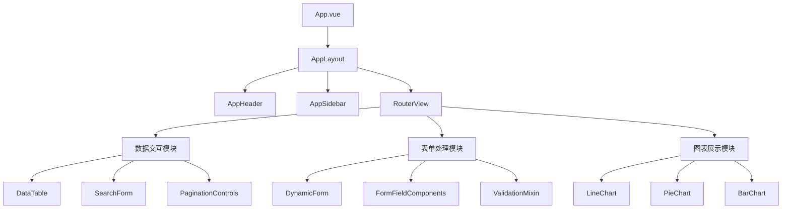
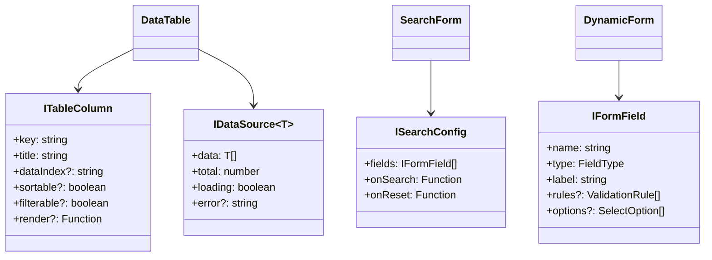
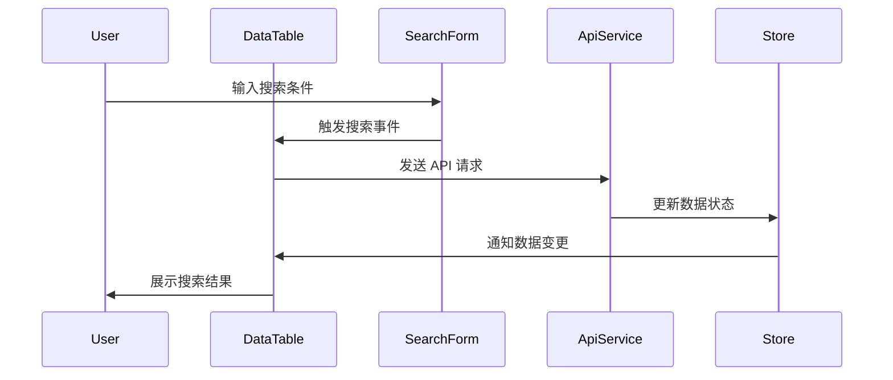

# daloRADIUS PHP 系统功能分析与 Vue 组件设计映射

按照 design.prompt.md 的要求，本文档分析 PHP 原系统的核心功能模式，并基于 SOLID 原则和 DRY 原则设计可复用的 Vue 组件架构。

## 模块概述 (Module Overview)

### 职责
分析 daloRADIUS PHP 系统中的通用 UI 模式和业务逻辑，抽象出可复用的组件架构，为 Vue 3 + TypeScript 前端重构提供设计指导。

### 设计目标
1. **高可复用性**：基于 DRY 原则，避免重复的组件实现
2. **类型安全**：利用 TypeScript 提供完整的类型约束
3. **易扩展性**：遵循 OCP 原则，支持功能扩展而无需修改现有组件
4. **接口隔离**：遵循 ISP 原则，组件接口小而专一

## 设计原则与模式 (Design Principles & Patterns)

### 原则应用
1. **SRP (单一职责原则)**：每个组件只负责一个特定的UI功能
2. **OCP (开闭原则)**：通过 props 和 slots 机制支持扩展
3. **DIP (依赖倒置原则)**：组件依赖抽象接口而非具体实现
4. **KISS (保持简单原则)**：组件设计简单易用，避免过度抽象
5. **YAGNI (你不会需要它)**：只实现当前明确需要的功能

### 设计模式
- **组合模式 (Composition Pattern)**：通过组合小组件构建复杂 UI
- **策略模式 (Strategy Pattern)**：支持不同的数据展示和交互策略
- **观察者模式 (Observer Pattern)**：基于 Vue 的响应式系统实现数据绑定

## 架构视图 (Architectural Views)

### 组件图 (Component Diagram)


### 类图 (Class Diagram) - TypeScript 接口设计


### 序列图 (Sequence Diagram) - 数据交互流程


## 关键接口与契约 (Key Interfaces & Contracts)

### 1. IDataTableProps - 数据表格组件接口
```typescript
interface IDataTableProps<T = any> {
  // 数据源配置
  dataSource: IDataSource<T>
  columns: ITableColumn[]
  
  // 功能配置
  showSelection?: boolean
  showPagination?: boolean
  showExport?: boolean
  
  // 事件处理
  onSelectionChange?: (selectedRows: T[]) => void
  onRowClick?: (record: T) => void
  onSort?: (field: string, order: 'asc' | 'desc') => void
  onFilter?: (filters: Record<string, any>) => void
}
```

**职责**：统一数据表格的展示和交互逻辑
**行为契约**：
- 必须提供 dataSource 和 columns 属性
- 当 showSelection 为 true 时，必须提供 onSelectionChange 回调
- 支持排序、过滤、分页等标准数据表格功能

### 2. ISearchFormProps - 搜索表单组件接口
```typescript
interface ISearchFormProps {
  // 表单配置
  fields: IFormField[]
  
  // 布局配置
  layout?: 'horizontal' | 'vertical' | 'inline'
  
  // 事件处理
  onSearch: (values: Record<string, any>) => void
  onReset?: () => void
  onFieldChange?: (field: string, value: any) => void
}
```

**职责**：提供统一的搜索表单构建和验证能力
**行为契约**：
- 必须提供 fields 和 onSearch 属性
- 表单验证在提交前自动执行
- 支持动态表单字段配置

### 3. IDynamicFormProps - 动态表单组件接口
```typescript
interface IDynamicFormProps {
  // 表单配置
  fields: IFormField[]
  modelValue: Record<string, any>
  
  // 布局配置
  layout?: FormLayout
  columns?: number
  
  // 功能配置
  readonly?: boolean
  showResetButton?: boolean
  
  // 事件处理
  onSubmit: (values: Record<string, any>) => void
  onValidationChange?: (valid: boolean) => void
}
```

**职责**：基于配置动态生成表单，支持各种字段类型和验证规则
**行为契约**：
- 支持所有标准表单字段类型
- 自动处理表单验证和错误展示
- 通过配置驱动，无需编写重复的表单代码

### 4. IChartProps - 图表组件接口
```typescript
interface IChartProps {
  // 数据配置
  data: any[]
  
  // 图表配置
  type: ChartType
  options?: ChartOptions
  
  // 尺寸配置
  width?: string | number
  height?: string | number
  
  // 事件处理
  onDataPointClick?: (data: any) => void
}
```

**职责**：提供统一的图表展示能力，支持多种图表类型
**行为契约**：
- 支持 ECharts 的所有图表类型
- 自动适应容器尺寸
- 提供统一的配置接口

## PHP 系统功能分析结果

### 识别的通用模式

1. **数据列表页面模式** (以 `acct-all.php` 为例)
   - 搜索表单 + 数据表格 + 分页控制
   - 批量操作 (全选/全不选)
   - 排序和过滤功能
   - 导出功能

2. **表单页面模式** (以 `mng-new.php` 为例)
   - 多标签页表单结构
   - 字段验证和提示
   - 动态字段配置
   - CSRF 保护

3. **详情页面模式** (以 `mng-edit.php` 为例)
   - 信息展示 + 编辑表单
   - 相关数据展示 (如用户报表)
   - 操作日志记录

4. **报表页面模式** (以 `rep-` 开头文件为例)
   - 参数配置表单
   - 图表数据展示
   - 数据导出功能

### 核心 PHP 函数映射到 Vue 组件

| PHP 函数 | 功能描述 | Vue 组件映射 |
|----------|----------|-------------|
| `print_form_component()` | 渲染表单字段 | `DynamicFormField.vue` |
| `print_table_top/middle/bottom()` | 表格结构渲染 | `DataTable.vue` |
| `setupLinks_str()` | 分页链接生成 | `PaginationControls.vue` |
| `print_table_prologue()` | 表格控制栏 | `TableToolbar.vue` |
| `get_tooltip_list_str()` | 操作下拉菜单 | `ActionDropdown.vue` |
| `print_checkbox()` | 复选框组件 | `CheckboxGroup.vue` |

## 数据模型 (Data Model)

### 核心实体类型定义
```typescript
// 用户实体
interface User {
  id: number
  username: string
  email: string
  status: 'active' | 'inactive' | 'suspended'
  createdAt: string
  updatedAt: string
}

// 计费记录实体
interface AccountingRecord {
  id: number
  username: string
  sessionId: string
  startTime: string
  endTime?: string
  inputOctets: number
  outputOctets: number
  nasIpAddress: string
}

// 表格列配置
interface TableColumn {
  key: string
  title: string
  dataIndex?: string
  sortable?: boolean
  filterable?: boolean
  width?: number
  render?: (value: any, record: any) => VNode | string
}
```

## 演进性与考量 (Evolution & Considerations)

### 已知限制
1. **国际化支持**：当前设计未完全考虑多语言切换的性能影响
2. **大数据集处理**：虚拟滚动等性能优化功能需要后续添加
3. **移动端适配**：响应式设计需要进一步优化

### 扩展方案
1. **新字段类型扩展**：通过实现 `IFormField` 接口添加新的表单字段类型
2. **新图表类型扩展**：通过 `ChartType` 枚举和对应的配置扩展
3. **新数据源扩展**：通过实现 `IDataSource` 接口支持不同的数据获取策略

### 性能/安全考量
1. **性能优化**：
   - 使用 `v-memo` 优化大列表渲染
   - 组件懒加载减少初始包大小
   - 防抖和节流优化用户交互

2. **安全考量**：
   - XSS 防护：所有用户输入都经过 sanitization
   - CSRF 保护：所有表单都包含 CSRF token
   - 权限控制：基于角色的组件显示控制

## 实施计划

基于以上分析，将在接下来的任务中实现：

1. **通用数据交互组件**：DataTable、SearchForm、PaginationControls
2. **动态表单组件**：DynamicForm、FormField、ValidationMixin  
3. **图表展示组件**：LineChart、PieChart、BarChart
4. **业务组件库**：ActionDropdown、FileUpload、PermissionWrapper

每个组件都将严格遵循上述接口设计，确保高度的可复用性和类型安全。