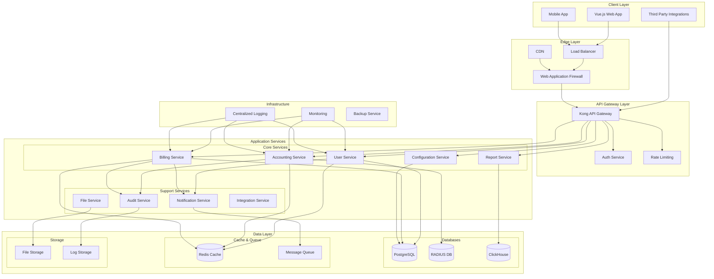
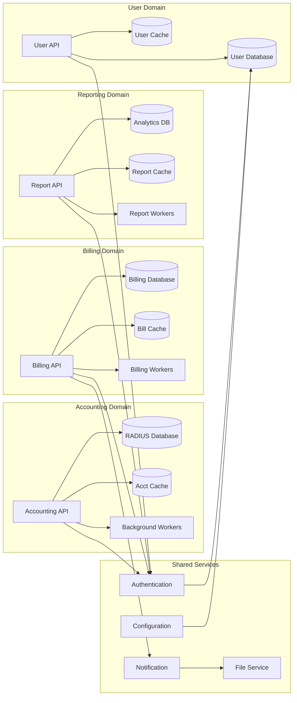
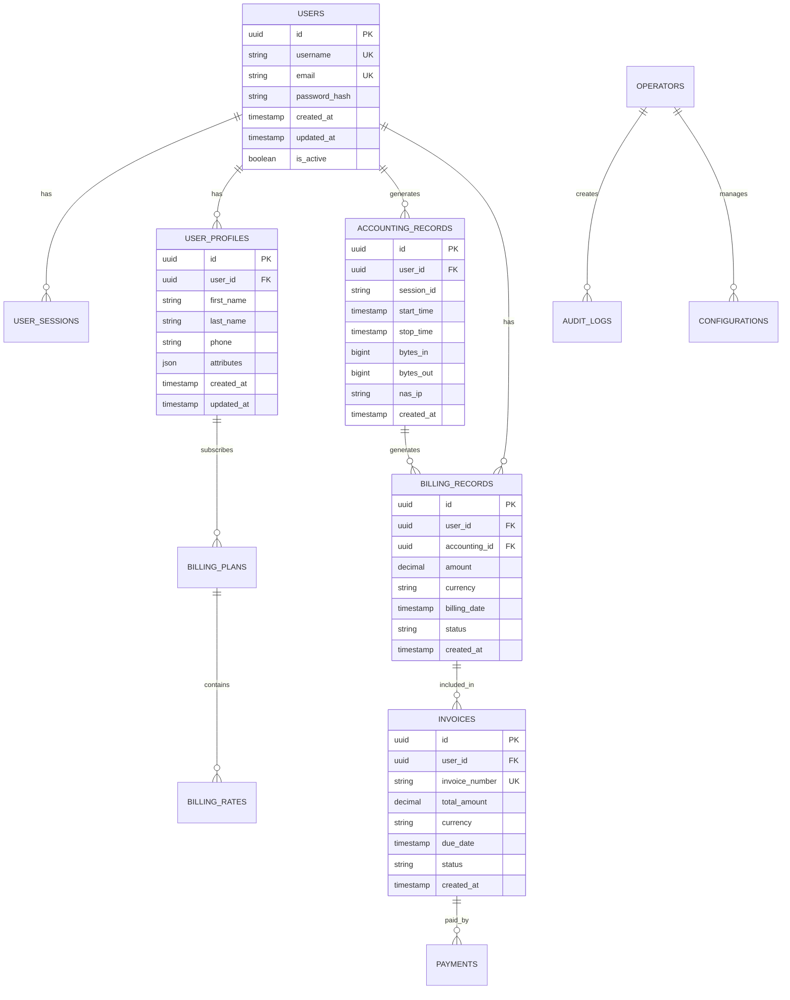
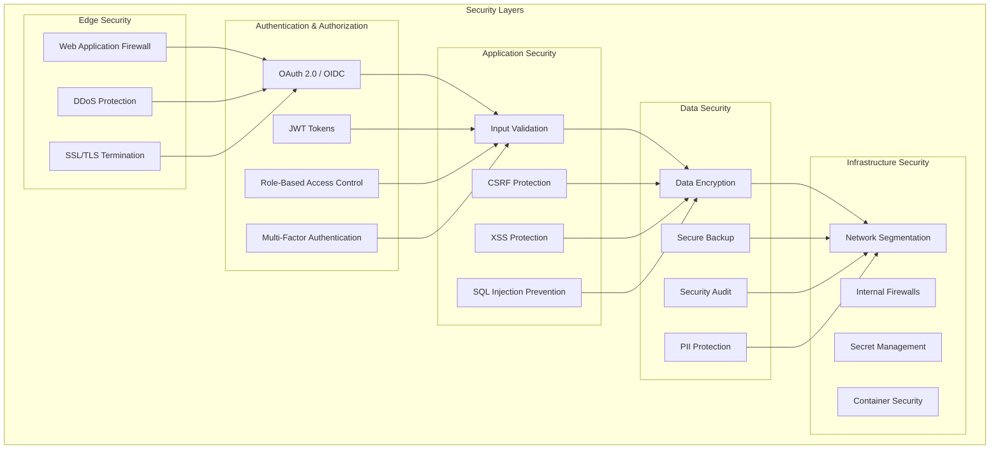
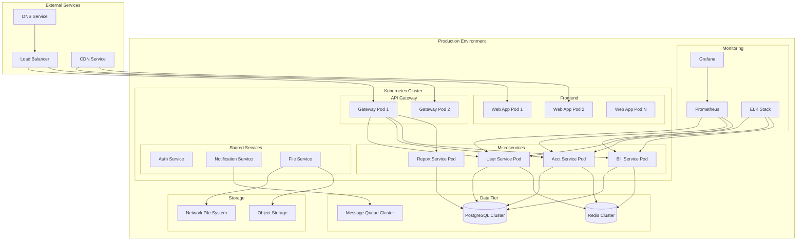

# daloradius-python Python版本项目架构设计（Mermaid UML）

## 执行概述
基于当前架构评审结果和重构目标，设计现代化的Python版本项目架构，采用微服务、前后端分离和云原生设计模式，解决现有技术债务并提升系统整体能力。

## 技术栈选型

### 后端框架
- **主框架**：FastAPI（高性能异步框架）
- **ORM**：SQLAlchemy 2.0（现代化ORM）
- **数据库**：PostgreSQL（主数据库） + Redis（缓存）
- **消息队列**：RabbitMQ或Apache Kafka
- **任务调度**：Celery

### 前端技术
- **主框架**：Vue.js 3 + TypeScript
- **UI组件库**：Element Plus
- **状态管理**：Pinia
- **构建工具**：Vite

### 基础设施
- **容器化**：Docker + Kubernetes
- **API网关**：Kong或Nginx
- **监控**：Prometheus + Grafana
- **日志**：ELK Stack

## 系统架构设计

## 微服务架构设计

## 数据架构设计

## 安全架构设计

## 部署架构设计

## 架构特性说明

### 高可用性设计
- **服务冗余**：每个服务多实例部署
- **数据库集群**：主从复制 + 读写分离
- **负载均衡**：多层负载均衡策略
- **故障转移**：自动故障检测和切换

### 可扩展性设计
- **水平扩展**：服务无状态化，支持水平扩展
- **微服务架构**：按业务域拆分，独立扩展
- **缓存策略**：多级缓存提升性能
- **异步处理**：消息队列处理长时间任务

### 安全性设计
- **零信任架构**：服务间通信加密验证
- **最小权限原则**：精细化权限控制
- **数据保护**：加密存储和传输
- **安全监控**：全链路安全审计

### 可观测性设计
- **指标监控**：业务和技术指标监控
- **日志聚合**：结构化日志集中管理
- **链路追踪**：分布式请求追踪
- **告警机制**：智能告警和通知

---

本Python架构设计为daloradius重构提供现代化、可扩展的技术方案。