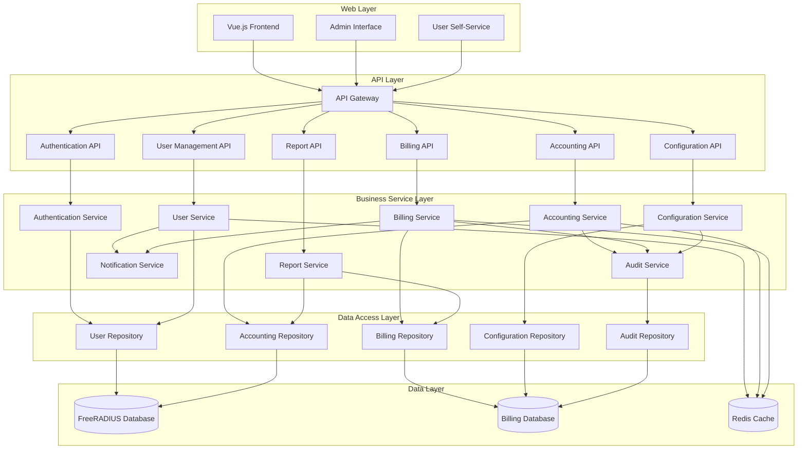
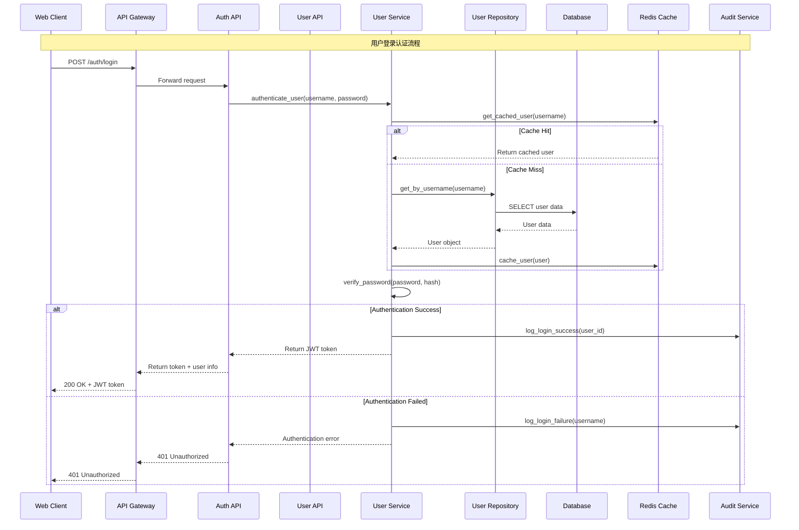
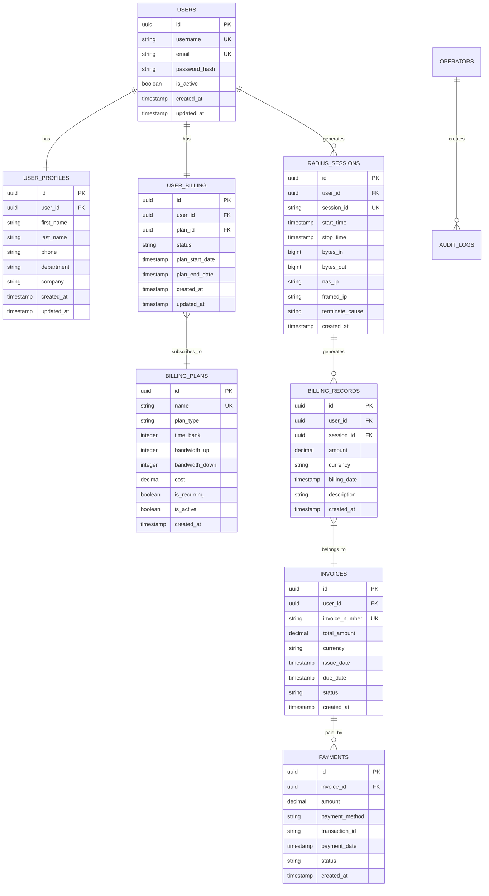

# daloradius-python Python版本项目架构设计文档 v1.1

## 模块概述 (Module Overview)

### 职责
基于现有 daloradius 系统的业务功能，设计现代化的 Python Web 应用架构，实现 RADIUS 网络计费管理系统的核心业务：用户管理、计费会计、账单管理、报表分析和系统配置。

### 设计目标
- **高内聚低耦合**：按业务域清晰划分模块边界
- **可扩展性**：支持新业务功能的快速开发和部署
- **可维护性**：代码结构清晰，便于理解和修改
- **性能优化**：支持大量并发用户和会计数据处理
- **数据一致性**：确保计费数据的准确性和完整性

## 设计原则与模式 (Design Principles & Patterns)

### 原则应用
- **SRP (单一职责原则)**：每个服务模块专注单一业务域，如 UserService 只负责用户管理，BillingService 只负责计费逻辑
- **OCP (开闭原则)**：通过接口抽象和依赖注入支持功能扩展，如支付方式、计费策略的插件化扩展
- **DIP (依赖倒置原则)**：业务逻辑依赖抽象接口，而非具体实现，通过 Repository 模式抽象数据访问
- **KISS (保持简单原则)**：优先使用简单直接的解决方案，避免过度抽象
- **YAGNI (你不会需要它)**：严格基于现有 189 个 operators 页面和 20 个 users 页面的实际需求进行设计，不添加未来假设功能

### 设计模式
- **Repository 模式**：抽象数据访问层，支持不同数据源的切换和测试
- **Service 层模式**：封装业务逻辑，提供清晰的业务接口
- **Factory 模式**：用于创建不同类型的计费策略和报表生成器
- **Observer 模式**：用于审计日志和通知系统的事件处理

## 架构视图 (Architectural Views)

### 组件图 (Component Diagram)



### 核心业务类图 (Class Diagram)

```mermaid
classDiagram
    class IUserRepository {
        <<interface>>
        +create(user: User) User
        +get_by_id(user_id: UUID) User
        +get_by_username(username: str) User
        +update(user: User) User
        +delete(user_id: UUID) bool
        +list_users(filters: dict) List[User]
    }
    
    class IBillingRepository {
        <<interface>>
        +create_plan(plan: BillingPlan) BillingPlan
        +get_user_billing(user_id: UUID) UserBilling
        +record_usage(record: AccountingRecord) bool
        +generate_invoice(user_id: UUID, period: DateRange) Invoice
        +process_payment(payment: Payment) bool
    }
    
    class IAccountingRepository {
        <<interface>>
        +record_session(session: RadiusSession) bool
        +get_user_sessions(user_id: UUID, period: DateRange) List[RadiusSession]
        +get_usage_statistics(filters: dict) UsageStats
        +cleanup_old_records(before_date: datetime) int
    }
    
    class UserService {
        -user_repo: IUserRepository
        -audit_svc: IAuditService
        -notif_svc: INotificationService
        +create_user(user_data: dict) User
        +authenticate_user(username: str, password: str) User
        +update_user_profile(user_id: UUID, profile_data: dict) bool
        +change_password(user_id: UUID, old_pwd: str, new_pwd: str) bool
        +list_users(pagination: Pagination, filters: dict) PaginatedList[User]
    }
    
    class BillingService {
        -billing_repo: IBillingRepository
        -audit_svc: IAuditService
        -notif_svc: INotificationService
        +create_billing_plan(plan_data: dict) BillingPlan
        +assign_plan_to_user(user_id: UUID, plan_id: UUID) bool
        +calculate_usage_charges(user_id: UUID, period: DateRange) Decimal
        +generate_invoice(user_id: UUID, period: DateRange) Invoice
        +process_payment(payment_data: dict) Payment
    }
    
    class AccountingService {
        -acct_repo: IAccountingRepository
        -audit_svc: IAuditService
        +record_session_start(session_data: dict) RadiusSession
        +record_session_stop(session_id: str, stop_data: dict) bool
        +get_active_sessions(filters: dict) List[RadiusSession]
        +get_user_usage_stats(user_id: UUID, period: DateRange) UsageStats
        +cleanup_old_sessions(retention_days: int) int
    }
    
    class ReportService {
        -acct_repo: IAccountingRepository
        -billing_repo: IBillingRepository
        +generate_usage_report(filters: dict, format: str) Report
        +generate_billing_report(period: DateRange, format: str) Report
        +get_active_users_count() int
        +get_revenue_statistics(period: DateRange) RevenueStats
    }
    
    class User {
        +id: UUID
        +username: str
        +email: str
        +password_hash: str
        +profile: UserProfile
        +created_at: datetime
        +is_active: bool
    }
    
    class BillingPlan {
        +id: UUID
        +name: str
        +plan_type: str
        +time_bank: int
        +bandwidth_up: int
        +bandwidth_down: int
        +cost: Decimal
        +is_recurring: bool
        +is_active: bool
    }
    
    class RadiusSession {
        +id: UUID
        +user_id: UUID
        +session_id: str
        +start_time: datetime
        +stop_time: datetime
        +bytes_in: int
        +bytes_out: int
        +nas_ip: str
        +terminate_cause: str
    }
    
    UserService --> IUserRepository
    UserService --> IAuditService
    UserService --> INotificationService
    BillingService --> IBillingRepository
    BillingService --> IAuditService
    BillingService --> INotificationService
    AccountingService --> IAccountingRepository
    AccountingService --> IAuditService
    ReportService --> IAccountingRepository
    ReportService --> IBillingRepository
    
    IUserRepository <|-- UserRepository
    IBillingRepository <|-- BillingRepository
    IAccountingRepository <|-- AccountingRepository
```



### 关键业务流程序列图 (Sequence Diagram)



## 关键接口与契约 (Key Interfaces & Contracts)

### 用户管理接口

#### IUserRepository
**职责**：用户数据访问抽象层
**方法签名**：
```python
@abstractmethod
def create(self, user: User) -> User:
    """创建新用户"""
    pass

@abstractmethod
def get_by_username(self, username: str) -> Optional[User]:
    """根据用户名获取用户"""
    pass

@abstractmethod
def update(self, user: User) -> User:
    """更新用户信息"""
    pass

@abstractmethod
def list_users(self, pagination: Pagination, filters: Optional[dict] = None) -> PaginatedList[User]:
    """分页获取用户列表"""
    pass
```

**行为契约**：
- `create` 方法在用户名重复时必须抛出 `UserAlreadyExistsException`
- `get_by_username` 用户不存在时返回 `None`，不抛出异常
- `update` 方法必须验证用户存在性，不存在时抛出 `UserNotFoundException`

#### UserService
**职责**：用户管理业务逻辑服务
**方法签名**：
```python
def create_user(self, user_data: CreateUserRequest) -> User:
    """创建新用户，包含密码加密和验证"""
    pass

def authenticate_user(self, username: str, password: str) -> Optional[User]:
    """用户认证，返回认证成功的用户对象"""
    pass

def change_password(self, user_id: UUID, old_password: str, new_password: str) -> bool:
    """修改用户密码，需要验证旧密码"""
    pass
```

**行为契约**：
- `create_user` 必须先调用数据验证，再调用 repository.create
- `authenticate_user` 认证失败时记录审计日志
- `change_password` 必须验证旧密码正确性

### 计费管理接口

#### IBillingRepository
**职责**：计费数据访问抽象层
**方法签名**：
```python
@abstractmethod
def create_plan(self, plan: BillingPlan) -> BillingPlan:
    """创建计费套餐"""
    pass

@abstractmethod
def assign_plan_to_user(self, user_id: UUID, plan_id: UUID) -> UserBilling:
    """为用户分配计费套餐"""
    pass

@abstractmethod
def calculate_charges(self, user_id: UUID, usage_data: UsageData) -> Decimal:
    """根据使用量计算费用"""
    pass
```

#### BillingService
**职责**：计费业务逻辑服务
**方法签名**：
```python
def process_accounting_record(self, acct_record: AccountingRecord) -> bool:
    """处理会计记录，更新用户使用量和费用"""
    pass

def generate_invoice(self, user_id: UUID, period: DateRange) -> Invoice:
    """生成用户账单"""
    pass
```

### 会计管理接口

#### IAccountingRepository
**职责**：会计数据访问抽象层
**方法签名**：
```python
@abstractmethod
def record_session(self, session: RadiusSession) -> bool:
    """记录 RADIUS 会话"""
    pass

@abstractmethod
def get_active_sessions(self, filters: Optional[dict] = None) -> List[RadiusSession]:
    """获取活跃会话列表"""
    pass

@abstractmethod
def get_usage_statistics(self, user_id: UUID, period: DateRange) -> UsageStats:
    """获取用户使用统计"""
    pass
```

## 数据模型 (Data Model)

### 核心实体关系图



## 演进性与考量 (Evolution & Considerations)

### 已知限制
1. **数据库依赖**：当前设计依赖传统关系型数据库，对于海量会计数据可能存在性能瓶颈
2. **同步处理**：大部分业务逻辑采用同步处理，对于批量操作和报表生成可能影响响应时间
3. **单体服务**：虽然按模块分层，但仍为单体应用，扩展性有限

### 扩展方案
1. **异步处理扩展**：通过实现 `IAsyncAccountingProcessor` 接口支持异步会计处理
2. **缓存策略扩展**：通过 `ICacheStrategy` 接口支持不同缓存方案（Redis、Memcached）
3. **计费策略扩展**：通过 `IBillingStrategy` 接口支持新的计费算法
4. **报表格式扩展**：通过 `IReportGenerator` 接口支持 PDF、Excel、CSV 等不同格式
5. **通知方式扩展**：通过 `INotificationChannel` 接口支持邮件、短信、推送等通知方式

### 性能考量
- **数据库连接池**：使用连接池管理数据库连接，避免连接开销
- **查询优化**：对频繁查询的表建立适当索引，优化复杂查询语句
- **缓存策略**：用户信息、计费套餐等相对静态数据使用缓存
- **分页处理**：所有列表查询必须实现分页，避免大量数据加载

### 安全考量
- **输入验证**：所有用户输入必须通过验证层，防止注入攻击
- **权限控制**：基于角色的访问控制，确保操作权限正确
- **敏感数据保护**：密码使用强哈希算法，敏感信息考虑加密存储
- **审计跟踪**：所有关键操作必须记录审计日志

---

本设计文档基于 daloradius 现有功能需求，遵循 SOLID 原则和 KISS/YAGNI 原则，为 Python 重构提供清晰的架构指导。