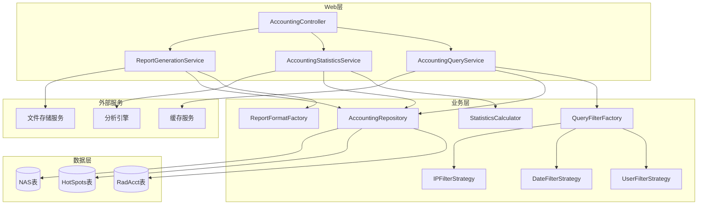
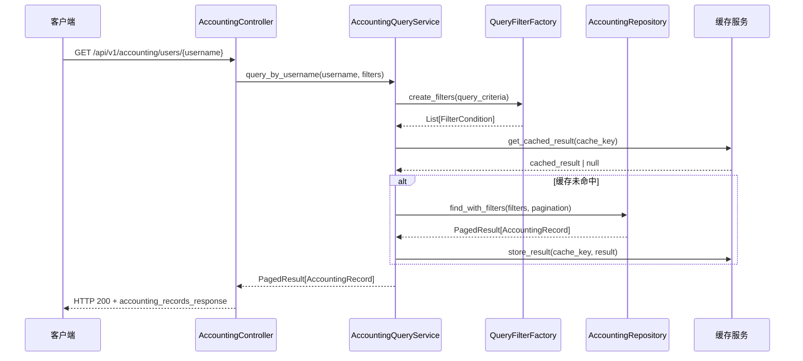
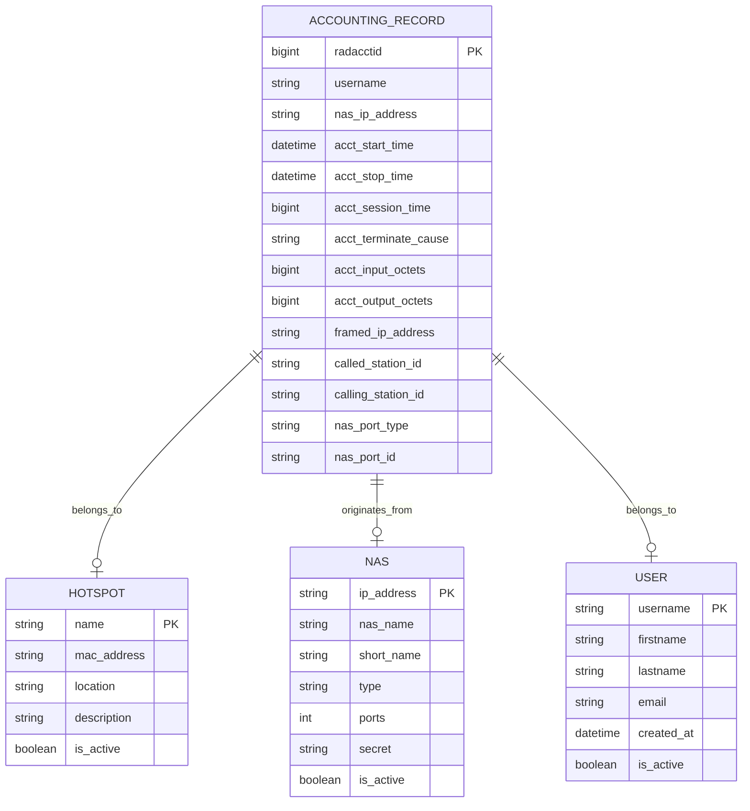

# 计费管理模块设计文档

## 模块概述 (Module Overview)

### 职责
计费管理模块负责RADIUS系统中所有网络访问的计费记录查询、统计分析、数据维护和报表生成。该模块专注于处理海量计费数据的高效查询、多维度统计分析以及数据生命周期管理。

### 设计目标
- **高性能查询**: 支持大数据量下的快速查询和统计分析
- **灵活过滤**: 提供多维度的数据过滤和筛选能力（用户、时间、IP地址、NAS等）
- **数据一致性**: 确保计费记录的完整性和准确性
- **可扩展性**: 支持新的统计维度和报表类型的灵活扩展
- **高可用性**: 支持大并发查询而不影响计费数据的实时写入

## 设计原则与模式 (Design Principles & Patterns)

### 原则应用

**SRP (单一职责原则)**:
- `AccountingQueryService`: 专注于计费数据查询业务逻辑
- `AccountingStatisticsService`: 专注于统计分析计算
- `AccountingMaintenanceService`: 专注于数据维护和清理
- `ReportGenerator`: 专注于报表生成和导出

**OCP (开闭原则)**:
- `QueryFilterStrategy` 接口支持新查询条件类型的扩展
- `StatisticsCalculator` 接口支持新统计指标的计算
- `ReportFormat` 接口支持多种导出格式（CSV、Excel、PDF）

**DIP (依赖倒置原则)**:
- 业务服务层依赖抽象的Repository和Calculator接口
- 通过策略模式隔离具体的查询实现和统计算法

**KISS & YAGNI**:
- 避免过度复杂的查询优化，采用简单有效的索引策略
- 仅为当前明确的统计需求设计计算接口

### 设计模式

**策略模式**: 用于处理不同类型的查询过滤条件
```python
class QueryFilterStrategy(ABC):
    @abstractmethod
    def build_filter_condition(self, criteria: QueryCriteria) -> FilterCondition
    
    @abstractmethod
    def validate_parameters(self, params: dict) -> ValidationResult
```

**建造者模式**: 用于构建复杂的统计查询
```python
class AccountingQueryBuilder:
    def filter_by_user(self, username: str) -> 'AccountingQueryBuilder'
    
    def filter_by_date_range(self, start: datetime, end: datetime) -> 'AccountingQueryBuilder'
    
    def build(self) -> AccountingQuery
```

**观察者模式**: 用于大数据量查询的进度通知
```python
class QueryProgressPublisher:
    def notify_progress(self, progress: QueryProgress) -> None
```

## 架构视图 (Architectural Views)

### 组件图 (Component Diagram)


### 类图 (Class Diagram)

```mermaid
classDiagram
    class AccountingQueryService {
        <<Service>>
        +query_all_records(filters: QueryFilters, pagination: Pagination) PagedResult~AccountingRecord~
        +query_by_username(username: str, filters: QueryFilters) List~AccountingRecord~
        +query_by_date_range(start: datetime, end: datetime, filters: QueryFilters) List~AccountingRecord~
        +query_by_ip_address(ip: str, filters: QueryFilters) List~AccountingRecord~
    }
    
    class AccountingStatisticsService {
        <<Service>>
        +calculate_user_statistics(username: str, period: DatePeriod) UserStatistics
        +calculate_period_statistics(period: DatePeriod) PeriodStatistics
        +calculate_hotspot_statistics(hotspot: str, period: DatePeriod) HotspotStatistics
        +calculate_nas_statistics(nas_ip: str, period: DatePeriod) NASStatistics
    }
    
    class AccountingMaintenanceService {
        <<Service>>
        +cleanup_old_records(before_date: datetime) CleanupResult
        +archive_records(date_range: DateRange) ArchiveResult
        +verify_data_integrity() IntegrityReport
        +optimize_database() OptimizationResult
    }
    
    class QueryFilterStrategy {
        <<Abstract>>
        +build_filter_condition(criteria: QueryCriteria)* FilterCondition
        +validate_parameters(params: dict)* ValidationResult
        +get_filter_priority()* int
    }
    
    class UserFilterStrategy {
        +build_filter_condition(criteria: QueryCriteria) FilterCondition
        +validate_parameters(params: dict) ValidationResult
        +get_filter_priority() int
    }
    
    class DateRangeFilterStrategy {
        +build_filter_condition(criteria: QueryCriteria) FilterCondition
        +validate_parameters(params: dict) ValidationResult
        +get_filter_priority() int
    }
    
    class IPAddressFilterStrategy {
        +build_filter_condition(criteria: QueryCriteria) FilterCondition
        +validate_parameters(params: dict) ValidationResult
        +get_filter_priority() int
    }
    
    class AccountingRepository {
        <<Repository>>
        +find_with_filters(filters: List[FilterCondition], pagination: Pagination) PagedResult~AccountingRecord~
        +count_with_filters(filters: List[FilterCondition]) int
        +find_by_criteria(criteria: QueryCriteria) List~AccountingRecord~
        +aggregate_statistics(criteria: StatisticsCriteria) AggregateResult
    }
    
    class StatisticsCalculator {
        <<Abstract>>
        +calculate(data: List[AccountingRecord])* StatisticsResult
        +get_calculation_type()* StatisticsType
    }
    
    class TrafficStatisticsCalculator {
        +calculate(data: List[AccountingRecord]) TrafficStatistics
        +get_calculation_type() StatisticsType
    }
    
    class SessionStatisticsCalculator {
        +calculate(data: List[AccountingRecord]) SessionStatistics
        +get_calculation_type() StatisticsType
    }
    
    AccountingQueryService --> AccountingRepository : depends on
    AccountingQueryService --> QueryFilterStrategy : uses
    AccountingStatisticsService --> AccountingRepository : depends on
    AccountingStatisticsService --> StatisticsCalculator : uses
    
    QueryFilterStrategy <|-- UserFilterStrategy : implements
    QueryFilterStrategy <|-- DateRangeFilterStrategy : implements
    QueryFilterStrategy <|-- IPAddressFilterStrategy : implements
    
    StatisticsCalculator <|-- TrafficStatisticsCalculator : implements
    StatisticsCalculator <|-- SessionStatisticsCalculator : implements
```


### 序列图 (Sequence Diagram) - 用户计费记录查询流程


## 关键接口与契约 (Key Interfaces & Contracts)

### AccountingQueryService 接口
**职责**: 计费数据查询的核心业务逻辑协调器
**方法签名**:
```python
class AccountingQueryService:
    def query_all_records(self, filters: QueryFilters, pagination: Pagination) -> PagedResult[AccountingRecord]:
        """查询所有计费记录"""
        
    def query_by_username(self, username: str, additional_filters: QueryFilters = None) -> List[AccountingRecord]:
        """按用户名查询计费记录"""
        
    def query_by_date_range(self, start_date: datetime, end_date: datetime, filters: QueryFilters = None) -> List[AccountingRecord]:
        """按日期范围查询计费记录"""
        
    def export_records(self, query_criteria: QueryCriteria, format_type: ExportFormat) -> ExportResult:
        """导出计费记录"""
```

**行为契约**:
- `query_all_records` 必须支持分页，避免内存溢出
- `query_by_date_range` 的日期范围不能超过系统配置的最大查询时间跨度
- 所有查询方法必须包含访问权限验证
- 大查询结果必须支持异步处理和进度通知

### QueryFilterStrategy 接口
**职责**: 抽象不同类型查询条件的构建逻辑
**方法签名**:
```python
class QueryFilterStrategy(ABC):
    @abstractmethod
    def build_filter_condition(self, criteria: QueryCriteria) -> FilterCondition:
        """构建特定类型的过滤条件"""
        
    @abstractmethod
    def validate_parameters(self, params: dict) -> ValidationResult:
        """验证过滤参数的有效性"""
        
    @abstractmethod
    def get_filter_priority(self) -> int:
        """获取过滤器的执行优先级（用于查询优化）"""
        
    @abstractmethod
    def estimate_selectivity(self, params: dict) -> float:
        """估算过滤条件的选择性（用于查询计划优化）"""
```

**行为契约**:
- `build_filter_condition` 必须返回SQL安全的过滤条件
- `validate_parameters` 必须在 `build_filter_condition` 之前调用
- `get_filter_priority` 返回值范围为1-100，数值越大优先级越高
- 所有方法必须是线程安全的

### AccountingRepository 接口
**职责**: 计费数据的持久化访问抽象层
**方法签名**:
```python
class AccountingRepository(ABC):
    @abstractmethod
    async def find_with_filters(self, filters: List[FilterCondition], pagination: Pagination) -> PagedResult[AccountingRecord]:
        """使用复合过滤条件查询记录"""
        
    @abstractmethod
    async def count_with_filters(self, filters: List[FilterCondition]) -> int:
        """统计符合条件的记录数量"""
        
    @abstractmethod
    async def aggregate_statistics(self, criteria: StatisticsCriteria) -> AggregateResult:
        """聚合统计计算"""
        
    @abstractmethod
    async def cleanup_old_records(self, before_date: datetime) -> int:
        """清理旧记录"""
```

**行为契约**:
- `find_with_filters` 必须支持SQL注入防护
- `count_with_filters` 应与 `find_with_filters` 使用相同的过滤逻辑
- `aggregate_statistics` 必须在数据库层面进行聚合，避免内存计算
- 所有操作必须支持查询超时控制

## 数据模型 (Data Model)

### 核心实体关系图


### 聚合根设计
```python
class AccountingRecordAggregate:
    """计费记录聚合根 - 封装计费业务不变性"""
    
    def __init__(self, session_id: str, username: str, nas_ip: str):
        self.radacct_id = session_id
        self.username = username
        self.nas_ip_address = nas_ip
        self.session_metrics: SessionMetrics = SessionMetrics()
        self.traffic_metrics: TrafficMetrics = TrafficMetrics()
        self._domain_events: List[DomainEvent] = []
    
    def start_session(self, start_time: datetime, framed_ip: str) -> None:
        """开始计费会话 - 业务规则验证"""
        if self.session_metrics.is_active():
            raise SessionAlreadyActiveError()
        
        self.session_metrics.start_session(start_time, framed_ip)
        self._domain_events.append(SessionStartedEvent(self.radacct_id, start_time))
    
    def stop_session(self, stop_time: datetime, terminate_cause: str) -> None:
        """结束计费会话 - 计算会话时长"""
        if not self.session_metrics.is_active():
            raise SessionNotActiveError()
        
        self.session_metrics.stop_session(stop_time, terminate_cause)
        self._domain_events.append(SessionStoppedEvent(self.radacct_id, stop_time))
    
    def update_traffic(self, input_octets: int, output_octets: int) -> None:
        """更新流量统计 - 确保流量单调递增"""
        if not self._is_valid_traffic_update(input_octets, output_octets):
            raise InvalidTrafficUpdateError()
        
        self.traffic_metrics.update_traffic(input_octets, output_octets)
        self._domain_events.append(TrafficUpdatedEvent(self.radacct_id, input_octets, output_octets))
```

## 演进性与考量 (Evolution & Considerations)

### 已知限制
1. **大数据量性能**: 当计费记录超过千万级别时，复杂查询可能出现性能瓶颈
2. **实时性要求**: 当前设计假设查询延迟可接受，不适用于实时计费场景
3. **存储容量**: 长期数据保留策略需要考虑存储成本和查询性能的平衡

### 扩展方案
**新统计维度扩展**:
```python
# 通过实现接口轻松扩展新的统计计算
class GeographicStatisticsCalculator(StatisticsCalculator):
    def calculate(self, data: List[AccountingRecord]) -> GeographicStatistics:
        # 地理位置统计逻辑
        pass
        
    def get_calculation_type() -> StatisticsType:
        return StatisticsType.GEOGRAPHIC
```

**新过滤条件扩展**:
```python
class DeviceTypeFilterStrategy(QueryFilterStrategy):
    """设备类型过滤策略 - 遵循OCP原则"""
    
    def build_filter_condition(self, criteria: QueryCriteria) -> FilterCondition:
        # 设备类型过滤逻辑
        pass
        
    def validate_parameters(self, params: dict) -> ValidationResult:
        # 设备类型参数验证
        pass
```

**实时统计扩展**:
```python
class RealTimeStatisticsService:
    """实时统计服务 - 通过事件驱动扩展"""
    
    def on_session_started(self, event: SessionStartedEvent) -> None:
        """会话开始时更新实时统计"""
        
    def on_session_stopped(self, event: SessionStoppedEvent) -> None:
        """会话结束时更新实时统计"""
```

### 性能考量
**查询优化策略**:
- 多维度索引：用户名、时间范围、IP地址组合索引
- 分区策略：按月分区存储历史数据
- 读写分离：查询使用只读副本，减少对实时计费的影响

**缓存策略**:
- 热点数据缓存（TTL: 5分钟）：活跃用户的最近会话记录
- 统计结果缓存（TTL: 1小时）：按小时/天的聚合统计结果
- 查询结果缓存（TTL: 15分钟）：复杂查询的中间结果

**大数据处理**:
- 异步导出：大量数据导出使用后台任务
- 流式处理：超大结果集使用流式返回
- 分页优化：使用游标分页替代偏移分页

### 安全考量
**数据保护**:
- 敏感信息脱敏：IP地址、用户标识的部分隐藏
- 访问控制：基于角色的数据访问权限
- 审计跟踪：查询操作的完整审计日志

**性能保护**:
- 查询限制：单次查询的最大记录数限制
- 频率控制：防止恶意的高频查询
- 资源监控：数据库连接池和CPU使用率监控

**数据完整性**:
- 一致性检查：定期验证计费数据的完整性
- 备份策略：计费数据的定期备份和恢复测试
- 归档管理：历史数据的分层存储策略

---

本设计文档严格遵循SOLID原则和现代软件架构最佳实践，通过清晰的接口定义和职责分离，为计费管理模块的重构提供了坚实的理论基础。设计强调简单性和高性能的平衡，避免过度工程化，确保系统能够处理大规模计费数据查询需求并支持未来的业务扩展。