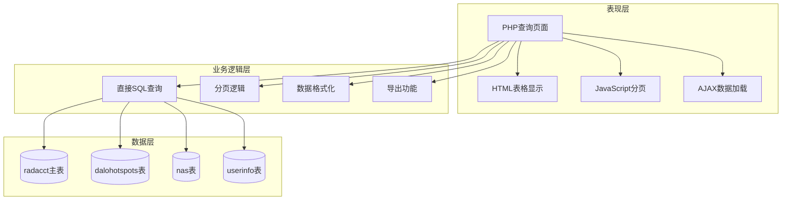
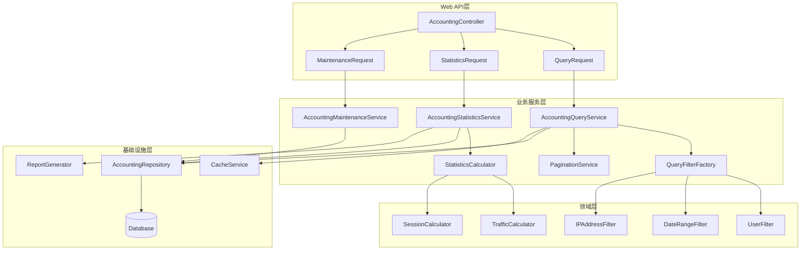

# 计费管理核心页面分析报告 (Batch 3)

## 分析概述 (Analysis Overview)

本批次分析了daloRADIUS计费管理模块的5个核心页面，这些页面负责网络访问计费数据的查询、统计、维护等核心功能。分析重点关注抽象设计层面，遵循SOLID原则和现代软件架构最佳实践。

### 分析文件清单
- `acct-main.php` (48行) - 计费管理主入口页面
- `acct-all.php` (279行) - 全量计费记录查询页面
- `acct-username.php` (293行) - 按用户查询计费记录页面
- `acct-date.php` (330行) - 按日期范围查询计费记录页面
- `acct-maintenance.php` (48行) - 计费数据维护页面

**总代码量**: 998行
**复杂度评估**: 中高复杂度模块，涉及大数据量查询、复杂统计分析、性能优化需求

## 一、架构分析 (Architectural Analysis)

### 当前架构模式


### 设计问题识别

**违背SRP原则**:
- 单个页面文件承担了查询条件构建、数据库查询、结果展示、分页处理等多重职责
- `acct-all.php` 混合了数据查询逻辑和UI渲染逻辑

**违背OCP原则**:
- 新增查询维度（如地理位置、设备类型）需要修改现有的SQL构建代码
- 不同查询条件的组合逻辑硬编码在条件分支中

**性能和扩展性问题**:
- 缺乏查询优化机制，复杂查询可能导致数据库性能问题
- 没有统一的缓存策略，重复查询造成资源浪费
- 大数据量查询缺乏异步处理机制

## 二、核心功能分析 (Core Functionality Analysis)

### acct-main.php - 计费管理主入口

**职责范围**:
- 计费管理功能的导航入口
- 提供计费模块的概览信息

**代码特征**:
- 极简导航页面，仅48行代码
- 标准的页面布局和帮助信息显示

**设计评估**:
- 符合SRP原则，职责单一清晰
- 作为入口页面，设计合理

### acct-all.php - 全量计费记录查询

**职责范围**:
- 查询和展示所有计费记录
- 支持分页、排序、导出功能
- 提供AJAX交互和工具提示

**关键业务逻辑**:
```php
// 复杂SQL查询 - 多表连接
$sql = sprintf(
    "SELECT ra.RadAcctId, dhs.name AS hotspot, ra.username, ra.FramedIPAddress, 
            ra.AcctStartTime, ra.AcctStopTime, ra.AcctSessionTime, 
            ra.AcctInputOctets, ra.AcctOutputOctets, ra.AcctTerminateCause, ra.NASIPAddress
     FROM %s AS ra
     LEFT JOIN %s AS dhs ON ra.calledstationid = dhs.mac
     ORDER BY %s %s
     LIMIT %d, %d",
    $configValues['CONFIG_DB_TBL_RADACCT'],
    $configValues['CONFIG_DB_TBL_DALOHOTSPOTS'],
    $orderBy, $orderType, $offset, $rowsPerPage
);
```

**问题分析**:
1. **职责过载**: 查询构建、数据处理、UI渲染混合在一个文件中
2. **硬编码查询**: SQL语句硬编码，难以扩展和优化
3. **性能风险**: 大表全量查询缺乏优化策略
4. **重复代码**: 分页逻辑与其他查询页面重复

### acct-username.php - 按用户查询计费记录

**职责范围**:
- 根据用户名查询特定用户的计费记录
- 支持用户名的模糊匹配和精确查询
- 提供用户相关的统计信息

**查询条件构建**:
```php
// 用户过滤条件 - 缺乏抽象
$sql_WHERE = "";
$partial_query_string = "";
if (!empty($username)) {
    $sql_WHERE = sprintf(" WHERE username='%s'", $dbSocket->escapeSimple($username));
    $partial_query_string = sprintf("&username=%s", urlencode($username_enc));
}
```

**设计缺陷**:
1. **条件构建耦合**: WHERE条件的构建逻辑与页面逻辑耦合
2. **重复模式**: 与`acct-all.php`有大量重复的查询和显示逻辑
3. **扩展困难**: 添加新的用户查询维度需要修改核心代码

### acct-date.php - 按日期范围查询计费记录

**职责范围**:
- 根据日期范围查询计费记录
- 支持开始日期和结束日期的组合查询
- 提供时间段的统计分析

**复杂查询逻辑**:
```php
// 日期范围查询条件构建
$sql_WHERE = array();
$partial_query_params = array();

if (!empty($startdate)) {
    $sql_WHERE[] = sprintf("AcctStartTime >= '%s'", $dbSocket->escapeSimple($startdate));
    $partial_query_params[] = sprintf("startdate=%s", urlencode($startdate));
}

if (!empty($enddate)) {
    $sql_WHERE[] = sprintf("AcctStopTime <= '%s'", $dbSocket->escapeSimple($enddate));
    $partial_query_params[] = sprintf("enddate=%s", urlencode($enddate));
}

if (!empty($username)) {
    $sql_WHERE[] = sprintf("username='%s'", $dbSocket->escapeSimple($username));
    $partial_query_params[] = sprintf("username=%s", urlencode($username_enc));
}
```

**关键问题**:
1. **查询复杂度**: 多条件组合查询缺乏统一的构建机制
2. **性能隐患**: 大时间范围查询可能导致性能问题
3. **逻辑重复**: 条件构建逻辑在多个页面重复出现

### acct-maintenance.php - 计费数据维护

**职责范围**:
- 计费数据的维护和管理入口
- 数据清理、归档、完整性检查等功能

**代码特征**:
- 简单的导航页面，48行代码
- 提供维护功能的入口点

**潜在需求**:
- 大数据量的清理策略
- 历史数据的归档机制
- 数据完整性验证工具

## 三、现代化设计方案 (Modernization Design)

### 基于SOLID原则的重构架构



### 核心接口设计

**计费查询服务接口** (遵循SRP):
```python
class AccountingQueryService:
    def query_all_records(self, filters: QueryFilters, pagination: Pagination) -> PagedResult[AccountingRecord]:
        """查询所有计费记录 - 单一职责：全量数据查询协调"""
        
    def query_by_username(self, username: str, additional_filters: QueryFilters = None) -> List[AccountingRecord]:
        """按用户名查询计费记录 - 单一职责：用户维度查询"""
        
    def query_by_date_range(self, start_date: datetime, end_date: datetime, filters: QueryFilters = None) -> List[AccountingRecord]:
        """按日期范围查询计费记录 - 单一职责：时间维度查询"""
        
    def export_records(self, query_criteria: QueryCriteria, format_type: ExportFormat) -> ExportResult:
        """导出计费记录 - 单一职责：数据导出处理"""
```

**查询过滤策略接口** (遵循OCP):
```python
class QueryFilterStrategy(ABC):
    @abstractmethod
    def build_filter_condition(self, criteria: QueryCriteria) -> FilterCondition:
        """构建过滤条件 - 开放扩展：新过滤类型只需实现此接口"""
        
    @abstractmethod
    def validate_parameters(self, params: dict) -> ValidationResult:
        """验证过滤参数 - 开放扩展：支持不同验证规则"""
        
    @abstractmethod
    def estimate_selectivity(self, params: dict) -> float:
        """估算选择性 - 开放扩展：支持查询优化"""

# 具体策略实现 - 新增过滤类型无需修改现有代码
class UserFilterStrategy(QueryFilterStrategy):
    def build_filter_condition(self, criteria: QueryCriteria) -> FilterCondition:
        return FilterCondition(
            field="username",
            operator="=",
            value=criteria.username,
            index_hint="idx_username"
        )
        
    def validate_parameters(self, params: dict) -> ValidationResult:
        username = params.get('username', '')
        if not username or len(username) < 2:
            return ValidationResult(is_valid=False, errors=["Username must be at least 2 characters"])
        return ValidationResult(is_valid=True, errors=[])

class DateRangeFilterStrategy(QueryFilterStrategy):
    def build_filter_condition(self, criteria: QueryCriteria) -> FilterCondition:
        conditions = []
        if criteria.start_date:
            conditions.append(FilterCondition("AcctStartTime", ">=", criteria.start_date))
        if criteria.end_date:
            conditions.append(FilterCondition("AcctStopTime", "<=", criteria.end_date))
        
        return CompositeFilterCondition(conditions, operator="AND")
        
    def validate_parameters(self, params: dict) -> ValidationResult:
        start_date = params.get('start_date')
        end_date = params.get('end_date')
        
        if start_date and end_date and start_date > end_date:
            return ValidationResult(is_valid=False, errors=["Start date must be before end date"])
        
        # 限制查询时间范围，避免性能问题
        if start_date and end_date:
            max_range = timedelta(days=365)  # 最大查询一年数据
            if end_date - start_date > max_range:
                return ValidationResult(is_valid=False, errors=["Date range cannot exceed 365 days"])
        
        return ValidationResult(is_valid=True, errors=[])
```

**计费记录聚合根** (遵循DDD):
```python
class AccountingRecordAggregate:
    """计费记录聚合根 - 封装计费业务不变性"""
    
    def __init__(self, radacct_id: int, username: str, nas_ip: str):
        self.radacct_id = radacct_id
        self.username = username
        self.nas_ip_address = nas_ip
        self.session_info: SessionInfo = SessionInfo()
        self.traffic_info: TrafficInfo = TrafficInfo()
        self.location_info: LocationInfo = LocationInfo()
    
    def calculate_session_duration(self) -> timedelta:
        """计算会话时长 - 业务逻辑封装"""
        if not self.session_info.is_completed():
            return timedelta()
        
        return self.session_info.stop_time - self.session_info.start_time
    
    def calculate_total_traffic(self) -> int:
        """计算总流量 - 业务规则应用"""
        return self.traffic_info.input_octets + self.traffic_info.output_octets
    
    def is_suspicious_session(self) -> bool:
        """检测异常会话 - 业务规则判断"""
        # 会话时长异常短或异常长
        duration = self.calculate_session_duration()
        if duration < timedelta(seconds=10) or duration > timedelta(hours=24):
            return True
        
        # 流量异常（上传下载比例异常）
        if self.traffic_info.input_octets > 0 and self.traffic_info.output_octets > 0:
            ratio = self.traffic_info.input_octets / self.traffic_info.output_octets
            if ratio > 100 or ratio < 0.01:  # 上传下载比例过于悬殊
                return True
        
        return False
```

**Repository接口** (遵循DIP):
```python
class AccountingRepository(ABC):
    @abstractmethod
    async def find_with_filters(self, filters: List[FilterCondition], pagination: Pagination) -> PagedResult[AccountingRecord]:
        """使用复合过滤条件查询记录 - 抽象查询操作"""
        
    @abstractmethod
    async def count_with_filters(self, filters: List[FilterCondition]) -> int:
        """统计符合条件的记录数量 - 抽象计数操作"""
        
    @abstractmethod
    async def aggregate_statistics(self, criteria: StatisticsCriteria) -> AggregateResult:
        """聚合统计计算 - 抽象统计操作"""
        
    @abstractmethod
    async def find_by_date_range_optimized(self, start_date: datetime, end_date: datetime, 
                                         additional_filters: List[FilterCondition] = None) -> List[AccountingRecord]:
        """优化的日期范围查询 - 抽象性能优化查询"""

# 具体实现 - 可替换为不同的存储和优化策略
class SqlAccountingRepository(AccountingRepository):
    def __init__(self, db_session: AsyncSession, cache_service: CacheService):
        self._session = db_session
        self._cache = cache_service
    
    async def find_with_filters(self, filters: List[FilterCondition], pagination: Pagination) -> PagedResult[AccountingRecord]:
        # 构建优化的SQL查询
        query_builder = SQLQueryBuilder()
        
        # 应用过滤条件，按选择性排序
        sorted_filters = sorted(filters, key=lambda f: f.estimated_selectivity, reverse=True)
        for filter_condition in sorted_filters:
            query_builder.add_filter(filter_condition)
        
        # 应用分页
        query_builder.add_pagination(pagination)
        
        # 添加查询优化提示
        query_builder.add_hints(["USE INDEX", "SQL_NO_CACHE"])
        
        sql_query = query_builder.build()
        
        # 检查缓存
        cache_key = self._generate_cache_key(sql_query, pagination)
        cached_result = await self._cache.get(cache_key)
        if cached_result:
            return cached_result
        
        # 执行查询
        result = await self._session.execute(sql_query)
        records = [self._map_to_aggregate(row) for row in result.fetchall()]
        
        # 获取总数（用于分页）
        count_query = query_builder.build_count_query()
        total_count = await self._session.scalar(count_query)
        
        paged_result = PagedResult(
            items=records,
            total_count=total_count,
            page_number=pagination.page_number,
            page_size=pagination.page_size
        )
        
        # 缓存结果
        await self._cache.set(cache_key, paged_result, ttl=300)  # 5分钟缓存
        
        return paged_result
    
    async def aggregate_statistics(self, criteria: StatisticsCriteria) -> AggregateResult:
        # 构建聚合查询 - 在数据库层面计算，避免内存计算
        aggregation_query = """
            SELECT 
                COUNT(*) as total_sessions,
                SUM(AcctSessionTime) as total_session_time,
                SUM(AcctInputOctets + AcctOutputOctets) as total_traffic,
                AVG(AcctSessionTime) as avg_session_time,
                COUNT(DISTINCT username) as unique_users,
                COUNT(DISTINCT NASIPAddress) as unique_nas
            FROM radacct 
            WHERE AcctStartTime >= :start_date 
              AND AcctStopTime <= :end_date
        """
        
        result = await self._session.execute(
            text(aggregation_query),
            {
                "start_date": criteria.start_date,
                "end_date": criteria.end_date
            }
        )
        
        row = result.fetchone()
        return AggregateResult(
            total_sessions=row.total_sessions,
            total_session_time=timedelta(seconds=row.total_session_time or 0),
            total_traffic=row.total_traffic or 0,
            average_session_time=timedelta(seconds=row.avg_session_time or 0),
            unique_users=row.unique_users,
            unique_nas=row.unique_nas
        )
```

## 四、实施建议与风险评估 (Implementation Recommendations & Risk Assessment)

### 迁移策略

**阶段1: 查询抽象层建立** (2-3周)
- 创建QueryFilterStrategy接口和基础实现
- 建立AccountingRepository抽象层
- 实现基础的查询构建器

**阶段2: 业务服务重构** (3-4周)
- 提取AccountingQueryService业务逻辑
- 实现统一的查询优化机制
- 添加缓存和性能监控

**阶段3: 统计分析增强** (2-3周)
- 实现AccountingStatisticsService
- 添加实时统计计算能力
- 集成报表生成功能

**阶段4: 性能优化与监控** (3-4周)
- 数据库查询优化和索引策略
- 大数据量处理的异步机制
- 监控和告警系统集成

### 风险评估与缓解措施

**高风险**:
1. **查询性能风险**: 大数据量查询可能导致数据库性能问题
   - 缓解: 实现查询优化器、强制索引使用、查询超时控制
   
2. **数据一致性风险**: 计费数据的实时性和一致性要求
   - 缓解: 读写分离、事务隔离级别控制、数据校验机制

**中风险**:
3. **内存消耗风险**: 大结果集可能导致内存溢出
   - 缓解: 流式查询、分页限制、结果集大小监控

4. **并发访问风险**: 高并发查询可能影响系统稳定性
   - 缓解: 连接池管理、查询队列、限流机制

### 技术债务清理

**查询优化**:
- 消除重复查询逻辑：统一查询构建器和过滤器
- 索引策略优化：基于查询模式的复合索引设计
- 查询缓存：智能缓存策略和失效机制

**代码质量提升**:
- 分离关注点：查询逻辑、展示逻辑、业务逻辑分离
- 提高测试覆盖率：查询逻辑的单元测试和性能测试
- 改进监控：查询性能监控、慢查询分析、容量规划

## 五、总结与后续规划 (Summary & Next Steps)

### 关键发现

1. **查询复杂性高**: 计费管理涉及多维度查询、大数据量处理、复杂统计分析
2. **性能优化需求迫切**: 当前设计缺乏有效的查询优化和缓存策略
3. **扩展性受限**: 硬编码的查询逻辑限制了新查询维度的添加

### 设计价值

通过应用现代软件设计原则：
- **SRP应用**: 查询服务、统计服务、维护服务各司其职
- **OCP实现**: 策略模式支持新查询条件的零侵入扩展
- **DIP践行**: 依赖抽象Repository而非具体数据库实现
- **性能优化**: 查询优化器、缓存策略、异步处理机制

### 后续分析计划

**Batch 4: 账单管理系统** (优先级: 高)
- `bill-main.php` - 账单管理主页面
- `bill-invoice-*.php` - 发票管理功能
- `bill-payment-*.php` - 支付管理功能
- `bill-plans-*.php` - 计费方案管理
- `bill-rates-*.php` - 费率管理功能

预期发现: 复杂的财务计算逻辑、多币种支持需求、支付集成模式

**Batch 5: 配置管理系统** (优先级: 中高)
- 系统配置、数据库配置、邮件配置等核心配置功能

通过系统性的分析和现代化设计，为daloRADIUS计费管理模块的Python重构提供了完整的架构指导和实施路径。