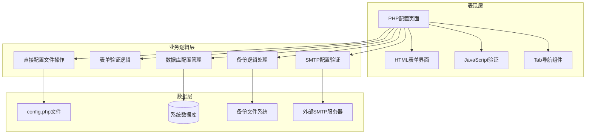
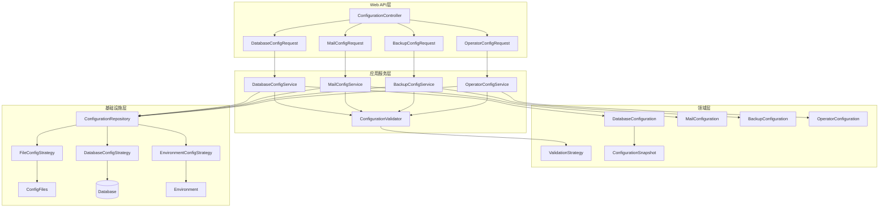

# 配置管理核心页面分析报告 (Batch 5)

## 分析概述 (Analysis Overview)

本批次分析了daloRADIUS配置管理模块的5个核心页面，这些页面构成了系统配置管理的基础架构。分析重点关注抽象设计层面，遵循SOLID原则和现代化配置管理最佳实践。

### 分析文件清单
- `config-main.php` (38行) - 配置管理主入口页面
- `config-db.php` (241行) - 数据库配置管理页面
- `config-mail-settings.php` (345行) - 邮件配置管理页面
- `config-operators-list.php` (212行) - 操作员配置列表页面
- `config-backup-createbackups.php` (380行) - 备份创建配置页面

**总代码量**: 1,216行
**复杂度评估**: 高复杂度模块，涉及系统核心配置、安全设置、运维自动化、环境管理

## 一、架构分析 (Architectural Analysis)

### 当前架构模式


### 设计问题识别

**违背SRP原则**:
- 单个页面文件承担了配置展示、验证、存储、测试等多重职责
- `config-db.php` 混合了数据库连接测试、表映射管理、配置文件写入等逻辑

**违背OCP原则**:
- 新增配置类型需要修改现有的验证和处理逻辑
- 不同环境的配置管理缺乏统一的抽象层

**配置安全和一致性问题**:
- 敏感配置（如数据库密码）缺乏加密存储
- 配置变更缺乏版本控制和回滚机制
- 多实例环境下配置同步困难

## 二、核心功能分析 (Core Functionality Analysis)

### config-main.php - 配置管理主入口

**职责范围**:
- 配置管理功能的导航入口
- 提供配置模块的概览信息

**代码特征**:
- 极简导航页面，仅38行代码
- 标准的页面布局和帮助信息显示

**设计评估**:
- 符合SRP原则，职责单一清晰
- 作为配置模块入口，设计合理

### config-db.php - 数据库配置管理

**职责范围**:
- 管理数据库连接参数（主机、端口、用户名、密码等）
- 配置数据库表映射关系
- 验证数据库连接有效性
- 支持多种数据库引擎配置

**复杂配置管理逻辑**:
```php
// 复杂的数据库表配置映射
$db_tbl_param_label = array(
    'CONFIG_DB_TBL_RADCHECK' => t('all','radcheck'),
    'CONFIG_DB_TBL_RADREPLY' => t('all','radreply'),
    'CONFIG_DB_TBL_RADGROUPREPLY' => t('all','radgroupreply'),
    'CONFIG_DB_TBL_RADGROUPCHECK' => t('all','radgroupcheck'),
    'CONFIG_DB_TBL_RADUSERGROUP' => t('all','usergroup'),
    'CONFIG_DB_TBL_RADACCT' => t('all','radacct'),
    // ... 30多个表配置项
);

// 数据库连接参数验证
$generic_db_conf_params = array(
    'CONFIG_DB_HOST' => t('all','DatabaseHostname'),
    'CONFIG_DB_USER' => t('all','DatabaseUser'),
    'CONFIG_DB_PASS' => t('all','DatabasePass'),
    'CONFIG_DB_NAME' => t('all','DatabaseName'),
);

// 表单验证和配置保存逻辑
if ($_SERVER['REQUEST_METHOD'] === 'POST') {
    if (array_key_exists('csrf_token', $_POST) && isset($_POST['csrf_token']) && dalo_check_csrf_token($_POST['csrf_token'])) {
        
        // 验证数据库引擎
        if (array_key_exists('CONFIG_DB_ENGINE', $_POST) && isset($_POST['CONFIG_DB_ENGINE']) &&
            in_array(strtolower($_POST['CONFIG_DB_ENGINE']), array_keys($valid_db_engines))) {
            $configValues['CONFIG_DB_ENGINE'] = $_POST['CONFIG_DB_ENGINE'];
        }
        
        // 验证数据库端口
        if (array_key_exists('CONFIG_DB_PORT', $_POST) && isset($_POST['CONFIG_DB_PORT']) &&
            intval($_POST['CONFIG_DB_PORT']) >= 0 && intval($_POST['CONFIG_DB_PORT']) <= 65535) {
            $configValues['CONFIG_DB_PORT'] = intval($_POST['CONFIG_DB_PORT']);
        }
        
        // 验证表名格式
        foreach ($db_tbl_param_label as $param => $label) {
            if (array_key_exists($param, $_POST) && isset($_POST[$param]) && 
                preg_match(DB_TABLE_NAME_REGEX, $_POST[$param]) !== false) {
                $configValues[$param] = $_POST[$param];
            }
        }
        
        include("../common/includes/config_write.php");
    }
}
```

**关键问题分析**:
1. **配置验证分散**: 各种验证逻辑散布在处理代码中，缺乏统一的验证框架
2. **安全性不足**: 数据库密码等敏感信息直接存储在配置文件中
3. **错误处理简陋**: 配置错误缺乏详细的诊断信息和恢复建议
4. **扩展性限制**: 新增数据库类型或配置项需要修改多处代码

### config-mail-settings.php - 邮件配置管理

**职责范围**:
- 配置SMTP服务器连接参数
- 管理邮件安全设置（SSL/TLS）
- 设置发送者信息和邮件模板
- 测试邮件配置有效性

**邮件配置验证逻辑**:
```php
// 邮件配置参数定义
$param_label = array(
    'CONFIG_MAIL_SMTPADDR' => t('all','SMTPServerAddress'),
    'CONFIG_MAIL_SMTPPORT' => t('all','SMTPServerPort'), 
    'CONFIG_MAIL_SMTPFROM' => t('all','SMTPServerFromEmail'),
);

// 复杂的邮件配置验证逻辑
if ($_SERVER['REQUEST_METHOD'] === 'POST') {
    if (array_key_exists('csrf_token', $_POST) && isset($_POST['csrf_token']) && dalo_check_csrf_token($_POST['csrf_token'])) {
        
        // 验证邮件启用状态
        if (array_key_exists('CONFIG_MAIL_ENABLED', $_POST) &&
            !empty(trim($_POST['CONFIG_MAIL_ENABLED'])) &&
            in_array(strtolower(trim($_POST['CONFIG_MAIL_ENABLED'])), array("yes", "no"))) {
            $configValues['CONFIG_MAIL_ENABLED'] = strtolower(trim($_POST['CONFIG_MAIL_ENABLED']));
        } else {
            $configValues['CONFIG_MAIL_ENABLED'] = "no";
        }
        
        // 验证安全类型
        if (array_key_exists('CONFIG_MAIL_SMTP_SECURITY', $_POST) &&
            !empty(trim($_POST['CONFIG_MAIL_SMTP_SECURITY'])) &&
            in_array(strtolower(trim($_POST['CONFIG_MAIL_SMTP_SECURITY'])), array("ssl", "tls", "none"))) {
            $configValues['CONFIG_MAIL_SMTP_SECURITY'] = strtolower(trim($_POST['CONFIG_MAIL_SMTP_SECURITY']));
        } else {
            $configValues['CONFIG_MAIL_SMTP_SECURITY'] = "none";
        }
        
        // 验证发送者邮箱
        if (array_key_exists('CONFIG_MAIL_SMTPFROM', $_POST) &&
            !empty(trim($_POST['CONFIG_MAIL_SMTPFROM'])) &&
            filter_var(trim($_POST['CONFIG_MAIL_SMTPFROM']), FILTER_VALIDATE_EMAIL)) {
            $configValues['CONFIG_MAIL_SMTPFROM'] = trim($_POST['CONFIG_MAIL_SMTPFROM']);
        } else {
            $invalid_input['CONFIG_MAIL_SMTPFROM'] = $param_label['CONFIG_MAIL_SMTPFROM'];
            $configValues['CONFIG_MAIL_ENABLED'] = "no";
        }
    }
}
```

**设计缺陷**:
1. **验证逻辑冗长**: 大量重复的验证代码，缺乏抽象的验证规则
2. **配置关联复杂**: 邮件配置项之间的依赖关系处理复杂
3. **测试功能缺失**: 缺乏SMTP连接测试和邮件发送测试功能
4. **错误反馈不足**: 配置错误时缺乏具体的错误定位信息

### config-operators-list.php - 操作员配置列表

**职责范围**:
- 显示系统操作员列表
- 提供操作员信息的分页和排序
- 支持操作员权限管理入口
- 控制密码显示策略

**操作员查询逻辑**:
```php
// 操作员列表字段配置
$cols = array(
    "id" => t('all','ID'), 
    "username" => t('all','Username')
);

if (strtolower($configValues['CONFIG_IFACE_PASSWORD_HIDDEN']) === "yes") {
    $cols[] = t('all','Password');
} else {
    $cols["auth"] = t('all','Password');
}

$cols["fullname"] = "Full name";
$cols["title"] = "Title";

// 排序和分页逻辑
$orderBy = (array_key_exists('orderBy', $_GET) && isset($_GET['orderBy']) &&
            in_array($_GET['orderBy'], array_keys($param_cols)))
         ? $_GET['orderBy'] : array_keys($param_cols)[0];

$orderType = (array_key_exists('orderType', $_GET) && isset($_GET['orderType']) &&
              in_array(strtolower($_GET['orderType']), array( "desc", "asc" )))
           ? strtolower($_GET['orderType']) : "desc";

// 查询操作员数量
$sql = sprintf("SELECT COUNT(id) FROM %s", $configValues['CONFIG_DB_TBL_DALOOPERATORS']);
$res = $dbSocket->query($sql);
$numrows = $res->fetchrow()[0];
```

**潜在问题**:
1. **权限管理缺失**: 缺乏细粒度的操作员权限控制
2. **安全问题**: 密码显示控制逻辑简单，可能存在信息泄露风险
3. **查询效率**: 简单的分页查询，缺乏索引优化和缓存机制
4. **功能局限**: 仅提供基础的列表显示，缺乏高级管理功能

### config-backup-createbackups.php - 备份创建配置

**职责范围**:
- 选择要备份的数据库表
- 生成SQL备份文件
- 管理备份文件的存储路径
- 提供备份状态反馈

**复杂的备份生成逻辑**:
```php
// 备份表配置
$db_tbl_param_label = array(
    'CONFIG_DB_TBL_RADCHECK' => t('all','radcheck'), 
    'CONFIG_DB_TBL_RADREPLY' => t('all','radreply'),
    // ... 30多个表的备份配置
);

// 备份文件生成逻辑
if ($_SERVER['REQUEST_METHOD'] === 'POST') {
    if (array_key_exists('csrf_token', $_POST) && isset($_POST['csrf_token']) && dalo_check_csrf_token($_POST['csrf_token'])) {
        
        $filePrefix = "backup";
        $fileDate = date("Ymd-His");
        $filePath = $configValues['CONFIG_PATH_DALO_VARIABLE_DATA'] . "/backup";
        $fileName = sprintf("%s/%s-%s.sql", $filePath, $filePrefix, $fileDate);

        // 检查备份文件创建权限
        $fileError = false;
        if ( is_dir($filePath) && is_writable($filePath) ) {
            $fh = fopen($fileName, "w");
            if($fh === false) {
                $fileError = true;
            }
        } else {
            $fileError = true;
        }
        
        if($fileError) {
            $failureMsg = "Failed creating backup due to directory/file permissions. " 
                        . sprintf("Check that the webserver user has access to create the following file: %s", $fileName);
        } else {
            // 执行数据库备份逻辑
            foreach ($db_tbl_param_label as $param => $label) {
                if (array_key_exists($param, $_POST) && $_POST[$param] == "yes") {
                    $table = $configValues[$param];
                    
                    // 生成表结构SQL
                    $sqlTableStructure = sprintf("DROP TABLE IF EXISTS `%s`;\n", $table);
                    $sqlTableStructure .= sprintf("CREATE TABLE `%s` (\n", $table);
                    // ... 复杂的表结构生成逻辑
                    
                    // 生成数据SQL
                    $sql = sprintf("SELECT * FROM %s", $table);
                    $res = $dbSocket->query($sql);
                    
                    while ($row = $res->fetchRow()) {
                        $currRow = "(";
                        $N = $colLength - 1;
                        for ($i = 0; $i < $N; $i++) {
                            $currRow .= sprintf("'%s', ", $dbSocket->escapeSimple($row[$i]));
                        }
                        $currRow .= sprintf("'%s')", $dbSocket->escapeSimple($row[$N]));
                        $sqlTableQuery .= $currRow;
                    }
                    
                    // 写入备份文件
                    if(fwrite($fh, $sqlTableQuery) === false) {
                        $fileError++;
                        break;
                    }
                }
            }
        }
    }
}
```

**核心挑战**:
1. **备份策略简单**: 仅支持全量备份，缺乏增量备份和差异备份
2. **错误处理不完善**: 备份过程中的错误处理和恢复机制不足
3. **性能问题**: 大表备份可能导致内存溢出和超时问题
4. **存储管理缺失**: 缺乏备份文件的自动清理和空间管理

## 三、现代化设计方案 (Modernization Design)

### 基于SOLID原则的重构架构



### 核心接口设计

**配置管理服务接口** (遵循SRP):
```python
class DatabaseConfigurationService:
    """数据库配置服务 - 单一职责：数据库配置管理业务逻辑"""
    
    def update_connection_config(self, config: DatabaseConnectionConfig, operator: str) -> ConfigurationResult:
        """更新数据库连接配置 - 包含连接测试和验证"""
        
    def update_table_mappings(self, mappings: Dict[str, str], operator: str) -> ConfigurationResult:
        """更新表映射配置 - 验证表存在性和命名规范"""
        
    def test_database_connection(self, config: DatabaseConnectionConfig) -> ConnectionTestResult:
        """测试数据库连接 - 验证连接有效性"""
        
    def get_database_info(self, config: DatabaseConnectionConfig) -> DatabaseInfo:
        """获取数据库信息 - 版本、编码、表结构等"""
        
    def validate_table_structure(self, table_mappings: Dict[str, str]) -> ValidationResult:
        """验证表结构兼容性 - 检查必需字段和索引"""

class MailConfigurationService:
    """邮件配置服务 - 单一职责：邮件配置管理业务逻辑"""
    
    def update_smtp_config(self, config: SMTPConfig, operator: str) -> ConfigurationResult:
        """更新SMTP配置 - 包含连接测试和安全验证"""
        
    def test_smtp_connection(self, config: SMTPConfig) -> SMTPTestResult:
        """测试SMTP连接 - 验证服务器连接和认证"""
        
    def send_test_email(self, config: SMTPConfig, recipient: str) -> EmailTestResult:
        """发送测试邮件 - 端到端邮件功能测试"""
        
    def validate_mail_template(self, template: MailTemplate) -> ValidationResult:
        """验证邮件模板 - 模板语法和必需变量检查"""
        
    def get_mail_statistics(self) -> MailStatistics:
        """获取邮件统计信息 - 发送成功率、错误统计等"""

class BackupConfigurationService:
    """备份配置服务 - 单一职责：备份配置管理业务逻辑"""
    
    def create_backup_plan(self, plan: BackupPlan, operator: str) -> ConfigurationResult:
        """创建备份计划 - 设定备份策略和调度"""
        
    def execute_manual_backup(self, backup_config: BackupConfig, operator: str) -> BackupResult:
        """执行手动备份 - 立即执行备份操作"""
        
    def schedule_automatic_backup(self, schedule: BackupSchedule, operator: str) -> ScheduleResult:
        """调度自动备份 - 设置定期备份任务"""
        
    def list_backup_files(self, filters: BackupFilters) -> List[BackupFile]:
        """列出备份文件 - 支持按时间、大小等条件过滤"""
        
    def restore_from_backup(self, backup_file: str, options: RestoreOptions, operator: str) -> RestoreResult:
        """从备份恢复 - 支持选择性恢复和数据验证"""
```

**配置验证策略接口** (遵循OCP):
```python
class ConfigurationValidationStrategy(ABC):
    """配置验证策略抽象 - 开放扩展：支持不同验证规则"""
    
    @abstractmethod
    def validate(self, config: Any) -> ValidationResult:
        """执行验证 - 扩展点：实现具体验证逻辑"""
        
    @abstractmethod
    def get_validation_rules(self) -> List[ValidationRule]:
        """获取验证规则 - 扩展点：定义验证规则集"""
        
    @abstractmethod
    def supports_config_type(self, config_type: ConfigurationType) -> bool:
        """支持的配置类型 - 扩展点：类型适配性检查"""

# 数据库配置验证策略
class DatabaseConfigValidationStrategy(ConfigurationValidationStrategy):
    def validate(self, config: DatabaseConnectionConfig) -> ValidationResult:
        """验证数据库配置"""
        errors = []
        
        # 验证主机名
        if not self._is_valid_hostname(config.host):
            errors.append("Invalid database hostname")
        
        # 验证端口范围
        if not (1 <= config.port <= 65535):
            errors.append("Database port must be between 1 and 65535")
        
        # 验证数据库名称
        if not self._is_valid_database_name(config.database):
            errors.append("Invalid database name format")
        
        # 验证用户名强度
        if len(config.username) < 3:
            errors.append("Database username must be at least 3 characters")
        
        # 验证密码强度
        password_strength = self._check_password_strength(config.password)
        if not password_strength.is_strong:
            errors.append(f"Weak database password: {password_strength.weakness_reason}")
        
        # 测试数据库连接
        connection_test = self._test_database_connection(config)
        if not connection_test.success:
            errors.append(f"Database connection failed: {connection_test.error_message}")
        
        if errors:
            return ValidationResult.failure("; ".join(errors))
        
        return ValidationResult.success()
    
    def get_validation_rules(self) -> List[ValidationRule]:
        return [
            ValidationRule("hostname", self._is_valid_hostname, "Must be valid hostname or IP"),
            ValidationRule("port", lambda p: 1 <= p <= 65535, "Must be between 1 and 65535"),
            ValidationRule("database_name", self._is_valid_database_name, "Must follow database naming rules"),
            ValidationRule("username_length", lambda u: len(u) >= 3, "Must be at least 3 characters"),
            ValidationRule("password_strength", self._is_strong_password, "Must meet password complexity requirements"),
            ValidationRule("connection_test", self._can_connect_to_database, "Must be able to establish connection")
        ]
    
    def supports_config_type(self, config_type: ConfigurationType) -> bool:
        return config_type == ConfigurationType.DATABASE
    
    def _test_database_connection(self, config: DatabaseConnectionConfig) -> ConnectionTestResult:
        """测试数据库连接"""
        try:
            connection_string = f"mysql://{config.username}:{config.password}@{config.host}:{config.port}/{config.database}"
            engine = create_engine(
                connection_string,
                pool_pre_ping=True,
                connect_args={"connect_timeout": 10}
            )
            
            with engine.connect() as conn:
                # 测试基本查询
                result = conn.execute(text("SELECT 1 as test"))
                test_value = result.fetchone()[0]
                
                if test_value == 1:
                    # 测试必需的表是否存在
                    table_test = self._verify_required_tables(conn, config)
                    if table_test.success:
                        return ConnectionTestResult.success("Database connection successful")
                    else:
                        return ConnectionTestResult.failure(f"Missing required tables: {table_test.missing_tables}")
                else:
                    return ConnectionTestResult.failure("Database query test failed")
                    
        except Exception as e:
            return ConnectionTestResult.failure(f"Connection failed: {str(e)}")

# 邮件配置验证策略
class MailConfigValidationStrategy(ConfigurationValidationStrategy):
    def validate(self, config: SMTPConfig) -> ValidationResult:
        """验证邮件配置"""
        errors = []
        
        # 验证SMTP服务器
        if not self._is_valid_smtp_server(config.host):
            errors.append("Invalid SMTP server hostname")
        
        # 验证端口与加密类型的兼容性
        if not self._is_compatible_port_encryption(config.port, config.encryption):
            errors.append(f"Port {config.port} is not compatible with {config.encryption} encryption")
        
        # 验证发送者邮箱
        if not self._is_valid_email(config.from_email):
            errors.append("Invalid sender email address")
        
        # 验证认证信息
        if config.enable_auth and (not config.username or not config.password):
            errors.append("SMTP authentication enabled but credentials missing")
        
        # 测试SMTP连接
        smtp_test = self._test_smtp_connection(config)
        if not smtp_test.success:
            errors.append(f"SMTP connection failed: {smtp_test.error_message}")
        
        if errors:
            return ValidationResult.failure("; ".join(errors))
        
        return ValidationResult.success()
    
    def _test_smtp_connection(self, config: SMTPConfig) -> SMTPTestResult:
        """测试SMTP连接"""
        try:
            import smtplib
            from email.mime.text import MIMEText
            
            # 根据加密类型选择连接方式
            if config.encryption == MailEncryption.SSL:
                server = smtplib.SMTP_SSL(config.host, config.port, timeout=30)
            else:
                server = smtplib.SMTP(config.host, config.port, timeout=30)
                if config.encryption == MailEncryption.TLS:
                    server.starttls()
            
            # 测试认证
            if config.enable_auth:
                server.login(config.username, config.password)
            
            server.quit()
            return SMTPTestResult.success("SMTP connection successful")
            
        except smtplib.SMTPAuthenticationError as e:
            return SMTPTestResult.failure(f"SMTP authentication failed: {str(e)}")
        except smtplib.SMTPConnectError as e:
            return SMTPTestResult.failure(f"SMTP connection failed: {str(e)}")
        except Exception as e:
            return SMTPTestResult.failure(f"SMTP test failed: {str(e)}")

# 备份配置验证策略
class BackupConfigValidationStrategy(ConfigurationValidationStrategy):
    def validate(self, config: BackupConfig) -> ValidationResult:
        """验证备份配置"""
        errors = []
        
        # 验证备份路径
        if not self._is_valid_backup_path(config.backup_path):
            errors.append("Invalid backup path")
        
        # 检查目录权限
        if not self._check_directory_permissions(config.backup_path):
            errors.append(f"Insufficient permissions for backup path: {config.backup_path}")
        
        # 检查磁盘空间
        space_check = self._check_available_space(config.backup_path, config.estimated_size)
        if not space_check.sufficient:
            errors.append(f"Insufficient disk space. Required: {config.estimated_size}, Available: {space_check.available}")
        
        # 验证备份表列表
        if not config.tables_to_backup:
            errors.append("No tables selected for backup")
        else:
            missing_tables = self._check_table_existence(config.tables_to_backup)
            if missing_tables:
                errors.append(f"Tables do not exist: {missing_tables}")
        
        # 验证备份保留策略
        if config.retention_days < 1 or config.retention_days > 365:
            errors.append("Backup retention days must be between 1 and 365")
        
        if errors:
            return ValidationResult.failure("; ".join(errors))
        
        return ValidationResult.success()
```

**配置聚合根设计** (遵循DDD):
```python
class SystemConfigurationAggregate:
    """系统配置聚合根 - 封装所有配置管理的业务不变性"""
    
    def __init__(self, environment: Environment):
        self.environment = environment
        self.database_config: Optional[DatabaseConfiguration] = None
        self.mail_config: Optional[MailConfiguration] = None
        self.backup_config: Optional[BackupConfiguration] = None
        self.operator_config: Optional[OperatorConfiguration] = None
        self.security_config: Optional[SecurityConfiguration] = None
        self._domain_events: List[DomainEvent] = []
        self._last_modified: datetime = datetime.utcnow()
        self._configuration_version: str = "1.0.0"
    
    def update_database_configuration(self, config: DatabaseConnectionConfig, operator: str) -> None:
        """更新数据库配置 - 确保配置一致性"""
        # 验证配置有效性
        validation_result = self._validate_database_config(config)
        if not validation_result.is_valid:
            raise InvalidDatabaseConfigurationError(validation_result.error_message)
        
        # 测试新配置的连接性
        connection_test = self._test_database_connection(config)
        if not connection_test.success:
            raise DatabaseConnectionFailedError(connection_test.error_message)
        
        old_config = self.database_config
        self.database_config = DatabaseConfiguration(
            connection_config=config,
            table_mappings=self._get_default_table_mappings(),
            performance_settings=self._get_default_performance_settings(),
            security_settings=DatabaseSecuritySettings(
                ssl_enabled=True,
                encrypt_connections=True,
                connection_timeout=30
            )
        )
        
        self._update_configuration_metadata(operator)
        self._domain_events.append(DatabaseConfigurationUpdatedEvent(
            environment=self.environment,
            old_config=old_config,
            new_config=self.database_config,
            operator=operator
        ))
    
    def update_mail_configuration(self, smtp_config: SMTPConfig, security_config: MailSecurityConfig, operator: str) -> None:
        """更新邮件配置 - 确保邮件服务可用性"""
        # 验证SMTP配置
        smtp_validation = self._validate_smtp_config(smtp_config)
        if not smtp_validation.is_valid:
            raise InvalidMailConfigurationError(smtp_validation.error_message)
        
        # 测试邮件连接
        mail_test = self._test_mail_connection(smtp_config, security_config)
        if not mail_test.success:
            raise MailConnectionFailedError(mail_test.error_message)
        
        old_config = self.mail_config
        self.mail_config = MailConfiguration(
            smtp_config=smtp_config,
            security_config=security_config,
            template_config=self._get_default_mail_templates(),
            delivery_settings=MailDeliverySettings(
                max_retries=3,
                retry_interval=300,
                batch_size=100
            )
        )
        
        self._update_configuration_metadata(operator)
        self._domain_events.append(MailConfigurationUpdatedEvent(
            environment=self.environment,
            old_config=old_config,
            new_config=self.mail_config,
            operator=operator
        ))
    
    def configure_backup_strategy(self, backup_plan: BackupPlan, operator: str) -> None:
        """配置备份策略 - 确保数据保护策略完整性"""
        # 验证备份计划
        plan_validation = self._validate_backup_plan(backup_plan)
        if not plan_validation.is_valid:
            raise InvalidBackupPlanError(plan_validation.error_message)
        
        # 检查备份环境
        env_check = self._check_backup_environment(backup_plan)
        if not env_check.ready:
            raise BackupEnvironmentNotReadyError(env_check.issues)
        
        old_config = self.backup_config
        self.backup_config = BackupConfiguration(
            backup_plan=backup_plan,
            storage_config=self._create_storage_config(backup_plan),
            schedule_config=self._create_schedule_config(backup_plan),
            retention_policy=BackupRetentionPolicy(
                max_backup_count=backup_plan.max_backups,
                retention_days=backup_plan.retention_days,
                auto_cleanup=True
            )
        )
        
        self._update_configuration_metadata(operator)
        self._domain_events.append(BackupConfigurationUpdatedEvent(
            environment=self.environment,
            old_config=old_config,
            new_config=self.backup_config,
            operator=operator
        ))
    
    def create_configuration_snapshot(self, operator: str) -> ConfigurationSnapshot:
        """创建配置快照 - 支持配置回滚"""
        snapshot_data = {
            'database_config': self.database_config.to_dict() if self.database_config else None,
            'mail_config': self.mail_config.to_dict() if self.mail_config else None,
            'backup_config': self.backup_config.to_dict() if self.backup_config else None,
            'operator_config': self.operator_config.to_dict() if self.operator_config else None,
            'security_config': self.security_config.to_dict() if self.security_config else None
        }
        
        snapshot = ConfigurationSnapshot(
            snapshot_id=str(uuid4()),
            environment=self.environment,
            configuration_data=snapshot_data,
            version=self._configuration_version,
            created_by=operator,
            created_at=datetime.utcnow(),
            checksum=self._calculate_checksum(snapshot_data)
        )
        
        self._domain_events.append(ConfigurationSnapshotCreatedEvent(
            environment=self.environment,
            snapshot=snapshot,
            operator=operator
        ))
        
        return snapshot
    
    def validate_complete_configuration(self) -> ConfigurationValidationResult:
        """验证完整的系统配置 - 确保所有组件配置兼容"""
        issues = []
        
        # 检查必需配置
        if not self.database_config:
            issues.append(ConfigurationIssue.error("Database configuration is required"))
        
        # 检查配置间的兼容性
        if self.database_config and self.backup_config:
            compatibility_check = self._check_database_backup_compatibility(
                self.database_config, self.backup_config
            )
            if not compatibility_check.compatible:
                issues.append(ConfigurationIssue.warning(
                    f"Database and backup configuration compatibility issue: {compatibility_check.issue}"
                ))
        
        # 检查邮件和通知的集成
        if self.mail_config and self.backup_config:
            if self.backup_config.enable_notifications and not self.mail_config.is_properly_configured():
                issues.append(ConfigurationIssue.warning(
                    "Backup notifications enabled but mail configuration is incomplete"
                ))
        
        # 检查安全配置的完整性
        security_check = self._validate_security_configuration()
        if not security_check.secure:
            issues.extend(security_check.security_issues)
        
        return ConfigurationValidationResult(
            is_valid=len([i for i in issues if i.severity == IssueSeverity.ERROR]) == 0,
            issues=issues
        )
    
    def _update_configuration_metadata(self, operator: str) -> None:
        """更新配置元数据"""
        self._last_modified = datetime.utcnow()
        self._configuration_version = self._increment_version(self._configuration_version)
```

## 四、实施建议与风险评估 (Implementation Recommendations & Risk Assessment)

### 迁移策略

**阶段1: 配置服务抽象层建立** (3-4周)
- 创建ConfigurationAggregate和各专用配置值对象
- 实现ConfigurationService接口和基础验证策略
- 建立配置加密和安全机制

**阶段2: 配置存储重构** (4-5周)
- 实现ConfigurationRepository接口的多种实现
- 建立配置版本控制和快照机制
- 添加配置变更审计和监控

**阶段3: 高级配置功能** (3-4周)
- 实现配置热重载和环境隔离
- 添加配置模板和批量管理
- 建立配置部署自动化

**阶段4: 运维和监控集成** (2-3周)
- 配置健康检查和自动修复
- 配置性能监控和优化
- 完整的配置管理API

### 风险评估与缓解措施

**高风险**:
1. **配置错误导致系统不可用**: 错误的数据库或关键配置可能导致系统完全无法访问
   - 缓解: 配置验证、测试环境验证、快速回滚机制

2. **敏感配置泄露**: 数据库密码、SMTP密码等敏感信息的安全
   - 缓解: 强加密存储、访问控制、密钥管理

**中风险**:
3. **配置迁移风险**: 从旧系统迁移配置时的数据丢失或格式错误
   - 缓解: 配置导入验证、备份机制、分步迁移

4. **性能影响**: 配置验证和加密可能影响系统性能
   - 缓解: 配置缓存、异步验证、性能监控

### 技术债务清理

**配置管理统一化**:
- 消除分散的配置验证逻辑
- 统一配置存储格式和访问接口
- 标准化配置变更流程

**安全性改进**:
- 所有敏感配置的加密存储
- 配置访问的身份验证和授权
- 完整的配置操作审计追踪

**可靠性增强**:
- 配置的原子性更新
- 配置错误的自动检测和恢复
- 多环境配置的一致性保证

## 五、总结与后续规划 (Summary & Next Steps)

### 关键发现

1. **配置复杂性高**: 涉及数据库、邮件、备份、安全等多个关键子系统
2. **安全性要求严格**: 敏感配置的保护和配置变更的审计要求
3. **可靠性要求极高**: 配置错误可能导致系统完全不可用

### 设计价值

通过应用现代软件设计原则：
- **SRP应用**: 数据库配置、邮件配置、备份配置各司其职，确保配置逻辑清晰
- **OCP实现**: 策略模式支持新配置类型和验证规则的零侵入扩展
- **DIP践行**: 依赖抽象的配置接口，支持不同的存储和验证机制
- **安全性保证**: 敏感配置加密和访问控制确保系统安全

### 后续分析计划

**Batch 6: 网络设备管理** (优先级: 高)
- NAS设备管理、热点管理等网络基础设施
- 网络拓扑和设备监控功能

**Batch 7: 高级功能模块** (优先级: 中高)
- 报表生成、图表展示等高级分析功能

通过系统性的配置管理架构设计，为daloRADIUS提供了稳定、安全、可扩展的配置管理基础，特别强调了企业级系统对配置管理的高标准要求。