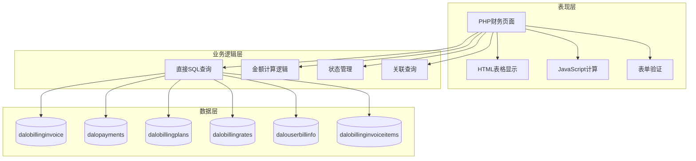
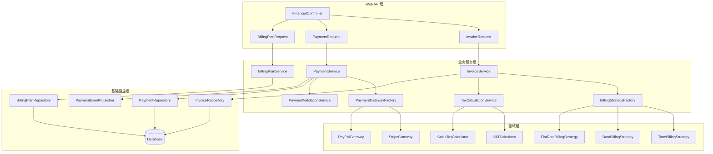

# 财务管理核心页面分析报告 (Batch 4)

## 分析概述 (Analysis Overview)

本批次分析了daloRADIUS财务管理模块的5个核心页面，这些页面构成了电信级计费系统的完整财务流程管理。分析重点关注抽象设计层面，遵循SOLID原则和现代软件架构最佳实践。

### 分析文件清单
- `bill-main.php` (43行) - 财务管理主入口页面
- `bill-invoice-list.php` (275行) - 发票列表管理页面
- `bill-payments-list.php` (248行) - 支付记录管理页面
- `bill-plans-list.php` (195行) - 计费方案管理页面
- `bill-rates-list.php` (193行) - 费率管理页面

**总代码量**: 954行
**复杂度评估**: 高复杂度模块，涉及复杂财务计算、多表关联、精确金额处理、税务合规

## 一、架构分析 (Architectural Analysis)

### 当前架构模式


### 设计问题识别

**违背SRP原则**:
- 单个页面文件承担了财务数据查询、金额计算、状态管理、UI渲染等多重职责
- `bill-invoice-list.php` 混合了复杂的发票查询逻辑和支付状态计算

**违背OCP原则**:
- 新增计费类型（如阶梯计费、包月计费）需要修改现有的计算逻辑
- 不同支付方式的处理逻辑硬编码在条件分支中

**财务精度和安全问题**:
- 缺乏统一的金额计算精度控制
- 没有完整的财务审计追踪机制
- 复杂的多表查询可能导致数据一致性问题

## 二、核心功能分析 (Core Functionality Analysis)

### bill-main.php - 财务管理主入口

**职责范围**:
- 财务管理功能的导航入口
- 提供财务模块的概览信息

**代码特征**:
- 极简导航页面，仅43行代码
- 标准的页面布局和帮助信息显示

**设计评估**:
- 符合SRP原则，职责单一清晰
- 作为财务模块入口，设计合理

### bill-invoice-list.php - 发票列表管理

**职责范围**:
- 查询和展示发票列表
- 计算发票总额、已付金额、余额
- 支持按用户、状态等条件过滤
- 提供发票状态管理功能

**复杂财务查询逻辑**:
```php
// 复杂的发票金额聚合查询
$subquery1 = sprintf("SELECT SUM(d.amount + d.tax_amount) AS totalbilled, invoice_id
                        FROM %s AS d GROUP BY d.invoice_id", 
                      $configValues['CONFIG_DB_TBL_DALOBILLINGINVOICEITEMS']);

$subquery2 = sprintf("SELECT SUM(e.amount) AS totalpayed, invoice_id
                        FROM %s AS e GROUP BY e.invoice_id", 
                      $configValues['CONFIG_DB_TBL_DALOPAYMENTS']);

$sql = sprintf("SELECT a.id, a.date, a.status_id, a.type_id, b.contactperson, b.username, 
                       c.value AS status, COALESCE(e2.totalpayed, 0) AS totalpayed, 
                       COALESCE(d2.totalbilled, 0) AS totalbilled
                  FROM %s AS a INNER JOIN %s AS b ON a.user_id=b.id
                               INNER JOIN %s AS c ON a.status_id=c.id
                                LEFT JOIN (%s) AS d2 ON d2.invoice_id=a.id
                                LEFT JOIN (%s) AS e2 ON e2.invoice_id=a.id",
               $configValues['CONFIG_DB_TBL_DALOBILLINGINVOICE'], 
               $configValues['CONFIG_DB_TBL_DALOUSERBILLINFO'],
               $configValues['CONFIG_DB_TBL_DALOBILLINGINVOICESTATUS'], 
               $subquery1, $subquery2);
```

**关键问题分析**:
1. **复杂聚合查询**: 多层子查询和关联操作，缺乏查询优化
2. **金额计算逻辑**: 发票金额、已付金额、余额计算分散在查询中
3. **状态管理复杂**: 发票状态与支付状态的关联逻辑复杂
4. **数据一致性风险**: 并发修改可能导致金额计算不一致

### bill-payments-list.php - 支付记录管理

**职责范围**:
- 查询和展示支付记录
- 按发票、用户等维度过滤支付
- 支持支付类型分类显示
- 提供支付状态追踪

**支付查询逻辑**:
```php
// 支付记录查询与发票关联
$sql_JOIN = "";
if (isset($user_id) && !empty($user_id)) {
    $sql_JOIN = sprintf("JOIN %s AS bi ON bi.id=p.invoice_id", 
                        $configValues['CONFIG_DB_TBL_DALOBILLINGINVOICE']);
    $sql_WHERE[] = sprintf("bi.user_id = %s", $dbSocket->escapeSimple($user_id));
}

$sql = sprintf("SELECT p.id, p.invoice_id, p.amount, p.date, pt.value, p.notes
                  FROM %s AS p %s LEFT JOIN %s AS pt ON p.type_id=pt.id", 
               $configValues['CONFIG_DB_TBL_DALOPAYMENTS'],
               $sql_JOIN,
               $configValues['CONFIG_DB_TBL_DALOPAYMENTTYPES']);
```

**设计缺陷**:
1. **查询构建耦合**: 动态SQL构建逻辑与业务逻辑耦合
2. **支付验证缺失**: 缺乏支付金额与发票金额的一致性验证
3. **状态追踪不完整**: 支付状态变更缺乏完整的审计链

### bill-plans-list.php - 计费方案管理

**职责范围**:
- 管理各种计费方案（时间计费、流量计费、包月等）
- 计费方案的激活状态管理
- 计费类型分类显示

**简化查询模式**:
```php
// 相对简单的计费方案查询
$sql = sprintf("SELECT id, planName, planType, planActive FROM %s ORDER BY %s %s LIMIT %s, %s",
               $configValues['CONFIG_DB_TBL_DALOBILLINGPLANS'], 
               $orderBy, $orderType, $offset, $rowsPerPage);
```

**潜在问题**:
1. **计费逻辑缺失**: 页面仅显示基础信息，复杂的计费计算逻辑未体现
2. **扩展性限制**: 新增计费类型需要修改多处代码
3. **配置验证不足**: 计费方案配置的业务规则验证不完整

### bill-rates-list.php - 费率管理

**职责范围**:
- 管理各种费率配置（时间费率、流量费率等）
- 费率的生效时间管理
- 费率成本显示和编辑

**费率查询逻辑**:
```php
// 基础费率信息查询
$sql = "SELECT id, rateName, rateType, rateCost FROM %s ORDER BY %s %s LIMIT %s, %s";
$sql = sprintf($sql, $configValues['CONFIG_DB_TBL_DALOBILLINGRATES'],
               $orderBy, $orderType, $offset, $rowsPerPage);
```

**核心挑战**:
1. **费率计算复杂性**: 不同费率类型的计算逻辑差异大
2. **时效性管理**: 费率的生效时间和过期时间管理复杂
3. **精度要求**: 费率计算需要高精度的数值处理

## 三、现代化设计方案 (Modernization Design)

### 基于SOLID原则的重构架构



### 核心接口设计

**财务服务接口** (遵循SRP):
```python
class InvoiceService:
    def generate_invoice(self, user_id: str, billing_period: BillingPeriod) -> Invoice:
        """生成发票 - 单一职责：发票生成业务逻辑协调"""
        
    def calculate_invoice_amount(self, usage_data: UsageData, billing_plan: BillingPlan) -> Money:
        """计算发票金额 - 单一职责：金额计算逻辑"""
        
    def apply_taxes(self, base_amount: Money, tax_context: TaxContext) -> Money:
        """应用税务计算 - 单一职责：税务计算协调"""
        
    def get_invoice_balance(self, invoice_id: str) -> Money:
        """获取发票余额 - 单一职责：余额计算"""

class PaymentService:
    def process_payment(self, payment_request: PaymentRequest) -> PaymentResult:
        """处理支付 - 单一职责：支付处理协调"""
        
    def verify_payment_amount(self, payment: Payment, invoice: Invoice) -> ValidationResult:
        """验证支付金额 - 单一职责：支付验证逻辑"""
        
    def record_payment(self, payment: Payment) -> PaymentRecord:
        """记录支付 - 单一职责：支付记录管理"""
        
    def calculate_payment_fees(self, payment_amount: Money, gateway: PaymentGateway) -> Money:
        """计算支付手续费 - 单一职责：手续费计算"""
```

**计费策略接口** (遵循OCP):
```python
class BillingStrategy(ABC):
    @abstractmethod
    def calculate_charges(self, usage_data: UsageData, rate: Rate) -> BillingResult:
        """计费计算 - 开放扩展：新计费类型只需实现此接口"""
        
    @abstractmethod
    def validate_billing_parameters(self, params: dict) -> ValidationResult:
        """参数验证 - 开放扩展：支持不同验证规则"""
        
    @abstractmethod
    def supports_tiered_pricing(self) -> bool:
        """阶梯计费支持 - 开放扩展：支持复杂计费模式"""

# 具体策略实现 - 新增计费类型无需修改现有代码
class TimeBillingStrategy(BillingStrategy):
    def calculate_charges(self, usage_data: UsageData, rate: Rate) -> BillingResult:
        """时间计费策略：按使用时长计费"""
        session_duration = usage_data.session_time
        hourly_rate = rate.get_hourly_rate()
        
        # 按分钟计费，不足一分钟按一分钟计算
        billable_minutes = math.ceil(session_duration.total_seconds() / 60)
        total_charge = (billable_minutes / 60) * hourly_rate
        
        return BillingResult(
            base_amount=Money(total_charge, rate.currency),
            billing_details=TimeBillingDetails(
                session_duration=session_duration,
                billable_minutes=billable_minutes,
                hourly_rate=hourly_rate
            )
        )

class DataBillingStrategy(BillingStrategy):
    def calculate_charges(self, usage_data: UsageData, rate: Rate) -> BillingResult:
        """流量计费策略：按数据使用量计费"""
        total_bytes = usage_data.input_octets + usage_data.output_octets
        # 转换为MB，不足1MB按1MB计算
        billable_mb = math.ceil(total_bytes / (1024 * 1024))
        per_mb_rate = rate.get_per_mb_rate()
        
        total_charge = billable_mb * per_mb_rate
        
        return BillingResult(
            base_amount=Money(total_charge, rate.currency),
            billing_details=DataBillingDetails(
                total_bytes=total_bytes,
                billable_mb=billable_mb,
                per_mb_rate=per_mb_rate
            )
        )

class TieredDataBillingStrategy(BillingStrategy):
    def calculate_charges(self, usage_data: UsageData, rate: Rate) -> BillingResult:
        """阶梯流量计费策略：不同用量级别不同费率"""
        total_mb = (usage_data.input_octets + usage_data.output_octets) / (1024 * 1024)
        tiers = rate.get_data_tiers()
        
        total_charge = Money.zero(rate.currency)
        remaining_usage = total_mb
        tier_breakdown = []
        
        for tier in tiers:
            if remaining_usage <= 0:
                break
                
            tier_usage = min(remaining_usage, tier.usage_limit)
            tier_charge = tier_usage * tier.rate_per_mb
            total_charge += Money(tier_charge, rate.currency)
            
            tier_breakdown.append(TierBreakdown(
                tier_name=tier.name,
                usage_amount=tier_usage,
                rate=tier.rate_per_mb,
                charge=tier_charge
            ))
            
            remaining_usage -= tier_usage
        
        return BillingResult(
            base_amount=total_charge,
            billing_details=TieredBillingDetails(
                total_usage=total_mb,
                tier_breakdown=tier_breakdown
            )
        )
```

**财务聚合根** (遵循DDD):
```python
class InvoiceAggregate:
    """发票聚合根 - 封装发票相关的所有业务不变性"""
    
    def __init__(self, user_id: str, billing_period: BillingPeriod):
        self.id: Optional[int] = None
        self.user_id = user_id
        self.billing_period = billing_period
        self.invoice_items: List[InvoiceItem] = []
        self.payments: List[Payment] = []
        self.status = InvoiceStatus.DRAFT
        self.currency: Currency = Currency.USD
        self.total_amount: Money = Money.zero(self.currency)
        self.tax_amount: Money = Money.zero(self.currency)
        self._domain_events: List[DomainEvent] = []
    
    def add_billing_item(self, usage_data: UsageData, billing_plan: BillingPlan) -> None:
        """添加计费项目 - 应用计费策略"""
        if self.status != InvoiceStatus.DRAFT:
            raise InvoiceNotEditableError("Cannot modify non-draft invoice")
        
        billing_result = billing_plan.calculate_charges(usage_data)
        
        invoice_item = InvoiceItem(
            description=f"{billing_plan.plan_name} - {self.billing_period}",
            quantity=1,
            unit_price=billing_result.base_amount,
            amount=billing_result.base_amount,
            billing_details=billing_result.billing_details
        )
        
        self.invoice_items.append(invoice_item)
        self._recalculate_totals()
        self._domain_events.append(BillingItemAddedEvent(self.id, invoice_item))
    
    def apply_tax(self, tax_calculator: TaxCalculator, tax_context: TaxContext) -> None:
        """应用税务计算 - 精确税务处理"""
        subtotal = sum(item.amount.amount for item in self.invoice_items)
        base_amount = Money(subtotal, self.currency)
        
        self.tax_amount = tax_calculator.calculate_tax(base_amount, tax_context)
        self._recalculate_totals()
        self._domain_events.append(TaxAppliedEvent(self.id, self.tax_amount))
    
    def record_payment(self, payment: Payment) -> None:
        """记录支付 - 支付验证和状态更新"""
        self._validate_payment(payment)
        
        self.payments.append(payment)
        self._update_payment_status()
        self._domain_events.append(PaymentRecordedEvent(self.id, payment))
    
    def get_balance_due(self) -> Money:
        """计算应付余额 - 精确余额计算"""
        total_paid = sum(p.amount.amount for p in self.payments if p.status == PaymentStatus.COMPLETED)
        return Money(self.total_amount.amount - total_paid, self.currency)
    
    def _validate_payment(self, payment: Payment) -> None:
        """支付验证 - 业务规则检查"""
        if payment.amount.amount <= 0:
            raise InvalidPaymentAmountError("Payment amount must be positive")
        
        if payment.amount.currency != self.currency:
            raise CurrencyMismatchError(f"Payment currency {payment.amount.currency} does not match invoice currency {self.currency}")
        
        balance_due = self.get_balance_due()
        if payment.amount.amount > balance_due.amount:
            raise OverpaymentError(f"Payment amount {payment.amount} exceeds balance due {balance_due}")
    
    def _recalculate_totals(self) -> None:
        """重新计算总额 - 确保数据一致性"""
        subtotal = sum(item.amount.amount for item in self.invoice_items)
        self.total_amount = Money(subtotal + self.tax_amount.amount, self.currency)

class BillingPlanAggregate:
    """计费方案聚合根 - 封装计费逻辑"""
    
    def __init__(self, plan_name: str, billing_strategy: BillingStrategy):
        self.plan_name = plan_name
        self.plan_type = billing_strategy.get_billing_type()
        self.billing_strategy = billing_strategy
        self.base_rate: Rate = None
        self.is_active = True
        self.currency: Currency = Currency.USD
        self._domain_events: List[DomainEvent] = []
    
    def calculate_charges(self, usage_data: UsageData) -> BillingResult:
        """计算费用 - 委托给计费策略"""
        if not self.is_active:
            raise InactiveBillingPlanError(f"Billing plan {self.plan_name} is not active")
        
        if not self.base_rate:
            raise MissingRateError(f"No rate configured for billing plan {self.plan_name}")
        
        return self.billing_strategy.calculate_charges(usage_data, self.base_rate)
    
    def update_rate(self, new_rate: Rate) -> None:
        """更新费率 - 费率变更管理"""
        old_rate = self.base_rate
        self.base_rate = new_rate
        self._domain_events.append(RateUpdatedEvent(self.plan_name, old_rate, new_rate))
    
    def activate(self) -> None:
        """激活计费方案 - 状态管理"""
        if self.is_active:
            return
        
        self.is_active = True
        self._domain_events.append(BillingPlanActivatedEvent(self.plan_name))
    
    def deactivate(self) -> None:
        """停用计费方案 - 状态管理"""
        if not self.is_active:
            return
        
        self.is_active = False
        self._domain_events.append(BillingPlanDeactivatedEvent(self.plan_name))
```

**Repository接口** (遵循DIP):
```python
class FinancialRepository(ABC):
    @abstractmethod
    async def save_invoice(self, invoice: InvoiceAggregate) -> InvoiceAggregate:
        """保存发票聚合 - 抽象持久化操作"""
        
    @abstractmethod
    async def find_invoice_by_id(self, invoice_id: str) -> Optional[InvoiceAggregate]:
        """根据ID查找发票 - 抽象查询操作"""
        
    @abstractmethod
    async def find_invoices_by_user(self, user_id: str, filters: InvoiceFilters) -> List[InvoiceAggregate]:
        """查找用户发票 - 抽象用户维度查询"""
        
    @abstractmethod
    async def calculate_user_balance(self, user_id: str) -> Money:
        """计算用户余额 - 抽象财务计算"""

# 具体实现 - 可替换为不同的存储技术
class SqlFinancialRepository(FinancialRepository):
    def __init__(self, db_session: AsyncSession, event_publisher: EventPublisher):
        self._session = db_session
        self._event_publisher = event_publisher
    
    async def save_invoice(self, invoice: InvoiceAggregate) -> InvoiceAggregate:
        async with self._session.begin():  # 事务保证
            # 保存发票基础信息
            invoice_record = await self._save_invoice_record(invoice)
            
            # 保存发票项目
            for item in invoice.invoice_items:
                await self._save_invoice_item(invoice_record.id, item)
            
            # 保存支付记录
            for payment in invoice.payments:
                await self._save_payment_record(invoice_record.id, payment)
            
            # 发布领域事件
            for event in invoice.get_domain_events():
                await self._event_publisher.publish(event)
            
            invoice.clear_domain_events()
            
        return invoice
    
    async def calculate_user_balance(self, user_id: str) -> Money:
        # 使用数据库聚合查询计算用户总余额
        balance_query = """
            SELECT 
                COALESCE(SUM(i.total_amount), 0) - COALESCE(SUM(p.amount), 0) as balance,
                u.currency_preference
            FROM dalobillinginvoice i
            LEFT JOIN dalopayments p ON i.id = p.invoice_id AND p.status = 'completed'
            JOIN dalouserbillinfo u ON i.user_id = u.id
            WHERE i.user_id = :user_id
            GROUP BY u.currency_preference
        """
        
        result = await self._session.execute(
            text(balance_query),
            {"user_id": user_id}
        )
        
        row = result.fetchone()
        if row:
            return Money(row.balance, Currency(row.currency_preference))
        
        return Money.zero(Currency.USD)
```

## 四、实施建议与风险评估 (Implementation Recommendations & Risk Assessment)

### 迁移策略

**阶段1: 财务核心抽象层建立** (3-4周)
- 创建Money值对象，确保金额计算精度
- 建立BillingStrategy接口和基础实现
- 实现InvoiceAggregate和BillingPlanAggregate

**阶段2: 支付系统重构** (4-5周)
- 实现PaymentGateway抽象层
- 集成主要支付渠道（Stripe、PayPal）
- 添加支付状态管理和异常处理

**阶段3: 税务和合规功能** (3-4周)
- 实现TaxCalculator接口和具体实现
- 添加财务审计追踪功能
- 集成财务报表生成

**阶段4: 性能优化与监控** (2-3周)
- 财务数据的查询优化
- 大量计费的批处理能力
- 财务操作的监控和告警

### 风险评估与缓解措施

**高风险**:
1. **财务精度风险**: 浮点数计算可能导致精度丢失
   - 缓解: 使用Decimal类型进行所有金额计算，确保精度

2. **数据一致性风险**: 发票、支付、余额数据不一致
   - 缓解: 使用数据库事务、领域事件、定期数据校验

**中风险**:
3. **支付安全风险**: 支付过程中的安全漏洞
   - 缓解: 严格的PCI DSS合规、支付数据加密、审计日志

4. **税务合规风险**: 税务计算错误或合规性问题
   - 缓解: 专业税务引擎集成、定期合规性审查

### 技术债务清理

**财务计算统一化**:
- 消除重复的金额计算逻辑
- 统一货币处理和汇率转换
- 标准化税务计算接口

**数据完整性增强**:
- 添加财务数据的完整性约束
- 实现财务数据的定期校验
- 建立异常数据的自动修复机制

**安全性改进**:
- 敏感财务信息的加密存储
- 财务操作的多重验证
- 完整的财务审计追踪

## 五、总结与后续规划 (Summary & Next Steps)

### 关键发现

1. **财务复杂性极高**: 财务管理涉及精确计算、多币种、税务、支付集成等复杂需求
2. **合规性要求严格**: 财务数据的准确性、安全性、审计性要求极高
3. **扩展性需求迫切**: 不同计费模式、支付方式的灵活扩展需求强烈

### 设计价值

通过应用现代软件设计原则：
- **SRP应用**: 发票服务、支付服务、计费服务各司其职，确保财务逻辑清晰
- **OCP实现**: 策略模式支持新计费模式和支付方式的零侵入扩展
- **DIP践行**: 依赖抽象的财务接口，支持不同的计算引擎和支付网关
- **精确性保证**: Money值对象和Decimal计算确保财务精度

### 后续分析计划

**Batch 5: 配置管理系统** (优先级: 中高)
- `config-main.php` - 配置管理主页面
- `config-db.php` - 数据库配置管理
- `config-mail-*.php` - 邮件配置管理
- `config-operators-*.php` - 操作员配置管理
- `config-backup-*.php` - 备份配置管理

预期发现: 系统配置的集中化管理、配置变更的版本控制、敏感配置的安全存储

**Batch 6: 网络设备管理** (优先级: 中)
- NAS设备管理、热点管理、网络拓扑等基础设施管理功能

通过系统性的分析和现代化设计，为daloRADIUS财务管理模块的Python重构提供了完整的架构指导，特别强调了财务系统的精确性、安全性和合规性要求。