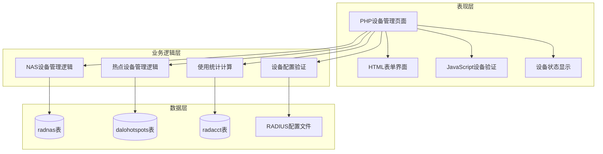
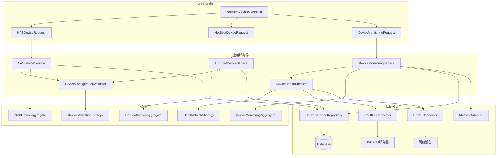

# 网络设备管理核心页面分析报告 (Batch 6)

## 分析概述 (Analysis Overview)

本批次分析了daloRADIUS网络设备管理模块的核心页面，这些页面构成了RADIUS网络基础设施的设备管理体系。分析重点关注抽象设计层面，遵循SOLID原则和现代化网络设备管理最佳实践。

### 分析文件清单
- `mng-rad-nas.php` (45行) - NAS设备管理主入口页面
- `mng-rad-nas-new.php` (272行) - NAS设备创建页面
- `mng-rad-nas-list.php` (205行) - NAS设备列表页面
- `mng-hs-new.php` (241行) - 热点设备创建页面
- `acct-hotspot-compare.php` (221行) - 热点设备使用分析页面

**总代码量**: 984行
**复杂度评估**: 中高复杂度模块，涉及网络设备配置、设备认证、地理信息管理、使用统计分析

## 一、架构分析 (Architectural Analysis)

### 当前架构模式


### 设计问题识别

**违背SRP原则**:
- 单个页面文件承担了设备创建、验证、存储、显示等多重职责
- `mng-rad-nas-new.php` 混合了NAS配置验证、数据库操作、UI渲染等逻辑

**违背OCP原则**:
- 新增设备类型（如WiFi控制器、交换机）需要修改现有的管理页面代码
- 不同厂商设备的配置参数硬编码在表单中

**网络设备管理问题**:
- 缺乏设备连接性测试和状态监控
- 设备配置缺乏版本控制和变更追踪
- 没有设备性能监控和告警机制

## 二、核心功能分析 (Core Functionality Analysis)

### mng-rad-nas.php - NAS设备管理主入口

**职责范围**:
- NAS设备管理功能的导航入口
- 提供NAS管理模块的概览信息

**代码特征**:
- 极简导航页面，仅45行代码
- 标准的页面布局和帮助信息显示

**设计评估**:
- 符合SRP原则，职责单一清晰
- 作为NAS管理模块入口，设计合理

### mng-rad-nas-new.php - NAS设备创建页面

**职责范围**:
- 创建新的NAS（Network Access Server）设备
- 验证NAS配置参数的有效性
- 管理NAS设备的认证密钥
- 配置RADIUS服务器连接参数

**复杂的NAS配置管理逻辑**:
```php
// NAS设备参数验证和处理
if ($_SERVER['REQUEST_METHOD'] === 'POST') {
    if (array_key_exists('csrf_token', $_POST) && isset($_POST['csrf_token']) && dalo_check_csrf_token($_POST['csrf_token'])) {
        
        $nasname = (array_key_exists('nasname', $_POST) && !empty(str_replace("%", "", trim($_POST['nasname']))))
                 ? str_replace("%", "", trim($_POST['nasname'])) : "";
        $nassecret = (array_key_exists('nassecret', $_POST) && !empty(str_replace("%", "", trim($_POST['nassecret']))))
                   ? str_replace("%", "", trim($_POST['nassecret'])) : "";
        
        $nastype = (array_key_exists('nastype', $_POST) && isset($_POST['nastype']) &&
                    in_array($_POST['nastype'], $valid_nastypes)) ? $_POST['nastype'] : $valid_nastypes[0];
        
        $shortname = (array_key_exists('shortname', $_POST) && !empty(str_replace("%", "", trim($_POST['shortname']))))
                   ? str_replace("%", "", trim($_POST['shortname'])) : "";
        
        $nasports = (array_key_exists('nasports', $_POST) && !empty(trim($_POST['nasports'])) &&
                     intval(trim($_POST['nasports'])) >= 1 && intval(trim($_POST['nasports'])) <= 65535)
                  ? intval(trim($_POST['nasports'])) : "";
        
        // 数据库操作：检查NAS是否已存在
        $sql = sprintf("SELECT COUNT(id) FROM %s WHERE nasname='%s'", $configValues['CONFIG_DB_TBL_RADNAS'],
                                                                      $dbSocket->escapeSimple($nasname));
        $res = $dbSocket->query($sql);
        $exists = $res->fetchrow()[0] > 0;
        
        if ($exists) {
            $failureMsg = sprintf("This %s already exists: <b>%s</b>", t('all','NasIPHost'), $nasname_enc);
        } else {
            // 插入新的NAS设备
            $sql = sprintf("INSERT INTO %s (id, nasname, shortname, type, ports, secret, server, community, description)
                                    VALUES (0, '%s', '%s', '%s', '%s', '%s', '%s', '%s', '%s')", 
                           $configValues['CONFIG_DB_TBL_RADNAS'],
                           $dbSocket->escapeSimple($nasname), $dbSocket->escapeSimple($shortname), 
                           $dbSocket->escapeSimple($nastype), $dbSocket->escapeSimple($nasports), 
                           $dbSocket->escapeSimple($nassecret), $dbSocket->escapeSimple($nasvirtualserver),
                           $dbSocket->escapeSimple($nascommunity), $dbSocket->escapeSimple($nasdescription));
            $res = $dbSocket->query($sql);
        }
    }
}
```

**关键问题分析**:
1. **配置验证不完整**: 缺乏对NAS IP地址可达性和RADIUS端口连通性的测试
2. **安全问题**: NAS密钥以明文形式存储和传输，存在安全风险
3. **错误处理简陋**: 配置错误时缺乏详细的诊断信息和修复建议
4. **功能局限**: 创建后无法测试NAS与RADIUS服务器的实际通信

### mng-rad-nas-list.php - NAS设备列表页面

**职责范围**:
- 显示所有NAS设备的列表信息
- 提供NAS设备的搜索和排序功能
- 支持NAS设备的分页浏览
- 提供编辑和删除操作入口

**NAS列表查询逻辑**:
```php
// NAS设备列表字段定义
$cols = array(
    'id' => t('all','NasID'),
    'nasname' => t('all','NasIPHost'),
    'shortname' => t('all','NasShortname'),
    'type' => t('all','NasType'),
    'ports' => t('all','NasPorts'),
    'secret' => t('all','NasSecret'),
    'server' => t('all','NasVirtualServer'),
    'community' => t('all','NasCommunity'),
    'description' => t('all','NasDescription'),
);

// 分页和排序处理
$orderBy = (array_key_exists('orderBy', $_GET) && isset($_GET['orderBy']) &&
            in_array($_GET['orderBy'], array_keys($param_cols)))
         ? $_GET['orderBy'] : array_keys($param_cols)[0];

$orderType = (array_key_exists('orderType', $_GET) && isset($_GET['orderType']) &&
              in_array(strtolower($_GET['orderType']), array( "desc", "asc" )))
           ? strtolower($_GET['orderType']) : "asc";

// 查询NAS设备数据
$sql = sprintf("SELECT id, nasname, shortname, type, ports, secret, server, community, description
                  FROM %s ORDER BY %s %s LIMIT %s, %s", $configValues['CONFIG_DB_TBL_RADNAS'],
                                                        $orderBy, $orderType, $offset, $rowsPerPage);
$res = $dbSocket->query($sql);
```

**设计缺陷**:
1. **状态信息缺失**: 列表中无法显示NAS设备的连接状态和健康状况
2. **安全风险**: 在列表中直接显示NAS密钥，存在信息泄露风险
3. **功能有限**: 缺乏批量操作和高级搜索功能
4. **监控缺失**: 无法查看NAS设备的实时使用情况和性能指标

### mng-hs-new.php - 热点设备创建页面

**职责范围**:
- 创建新的热点（HotSpot）设备
- 管理热点的地理位置信息
- 配置热点的业务联系人信息
- 设置热点的运营商信息

**热点设备创建逻辑**:
```php
// 热点设备参数验证
if ($_SERVER['REQUEST_METHOD'] === 'POST') {
    if (dalo_check_csrf_token()) {
        
        $macaddress = (array_key_exists('macaddress', $_POST) && isset($_POST['macaddress']) &&
                       (preg_match(MACADDR_REGEX, trim($_POST['macaddress'])) ||
                        preg_match(IP_REGEX, trim($_POST['macaddress']))))
                    ? trim($_POST['macaddress']) : "";

        $name = (array_key_exists('name', $_POST) && !empty(str_replace("%", "", trim($_POST['name']))))
              ? str_replace("%", "", trim($_POST['name'])) : "";
        
        $geocode = (array_key_exists('geocode', $_POST) && !empty(trim($_POST['geocode']))) 
                 ? trim($_POST['geocode']) : "";
        $hotspot_type = (array_key_exists('hotspot_type', $_POST) && !empty(trim($_POST['hotspot_type']))) 
                      ? trim($_POST['hotspot_type']) : "";
        
        // 业务信息字段
        $ownername = (array_key_exists('ownername', $_POST) && !empty(trim($_POST['ownername']))) 
                   ? trim($_POST['ownername']) : "";
        $managername = (array_key_exists('managername', $_POST) && !empty(trim($_POST['managername']))) 
                     ? trim($_POST['managername']) : "";
        $emailmanager = (array_key_exists('emailmanager', $_POST) && !empty(trim($_POST['emailmanager'])) &&
                         filter_var(trim($_POST['emailmanager']), FILTER_VALIDATE_EMAIL)) 
                      ? trim($_POST['emailmanager']) : "";
        
        // 检查热点是否已存在
        $sql = sprintf("SELECT COUNT(id) FROM %s WHERE name='%s' OR mac='%s'",
                       $configValues['CONFIG_DB_TBL_DALOHOTSPOTS'],
                       $dbSocket->escapeSimple($name), $dbSocket->escapeSimple($macaddress));
        $exists = get_numrows($dbSocket, $sql) > 0;
        
        if (!$exists) {
            // 插入新的热点设备
            $sql = sprintf("INSERT INTO %s (id, name, mac, geocode, owner, email_owner, manager, email_manager, address,
                                            company, phone1, phone2, type, companywebsite, companyemail, companycontact,
                                            companyphone, creationdate, creationby, updatedate, updateby)
                                    VALUES (0, '%s', '%s', '%s','%s','%s','%s','%s','%s','%s','%s','%s','%s','%s','%s','%s',
                                            '%s', '%s', '%s', NULL, NULL)", $configValues['CONFIG_DB_TBL_DALOHOTSPOTS'],
                           $dbSocket->escapeSimple($name), $dbSocket->escapeSimple($macaddress), $dbSocket->escapeSimple($geocode),
                           $dbSocket->escapeSimple($ownername), $dbSocket->escapeSimple($emailowner), 
                           $dbSocket->escapeSimple($managername), $dbSocket->escapeSimple($emailmanager),
                           $dbSocket->escapeSimple($address), $dbSocket->escapeSimple($company),
                           $dbSocket->escapeSimple($phone1), $dbSocket->escapeSimple($phone2), 
                           $dbSocket->escapeSimple($hotspot_type), $dbSocket->escapeSimple($companywebsite), 
                           $dbSocket->escapeSimple($companyemail), $dbSocket->escapeSimple($companycontact), 
                           $dbSocket->escapeSimple($companyphone), $current_datetime, $currBy);
        }
    }
}
```

**核心挑战**:
1. **地理信息验证**: 缺乏对地理编码的有效性验证和地图集成
2. **业务信息管理**: 大量业务字段的管理复杂，缺乏分类和模板化
3. **设备关联**: 热点设备与NAS设备的关联关系不明确
4. **状态追踪**: 缺乏热点设备的运营状态和生命周期管理

### acct-hotspot-compare.php - 热点设备使用分析页面

**职责范围**:
- 分析不同热点设备的使用情况
- 生成热点使用统计报表
- 比较热点设备的性能指标
- 提供可视化的数据展示

**复杂的热点统计查询**:
```php
// 热点使用情况统计查询
$sql = sprintf("SELECT hs.name AS hotspot, COUNT(DISTINCT(UserName)) AS uniqueusers, COUNT(radacctid) AS totalhits,
                       AVG(AcctSessionTime) AS avgsessiontime, SUM(AcctSessionTime) AS totaltime,
                       AVG(AcctInputOctets) AS avgInputOctets, SUM(AcctInputOctets) AS sumInputOctets,
                       AVG(AcctOutputOctets) AS avgOutputOctets, SUM(AcctOutputOctets) AS sumOutputOctets
                  FROM %s AS ra JOIN %s AS hs ON ra.calledstationid=hs.mac
                 GROUP BY hotspot", $configValues['CONFIG_DB_TBL_RADACCT'],
                                    $configValues['CONFIG_DB_TBL_DALOHOTSPOTS']);

// 分页和排序处理
$sql .= sprintf(" ORDER BY %s %s LIMIT %s, %s", $orderBy, $orderType, $offset, $rowsPerPage);
$res = $dbSocket->query($sql);

// 处理统计数据
while ($row = $res->fetchRow()) {
    list($hotspot, $uniqueusers, $totalhits, $avgsessiontime, $totaltime,
         $avgInputOctets, $sumInputOctets, $avgOutputOctets, $sumOutputOctets) = $row;
    
    // 格式化统计数据
    $table_row = array( $hotspot, $uniqueusers, $totalhits, $avgsessiontime, 
                       $totaltime, $sumInputOctets, $sumOutputOctets );
}
```

**分析功能问题**:
1. **实时性不足**: 统计数据基于历史计费记录，缺乏实时使用情况分析
2. **分析维度有限**: 仅提供基础的使用量统计，缺乏深度的业务分析
3. **可视化简陋**: 缺乏现代化的图表和可视化展示
4. **对比分析不足**: 热点间的对比分析功能有限，缺乏趋势分析

## 三、现代化设计方案 (Modernization Design)

### 基于SOLID原则的重构架构



### 核心接口设计

**NAS设备管理服务接口** (遵循SRP):
```python
class NASDeviceService:
    """NAS设备管理服务 - 单一职责：NAS设备的业务逻辑协调"""
    
    def create_nas_device(self, nas_info: NASDeviceInfo, operator: str) -> NASDevice:
        """创建NAS设备 - 包含完整的验证和连接测试"""
        
    def validate_nas_connectivity(self, nas_id: str) -> ConnectivityResult:
        """验证NAS连接性 - 测试RADIUS通信和网络可达性"""
        
    def update_nas_secret(self, nas_id: str, new_secret: str, operator: str) -> UpdateResult:
        """更新NAS密钥 - 安全的密钥轮换机制"""
        
    def get_nas_health_status(self, nas_id: str) -> HealthStatus:
        """获取NAS健康状态 - 实时状态和性能指标"""
        
    def test_radius_communication(self, nas_id: str) -> RADIUSTestResult:
        """测试RADIUS通信 - 端到端的认证和计费测试"""

class HotSpotDeviceService:
    """热点设备管理服务 - 单一职责：热点设备的业务逻辑协调"""
    
    def create_hotspot_device(self, hotspot_info: HotSpotInfo, operator: str) -> HotSpotDevice:
        """创建热点设备 - 包含地理编码验证和业务信息管理"""
        
    def update_hotspot_location(self, hotspot_id: str, location: GeographicLocation, operator: str) -> UpdateResult:
        """更新热点位置 - 地理编码验证和地图集成"""
        
    def get_hotspot_usage_analytics(self, hotspot_id: str, period: TimePeriod) -> UsageAnalytics:
        """获取热点使用分析 - 深度的业务分析和趋势报告"""
        
    def validate_hotspot_configuration(self, hotspot_config: HotSpotConfig) -> ValidationResult:
        """验证热点配置 - 网络配置和业务配置的完整性验证"""
        
    def get_hotspot_performance_metrics(self, hotspot_id: str) -> PerformanceMetrics:
        """获取热点性能指标 - 实时性能监控和告警"""

class DeviceMonitoringService:
    """设备监控服务 - 单一职责：网络设备的监控和告警"""
    
    def start_device_monitoring(self, device_id: str, monitoring_config: MonitoringConfig) -> MonitoringSession:
        """启动设备监控 - 配置监控策略和告警规则"""
        
    def get_real_time_metrics(self, device_id: str) -> RealTimeMetrics:
        """获取实时指标 - SNMP和其他协议的实时数据收集"""
        
    def configure_alert_rules(self, device_id: str, alert_rules: List[AlertRule]) -> ConfigurationResult:
        """配置告警规则 - 灵活的告警条件和通知机制"""
        
    def get_device_health_report(self, device_id: str, report_period: TimePeriod) -> HealthReport:
        """获取设备健康报告 - 综合的健康状况和趋势分析"""
        
    def detect_device_anomalies(self, device_id: str) -> List[Anomaly]:
        """检测设备异常 - 基于机器学习的异常检测"""
```

**设备验证策略接口** (遵循OCP):
```python
class DeviceValidationStrategy(ABC):
    """设备验证策略抽象 - 开放扩展：支持不同设备类型的验证规则"""
    
    @abstractmethod
    def validate_device_configuration(self, device_config: DeviceConfiguration) -> ValidationResult:
        """验证设备配置 - 扩展点：实现具体设备类型的验证逻辑"""
        
    @abstractmethod
    def test_device_connectivity(self, device_info: DeviceInfo) -> ConnectivityResult:
        """测试设备连接性 - 扩展点：实现具体设备的连接测试"""
        
    @abstractmethod
    def get_supported_device_types(self) -> List[DeviceType]:
        """支持的设备类型 - 扩展点：定义支持的设备类型范围"""

# NAS设备验证策略
class NASDeviceValidationStrategy(DeviceValidationStrategy):
    def validate_device_configuration(self, device_config: NASDeviceConfiguration) -> ValidationResult:
        """验证NAS设备配置"""
        errors = []
        
        # 验证NAS名称（IP地址或主机名）
        if not self._is_valid_nas_name(device_config.nas_name):
            errors.append("Invalid NAS name: must be valid IP address or hostname")
        
        # 验证NAS密钥强度
        secret_strength = self._check_secret_strength(device_config.nas_secret)
        if not secret_strength.is_strong:
            errors.append(f"Weak NAS secret: {secret_strength.weakness_reason}")
        
        # 验证端口范围
        if not (1 <= device_config.ports <= 65535):
            errors.append("NAS ports must be between 1 and 65535")
        
        # 验证NAS类型
        if device_config.nas_type not in self._get_supported_nas_types():
            errors.append(f"Unsupported NAS type: {device_config.nas_type}")
        
        if errors:
            return ValidationResult.failure("; ".join(errors))
        
        return ValidationResult.success()
    
    def test_device_connectivity(self, device_info: NASDeviceInfo) -> ConnectivityResult:
        """测试NAS设备连接性"""
        results = []
        
        # 测试网络可达性
        ping_result = self._test_network_reachability(device_info.nas_name)
        results.append(ping_result)
        
        # 测试RADIUS端口连通性
        radius_port_result = self._test_radius_port_connectivity(device_info.nas_name, device_info.ports)
        results.append(radius_port_result)
        
        # 测试RADIUS认证
        radius_auth_result = self._test_radius_authentication(device_info)
        results.append(radius_auth_result)
        
        # 测试SNMP连通性（如果配置了）
        if device_info.community:
            snmp_result = self._test_snmp_connectivity(device_info.nas_name, device_info.community)
            results.append(snmp_result)
        
        overall_success = all(result.success for result in results)
        
        if overall_success:
            return ConnectivityResult.success("All connectivity tests passed")
        else:
            failed_tests = [result.test_name for result in results if not result.success]
            return ConnectivityResult.failure(f"Failed tests: {', '.join(failed_tests)}")
    
    def get_supported_device_types(self) -> List[DeviceType]:
        return [
            DeviceType.CISCO_NAS,
            DeviceType.MIKROTIK_NAS,
            DeviceType.FREERADIUS_NAS,
            DeviceType.GENERIC_NAS
        ]

# 热点设备验证策略
class HotSpotDeviceValidationStrategy(DeviceValidationStrategy):
    def validate_device_configuration(self, device_config: HotSpotDeviceConfiguration) -> ValidationResult:
        """验证热点设备配置"""
        errors = []
        
        # 验证MAC地址格式
        if not self._is_valid_mac_address(device_config.mac_address):
            errors.append("Invalid MAC address format")
        
        # 验证地理编码
        if device_config.geo_code and not self._is_valid_geo_code(device_config.geo_code):
            errors.append("Invalid geographic code format")
        
        # 验证邮箱地址
        if device_config.owner_email and not self._is_valid_email(device_config.owner_email):
            errors.append("Invalid owner email address")
        
        if device_config.manager_email and not self._is_valid_email(device_config.manager_email):
            errors.append("Invalid manager email address")
        
        # 验证热点名称唯一性
        if self._hotspot_name_exists(device_config.name):
            errors.append(f"Hotspot name already exists: {device_config.name}")
        
        if errors:
            return ValidationResult.failure("; ".join(errors))
        
        return ValidationResult.success()
    
    def test_device_connectivity(self, device_info: HotSpotDeviceInfo) -> ConnectivityResult:
        """测试热点设备连接性"""
        results = []
        
        # 测试设备网络可达性
        if self._is_ip_address(device_info.mac_address):
            ping_result = self._test_network_reachability(device_info.mac_address)
            results.append(ping_result)
        
        # 验证地理位置（如果有地理编码）
        if device_info.geo_code:
            geo_validation = self._validate_geographic_location(device_info.geo_code)
            results.append(geo_validation)
        
        # 测试与NAS设备的关联
        nas_association = self._test_nas_association(device_info.mac_address)
        results.append(nas_association)
        
        overall_success = all(result.success for result in results)
        
        if overall_success:
            return ConnectivityResult.success("All hotspot validation tests passed")
        else:
            failed_tests = [result.test_name for result in results if not result.success]
            return ConnectivityResult.failure(f"Failed tests: {', '.join(failed_tests)}")
    
    def get_supported_device_types(self) -> List[DeviceType]:
        return [
            DeviceType.WIFI_HOTSPOT,
            DeviceType.ETHERNET_HOTSPOT,
            DeviceType.MOBILE_HOTSPOT,
            DeviceType.HYBRID_HOTSPOT
        ]
```

**设备聚合根设计** (遵循DDD):
```python
class NASDeviceAggregate:
    """NAS设备聚合根 - 封装NAS设备相关的所有业务不变性"""
    
    def __init__(self, nas_name: str, nas_secret: str, nas_type: str):
        self.device_id: Optional[str] = None
        self.nas_name = nas_name
        self.nas_secret = nas_secret
        self.nas_type = nas_type
        self.shortname: Optional[str] = None
        self.ports: Optional[int] = None
        self.community: Optional[str] = None
        self.virtual_server: Optional[str] = None
        self.description: Optional[str] = None
        self.status = DeviceStatus.INACTIVE
        self.health_metrics: Optional[HealthMetrics] = None
        self._domain_events: List[DomainEvent] = []
        self._last_connectivity_test: Optional[datetime] = None
        self._configuration_version: str = "1.0.0"
    
    def activate_device(self, operator: str) -> None:
        """激活NAS设备 - 确保设备配置完整性"""
        if self.status == DeviceStatus.ACTIVE:
            return
        
        # 验证设备配置完整性
        validation_result = self._validate_complete_configuration()
        if not validation_result.is_valid:
            raise IncompleteConfigurationError(validation_result.error_message)
        
        # 测试RADIUS连接
        connectivity_result = self._test_radius_connectivity()
        if not connectivity_result.success:
            raise RADIUSConnectivityError(connectivity_result.error_message)
        
        old_status = self.status
        self.status = DeviceStatus.ACTIVE
        self._last_connectivity_test = datetime.utcnow()
        
        self._domain_events.append(NASDeviceActivatedEvent(
            device_id=self.device_id,
            nas_name=self.nas_name,
            old_status=old_status,
            new_status=self.status,
            operator=operator
        ))
    
    def update_nas_secret(self, new_secret: str, operator: str) -> None:
        """更新NAS密钥 - 安全的密钥轮换"""
        # 验证新密钥强度
        secret_validation = self._validate_secret_strength(new_secret)
        if not secret_validation.is_strong:
            raise WeakSecretError(secret_validation.weakness_reason)
        
        # 测试新密钥的有效性
        test_result = self._test_secret_with_radius(new_secret)
        if not test_result.success:
            raise SecretTestFailedError(test_result.error_message)
        
        old_secret_hash = self._hash_secret(self.nas_secret)
        self.nas_secret = new_secret
        self._configuration_version = self._increment_version(self._configuration_version)
        
        self._domain_events.append(NASSecretUpdatedEvent(
            device_id=self.device_id,
            nas_name=self.nas_name,
            old_secret_hash=old_secret_hash,
            new_secret_hash=self._hash_secret(new_secret),
            operator=operator
        ))
    
    def update_health_metrics(self, metrics: HealthMetrics) -> None:
        """更新健康指标 - 设备状态监控"""
        old_metrics = self.health_metrics
        self.health_metrics = metrics
        
        # 检查健康状态变化
        if old_metrics and self._health_status_changed(old_metrics, metrics):
            self._domain_events.append(NASHealthStatusChangedEvent(
                device_id=self.device_id,
                nas_name=self.nas_name,
                old_health_status=old_metrics.overall_status,
                new_health_status=metrics.overall_status,
                metrics_details=metrics
            ))
        
        # 检查是否需要告警
        alerts = self._check_health_alerts(metrics)
        for alert in alerts:
            self._domain_events.append(NASHealthAlertEvent(
                device_id=self.device_id,
                nas_name=self.nas_name,
                alert_type=alert.alert_type,
                alert_level=alert.severity,
                alert_message=alert.message,
                metric_values=alert.related_metrics
            ))
    
    def perform_connectivity_test(self, operator: str) -> ConnectivityTestResult:
        """执行连接性测试 - 验证NAS设备的网络连接"""
        test_results = []
        
        # 网络可达性测试
        ping_result = self._test_network_ping()
        test_results.append(ping_result)
        
        # RADIUS端口连通性测试
        radius_port_result = self._test_radius_port()
        test_results.append(radius_port_result)
        
        # RADIUS认证测试
        radius_auth_result = self._test_radius_authentication()
        test_results.append(radius_auth_result)
        
        # SNMP连通性测试（如果配置了）
        if self.community:
            snmp_result = self._test_snmp_connectivity()
            test_results.append(snmp_result)
        
        overall_result = ConnectivityTestResult(
            device_id=self.device_id,
            test_timestamp=datetime.utcnow(),
            test_results=test_results,
            overall_success=all(result.success for result in test_results)
        )
        
        self._last_connectivity_test = datetime.utcnow()
        
        self._domain_events.append(NASConnectivityTestedEvent(
            device_id=self.device_id,
            nas_name=self.nas_name,
            test_result=overall_result,
            operator=operator
        ))
        
        return overall_result
    
    def _validate_complete_configuration(self) -> ValidationResult:
        """验证配置完整性"""
        issues = []
        
        if not self.nas_name:
            issues.append("NAS name is required")
        
        if not self.nas_secret:
            issues.append("NAS secret is required")
        
        if not self.nas_type:
            issues.append("NAS type is required")
        
        if self.ports and (self.ports < 1 or self.ports > 65535):
            issues.append("NAS ports must be between 1 and 65535")
        
        return ValidationResult.success() if not issues else ValidationResult.failure("; ".join(issues))

class HotSpotDeviceAggregate:
    """热点设备聚合根 - 封装热点设备相关的所有业务不变性"""
    
    def __init__(self, name: str, mac_address: str):
        self.device_id: Optional[str] = None
        self.name = name
        self.mac_address = mac_address
        self.geo_code: Optional[str] = None
        self.hotspot_type: Optional[str] = None
        self.location_info: Optional[LocationInfo] = None
        self.business_info: Optional[BusinessInfo] = None
        self.usage_analytics: Optional[UsageAnalytics] = None
        self.status = DeviceStatus.INACTIVE
        self._domain_events: List[DomainEvent] = []
        self._creation_metadata: Optional[CreationMetadata] = None
    
    def configure_location(self, location_info: LocationInfo, operator: str) -> None:
        """配置位置信息 - 地理编码和地图集成"""
        # 验证地理编码
        if location_info.geo_code:
            geo_validation = self._validate_geo_code(location_info.geo_code)
            if not geo_validation.is_valid:
                raise InvalidGeoCodeError(geo_validation.error_message)
        
        # 验证地址信息
        if location_info.address:
            address_validation = self._validate_address(location_info.address)
            if not address_validation.is_valid:
                raise InvalidAddressError(address_validation.error_message)
        
        old_location = self.location_info
        self.location_info = location_info
        self.geo_code = location_info.geo_code
        
        self._domain_events.append(HotSpotLocationUpdatedEvent(
            device_id=self.device_id,
            hotspot_name=self.name,
            old_location=old_location,
            new_location=location_info,
            operator=operator
        ))
    
    def configure_business_info(self, business_info: BusinessInfo, operator: str) -> None:
        """配置业务信息 - 运营商和联系人信息"""
        # 验证邮箱地址
        if business_info.owner_email and not self._is_valid_email(business_info.owner_email):
            raise InvalidEmailError(f"Invalid owner email: {business_info.owner_email}")
        
        if business_info.manager_email and not self._is_valid_email(business_info.manager_email):
            raise InvalidEmailError(f"Invalid manager email: {business_info.manager_email}")
        
        # 验证电话号码格式
        if business_info.phone1 and not self._is_valid_phone(business_info.phone1):
            raise InvalidPhoneError(f"Invalid phone number: {business_info.phone1}")
        
        old_business_info = self.business_info
        self.business_info = business_info
        
        self._domain_events.append(HotSpotBusinessInfoUpdatedEvent(
            device_id=self.device_id,
            hotspot_name=self.name,
            old_business_info=old_business_info,
            new_business_info=business_info,
            operator=operator
        ))
    
    def activate_hotspot(self, operator: str) -> None:
        """激活热点设备 - 确保配置完整性"""
        if self.status == DeviceStatus.ACTIVE:
            return
        
        # 验证基础配置
        validation_result = self._validate_basic_configuration()
        if not validation_result.is_valid:
            raise IncompleteConfigurationError(validation_result.error_message)
        
        # 检查与NAS设备的关联
        nas_association = self._verify_nas_association()
        if not nas_association.is_associated:
            raise NASAssociationError(nas_association.error_message)
        
        old_status = self.status
        self.status = DeviceStatus.ACTIVE
        
        self._domain_events.append(HotSpotActivatedEvent(
            device_id=self.device_id,
            hotspot_name=self.name,
            mac_address=self.mac_address,
            old_status=old_status,
            new_status=self.status,
            operator=operator
        ))
    
    def update_usage_analytics(self, analytics: UsageAnalytics) -> None:
        """更新使用分析数据 - 业务指标和趋势分析"""
        old_analytics = self.usage_analytics
        self.usage_analytics = analytics
        
        # 检查使用量异常
        anomalies = self._detect_usage_anomalies(analytics)
        for anomaly in anomalies:
            self._domain_events.append(HotSpotUsageAnomalyEvent(
                device_id=self.device_id,
                hotspot_name=self.name,
                anomaly_type=anomaly.anomaly_type,
                anomaly_severity=anomaly.severity,
                anomaly_description=anomaly.description,
                metrics=anomaly.related_metrics
            ))
        
        # 检查业务阈值
        threshold_alerts = self._check_business_thresholds(analytics)
        for alert in threshold_alerts:
            self._domain_events.append(HotSpotThresholdAlertEvent(
                device_id=self.device_id,
                hotspot_name=self.name,
                threshold_type=alert.threshold_type,
                current_value=alert.current_value,
                threshold_value=alert.threshold_value,
                alert_message=alert.message
            ))
```

## 四、实施建议与风险评估 (Implementation Recommendations & Risk Assessment)

### 迁移策略

**阶段1: 设备管理抽象层建立** (3-4周)
- 创建NetworkDevice聚合根和设备管理服务接口
- 实现设备验证策略和连接性测试机制
- 建立设备监控和健康检查框架

**阶段2: NAS设备管理重构** (4-5周)
- 实现NASDeviceService和相关验证策略
- 建立RADIUS连接测试和密钥管理机制
- 添加NAS设备的实时状态监控

**阶段3: 热点设备管理增强** (3-4周)
- 实现HotSpotDeviceService和地理信息集成
- 建立业务信息管理和使用分析功能
- 添加热点设备的运营状态管理

**阶段4: 高级监控和分析** (4-5周)
- 实现设备性能监控和异常检测
- 建立智能告警和自动化运维功能
- 集成网络拓扑管理和可视化展示

### 风险评估与缓解措施

**高风险**:
1. **设备连接中断**: 配置错误可能导致网络设备无法正常工作
   - 缓解: 配置验证、连接测试、配置回滚机制

2. **安全密钥泄露**: NAS密钥等敏感信息的安全问题
   - 缓解: 密钥加密存储、安全传输、定期轮换

**中风险**:
3. **监控数据丢失**: 设备监控数据的可靠性和连续性
   - 缓解: 数据备份、冗余收集、故障恢复

4. **性能影响**: 频繁的设备检查可能影响网络性能
   - 缓解: 智能调度、负载均衡、性能优化

### 技术债务清理

**设备管理统一化**:
- 消除重复的设备配置验证逻辑
- 统一设备状态管理和生命周期控制
- 标准化设备监控和告警接口

**安全性改进**:
- 所有设备认证信息的加密存储
- 设备配置变更的完整审计追踪
- 网络设备访问的身份验证和授权

**可靠性增强**:
- 设备配置的原子性更新
- 设备故障的自动检测和恢复
- 网络拓扑变更的自动适应

## 五、总结与后续规划 (Summary & Next Steps)

### 关键发现

1. **网络设备管理复杂性**: 涉及NAS设备、热点设备等多种网络基础设施的统一管理
2. **实时监控需求**: 网络设备需要实时状态监控和性能分析
3. **安全性要求**: 设备认证信息和网络配置的高安全性要求

### 设计价值

通过应用现代软件设计原则：
- **SRP应用**: NAS设备服务、热点设备服务、监控服务各司其职，确保功能职责清晰
- **OCP实现**: 策略模式支持新设备类型和监控协议的零侵入扩展
- **DIP践行**: 依赖抽象的设备管理接口，支持不同的网络协议和监控机制
- **实时性保证**: 设备状态监控和健康检查确保网络基础设施的稳定运行

### 后续分析计划

**Batch 7: 报表和分析模块** (优先级: 中高)
- 报表生成、数据分析、图表展示等高级分析功能
- 业务智能和决策支持功能

**Batch 8: 系统集成和API模块** (优先级: 高)
- 外部系统集成、API接口、数据同步等集成功能

通过系统性的网络设备管理架构设计，为daloRADIUS提供了完整、安全、可扩展的网络基础设施管理能力，特别强调了电信级网络设备管理的高标准要求。