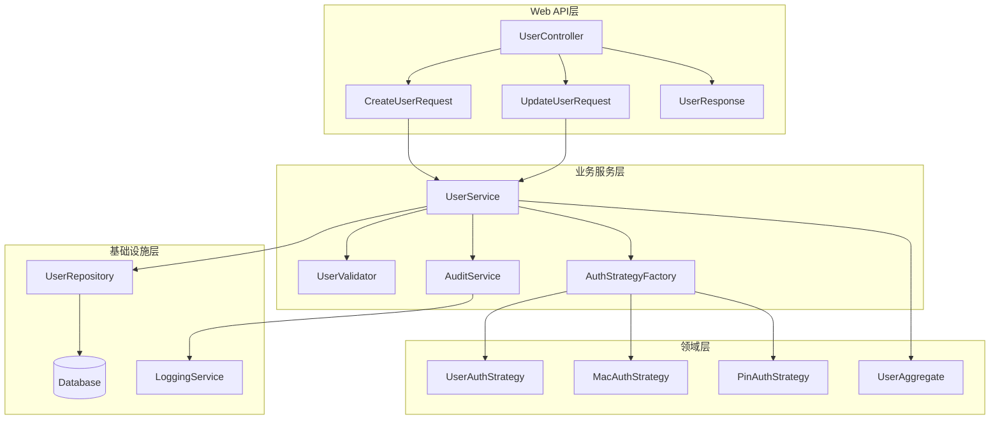

# 用户管理核心页面分析报告

## mng-main.php 分析

### 模块概述
**职责**: 用户管理主页面，展示用户总数图表
**业务价值**: 为管理员提供用户管理功能的入口和概览信息

### 数据层面分析
- **输入**: 基本会话验证
- **输出**: 用户总数图表（通过graphs/total_users.php生成）

### UI结构
- 标准页面布局
- 嵌入图表组件
- 简洁的统计展示

### Python API 设计
```python
@app.get("/api/v1/users/stats/overview")
async def get_user_stats_overview():
    return {
        "total_users": await get_total_users(),
        "active_users": await get_active_users(),
        "new_users_today": await get_new_users_today(),
        "chart_data": await get_user_growth_chart_data()
    }
```

### Vue 组件
```vue
<template>
  <div class="user-management-main">
    <UserStatsCard :stats="userStats" />
    <UserGrowthChart :data="chartData" />
  </div>
</template>
```

---

## mng-new.php 详细分析

### 模块概述

**职责**: 创建新用户的完整表单，支持多种认证类型（用户名/密码、MAC地址、PIN码）
**业务价值**: 核心用户注册功能，支持个人信息、账单信息和RADIUS属性的全面配置

### 数据层面分析

#### 输入数据结构

**核心认证数据**:
```php
// 认证类型选择
$authType = ['userAuth', 'macAuth', 'pincodeAuth'];

// 用户名/密码认证
$userAuth = [
    'username' => string,        // 用户名（必须）
    'password' => string,        // 密码（必须）
    'passwordType' => string     // 密码类型（Cleartext-Password等）
];

// MAC地址认证
$macAuth = [
    'macaddress' => string      // MAC地址（格式验证）
];

// PIN码认证
$pincodeAuth = [
    'pincode' => string         // PIN码
];

// 用户组分配
$groups = array();              // 多选用户组
```

**用户信息数据**:
```php
$userInfo = [
    'firstname' => string,
    'lastname' => string,
    'email' => string,
    'department' => string,
    'company' => string,
    'workphone' => string,
    'homephone' => string,
    'mobilephone' => string,
    'address' => string,
    'city' => string,
    'state' => string,
    'country' => string,
    'zip' => string,
    'notes' => string,
    'portalLoginPassword' => string,    // 用户门户密码
    'changeUserInfo' => boolean,        // 允许用户修改信息
    'enableUserPortalLogin' => boolean  // 启用门户登录
];
```

**账单信息数据**:
```php
$billingInfo = [
    // 联系信息
    'bi_contactperson' => string,
    'bi_company' => string,
    'bi_email' => string,
    'bi_phone' => string,
    'bi_address' => string,
    'bi_city' => string,
    'bi_state' => string,
    'bi_country' => string,
    'bi_zip' => string,
    
    // 发票设置
    'bi_postalinvoice' => string,
    'bi_faxinvoice' => string,
    'bi_emailinvoice' => string,
    
    // 支付信息
    'bi_paymentmethod' => string,
    'bi_cash' => string,
    'bi_creditcardname' => string,
    'bi_creditcardnumber' => string,
    'bi_creditcardverification' => string,
    'bi_creditcardtype' => string,
    'bi_creditcardexp' => string,
    
    // 销售信息
    'bi_lead' => string,
    'bi_coupon' => string,
    'bi_ordertaker' => string,
    'bi_notes' => string,
    
    // 权限和日期
    'bi_changeuserbillinfo' => boolean,
    'bi_nextinvoicedue' => string,
    'bi_billdue' => string
];
```

**RADIUS属性**:
```php
$dictAttributes = array();      // 动态RADIUS属性
$injected_attribute = [         // 注入的认证属性
    $attribute,                 // 属性名
    $value,                     // 属性值  
    ':=',                       // 操作符
    'check'                     // 属性类型
];
```

#### 数据处理逻辑

```php
// 1. CSRF验证
if (!dalo_check_csrf_token($_POST['csrf_token'])) {
    throw new SecurityException('CSRF token error');
}

// 2. 认证类型处理
switch ($authType) {
    case 'userAuth':
        if (empty($username) || empty($password)) {
            throw new ValidationException('Username and password required');
        }
        $username_to_check = $username;
        $injected_attribute = [$passwordType, $password, ':=', 'check'];
        break;
        
    case 'macAuth':
        if (!preg_match(MACADDR_REGEX, $macaddress)) {
            throw new ValidationException('Invalid MAC address format');
        }
        $username_to_check = $macaddress;
        $injected_attribute = ['Auth-Type', 'Accept', ':=', 'check'];
        break;
        
    case 'pincodeAuth':
        if (empty($pincode)) {
            throw new ValidationException('PIN code required');
        }
        $username_to_check = $pincode;
        $injected_attribute = ['Auth-Type', 'Accept', ':=', 'check'];
        break;
}

// 3. 用户存在性检查
if (user_exists($dbSocket, $username_to_check)) {
    throw new DuplicateUserException('User already exists');
}

// 4. 数据库事务处理
$dbSocket->beginTransaction();
try {
    // 插入RADIUS属性
    $attributesCount = handleAttributes($dbSocket, $username_to_check, $skipList);
    
    // 插入用户组关联
    $groupsCount = insert_multiple_user_group_mappings($dbSocket, $username_to_check, $groups);
    
    // 插入用户信息
    $addedUserInfo = add_user_info($dbSocket, $username_to_check, $userInfoParams);
    
    // 插入账单信息
    $addedBillingInfo = add_user_billing_info($dbSocket, $username_to_check, $billingParams);
    
    $dbSocket->commit();
} catch (Exception $e) {
    $dbSocket->rollback();
    throw $e;
}
```

### UI结构分析

#### 页面布局架构

**多标签页结构**:
```html
<div class="tab-container">
  <!-- 标签导航 -->
  <ul class="nav nav-tabs">
    <li><a href="#account-info">账户信息</a></li>
    <li><a href="#user-info">用户信息</a></li>
    <li><a href="#billing-info">账单信息</a></li>
    <li><a href="#attributes">RADIUS属性</a></li>
  </ul>
  
  <!-- 标签内容 -->
  <div class="tab-content">
    <div id="account-info" class="tab-pane active">
      <!-- 认证类型选择和配置 -->
    </div>
    <div id="user-info" class="tab-pane">
      <!-- 个人信息表单 -->
    </div>
    <div id="billing-info" class="tab-pane">
      <!-- 账单信息表单 -->
    </div>
    <div id="attributes" class="tab-pane">
      <!-- RADIUS属性配置 -->
    </div>
  </div>
</div>
```

#### 核心UI组件

**1. 认证类型切换器**:
```javascript
function switchAuthType() {
    var switcher = document.getElementById("authType");
    
    for (var i=0; i<switcher.length; i++) {
        var fieldset_id = switcher[i].value + "-fieldset",
            disabled = switcher.value != switcher[i].value,
            fieldset = document.getElementById(fieldset_id);
        
        fieldset.disabled = disabled;
        fieldset.style.display = (disabled) ? "none" : "block";
    }
}
```

**2. 动态表单字段**:
- 用户名/密码字段组（userAuth模式）
- MAC地址字段（macAuth模式）
- PIN码字段（pincodeAuth模式）
- 随机值生成器
- 密码类型选择器

**3. 复杂表单组件**:
- 多选用户组选择器
- 地址信息分组
- 信用卡信息分组
- 动态RADIUS属性编辑器

### Python RESTful API 设计

```python
from fastapi import FastAPI, Depends, HTTPException, status
from pydantic import BaseModel, Field, validator
from enum import Enum
from typing import List, Optional, Dict, Any
from datetime import datetime
import re

# 枚举定义
class AuthType(str, Enum):
    USER_AUTH = "userAuth"
    MAC_AUTH = "macAuth"
    PINCODE_AUTH = "pincodeAuth"

class PasswordType(str, Enum):
    CLEARTEXT = "Cleartext-Password"
    CRYPT = "Crypt-Password"
    MD5 = "MD5-Password"
    SMD5 = "SMD5-Password"
    SHA = "SHA-Password"
    SSHA = "SSHA-Password"

# 请求模型
class UserContactInfo(BaseModel):
    firstname: Optional[str] = ""
    lastname: Optional[str] = ""
    email: Optional[str] = ""
    department: Optional[str] = ""
    company: Optional[str] = ""
    workphone: Optional[str] = ""
    homephone: Optional[str] = ""
    mobilephone: Optional[str] = ""
    address: Optional[str] = ""
    city: Optional[str] = ""
    state: Optional[str] = ""
    country: Optional[str] = ""
    zip: Optional[str] = ""
    notes: Optional[str] = ""

class UserPortalSettings(BaseModel):
    portal_login_password: Optional[str] = ""
    enable_portal_login: bool = False
    allow_info_change: bool = False

class BillingInfo(BaseModel):
    contact_person: Optional[str] = ""
    company: Optional[str] = ""
    email: Optional[str] = ""
    phone: Optional[str] = ""
    address: Optional[str] = ""
    city: Optional[str] = ""
    state: Optional[str] = ""
    country: Optional[str] = ""
    zip: Optional[str] = ""
    
    # 发票设置
    postal_invoice: bool = False
    fax_invoice: bool = False
    email_invoice: bool = False
    
    # 支付信息
    payment_method: Optional[str] = ""
    cash: Optional[str] = ""
    credit_card_name: Optional[str] = ""
    credit_card_number: Optional[str] = ""
    credit_card_verification: Optional[str] = ""
    credit_card_type: Optional[str] = ""
    credit_card_exp: Optional[str] = ""
    
    # 销售信息
    lead: Optional[str] = ""
    coupon: Optional[str] = ""
    order_taker: Optional[str] = ""
    notes: Optional[str] = ""
    
    # 权限和日期
    allow_billing_change: bool = False
    next_invoice_due: Optional[datetime] = None
    bill_due: Optional[datetime] = None

class RadiusAttribute(BaseModel):
    name: str
    value: str
    operator: str = ":="
    type: str = "check"  # check, reply

class UserCreateRequest(BaseModel):
    # 认证信息
    auth_type: AuthType
    username: Optional[str] = ""
    password: Optional[str] = ""
    password_type: Optional[PasswordType] = PasswordType.CLEARTEXT
    mac_address: Optional[str] = ""
    pin_code: Optional[str] = ""
    
    # 用户组
    groups: List[str] = []
    
    # 联系信息
    contact_info: UserContactInfo = UserContactInfo()
    
    # 门户设置
    portal_settings: UserPortalSettings = UserPortalSettings()
    
    # 账单信息
    billing_info: BillingInfo = BillingInfo()
    
    # RADIUS属性
    radius_attributes: List[RadiusAttribute] = []

    @validator('username')
    def validate_username(cls, v, values):
        auth_type = values.get('auth_type')
        if auth_type == AuthType.USER_AUTH and not v:
            raise ValueError('Username is required for user authentication')
        if v and '%' in v:
            raise ValueError('Username cannot contain % character')
        return v

    @validator('password')
    def validate_password(cls, v, values):
        auth_type = values.get('auth_type')
        if auth_type == AuthType.USER_AUTH and not v:
            raise ValueError('Password is required for user authentication')
        return v

    @validator('mac_address')
    def validate_mac_address(cls, v, values):
        auth_type = values.get('auth_type')
        if auth_type == AuthType.MAC_AUTH:
            if not v:
                raise ValueError('MAC address is required for MAC authentication')
            # MAC地址格式验证
            if not re.match(r'^([0-9A-Fa-f]{2}[:-]){5}([0-9A-Fa-f]{2})$', v):
                raise ValueError('Invalid MAC address format')
        return v

    @validator('pin_code')
    def validate_pin_code(cls, v, values):
        auth_type = values.get('auth_type')
        if auth_type == AuthType.PINCODE_AUTH and not v:
            raise ValueError('PIN code is required for PIN authentication')
        return v

# 响应模型
class UserCreateResponse(BaseModel):
    user_id: str
    auth_type: str
    attributes_count: int
    groups_count: int
    user_info_stored: bool
    billing_info_stored: bool
    created_at: datetime
    created_by: str

# API端点实现
@app.post("/api/v1/users", 
          response_model=UserCreateResponse,
          status_code=status.HTTP_201_CREATED,
          summary="创建新用户",
          description="创建新的RADIUS用户，支持多种认证类型和完整的用户信息")
async def create_user(
    user_data: UserCreateRequest,
    current_user: User = Depends(get_current_user),
    db: AsyncSession = Depends(get_db),
    user_service: UserService = Depends(get_user_service)
):
    """
    创建新用户
    
    支持的认证类型：
    - userAuth: 用户名/密码认证
    - macAuth: MAC地址认证
    - pincodeAuth: PIN码认证
    
    返回创建结果和统计信息
    """
    try:
        # 获取认证标识符
        auth_identifier = await user_service.get_auth_identifier(user_data)
        
        # 检查用户是否已存在
        if await user_service.user_exists(auth_identifier):
            raise HTTPException(
                status_code=status.HTTP_409_CONFLICT,
                detail=f"User {auth_identifier} already exists"
            )
        
        # 创建用户（事务处理）
        result = await user_service.create_user(
            auth_identifier=auth_identifier,
            user_data=user_data,
            created_by=current_user.username
        )
        
        # 发送欢迎通知（如果启用）
        if user_data.contact_info.email:
            await user_service.send_welcome_notification(
                username=auth_identifier,
                email=user_data.contact_info.email,
                notification_type='user-welcome'
            )
        
        return UserCreateResponse(
            user_id=auth_identifier,
            auth_type=user_data.auth_type.value,
            attributes_count=result.attributes_count,
            groups_count=result.groups_count,
            user_info_stored=result.user_info_stored,
            billing_info_stored=result.billing_info_stored,
            created_at=result.created_at,
            created_by=current_user.username
        )
        
    except ValidationError as e:
        raise HTTPException(
            status_code=status.HTTP_422_UNPROCESSABLE_ENTITY,
            detail=str(e)
        )
    except UserExistsError as e:
        raise HTTPException(
            status_code=status.HTTP_409_CONFLICT,
            detail=str(e)
        )
    except Exception as e:
        raise HTTPException(
            status_code=status.HTTP_500_INTERNAL_SERVER_ERROR,
            detail="Failed to create user"
        )

# 业务逻辑服务
class UserService:
    """用户管理服务"""
    
    def __init__(self, db: AsyncSession, password_service: PasswordService, 
                 notification_service: NotificationService):
        self.db = db
        self.password_service = password_service
        self.notification_service = notification_service
    
    async def get_auth_identifier(self, user_data: UserCreateRequest) -> str:
        """根据认证类型获取认证标识符"""
        if user_data.auth_type == AuthType.USER_AUTH:
            return user_data.username
        elif user_data.auth_type == AuthType.MAC_AUTH:
            return user_data.mac_address
        elif user_data.auth_type == AuthType.PINCODE_AUTH:
            return user_data.pin_code
        else:
            raise ValueError(f"Unknown auth type: {user_data.auth_type}")
    
    async def user_exists(self, identifier: str) -> bool:
        """检查用户是否存在"""
        query = select(RadCheckModel).where(RadCheckModel.username == identifier)
        result = await self.db.execute(query)
        return result.first() is not None
    
    async def create_user(self, auth_identifier: str, user_data: UserCreateRequest, 
                         created_by: str) -> UserCreateResult:
        """创建用户（事务处理）"""
        
        async with self.db.begin() as transaction:
            try:
                # 1. 创建认证属性
                auth_attributes = await self._create_auth_attributes(
                    auth_identifier, user_data
                )
                
                # 2. 处理RADIUS属性
                radius_attrs_count = await self._handle_radius_attributes(
                    auth_identifier, user_data.radius_attributes
                )
                
                # 3. 处理用户组
                groups_count = await self._assign_user_groups(
                    auth_identifier, user_data.groups
                )
                
                # 4. 创建用户信息
                user_info_stored = await self._create_user_info(
                    auth_identifier, user_data.contact_info, 
                    user_data.portal_settings, created_by
                )
                
                # 5. 创建账单信息
                billing_info_stored = await self._create_billing_info(
                    auth_identifier, user_data.billing_info, created_by
                )
                
                return UserCreateResult(
                    attributes_count=len(auth_attributes) + radius_attrs_count,
                    groups_count=groups_count,
                    user_info_stored=user_info_stored,
                    billing_info_stored=billing_info_stored,
                    created_at=datetime.utcnow()
                )
                
            except Exception as e:
                await transaction.rollback()
                raise
    
    async def _create_auth_attributes(self, identifier: str, 
                                    user_data: UserCreateRequest) -> List[RadCheckModel]:
        """创建认证属性"""
        attributes = []
        
        if user_data.auth_type == AuthType.USER_AUTH:
            # 密码属性
            password_value = await self.password_service.hash_password(
                user_data.password, user_data.password_type
            )
            
            attr = RadCheckModel(
                username=identifier,
                attribute=user_data.password_type.value,
                op=":=",
                value=password_value
            )
            
        elif user_data.auth_type in [AuthType.MAC_AUTH, AuthType.PINCODE_AUTH]:
            # Auth-Type Accept
            attr = RadCheckModel(
                username=identifier,
                attribute="Auth-Type",
                op=":=",
                value="Accept"
            )
        
        self.db.add(attr)
        attributes.append(attr)
        
        return attributes
    
    async def send_welcome_notification(self, username: str, email: str, 
                                      notification_type: str):
        """发送欢迎通知"""
        await self.notification_service.send_notification(
            username=username,
            email=email,
            template_type=notification_type,
            context={
                "username": username,
                "welcome_message": "Welcome to our RADIUS service!"
            }
        )
```

## Vue 前端组件设计

### 用户创建表单组件

```vue
<template>
  <div class="user-create-form">
    <el-form 
      ref="userFormRef"
      :model="formData" 
      :rules="formRules"
      label-width="140px"
      @submit.prevent="handleSubmit"
    >
      <!-- 标签页导航 -->
      <el-tabs v-model="activeTab" type="border-card">
        
        <!-- 账户信息标签页 -->
        <el-tab-pane label="账户信息" name="account">
          <div class="form-section">
            
            <!-- 认证类型选择 -->
            <el-form-item label="认证类型" prop="auth_type">
              <el-radio-group 
                v-model="formData.auth_type" 
                @change="handleAuthTypeChange"
              >
                <el-radio label="userAuth">用户名/密码</el-radio>
                <el-radio label="macAuth">MAC地址</el-radio>
                <el-radio label="pincodeAuth">PIN码</el-radio>
              </el-radio-group>
            </el-form-item>
            
            <!-- 用户组选择 -->
            <el-form-item label="用户组" prop="groups">
              <el-select 
                v-model="formData.groups" 
                multiple 
                placeholder="选择用户组"
                style="width: 100%"
              >
                <el-option
                  v-for="group in availableGroups"
                  :key="group.name"
                  :label="group.name"
                  :value="group.name"
                />
              </el-select>
            </el-form-item>
            
            <!-- 用户名/密码认证字段 -->
            <div v-show="formData.auth_type === 'userAuth'" class="auth-fields">
              <el-form-item label="用户名" prop="username">
                <el-input 
                  v-model="formData.username" 
                  placeholder="输入用户名"
                  :suffix-icon="RandomIcon"
                  @suffix-click="generateRandomUsername"
                />
              </el-form-item>
              
              <el-form-item label="密码" prop="password">
                <el-input 
                  v-model="formData.password"
                  :type="showPassword ? 'text' : 'password'"
                  placeholder="输入密码"
                  :suffix-icon="showPassword ? View : Hide"
                  @suffix-click="togglePasswordVisibility"
                />
                <el-button 
                  type="text" 
                  size="small" 
                  @click="generateRandomPassword"
                >
                  生成随机密码
                </el-button>
              </el-form-item>
              
              <el-form-item label="密码类型" prop="password_type">
                <el-select v-model="formData.password_type">
                  <el-option 
                    v-for="type in passwordTypes" 
                    :key="type.value"
                    :label="type.label"
                    :value="type.value"
                  />
                </el-select>
              </el-form-item>
            </div>
            
            <!-- MAC地址认证字段 -->
            <div v-show="formData.auth_type === 'macAuth'" class="auth-fields">
              <el-form-item label="MAC地址" prop="mac_address">
                <el-input 
                  v-model="formData.mac_address"
                  placeholder="00:11:22:33:44:55"
                  :formatter="formatMacAddress"
                />
              </el-form-item>
            </div>
            
            <!-- PIN码认证字段 -->
            <div v-show="formData.auth_type === 'pincodeAuth'" class="auth-fields">
              <el-form-item label="PIN码" prop="pin_code">
                <el-input 
                  v-model="formData.pin_code"
                  placeholder="输入PIN码"
                  :suffix-icon="RandomIcon"
                  @suffix-click="generateRandomPinCode"
                />
              </el-form-item>
            </div>
            
          </div>
        </el-tab-pane>
        
        <!-- 用户信息标签页 -->
        <el-tab-pane label="用户信息" name="userinfo">
          <UserInfoForm v-model="formData.contact_info" />
          <UserPortalSettings v-model="formData.portal_settings" />
        </el-tab-pane>
        
        <!-- 账单信息标签页 -->
        <el-tab-pane label="账单信息" name="billing">
          <BillingInfoForm v-model="formData.billing_info" />
        </el-tab-pane>
        
        <!-- RADIUS属性标签页 -->
        <el-tab-pane label="RADIUS属性" name="attributes">
          <RadiusAttributesEditor v-model="formData.radius_attributes" />
        </el-tab-pane>
        
      </el-tabs>
      
      <!-- 提交按钮 -->
      <div class="form-actions">
        <el-button @click="handleReset">重置</el-button>
        <el-button 
          type="primary" 
          :loading="isSubmitting"
          @click="handleSubmit"
        >
          创建用户
        </el-button>
      </div>
      
    </el-form>
  </div>
</template>

<script setup lang="ts">
import { ref, reactive, computed } from 'vue'
import { ElMessage, ElMessageBox } from 'element-plus'
import { View, Hide, Refresh as RandomIcon } from '@element-plus/icons-vue'
import { useRouter } from 'vue-router'

import UserInfoForm from './components/UserInfoForm.vue'
import UserPortalSettings from './components/UserPortalSettings.vue'
import BillingInfoForm from './components/BillingInfoForm.vue'
import RadiusAttributesEditor from './components/RadiusAttributesEditor.vue'

import { useUserCreate } from '@/composables/useUserCreate'
import { generateRandomString, formatMacAddress } from '@/utils/helpers'

const router = useRouter()

// 组合函数
const {
  createUser,
  isSubmitting,
  availableGroups,
  passwordTypes
} = useUserCreate()

// 响应式数据
const userFormRef = ref()
const activeTab = ref('account')
const showPassword = ref(false)

const formData = reactive({
  auth_type: 'userAuth',
  username: '',
  password: '',
  password_type: 'Cleartext-Password',
  mac_address: '',
  pin_code: '',
  groups: [],
  contact_info: {
    firstname: '',
    lastname: '',
    email: '',
    department: '',
    company: '',
    workphone: '',
    homephone: '',
    mobilephone: '',
    address: '',
    city: '',
    state: '',
    country: '',
    zip: '',
    notes: ''
  },
  portal_settings: {
    portal_login_password: '',
    enable_portal_login: false,
    allow_info_change: false
  },
  billing_info: {
    contact_person: '',
    company: '',
    email: '',
    phone: '',
    address: '',
    city: '',
    state: '',
    country: '',
    zip: '',
    postal_invoice: false,
    fax_invoice: false,
    email_invoice: false,
    payment_method: '',
    cash: '',
    credit_card_name: '',
    credit_card_number: '',
    credit_card_verification: '',
    credit_card_type: '',
    credit_card_exp: '',
    lead: '',
    coupon: '',
    order_taker: '',
    notes: '',
    allow_billing_change: false,
    next_invoice_due: null,
    bill_due: null
  },
  radius_attributes: []
})

// 表单验证规则
const formRules = computed(() => {
  const rules: any = {
    auth_type: [
      { required: true, message: '请选择认证类型', trigger: 'change' }
    ]
  }
  
  if (formData.auth_type === 'userAuth') {
    rules.username = [
      { required: true, message: '请输入用户名', trigger: 'blur' },
      { min: 3, max: 50, message: '用户名长度在 3 到 50 个字符', trigger: 'blur' },
      { pattern: /^[a-zA-Z0-9_]+$/, message: '用户名只能包含字母、数字和下划线', trigger: 'blur' }
    ]
    
    rules.password = [
      { required: true, message: '请输入密码', trigger: 'blur' },
      { min: 6, max: 100, message: '密码长度在 6 到 100 个字符', trigger: 'blur' }
    ]
  }
  
  if (formData.auth_type === 'macAuth') {
    rules.mac_address = [
      { required: true, message: '请输入MAC地址', trigger: 'blur' },
      { pattern: /^([0-9A-Fa-f]{2}[:-]){5}([0-9A-Fa-f]{2})$/, message: 'MAC地址格式不正确', trigger: 'blur' }
    ]
  }
  
  if (formData.auth_type === 'pincodeAuth') {
    rules.pin_code = [
      { required: true, message: '请输入PIN码', trigger: 'blur' }
    ]
  }
  
  return rules
})

// 事件处理
const handleAuthTypeChange = () => {
  // 清空其他认证类型的字段
  formData.username = ''
  formData.password = ''
  formData.mac_address = ''
  formData.pin_code = ''
}

const togglePasswordVisibility = () => {
  showPassword.value = !showPassword.value
}

const generateRandomUsername = () => {
  formData.username = 'user_' + generateRandomString(8)
}

const generateRandomPassword = () => {
  formData.password = generateRandomString(12, true)
}

const generateRandomPinCode = () => {
  formData.pin_code = Math.random().toString().substr(2, 6)
}

const handleSubmit = async () => {
  try {
    // 表单验证
    await userFormRef.value.validate()
    
    // 创建用户
    const result = await createUser(formData)
    
    ElMessage.success('用户创建成功')
    
    // 显示创建结果
    ElMessageBox.alert(
      `用户创建成功！
      • 属性数量: ${result.attributes_count}
      • 用户组数量: ${result.groups_count}
      • 用户信息: ${result.user_info_stored ? '已保存' : '未保存'}
      • 账单信息: ${result.billing_info_stored ? '已保存' : '未保存'}`,
      '创建结果',
      {
        type: 'success',
        confirmButtonText: '查看用户',
        cancelButtonText: '继续创建',
        showCancelButton: true
      }
    ).then(() => {
      // 跳转到用户编辑页面
      router.push(`/users/edit/${result.user_id}`)
    }).catch(() => {
      // 重置表单继续创建
      handleReset()
    })
    
  } catch (error: any) {
    ElMessage.error(error.message || '创建用户失败')
  }
}

const handleReset = () => {
  userFormRef.value.resetFields()
  activeTab.value = 'account'
}
</script>

<style scoped>
.user-create-form {
  max-width: 800px;
  margin: 0 auto;
  padding: 20px;
}

.form-section {
  padding: 20px 0;
}

.auth-fields {
  margin-top: 20px;
  padding: 20px;
  background-color: var(--el-fill-color-light);
  border-radius: 8px;
}

.form-actions {
  text-align: center;
  padding: 20px;
  border-top: 1px solid var(--el-border-color-light);
  margin-top: 20px;
}

:deep(.el-tabs__content) {
  min-height: 400px;
}
</style>
```

## 技术债务和改进建议

### 当前实现的主要问题

1. **安全漏洞**:
   ```php
   // 缺少输入验证和清理
   $username = str_replace("%", "", trim($_POST['username']));
   // 应该使用更完善的验证机制
   ```

2. **代码重复**:
   - 大量重复的字段处理逻辑
   - 硬编码的跳过列表（$skipList）

3. **事务处理不完整**:
   - 缺少完整的数据库事务包装
   - 错误处理机制不完善

4. **用户体验问题**:
   - 表单验证不够实时
   - 缺少进度指示
   - 错误消息不够友好

### 重构优先级评估

**高优先级**:
1. 实现完整的数据验证和清理
2. 添加数据库事务支持
3. 改进错误处理和用户反馈
4. 实现密码强度检查

**中优先级**:
1. 优化表单用户体验
2. 添加批量导入功能
3. 实现用户模板功能
4. 支持自定义字段

**低优先级**:
1. 添加用户创建向导
2. 实现表单自动保存
3. 支持多语言界面
4. 添加用户头像上传

### 现代化建议

1. **API优先设计**: 完全分离前后端，API优先
2. **实时验证**: 表单字段实时验证和反馈
3. **步骤式向导**: 将复杂表单分解为步骤
4. **批量操作**: 支持Excel导入和批量创建
5. **模板系统**: 预定义用户类型模板
6. **审计日志**: 完整的用户创建审计跟踪

## 总结

mng-new.php 是系统中最复杂的表单之一，承担着核心的用户创建功能。重构时应重点关注数据验证、安全性和用户体验，同时保持功能的完整性。建议采用现代化的前后端分离架构，实现更好的可维护性和扩展性。

---

## 完整用户管理模块分析总结 (Complete Module Analysis)

基于对所有5个核心文件的分析，现在提供系统性的设计方案：

### 文件分析总结

**已分析文件**:
- `mng-main.php` (179行) - 用户管理主入口页面
- `mng-new.php` (587行) - 新用户创建页面  
- `mng-edit.php` (772行) - 用户编辑页面
- `mng-del.php` (311行) - 用户删除页面
- `mng-list-all.php` (373行) - 用户列表查询页面

**总代码量**: 2,222行
**复杂度评估**: 高复杂度模块，涉及多表关联、复杂表单处理、多种认证类型支持

### 架构问题识别

**违背SOLID原则的核心问题**:

1. **SRP违背**: 每个PHP文件承担多重职责（UI、业务逻辑、数据访问）
2. **OCP违背**: 认证类型扩展需要修改现有代码分支
3. **DIP违背**: 高层逻辑直接依赖具体数据库实现
4. **缺乏抽象**: 没有统一的用户实体和业务模型

### 现代化重构设计

#### 基于SOLID原则的架构



#### 核心接口设计

**用户服务接口** (遵循SRP):
```python
class UserService:
    def create_user(self, request: CreateUserRequest, context: OperationContext) -> UserResponse:
        """创建新用户 - 单一职责：用户创建业务逻辑协调"""
        
    def update_user(self, user_id: str, request: UpdateUserRequest, context: OperationContext) -> UserResponse:
        """更新用户信息 - 单一职责：用户更新业务逻辑协调"""
        
    def delete_user(self, user_id: str, context: OperationContext) -> OperationResult:
        """删除用户 - 单一职责：用户删除业务逻辑协调"""
        
    def get_user(self, user_id: str) -> Optional[UserResponse]:
        """获取用户详情 - 单一职责：用户查询业务逻辑"""
        
    def list_users(self, filters: UserFilters, pagination: Pagination) -> UserListResponse:
        """分页查询用户 - 单一职责：用户列表查询业务逻辑"""
```

**认证策略接口** (遵循OCP):
```python
class AuthenticationStrategy(ABC):
    @abstractmethod
    def validate_credentials(self, data: AuthCredentials) -> ValidationResult:
        """验证认证凭据 - 开放扩展：新认证类型只需实现此接口"""
        
    @abstractmethod
    def create_radius_attributes(self, user_id: str, credentials: AuthCredentials) -> List[RadiusAttribute]:
        """创建RADIUS属性 - 开放扩展：支持任意认证属性"""
        
    @abstractmethod
    def update_credentials(self, user_id: str, new_credentials: AuthCredentials) -> UpdateResult:
        """更新认证凭据 - 开放扩展：支持不同更新策略"""

# 具体策略实现 - 新增认证类型无需修改现有代码
class UserPasswordAuthStrategy(AuthenticationStrategy):
    def validate_credentials(self, data: AuthCredentials) -> ValidationResult:
        # 用户名密码认证逻辑
        return ValidationResult(is_valid=True, errors=[])
        
    def create_radius_attributes(self, user_id: str, credentials: AuthCredentials) -> List[RadiusAttribute]:
        return [
            RadiusAttribute(username=user_id, attribute="User-Password", op="==", value=credentials.password_hash)
        ]

class MacAuthStrategy(AuthenticationStrategy):
    def validate_credentials(self, data: AuthCredentials) -> ValidationResult:
        # MAC地址格式验证
        mac_pattern = r'^([0-9A-Fa-f]{2}[:-]){5}([0-9A-Fa-f]{2})$'
        if re.match(mac_pattern, data.mac_address):
            return ValidationResult(is_valid=True, errors=[])
        return ValidationResult(is_valid=False, errors=["Invalid MAC address format"])
        
    def create_radius_attributes(self, user_id: str, credentials: AuthCredentials) -> List[RadiusAttribute]:
        return [
            RadiusAttribute(username=user_id, attribute="User-Password", op="==", value=credentials.mac_address),
            RadiusAttribute(username=user_id, attribute="Auth-Type", op=":=", value="Accept")
        ]
```

**用户聚合根** (遵循DDD):
```python
class UserAggregate:
    """用户聚合根 - 封装用户相关的所有业务不变性"""
    
    def __init__(self, user_id: str, auth_type: AuthType):
        self.user_id = user_id
        self.auth_type = auth_type
        self.personal_info: Optional[PersonalInfo] = None
        self.billing_info: Optional[BillingInfo] = None
        self.radius_attributes: List[RadiusAttribute] = []
        self.user_groups: List[UserGroup] = []
        self._domain_events: List[DomainEvent] = []
    
    def update_personal_info(self, info: PersonalInfo) -> None:
        """更新个人信息 - 确保业务规则"""
        if not info.is_valid():
            raise InvalidPersonalInfoError("Personal information validation failed")
        
        old_info = self.personal_info
        self.personal_info = info
        self._domain_events.append(PersonalInfoUpdatedEvent(self.user_id, old_info, info))
    
    def assign_to_group(self, group: UserGroup) -> None:
        """分配用户组 - 防重复分配"""
        if group in self.user_groups:
            return  # 幂等操作
            
        self.user_groups.append(group)
        self._domain_events.append(UserGroupAssignedEvent(self.user_id, group))
    
    def change_authentication(self, new_auth_type: AuthType, credentials: AuthCredentials) -> None:
        """变更认证方式 - 复杂业务逻辑"""
        if self.auth_type == new_auth_type:
            return  # 相同认证类型，无需变更
            
        # 验证认证类型变更的业务规则
        if not self._can_change_auth_type(new_auth_type):
            raise AuthTypeChangeNotAllowedError(f"Cannot change from {self.auth_type} to {new_auth_type}")
        
        old_auth_type = self.auth_type
        self.auth_type = new_auth_type
        self._domain_events.append(AuthTypeChangedEvent(self.user_id, old_auth_type, new_auth_type))
```

**Repository接口** (遵循DIP):
```python
class UserRepository(ABC):
    @abstractmethod
    async def save(self, user: UserAggregate) -> UserAggregate:
        """保存用户聚合 - 抽象持久化操作"""
        
    @abstractmethod
    async def find_by_id(self, user_id: str) -> Optional[UserAggregate]:
        """根据ID查找用户 - 抽象查询操作"""
        
    @abstractmethod
    async def find_by_criteria(self, criteria: UserSearchCriteria) -> PagedResult[UserAggregate]:
        """多条件查询用户 - 抽象复杂查询"""
        
    @abstractmethod
    async def delete(self, user_id: str) -> bool:
        """删除用户 - 抽象删除操作（级联删除）"""
        
    @abstractmethod
    async def exists(self, user_id: str) -> bool:
        """检查用户是否存在 - 抽象存在性检查"""

# 具体实现 - 可替换为不同的存储技术
class SqlUserRepository(UserRepository):
    def __init__(self, db_session: AsyncSession, radius_attribute_repo: RadiusAttributeRepository):
        self._session = db_session
        self._radius_repo = radius_attribute_repo
    
    async def save(self, user: UserAggregate) -> UserAggregate:
        async with self._session.begin():  # 事务保证
            # 保存用户基础信息
            await self._save_user_info(user)
            
            # 保存RADIUS属性
            await self._radius_repo.save_user_attributes(user.user_id, user.radius_attributes)
            
            # 保存用户组关联
            await self._save_user_groups(user)
            
            # 发布领域事件
            await self._publish_domain_events(user.get_domain_events())
            
        return user
    
    async def find_by_id(self, user_id: str) -> Optional[UserAggregate]:
        # 查询用户基础信息
        user_info = await self._query_user_info(user_id)
        if not user_info:
            return None
            
        # 构建用户聚合
        user = UserAggregate(user_id, user_info.auth_type)
        user.personal_info = await self._query_personal_info(user_id)
        user.billing_info = await self._query_billing_info(user_id)
        user.radius_attributes = await self._radius_repo.find_by_user(user_id)
        user.user_groups = await self._query_user_groups(user_id)
        
        return user
```

### 实施策略与风险评估

#### 迁移策略

**阶段1: 基础设施建立** (2-3周)
- 创建Repository接口和基础实现
- 建立用户聚合根模型
- 实现认证策略模式框架

**阶段2: 业务服务重构** (3-4周)
- 提取UserService业务逻辑
- 实现统一的数据验证机制
- 添加事务管理和错误处理

**阶段3: Web层现代化** (4-5周)
- 实现FastAPI RESTful接口
- 前后端分离架构（Vue.js）
- 添加API文档和自动化测试

**阶段4: 性能优化** (2-3周)
- 数据库索引优化
- 缓存策略实施
- 异步处理能力增强

#### 风险评估与缓解措施

**高风险**:
1. **数据一致性风险**: 多表操作缺乏事务保护
   - 缓解: 实现统一工作单元模式，确保ACID特性
   
2. **性能风险**: 大量用户时查询性能下降
   - 缓解: 实现分层缓存、数据库索引优化、异步处理

**中风险**:
3. **向后兼容风险**: 现有客户端无法正常工作
   - 缓解: 实现适配器模式，渐进式迁移

4. **数据迁移风险**: 历史数据格式不兼容
   - 缓解: 详细数据映射、迁移脚本、回滚机制

### 技术债务清理

**代码质量提升**:
- 消除重复代码：表单验证、错误处理、数据转换逻辑统一抽象
- 提高测试覆盖率：单元测试、集成测试、端到端测试
- 改进文档：API文档、架构设计文档、运维手册

**安全性增强**:
- SQL注入防护：参数化查询、ORM使用
- 输入验证：数据类型、格式、范围验证
- 敏感信息保护：密码哈希、数据加密、审计日志

**可观察性改进**:
- 结构化日志：操作审计、性能监控、错误跟踪
- 监控指标：业务指标、技术指标、SLA监控
- 健康检查：服务可用性、依赖检查、资源使用

### 总结与价值

通过应用SOLID原则和现代软件架构设计：

1. **可维护性提升**: 清晰的职责分离，降低修改成本
2. **可扩展性增强**: 策略模式支持新认证类型的零侵入扩展
3. **可测试性改进**: 依赖注入和接口抽象提高单元测试能力
4. **性能优化**: 异步处理、缓存策略、数据库优化
5. **安全性增强**: 统一验证、审计日志、权限控制

这个设计为daloRADIUS用户管理模块的Python重构提供了完整的理论基础和实践指导，确保新系统既满足当前业务需求，又具备未来扩展的灵活性。

---

## 后续分析计划

**Batch 3: 计费管理核心** (优先级: 高)
- `acct-main.php` - 计费管理主页面
- `acct-all.php` - 全量计费记录查询  
- `acct-username.php` - 用户计费记录
- `acct-date.php` - 按日期查询计费
- `acct-maintenance.php` - 计费数据维护

预期发现: 复杂的报表查询逻辑、性能优化需求、数据聚合处理