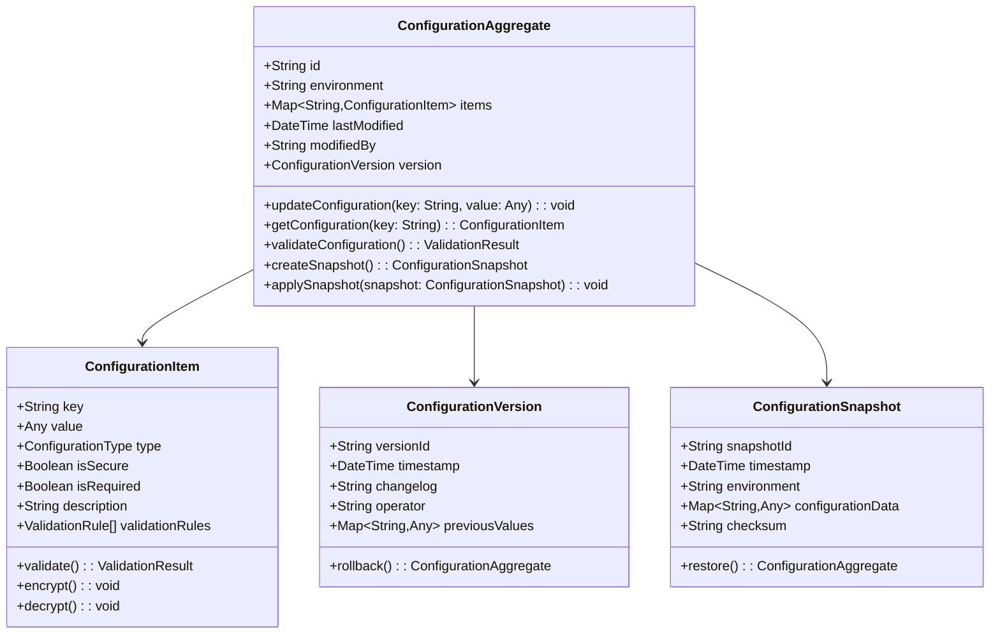
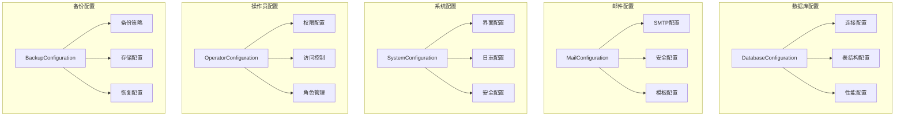
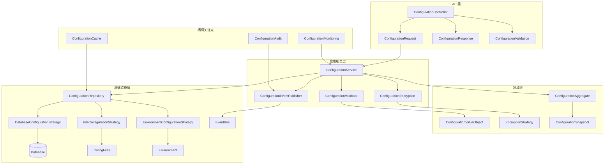
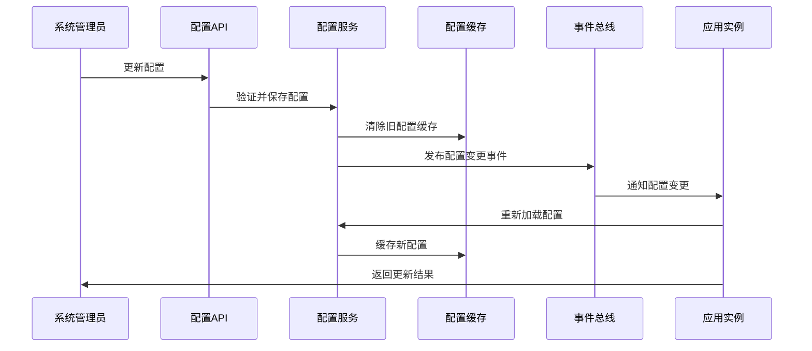

# 配置管理系统模块设计文档

## 模块概览 (Module Overview)

配置管理系统是daloRADIUS的核心基础设施模块，负责整个系统的配置参数管理、环境设置、安全配置和系统维护。本文档基于SOLID原则设计现代化的配置管理架构，重点关注抽象层设计和接口契约。

### 核心价值主张
- **集中化配置管理**: 统一的配置参数存储和管理接口
- **环境隔离**: 支持开发、测试、生产环境的配置分离
- **安全配置**: 敏感配置的加密存储和安全传输
- **配置版本控制**: 配置变更的追踪和回滚机制
- **实时配置更新**: 支持配置的热更新和动态重载

## 领域模型设计 (Domain Model Design)

### 配置聚合根 (Configuration Aggregate)



### 配置类型分类 (Configuration Type Taxonomy)



## 核心接口设计 (Core Interface Design)

### 配置管理服务接口 (遵循SRP)

```python
class ConfigurationService:
    """配置管理服务 - 单一职责：配置的业务逻辑协调"""
    
    def get_configuration(self, key: str, environment: Environment = None) -> ConfigurationItem:
        """获取配置项 - 支持环境隔离"""
        
    def set_configuration(self, key: str, value: Any, operator: str) -> ConfigurationItem:
        """设置配置项 - 包含变更追踪"""
        
    def validate_configuration(self, config: Dict[str, Any]) -> ValidationResult:
        """验证配置有效性 - 业务规则校验"""
        
    def get_configuration_by_category(self, category: ConfigurationCategory) -> List[ConfigurationItem]:
        """按类别获取配置 - 分类管理支持"""
        
    def create_configuration_snapshot(self, environment: Environment) -> ConfigurationSnapshot:
        """创建配置快照 - 备份和恢复支持"""
        
    def restore_configuration_snapshot(self, snapshot_id: str, operator: str) -> RestoreResult:
        """恢复配置快照 - 配置回滚机制"""

class ConfigurationValidator:
    """配置验证服务 - 单一职责：配置有效性验证"""
    
    def validate_database_configuration(self, config: DatabaseConfiguration) -> ValidationResult:
        """验证数据库配置 - 连接性和参数有效性"""
        
    def validate_mail_configuration(self, config: MailConfiguration) -> ValidationResult:
        """验证邮件配置 - SMTP设置和安全参数"""
        
    def validate_security_configuration(self, config: SecurityConfiguration) -> ValidationResult:
        """验证安全配置 - 安全策略和权限设置"""
        
    def validate_backup_configuration(self, config: BackupConfiguration) -> ValidationResult:
        """验证备份配置 - 备份策略和存储路径"""

class ConfigurationEncryption:
    """配置加密服务 - 单一职责：敏感配置的加密处理"""
    
    def encrypt_sensitive_value(self, value: str, config_key: str) -> EncryptedValue:
        """加密敏感配置值 - 密码、密钥等"""
        
    def decrypt_sensitive_value(self, encrypted_value: EncryptedValue) -> str:
        """解密敏感配置值 - 安全获取原始值"""
        
    def rotate_encryption_key(self, new_key: str) -> KeyRotationResult:
        """轮换加密密钥 - 安全密钥管理"""
        
    def is_sensitive_configuration(self, config_key: str) -> bool:
        """判断是否为敏感配置 - 安全分类标识"""
```

### 配置策略接口 (遵循OCP)

```python
class ConfigurationStrategy(ABC):
    """配置策略抽象 - 开放扩展：支持不同配置来源和格式"""
    
    @abstractmethod
    def load_configuration(self, source: ConfigurationSource) -> Dict[str, ConfigurationItem]:
        """加载配置 - 扩展点：支持不同配置来源"""
        
    @abstractmethod
    def save_configuration(self, config: Dict[str, ConfigurationItem], target: ConfigurationTarget) -> SaveResult:
        """保存配置 - 扩展点：支持不同保存目标"""
        
    @abstractmethod
    def validate_source(self, source: ConfigurationSource) -> ValidationResult:
        """验证配置源 - 扩展点：支持不同验证规则"""
        
    @abstractmethod
    def supports_hot_reload(self) -> bool:
        """热重载支持 - 扩展点：支持动态配置更新"""

# 具体策略实现 - 数据库配置策略
class DatabaseConfigurationStrategy(ConfigurationStrategy):
    def __init__(self, db_connection: DatabaseConnection):
        self._db = db_connection
        
    def load_configuration(self, source: ConfigurationSource) -> Dict[str, ConfigurationItem]:
        """从数据库加载配置"""
        configurations = {}
        
        # 加载基础配置项
        base_configs = self._load_base_configurations()
        configurations.update(base_configs)
        
        # 加载数据库表配置
        table_configs = self._load_table_configurations()
        configurations.update(table_configs)
        
        # 加载连接参数配置
        connection_configs = self._load_connection_configurations()
        configurations.update(connection_configs)
        
        return configurations
    
    def save_configuration(self, config: Dict[str, ConfigurationItem], target: ConfigurationTarget) -> SaveResult:
        """保存配置到数据库"""
        try:
            with self._db.transaction():
                for key, item in config.items():
                    self._save_configuration_item(key, item)
                
                # 创建配置变更记录
                self._create_change_record(config, target.operator)
                
            return SaveResult.success()
        except Exception as e:
            return SaveResult.failure(str(e))
    
    def validate_source(self, source: ConfigurationSource) -> ValidationResult:
        """验证数据库配置源"""
        # 验证数据库连接
        if not self._test_database_connection(source.connection_params):
            return ValidationResult.failure("Database connection failed")
        
        # 验证必需的表结构
        required_tables = self._get_required_tables()
        missing_tables = self._check_missing_tables(required_tables)
        
        if missing_tables:
            return ValidationResult.failure(f"Missing tables: {missing_tables}")
        
        return ValidationResult.success()
    
    def supports_hot_reload(self) -> bool:
        return True  # 数据库配置支持热重载

# 文件配置策略
class FileConfigurationStrategy(ConfigurationStrategy):
    def __init__(self, file_path: str, file_format: ConfigurationFormat):
        self._file_path = file_path
        self._format = file_format
        
    def load_configuration(self, source: ConfigurationSource) -> Dict[str, ConfigurationItem]:
        """从文件加载配置"""
        configurations = {}
        
        if self._format == ConfigurationFormat.JSON:
            configurations = self._load_json_configuration(source.file_path)
        elif self._format == ConfigurationFormat.YAML:
            configurations = self._load_yaml_configuration(source.file_path)
        elif self._format == ConfigurationFormat.INI:
            configurations = self._load_ini_configuration(source.file_path)
        
        return configurations
    
    def save_configuration(self, config: Dict[str, ConfigurationItem], target: ConfigurationTarget) -> SaveResult:
        """保存配置到文件"""
        try:
            # 创建备份
            self._create_backup()
            
            # 保存新配置
            if self._format == ConfigurationFormat.JSON:
                self._save_json_configuration(config, target.file_path)
            elif self._format == ConfigurationFormat.YAML:
                self._save_yaml_configuration(config, target.file_path)
            elif self._format == ConfigurationFormat.INI:
                self._save_ini_configuration(config, target.file_path)
            
            # 验证保存结果
            if not self._verify_saved_configuration(config, target.file_path):
                self._restore_backup()
                return SaveResult.failure("Configuration verification failed")
            
            return SaveResult.success()
        except Exception as e:
            self._restore_backup()
            return SaveResult.failure(str(e))
    
    def validate_source(self, source: ConfigurationSource) -> ValidationResult:
        """验证文件配置源"""
        # 检查文件存在性和可读性
        if not os.path.exists(source.file_path):
            return ValidationResult.failure(f"Configuration file not found: {source.file_path}")
        
        if not os.access(source.file_path, os.R_OK):
            return ValidationResult.failure(f"Configuration file not readable: {source.file_path}")
        
        # 验证文件格式
        try:
            self._parse_configuration_file(source.file_path)
            return ValidationResult.success()
        except Exception as e:
            return ValidationResult.failure(f"Invalid configuration format: {str(e)}")
    
    def supports_hot_reload(self) -> bool:
        return True  # 文件配置支持热重载

# 环境变量配置策略
class EnvironmentConfigurationStrategy(ConfigurationStrategy):
    def load_configuration(self, source: ConfigurationSource) -> Dict[str, ConfigurationItem]:
        """从环境变量加载配置"""
        configurations = {}
        
        # 获取所有DALO_前缀的环境变量
        for key, value in os.environ.items():
            if key.startswith('DALO_'):
                config_key = key[5:]  # 移除DALO_前缀
                configurations[config_key] = ConfigurationItem(
                    key=config_key,
                    value=value,
                    type=ConfigurationType.STRING,
                    source=ConfigurationSource.ENVIRONMENT
                )
        
        return configurations
    
    def save_configuration(self, config: Dict[str, ConfigurationItem], target: ConfigurationTarget) -> SaveResult:
        """环境变量策略通常不支持保存"""
        return SaveResult.failure("Environment variables strategy does not support saving")
    
    def validate_source(self, source: ConfigurationSource) -> ValidationResult:
        """验证环境变量配置源"""
        # 检查必需的环境变量
        required_env_vars = ['DALO_DB_HOST', 'DALO_DB_NAME', 'DALO_DB_USER']
        missing_vars = [var for var in required_env_vars if not os.getenv(var)]
        
        if missing_vars:
            return ValidationResult.failure(f"Missing environment variables: {missing_vars}")
        
        return ValidationResult.success()
    
    def supports_hot_reload(self) -> bool:
        return False  # 环境变量通常需要重启应用
```

### 配置存储库接口 (遵循DIP)

```python
class ConfigurationRepository(ABC):
    """配置存储抽象 - 依赖倒置：抽象存储操作"""
    
    @abstractmethod
    async def find_configuration_by_key(self, key: str, environment: Environment) -> Optional[ConfigurationItem]:
        """根据键查找配置"""
        
    @abstractmethod
    async def find_configurations_by_category(self, category: ConfigurationCategory) -> List[ConfigurationItem]:
        """根据类别查找配置"""
        
    @abstractmethod
    async def save_configuration(self, config: ConfigurationItem) -> ConfigurationItem:
        """保存配置项"""
        
    @abstractmethod
    async def delete_configuration(self, key: str, environment: Environment) -> bool:
        """删除配置项"""
        
    @abstractmethod
    async def create_snapshot(self, environment: Environment) -> ConfigurationSnapshot:
        """创建配置快照"""
        
    @abstractmethod
    async def list_snapshots(self, environment: Environment) -> List[ConfigurationSnapshot]:
        """列出配置快照"""

# SQL实现
class SqlConfigurationRepository(ConfigurationRepository):
    def __init__(self, db_session: AsyncSession, encryption_service: ConfigurationEncryption):
        self._session = db_session
        self._encryption = encryption_service
    
    async def find_configuration_by_key(self, key: str, environment: Environment) -> Optional[ConfigurationItem]:
        query = select(ConfigurationRecord).where(
            and_(
                ConfigurationRecord.key == key,
                ConfigurationRecord.environment == environment.value
            )
        )
        
        result = await self._session.execute(query)
        record = result.scalar_one_or_none()
        
        if not record:
            return None
        
        # 处理敏感配置的解密
        value = record.value
        if record.is_secure:
            value = self._encryption.decrypt_sensitive_value(EncryptedValue(value))
        
        return ConfigurationItem(
            key=record.key,
            value=value,
            type=ConfigurationType(record.type),
            is_secure=record.is_secure,
            is_required=record.is_required,
            description=record.description,
            environment=Environment(record.environment)
        )
    
    async def save_configuration(self, config: ConfigurationItem) -> ConfigurationItem:
        # 处理敏感配置的加密
        value_to_store = config.value
        if config.is_secure:
            encrypted = self._encryption.encrypt_sensitive_value(str(config.value), config.key)
            value_to_store = encrypted.encrypted_value
        
        # 查找现有记录
        existing_query = select(ConfigurationRecord).where(
            and_(
                ConfigurationRecord.key == config.key,
                ConfigurationRecord.environment == config.environment.value
            )
        )
        
        result = await self._session.execute(existing_query)
        existing_record = result.scalar_one_or_none()
        
        if existing_record:
            # 更新现有记录
            existing_record.value = value_to_store
            existing_record.modified_at = datetime.utcnow()
            existing_record.modified_by = config.modified_by
        else:
            # 创建新记录
            new_record = ConfigurationRecord(
                key=config.key,
                value=value_to_store,
                type=config.type.value,
                is_secure=config.is_secure,
                is_required=config.is_required,
                description=config.description,
                environment=config.environment.value,
                created_at=datetime.utcnow(),
                modified_at=datetime.utcnow(),
                modified_by=config.modified_by
            )
            self._session.add(new_record)
        
        await self._session.commit()
        return config
    
    async def create_snapshot(self, environment: Environment) -> ConfigurationSnapshot:
        # 获取所有配置
        query = select(ConfigurationRecord).where(
            ConfigurationRecord.environment == environment.value
        )
        
        result = await self._session.execute(query)
        records = result.scalars().all()
        
        # 构建配置数据
        config_data = {}
        for record in records:
            value = record.value
            if record.is_secure:
                # 快照中保持加密状态
                value = f"[ENCRYPTED:{record.key}]"
            
            config_data[record.key] = {
                'value': value,
                'type': record.type,
                'is_secure': record.is_secure,
                'is_required': record.is_required,
                'description': record.description
            }
        
        # 创建快照记录
        snapshot = ConfigurationSnapshot(
            snapshot_id=str(uuid4()),
            timestamp=datetime.utcnow(),
            environment=environment,
            configuration_data=config_data,
            checksum=self._calculate_checksum(config_data)
        )
        
        # 保存快照到数据库
        snapshot_record = ConfigurationSnapshotRecord(
            snapshot_id=snapshot.snapshot_id,
            environment=environment.value,
            configuration_data=json.dumps(config_data),
            checksum=snapshot.checksum,
            created_at=snapshot.timestamp
        )
        
        self._session.add(snapshot_record)
        await self._session.commit()
        
        return snapshot

# 缓存实现
class CachedConfigurationRepository(ConfigurationRepository):
    def __init__(self, base_repository: ConfigurationRepository, cache: CacheService):
        self._base = base_repository
        self._cache = cache
        self._cache_ttl = 300  # 5分钟缓存
    
    async def find_configuration_by_key(self, key: str, environment: Environment) -> Optional[ConfigurationItem]:
        cache_key = f"config:{environment.value}:{key}"
        
        # 尝试从缓存获取
        cached_config = await self._cache.get(cache_key)
        if cached_config:
            return ConfigurationItem.from_dict(cached_config)
        
        # 从底层存储获取
        config = await self._base.find_configuration_by_key(key, environment)
        if config:
            # 缓存结果
            await self._cache.set(cache_key, config.to_dict(), ttl=self._cache_ttl)
        
        return config
    
    async def save_configuration(self, config: ConfigurationItem) -> ConfigurationItem:
        # 保存到底层存储
        saved_config = await self._base.save_configuration(config)
        
        # 清除相关缓存
        cache_key = f"config:{config.environment.value}:{config.key}"
        await self._cache.delete(cache_key)
        
        # 清除类别缓存
        category_cache_key = f"config_category:{config.environment.value}:{config.category.value}"
        await self._cache.delete(category_cache_key)
        
        return saved_config
```

## 架构模式设计 (Architectural Pattern Design)

### 配置管理整体架构



### 配置热重载机制



## 具体实现案例 (Implementation Examples)

### 数据库配置管理

```python
class DatabaseConfigurationAggregate:
    """数据库配置聚合根"""
    
    def __init__(self, environment: Environment):
        self.environment = environment
        self.connection_config: DatabaseConnectionConfig = None
        self.table_config: DatabaseTableConfig = None
        self.performance_config: DatabasePerformanceConfig = None
        self._domain_events: List[DomainEvent] = []
    
    def update_connection_config(self, host: str, port: int, database: str, 
                               username: str, password: str, operator: str) -> None:
        """更新数据库连接配置"""
        
        # 验证连接参数
        validation_result = self._validate_connection_params(host, port, database, username, password)
        if not validation_result.is_valid:
            raise InvalidDatabaseConfigurationError(validation_result.error_message)
        
        # 测试连接有效性
        if not self._test_database_connection(host, port, database, username, password):
            raise DatabaseConnectionFailedError("Failed to connect to database with provided credentials")
        
        old_config = self.connection_config
        self.connection_config = DatabaseConnectionConfig(
            host=host,
            port=port,
            database=database,
            username=username,
            password=password,  # 将被加密存储
            ssl_enabled=True,
            connection_timeout=30,
            pool_size=10
        )
        
        self._domain_events.append(DatabaseConfigurationUpdatedEvent(
            environment=self.environment,
            old_config=old_config,
            new_config=self.connection_config,
            operator=operator
        ))
    
    def update_table_mapping(self, table_mappings: Dict[str, str], operator: str) -> None:
        """更新表映射配置"""
        
        # 验证表映射的有效性
        for logical_name, physical_name in table_mappings.items():
            if not self._is_valid_table_name(physical_name):
                raise InvalidTableNameError(f"Invalid table name: {physical_name}")
            
            if not self._table_exists(physical_name):
                raise TableNotFoundError(f"Table does not exist: {physical_name}")
        
        old_config = self.table_config
        self.table_config = DatabaseTableConfig(
            table_mappings=table_mappings,
            table_prefix=self._extract_common_prefix(table_mappings.values()),
            charset='utf8mb4',
            collation='utf8mb4_unicode_ci'
        )
        
        self._domain_events.append(TableMappingUpdatedEvent(
            environment=self.environment,
            old_mappings=old_config.table_mappings if old_config else {},
            new_mappings=table_mappings,
            operator=operator
        ))
    
    def optimize_performance_settings(self, max_connections: int, query_timeout: int, 
                                    cache_size: int, operator: str) -> None:
        """优化数据库性能配置"""
        
        if max_connections < 1 or max_connections > 1000:
            raise InvalidPerformanceConfigError("Max connections must be between 1 and 1000")
        
        if query_timeout < 5 or query_timeout > 300:
            raise InvalidPerformanceConfigError("Query timeout must be between 5 and 300 seconds")
        
        old_config = self.performance_config
        self.performance_config = DatabasePerformanceConfig(
            max_connections=max_connections,
            query_timeout=query_timeout,
            cache_size=cache_size,
            enable_query_cache=True,
            connection_pool_enabled=True,
            slow_query_threshold=1.0
        )
        
        self._domain_events.append(DatabasePerformanceConfigUpdatedEvent(
            environment=self.environment,
            old_config=old_config,
            new_config=self.performance_config,
            operator=operator
        ))
    
    def _validate_connection_params(self, host: str, port: int, database: str, 
                                  username: str, password: str) -> ValidationResult:
        """验证数据库连接参数"""
        errors = []
        
        if not host or len(host.strip()) == 0:
            errors.append("Database host is required")
        
        if port < 1 or port > 65535:
            errors.append("Database port must be between 1 and 65535")
        
        if not database or len(database.strip()) == 0:
            errors.append("Database name is required")
        
        if not username or len(username.strip()) == 0:
            errors.append("Database username is required")
        
        if not password or len(password) < 8:
            errors.append("Database password must be at least 8 characters")
        
        if errors:
            return ValidationResult.failure("; ".join(errors))
        
        return ValidationResult.success()
    
    def _test_database_connection(self, host: str, port: int, database: str, 
                                username: str, password: str) -> bool:
        """测试数据库连接"""
        try:
            # 使用适当的数据库驱动测试连接
            connection_string = f"mysql://{username}:{password}@{host}:{port}/{database}"
            engine = create_engine(connection_string, pool_pre_ping=True)
            
            with engine.connect() as conn:
                result = conn.execute(text("SELECT 1"))
                return result.fetchone()[0] == 1
                
        except Exception:
            return False
```

### 邮件配置管理

```python
class MailConfigurationAggregate:
    """邮件配置聚合根"""
    
    def __init__(self, environment: Environment):
        self.environment = environment
        self.smtp_config: SMTPConfiguration = None
        self.security_config: MailSecurityConfiguration = None
        self.template_config: MailTemplateConfiguration = None
        self._domain_events: List[DomainEvent] = []
    
    def configure_smtp_settings(self, host: str, port: int, username: str, password: str,
                              from_email: str, from_name: str, operator: str) -> None:
        """配置SMTP设置"""
        
        # 验证邮件配置
        validation_result = self._validate_smtp_settings(host, port, username, password, from_email)
        if not validation_result.is_valid:
            raise InvalidMailConfigurationError(validation_result.error_message)
        
        # 测试SMTP连接
        if not self._test_smtp_connection(host, port, username, password):
            raise SMTPConnectionFailedError("Failed to connect to SMTP server")
        
        old_config = self.smtp_config
        self.smtp_config = SMTPConfiguration(
            host=host,
            port=port,
            username=username,
            password=password,  # 将被加密存储
            from_email=from_email,
            from_name=from_name,
            connection_timeout=30,
            send_timeout=60
        )
        
        self._domain_events.append(SMTPConfigurationUpdatedEvent(
            environment=self.environment,
            old_config=old_config,
            new_config=self.smtp_config,
            operator=operator
        ))
    
    def configure_security_settings(self, encryption_type: MailEncryption, 
                                   enable_auth: bool, verify_ssl: bool, operator: str) -> None:
        """配置邮件安全设置"""
        
        # 验证安全配置的兼容性
        if encryption_type == MailEncryption.SSL and self.smtp_config.port not in [465, 587]:
            raise IncompatibleSecurityConfigError("SSL encryption typically requires port 465 or 587")
        
        old_config = self.security_config
        self.security_config = MailSecurityConfiguration(
            encryption_type=encryption_type,
            enable_authentication=enable_auth,
            verify_ssl_certificate=verify_ssl,
            enable_dkim=True,
            enable_spf=True,
            max_recipients_per_message=50
        )
        
        self._domain_events.append(MailSecurityConfigUpdatedEvent(
            environment=self.environment,
            old_config=old_config,
            new_config=self.security_config,
            operator=operator
        ))
    
    def configure_mail_templates(self, templates: Dict[str, MailTemplate], operator: str) -> None:
        """配置邮件模板"""
        
        # 验证模板的有效性
        for template_name, template in templates.items():
            validation_result = self._validate_mail_template(template)
            if not validation_result.is_valid:
                raise InvalidMailTemplateError(f"Invalid template {template_name}: {validation_result.error_message}")
        
        old_config = self.template_config
        self.template_config = MailTemplateConfiguration(
            templates=templates,
            default_template="default",
            template_engine="jinja2",
            enable_html=True,
            enable_text_fallback=True
        )
        
        self._domain_events.append(MailTemplateConfigUpdatedEvent(
            environment=self.environment,
            old_config=old_config,
            new_config=self.template_config,
            operator=operator
        ))
    
    def test_mail_configuration(self, test_recipient: str) -> MailTestResult:
        """测试邮件配置"""
        if not self.smtp_config:
            return MailTestResult.failure("SMTP configuration not set")
        
        try:
            # 发送测试邮件
            test_mail = MailMessage(
                to=test_recipient,
                subject="daloRADIUS Configuration Test",
                body="This is a test email to verify mail configuration.",
                from_email=self.smtp_config.from_email,
                from_name=self.smtp_config.from_name
            )
            
            mail_sender = SMTPMailSender(self.smtp_config, self.security_config)
            send_result = mail_sender.send_mail(test_mail)
            
            if send_result.success:
                return MailTestResult.success("Test email sent successfully")
            else:
                return MailTestResult.failure(f"Failed to send test email: {send_result.error_message}")
                
        except Exception as e:
            return MailTestResult.failure(f"Mail test failed: {str(e)}")
    
    def _validate_smtp_settings(self, host: str, port: int, username: str, 
                               password: str, from_email: str) -> ValidationResult:
        """验证SMTP设置"""
        errors = []
        
        if not host or len(host.strip()) == 0:
            errors.append("SMTP host is required")
        
        if port < 1 or port > 65535:
            errors.append("SMTP port must be between 1 and 65535")
        
        if not username or len(username.strip()) == 0:
            errors.append("SMTP username is required")
        
        if not password or len(password) < 6:
            errors.append("SMTP password must be at least 6 characters")
        
        if not from_email or not self._is_valid_email(from_email):
            errors.append("Valid from email is required")
        
        if errors:
            return ValidationResult.failure("; ".join(errors))
        
        return ValidationResult.success()
```

### 备份配置管理

```python
class BackupConfigurationAggregate:
    """备份配置聚合根"""
    
    def __init__(self, environment: Environment):
        self.environment = environment
        self.backup_strategy: BackupStrategy = None
        self.storage_config: BackupStorageConfig = None
        self.schedule_config: BackupScheduleConfig = None
        self._domain_events: List[DomainEvent] = []
    
    def configure_backup_strategy(self, strategy_type: BackupStrategyType, 
                                 tables: List[str], compression: bool, operator: str) -> None:
        """配置备份策略"""
        
        # 验证表列表
        invalid_tables = [table for table in tables if not self._is_valid_table_name(table)]
        if invalid_tables:
            raise InvalidBackupConfigurationError(f"Invalid table names: {invalid_tables}")
        
        # 检查表是否存在
        missing_tables = [table for table in tables if not self._table_exists(table)]
        if missing_tables:
            raise BackupConfigurationError(f"Tables do not exist: {missing_tables}")
        
        old_strategy = self.backup_strategy
        self.backup_strategy = BackupStrategy(
            strategy_type=strategy_type,
            include_tables=tables,
            exclude_tables=[],
            enable_compression=compression,
            compression_level=6,
            include_data=True,
            include_schema=True,
            parallel_threads=2
        )
        
        self._domain_events.append(BackupStrategyUpdatedEvent(
            environment=self.environment,
            old_strategy=old_strategy,
            new_strategy=self.backup_strategy,
            operator=operator
        ))
    
    def configure_storage_settings(self, storage_path: str, max_backups: int, 
                                  storage_type: BackupStorageType, operator: str) -> None:
        """配置存储设置"""
        
        # 验证存储路径
        if not self._is_valid_storage_path(storage_path):
            raise InvalidStoragePathError(f"Invalid storage path: {storage_path}")
        
        # 检查存储路径权限
        if not self._check_storage_permissions(storage_path):
            raise StoragePermissionError(f"Insufficient permissions for storage path: {storage_path}")
        
        # 检查存储空间
        available_space = self._get_available_storage_space(storage_path)
        required_space = self._estimate_backup_size()
        
        if available_space < required_space * max_backups:
            raise InsufficientStorageSpaceError(
                f"Insufficient storage space. Required: {required_space * max_backups}, Available: {available_space}"
            )
        
        old_config = self.storage_config
        self.storage_config = BackupStorageConfig(
            storage_type=storage_type,
            local_path=storage_path,
            max_backup_count=max_backups,
            auto_cleanup=True,
            encryption_enabled=True,
            compression_enabled=True
        )
        
        self._domain_events.append(BackupStorageConfigUpdatedEvent(
            environment=self.environment,
            old_config=old_config,
            new_config=self.storage_config,
            operator=operator
        ))
    
    def configure_backup_schedule(self, frequency: BackupFrequency, 
                                 scheduled_time: time, retention_days: int, operator: str) -> None:
        """配置备份计划"""
        
        if retention_days < 1 or retention_days > 365:
            raise InvalidBackupScheduleError("Retention days must be between 1 and 365")
        
        old_config = self.schedule_config
        self.schedule_config = BackupScheduleConfig(
            frequency=frequency,
            scheduled_time=scheduled_time,
            retention_days=retention_days,
            enable_incremental=True,
            enable_notifications=True,
            max_concurrent_backups=1
        )
        
        self._domain_events.append(BackupScheduleConfigUpdatedEvent(
            environment=self.environment,
            old_config=old_config,
            new_config=self.schedule_config,
            operator=operator
        ))
    
    def create_manual_backup(self, backup_name: str, operator: str) -> BackupResult:
        """手动创建备份"""
        if not self.backup_strategy or not self.storage_config:
            raise BackupNotConfiguredError("Backup strategy and storage must be configured before creating backups")
        
        try:
            backup_executor = BackupExecutor(self.backup_strategy, self.storage_config)
            backup_result = backup_executor.execute_backup(backup_name, operator)
            
            self._domain_events.append(ManualBackupCreatedEvent(
                environment=self.environment,
                backup_name=backup_name,
                backup_result=backup_result,
                operator=operator
            ))
            
            return backup_result
            
        except Exception as e:
            error_result = BackupResult.failure(str(e))
            self._domain_events.append(BackupFailedEvent(
                environment=self.environment,
                backup_name=backup_name,
                error_message=str(e),
                operator=operator
            ))
            return error_result
    
    def validate_backup_configuration(self) -> ValidationResult:
        """验证备份配置的完整性"""
        errors = []
        
        if not self.backup_strategy:
            errors.append("Backup strategy is not configured")
        elif not self.backup_strategy.include_tables:
            errors.append("No tables selected for backup")
        
        if not self.storage_config:
            errors.append("Storage configuration is not set")
        elif not self._check_storage_permissions(self.storage_config.local_path):
            errors.append("Storage path is not accessible")
        
        if self.schedule_config and self.schedule_config.frequency != BackupFrequency.MANUAL:
            if not self._is_valid_schedule_time(self.schedule_config.scheduled_time):
                errors.append("Invalid scheduled backup time")
        
        if errors:
            return ValidationResult.failure("; ".join(errors))
        
        return ValidationResult.success()
```

## 实施建议与架构演进 (Implementation Recommendations & Architecture Evolution)

### 迁移策略

**阶段1: 配置抽象层建立** (2-3周)
- 创建ConfigurationItem值对象和ConfigurationAggregate
- 实现ConfigurationService接口和基础策略
- 建立配置验证和加密机制

**阶段2: 存储层重构** (3-4周)
- 实现ConfigurationRepository接口的多种实现
- 建立配置缓存和性能优化
- 添加配置变更审计和版本控制

**阶段3: 热重载和监控** (2-3周)
- 实现配置热重载机制
- 添加配置变更监控和告警
- 建立配置健康检查和自动恢复

**阶段4: 高级功能集成** (3-4周)
- 环境隔离和配置模板
- 配置部署和回滚自动化
- 完整的配置管理API

### 风险评估与缓解

**高风险**:
1. **配置变更风险**: 错误配置可能导致系统不可用
   - 缓解: 配置验证、灰度发布、快速回滚机制

2. **敏感信息泄露**: 数据库密码等敏感配置的安全
   - 缓解: 强加密、密钥轮换、访问控制

**中风险**:
3. **配置同步问题**: 多实例环境的配置一致性
   - 缓解: 事件驱动同步、配置版本管理

4. **性能影响**: 频繁的配置查询影响性能
   - 缓解: 多层缓存、配置预加载

### 监控和运维

**配置健康监控**:
- 配置完整性检查
- 配置变更频率监控
- 敏感配置访问审计

**自动化运维**:
- 配置备份和恢复自动化
- 配置漂移检测和修复
- 配置合规性扫描

通过这种基于SOLID原则的现代化配置管理架构，daloRADIUS能够实现：
- **高可维护性**: 清晰的职责分离和接口设计
- **高扩展性**: 策略模式支持新配置源和存储方式
- **高安全性**: 敏感配置的加密和访问控制
- **高可靠性**: 配置验证、版本控制和快速恢复机制