# 财务管理模块设计文档

## 模块概述 (Module Overview)

### 职责
财务管理模块负责电信级计费系统的完整财务流程管理，包括发票生成、支付处理、计费方案配置、费率管理以及财务报表生成。该模块专注于处理复杂的财务计算、多币种支持、税务合规和支付集成。

### 设计目标
- **财务合规性**: 符合财务会计准则和税务法规要求
- **多币种支持**: 支持多种货币的计费和结算
- **灵活计费**: 支持多种计费模式（时间、流量、包月等）
- **支付集成**: 集成多种支付网关和支付方式
- **精确计算**: 确保财务计算的精确性和审计追踪

## 设计原则与模式 (Design Principles & Patterns)

### 原则应用

**SRP (单一职责原则)**:
- `InvoiceService`: 专注于发票生成和管理业务逻辑
- `PaymentService`: 专注于支付处理和验证
- `BillingPlanService`: 专注于计费方案配置和计算
- `RateCalculationService`: 专注于费率计算和应用

**OCP (开闭原则)**:
- `BillingStrategy` 接口支持新计费模式的扩展（时间、流量、包月、阶梯计费）
- `PaymentGateway` 接口支持新支付渠道的集成
- `TaxCalculator` 接口支持不同税收政策的计算

**DIP (依赖倒置原则)**:
- 业务服务层依赖抽象的Repository和Calculator接口
- 支付处理依赖抽象的PaymentGateway而非具体实现

**KISS & YAGNI**:
- 避免过度复杂的财务规则引擎，采用简单直接的计算逻辑
- 仅为当前明确的计费需求设计接口，避免假设性的复杂功能

### 设计模式

**策略模式**: 用于处理不同类型的计费策略
```python
class BillingStrategy(ABC):
    @abstractmethod
    def calculate_charges(self, usage_data: UsageData, rate: Rate) -> BillingResult
    
    @abstractmethod
    def validate_billing_parameters(self, params: dict) -> ValidationResult
```

**模板方法模式**: 用于发票生成流程
```python
class InvoiceGenerator:
    def generate_invoice(self, billing_period: BillingPeriod) -> Invoice:
        # 标准发票生成流程模板
        usage_data = self.collect_usage_data(billing_period)
        charges = self.calculate_charges(usage_data)
        taxes = self.calculate_taxes(charges)
        return self.create_invoice(charges, taxes)
```

**观察者模式**: 用于支付状态变更通知
```python
class PaymentEventPublisher:
    def notify_payment_completed(self, payment: Payment) -> None
    def notify_payment_failed(self, payment: Payment) -> None
```

## 架构视图 (Architectural Views)

### 组件图 (Component Diagram)


### 类图 (Class Diagram)

```mermaid
classDiagram
    class InvoiceService {
        <<Service>>
        +generate_invoice(user_id: str, billing_period: BillingPeriod) Invoice
        +calculate_invoice_amount(usage_data: UsageData, billing_plan: BillingPlan) Money
        +apply_taxes(base_amount: Money, tax_rules: List[TaxRule]) Money
        +send_invoice_notification(invoice: Invoice) NotificationResult
    }
    
    class PaymentService {
        <<Service>>
        +process_payment(payment_request: PaymentRequest) PaymentResult
        +verify_payment(payment_id: str) PaymentStatus
        +refund_payment(payment_id: str, amount: Money) RefundResult
        +get_payment_history(user_id: str, date_range: DateRange) List[Payment]
    }
    
    class BillingPlanService {
        <<Service>>
        +create_billing_plan(plan_data: BillingPlanData) BillingPlan
        +update_billing_plan(plan_id: str, updates: BillingPlanUpdates) BillingPlan
        +calculate_plan_charges(plan: BillingPlan, usage: UsageData) ChargeResult
        +validate_plan_configuration(plan_data: BillingPlanData) ValidationResult
    }
    
    class BillingStrategy {
        <<Abstract>>
        +calculate_charges(usage_data: UsageData, rate: Rate)* BillingResult
        +validate_billing_parameters(params: dict)* ValidationResult
        +get_billing_type()* BillingType
    }
    
    class TimeBillingStrategy {
        +calculate_charges(usage_data: UsageData, rate: Rate) BillingResult
        +validate_billing_parameters(params: dict) ValidationResult
        +get_billing_type() BillingType
    }
    
    class DataBillingStrategy {
        +calculate_charges(usage_data: UsageData, rate: Rate) BillingResult
        +validate_billing_parameters(params: dict) ValidationResult
        +get_billing_type() BillingType
    }
    
    class FlatRateBillingStrategy {
        +calculate_charges(usage_data: UsageData, rate: Rate) BillingResult
        +validate_billing_parameters(params: dict) ValidationResult
        +get_billing_type() BillingType
    }
    
    class PaymentGateway {
        <<Abstract>>
        +process_payment(payment_data: PaymentData)* PaymentResult
        +verify_payment(transaction_id: str)* PaymentStatus
        +refund_payment(transaction_id: str, amount: Money)* RefundResult
        +get_supported_currencies()* List[Currency]
    }
    
    class StripePaymentGateway {
        +process_payment(payment_data: PaymentData) PaymentResult
        +verify_payment(transaction_id: str) PaymentStatus
        +refund_payment(transaction_id: str, amount: Money) RefundResult
        +get_supported_currencies() List[Currency]
    }
    
    class PayPalPaymentGateway {
        +process_payment(payment_data: PaymentData) PaymentResult
        +verify_payment(transaction_id: str) PaymentStatus
        +refund_payment(transaction_id: str, amount: Money) RefundResult
        +get_supported_currencies() List[Currency]
    }
    
    class TaxCalculator {
        <<Abstract>>
        +calculate_tax(base_amount: Money, tax_context: TaxContext)* Money
        +get_applicable_tax_rules(context: TaxContext)* List[TaxRule]
    }
    
    class VATCalculator {
        +calculate_tax(base_amount: Money, tax_context: TaxContext) Money
        +get_applicable_tax_rules(context: TaxContext) List[TaxRule]
    }
    
    InvoiceService --> BillingStrategy : uses
    InvoiceService --> TaxCalculator : uses
    PaymentService --> PaymentGateway : uses
    BillingPlanService --> BillingStrategy : uses
    
    BillingStrategy <|-- TimeBillingStrategy : implements
    BillingStrategy <|-- DataBillingStrategy : implements
    BillingStrategy <|-- FlatRateBillingStrategy : implements
    
    PaymentGateway <|-- StripePaymentGateway : implements
    PaymentGateway <|-- PayPalPaymentGateway : implements
    
    TaxCalculator <|-- VATCalculator : implements
```


### 序列图 (Sequence Diagram) - 发票生成流程


## 关键接口与契约 (Key Interfaces & Contracts)

### InvoiceService 接口
**职责**: 发票生成和管理的核心业务逻辑协调器
**方法签名**:
```python
class InvoiceService:
    def generate_invoice(self, user_id: str, billing_period: BillingPeriod) -> Invoice:
        """生成用户指定周期的发票"""
        
    def calculate_invoice_amount(self, usage_data: UsageData, billing_plan: BillingPlan) -> Money:
        """计算发票金额"""
        
    def apply_taxes(self, base_amount: Money, tax_context: TaxContext) -> Money:
        """应用税务计算"""
        
    def void_invoice(self, invoice_id: str, reason: str) -> VoidResult:
        """作废发票"""
        
    def get_invoice_pdf(self, invoice_id: str) -> bytes:
        """获取发票PDF"""
```

**行为契约**:
- `generate_invoice` 必须在事务中执行，确保数据一致性
- `calculate_invoice_amount` 计算结果必须精确到货币最小单位
- `apply_taxes` 必须根据用户地理位置应用正确的税率
- 所有金额计算必须使用Decimal类型，避免浮点精度问题

### BillingStrategy 接口
**职责**: 抽象不同计费模式的计算逻辑
**方法签名**:
```python
class BillingStrategy(ABC):
    @abstractmethod
    def calculate_charges(self, usage_data: UsageData, rate: Rate) -> BillingResult:
        """根据使用量和费率计算费用"""
        
    @abstractmethod
    def validate_billing_parameters(self, params: dict) -> ValidationResult:
        """验证计费参数的有效性"""
        
    @abstractmethod
    def get_billing_type(self) -> BillingType:
        """获取计费类型标识"""
        
    @abstractmethod
    def supports_tiered_pricing(self) -> bool:
        """是否支持阶梯计费"""
```

**行为契约**:
- `calculate_charges` 必须处理边界情况（零使用量、超限等）
- `validate_billing_parameters` 必须在计费前调用
- 所有策略必须支持多币种计算
- 计算结果必须包含详细的计费明细

### PaymentGateway 接口
**职责**: 抽象支付网关的接入逻辑
**方法签名**:
```python
class PaymentGateway(ABC):
    @abstractmethod
    def process_payment(self, payment_data: PaymentData) -> PaymentResult:
        """处理支付请求"""
        
    @abstractmethod
    def verify_payment(self, transaction_id: str) -> PaymentStatus:
        """验证支付状态"""
        
    @abstractmethod
    def refund_payment(self, transaction_id: str, amount: Money, reason: str) -> RefundResult:
        """处理退款"""
        
    @abstractmethod
    def get_supported_currencies(self) -> List[Currency]:
        """获取支持的货币列表"""
        
    @abstractmethod
    def get_transaction_fees(self, amount: Money) -> Money:
        """计算交易手续费"""
```

**行为契约**:
- `process_payment` 必须在超时时间内返回结果
- `verify_payment` 必须处理网关异常情况
- `refund_payment` 必须验证退款金额不超过原支付金额
- 所有操作必须记录详细的交易日志

## 数据模型 (Data Model)

### 核心实体关系图


### 聚合根设计
```python
class InvoiceAggregate:
    """发票聚合根 - 封装发票相关的所有业务不变性"""
    
    def __init__(self, user_id: str, billing_period: BillingPeriod):
        self.id: Optional[int] = None
        self.user_id = user_id
        self.billing_period = billing_period
        self.invoice_items: List[InvoiceItem] = []
        self.payments: List[Payment] = []
        self.status = InvoiceStatus.DRAFT
        self.currency: Currency = Currency.USD
        self._domain_events: List[DomainEvent] = []
    
    def add_invoice_item(self, item: InvoiceItem) -> None:
        """添加发票项目 - 业务规则验证"""
        if self.status != InvoiceStatus.DRAFT:
            raise InvoiceNotEditableError("Cannot modify non-draft invoice")
        
        if item.amount <= 0:
            raise InvalidInvoiceItemError("Invoice item amount must be positive")
        
        self.invoice_items.append(item)
        self._domain_events.append(InvoiceItemAddedEvent(self.id, item))
    
    def calculate_total_amount(self) -> Money:
        """计算发票总金额 - 精确计算"""
        subtotal = sum(item.amount for item in self.invoice_items)
        tax_total = sum(item.tax_amount for item in self.invoice_items)
        return Money(subtotal + tax_total, self.currency)
    
    def mark_as_sent(self) -> None:
        """标记发票为已发送 - 状态转换控制"""
        if self.status != InvoiceStatus.DRAFT:
            raise InvalidInvoiceStatusTransitionError(f"Cannot send invoice in {self.status} status")
        
        if not self.invoice_items:
            raise EmptyInvoiceError("Cannot send empty invoice")
        
        self.status = InvoiceStatus.SENT
        self._domain_events.append(InvoiceSentEvent(self.id))
    
    def record_payment(self, payment: Payment) -> None:
        """记录支付 - 支付验证和状态更新"""
        if payment.amount <= 0:
            raise InvalidPaymentAmountError("Payment amount must be positive")
        
        total_paid = sum(p.amount for p in self.payments) + payment.amount
        invoice_total = self.calculate_total_amount().amount
        
        if total_paid > invoice_total:
            raise OverpaymentError("Payment amount exceeds invoice total")
        
        self.payments.append(payment)
        
        # 更新发票状态
        if total_paid >= invoice_total:
            self.status = InvoiceStatus.PAID
            self._domain_events.append(InvoicePaidEvent(self.id, payment))
        else:
            self.status = InvoiceStatus.PARTIALLY_PAID
            self._domain_events.append(PartialPaymentReceivedEvent(self.id, payment))

class BillingPlanAggregate:
    """计费方案聚合根 - 封装计费方案业务逻辑"""
    
    def __init__(self, plan_name: str, billing_strategy: BillingStrategy):
        self.plan_name = plan_name
        self.billing_strategy = billing_strategy
        self.rates: List[Rate] = []
        self.is_active = True
        self.effective_date = datetime.now()
        self._domain_events: List[DomainEvent] = []
    
    def add_rate(self, rate: Rate) -> None:
        """添加费率 - 费率冲突检查"""
        for existing_rate in self.rates:
            if self._rates_conflict(existing_rate, rate):
                raise RateConflictError(f"Rate conflicts with existing rate: {existing_rate.rate_name}")
        
        self.rates.append(rate)
        self._domain_events.append(RateAddedToPlanEvent(self.plan_name, rate))
    
    def calculate_charges(self, usage_data: UsageData) -> BillingResult:
        """计算费用 - 应用计费策略"""
        if not self.is_active:
            raise InactivePlanError(f"Cannot calculate charges for inactive plan: {self.plan_name}")
        
        applicable_rate = self._find_applicable_rate(usage_data)
        if not applicable_rate:
            raise NoApplicableRateError(f"No applicable rate found for usage data")
        
        return self.billing_strategy.calculate_charges(usage_data, applicable_rate)
    
    def _rates_conflict(self, rate1: Rate, rate2: Rate) -> bool:
        """检查费率是否冲突"""
        # 检查时间重叠和适用条件冲突
        return (rate1.rate_type == rate2.rate_type and 
                self._date_ranges_overlap(rate1, rate2))
```

## 演进性与考量 (Evolution & Considerations)

### 已知限制
1. **复杂税务规则**: 当前设计假设税务规则相对简单，复杂的国际税务可能需要专门的税务引擎
2. **高频支付处理**: 当支付量达到高并发时，可能需要异步处理和队列机制
3. **多租户支持**: 当前设计未考虑多租户场景下的数据隔离和计费策略

### 扩展方案
**新计费策略扩展**:
```python
# 通过实现接口轻松扩展阶梯计费
class TieredBillingStrategy(BillingStrategy):
    def calculate_charges(self, usage_data: UsageData, rate: Rate) -> BillingResult:
        # 阶梯计费逻辑：不同使用量级别采用不同费率
        tiers = rate.get_tier_definitions()
        total_charge = Money.zero(rate.currency)
        
        remaining_usage = usage_data.total_usage
        for tier in tiers:
            if remaining_usage <= 0:
                break
                
            tier_usage = min(remaining_usage, tier.usage_limit)
            tier_charge = tier_usage * tier.unit_rate
            total_charge += tier_charge
            remaining_usage -= tier_usage
        
        return BillingResult(
            base_amount=total_charge,
            billing_details=self._create_tier_breakdown(tiers, usage_data)
        )
```

**新支付网关扩展**:
```python
class AlipayPaymentGateway(PaymentGateway):
    """支付宝支付网关 - 遵循OCP原则"""
    
    def process_payment(self, payment_data: PaymentData) -> PaymentResult:
        # 支付宝API集成逻辑
        pass
        
    def get_supported_currencies(self) -> List[Currency]:
        return [Currency.CNY, Currency.USD, Currency.EUR]
```

**国际化税务扩展**:
```python
class InternationalTaxCalculator(TaxCalculator):
    """国际税务计算器 - 支持多国税收政策"""
    
    def calculate_tax(self, base_amount: Money, tax_context: TaxContext) -> Money:
        country_tax_engine = self._get_country_tax_engine(tax_context.country)
        return country_tax_engine.calculate(base_amount, tax_context)
        
    def _get_country_tax_engine(self, country: Country) -> CountryTaxEngine:
        # 根据国家返回相应的税务计算引擎
        pass
```

### 性能考量
**计费计算优化**:
- 批量计费：支持批量用户的并行计费处理
- 缓存策略：费率和税率的内存缓存
- 预计算：常用计费场景的预计算结果

**支付处理优化**:
- 异步处理：大额支付或批量支付的异步处理
- 重试机制：支付失败的智能重试策略
- 限流保护：防止支付接口被恶意调用

**数据存储优化**:
- 分区策略：历史发票和支付数据按时间分区
- 索引优化：支付查询和发票查询的复合索引
- 归档机制：长期数据的自动归档和压缩

### 安全考量
**财务数据保护**:
- 敏感信息加密：支付信息、银行账户信息加密存储
- 访问控制：基于角色的财务数据访问权限
- 审计跟踪：所有财务操作的完整审计日志

**支付安全**:
- PCI DSS合规：支付卡数据的安全处理
- 反欺诈检测：异常支付模式的自动检测
- 交易验证：关键财务操作的双重验证

**合规性要求**:
- 数据保留：财务数据的法定保留期限管理
- 报表生成：税务申报和财务审计报表
- 隐私保护：个人财务信息的隐私保护

---

本设计文档严格遵循SOLID原则和现代软件架构最佳实践，通过清晰的接口定义和职责分离，为财务管理模块的重构提供了坚实的理论基础。设计特别强调财务数据的准确性、安全性和合规性，确保系统能够处理复杂的电信计费场景并支持国际化业务扩展。