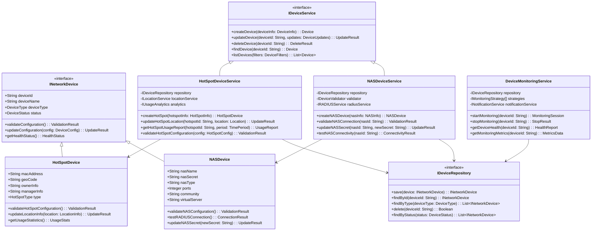

# 网络设备管理模块设计文档

## 模块概述 (Module Overview)

### 职责
网络设备管理模块的核心职责是管理RADIUS网络基础设施中的关键设备，包括NAS（Network Access Server）设备和热点（HotSpot）设备的完整生命周期管理，确保网络接入点的统一配置、监控和维护。

### 设计目标
- **统一设备管理**: 提供NAS设备和热点设备的集中化管理接口
- **高可扩展性**: 支持不同类型网络设备的动态接入和管理
- **实时监控**: 实现设备状态的实时监控和告警机制
- **配置一致性**: 确保设备配置的标准化和一致性管理
- **安全性**: 设备认证信息的安全存储和传输

## 设计原则与模式 (Design Principles & Patterns)

### 原则应用
- **SRP (单一职责原则)**: NAS设备管理服务专注于NAS设备的业务逻辑，热点管理服务专注于热点设备的业务逻辑，设备监控服务专注于设备状态监控
- **OCP (开闭原则)**: 通过设备类型策略模式支持新设备类型的扩展，无需修改现有核心代码
- **DIP (依赖倒置原则)**: 高层设备管理服务依赖抽象的设备存储库接口，而非具体的数据库实现

### 设计模式
- **策略模式**: 用于处理不同类型网络设备的配置和监控策略
- **工厂模式**: 用于创建不同类型的设备实例和配置对象
- **观察者模式**: 用于设备状态变更的事件通知和监控告警
- **适配器模式**: 用于适配不同厂商设备的管理接口和协议

## 架构视图 (Architectural Views)

### 组件图 (Component Diagram)

### 类图 (Class Diagram)

### 序列图 (Sequence Diagram) - NAS设备创建流程

## 关键接口与契约 (Key Interfaces & Contracts)

### INetworkDevice 接口

**名称**: INetworkDevice  
**职责**: 定义所有网络设备的基础行为契约  
**方法签名**:
- `validateConfiguration(): ValidationResult` - 验证设备配置的有效性
- `updateConfiguration(config: DeviceConfig): UpdateResult` - 更新设备配置
- `getHealthStatus(): HealthStatus` - 获取设备健康状态
- `getDeviceMetrics(): DeviceMetrics` - 获取设备性能指标

**预期的行为契约**:
- 调用 `updateConfiguration()` 前必须先调用 `validateConfiguration()` 确保配置有效
- `getHealthStatus()` 应返回设备的实时状态，包括连接性和性能指标
- 配置更新操作必须是原子性的，失败时不应留下部分更新状态

### INASDeviceService 接口

**名称**: INASDeviceService  
**职责**: 管理NAS设备的完整生命周期  
**方法签名**:
- `createNASDevice(nasInfo: NASInfo): NASDevice` - 创建新的NAS设备
- `validateNASConnection(nasId: String): ValidationResult` - 验证NAS连接
- `updateNASSecret(nasId: String, newSecret: String): UpdateResult` - 更新NAS密钥
- `getNASStatistics(nasId: String): NASStatistics` - 获取NAS统计信息

**预期的行为契约**:
- 创建NAS设备时必须验证与RADIUS服务器的连接性
- 更新NAS密钥时必须同时更新RADIUS服务器配置
- 所有NAS操作都应记录操作日志用于审计

### IHotSpotDeviceService 接口

**名称**: IHotSpotDeviceService  
**职责**: 管理热点设备的配置和运营信息  
**方法签名**:
- `createHotSpot(hotspotInfo: HotSpotInfo): HotSpotDevice` - 创建新的热点设备
- `updateHotSpotLocation(hotspotId: String, location: Location): UpdateResult` - 更新热点位置
- `getHotSpotUsageReport(hotspotId: String, period: TimePeriod): UsageReport` - 获取使用报告
- `validateHotSpotConfiguration(config: HotSpotConfig): ValidationResult` - 验证热点配置

**预期的行为契约**:
- 热点设备必须具有唯一的MAC地址或IP地址标识
- 位置更新应触发地理编码验证
- 使用报告生成应基于实际的计费数据

### IDeviceMonitoringService 接口

**名称**: IDeviceMonitoringService  
**职责**: 监控网络设备的健康状态和性能指标  
**方法签名**:
- `startMonitoring(deviceId: String): MonitoringSession` - 开始设备监控
- `stopMonitoring(deviceId: String): StopResult` - 停止设备监控
- `getDeviceHealth(deviceId: String): HealthReport` - 获取设备健康报告
- `configureAlerts(deviceId: String, alertRules: AlertRules): ConfigResult` - 配置告警规则

**预期的行为契约**:
- 监控会话应支持实时数据收集和历史数据存储
- 健康检查应包括连接性测试、性能指标和配置完整性验证
- 告警规则应支持阈值配置和自定义通知方式

## 数据模型 (Data Model)

## 演进性与考量 (Evolution & Considerations)

### 已知限制
1. **设备类型扩展复杂性**: 当前设计主要支持NAS和热点设备，添加新设备类型需要扩展接口定义
2. **监控数据存储**: 大量监控数据的长期存储和查询性能可能成为瓶颈
3. **实时性要求**: 设备状态监控的实时性依赖于底层网络协议的响应速度
4. **多厂商兼容性**: 不同厂商设备的管理接口标准化程度有限

### 扩展方案
1. **新设备类型支持**: 通过实现 `INetworkDevice` 接口和对应的 `IDeviceService` 接口来支持新设备类型
2. **监控策略扩展**: 通过实现 `IMonitoringStrategy` 接口来支持新的监控协议（如SNMP v3、REST API等）
3. **配置管理增强**: 通过策略模式扩展 `IConfigurationStrategy` 来支持不同设备的配置管理方式
4. **告警机制扩展**: 通过观察者模式扩展告警处理器来支持不同的通知渠道

### 性能/安全考量

**性能考量**:
- **批量操作优化**: 支持设备的批量创建、更新和监控配置
- **缓存策略**: 对频繁查询的设备信息和配置进行缓存
- **监控数据分层**: 实时数据和历史数据采用不同的存储策略
- **连接池管理**: 对设备连接进行池化管理，避免频繁建立连接

**安全考量**:
- **设备认证**: NAS密钥等敏感信息采用加密存储和安全传输
- **访问控制**: 基于角色的设备管理权限控制
- **操作审计**: 所有设备配置变更操作的完整审计日志
- **网络隔离**: 设备管理流量与业务流量的网络隔离

**扩展性考量**:
- **水平扩展**: 支持设备管理服务的水平扩展和负载均衡
- **插件架构**: 通过插件机制支持第三方设备管理扩展
- **API标准化**: 提供标准化的RESTful API接口支持外部系统集成
- **事件驱动**: 基于事件驱动架构支持设备状态变更的异步处理