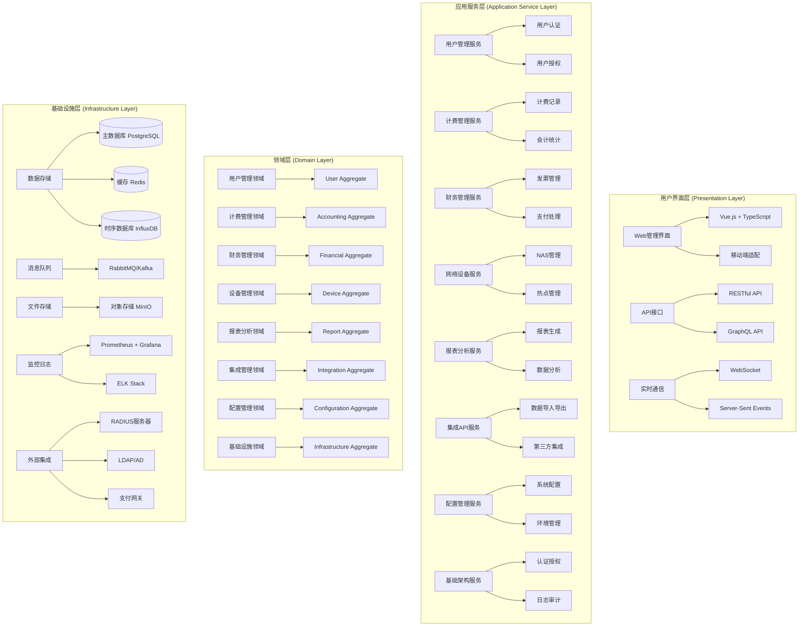
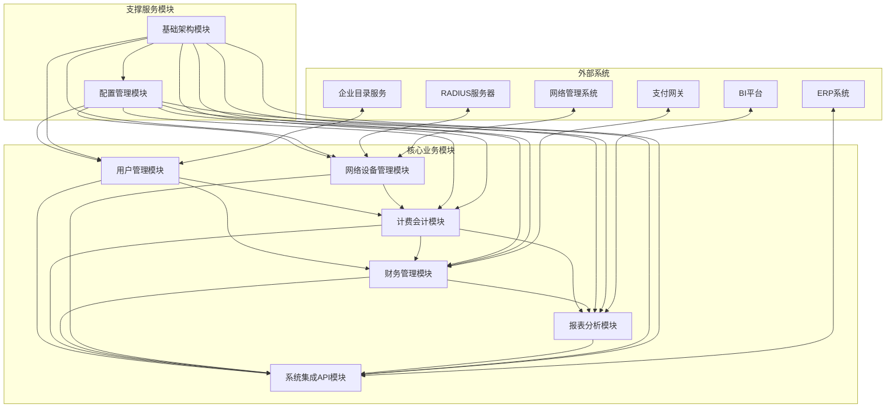
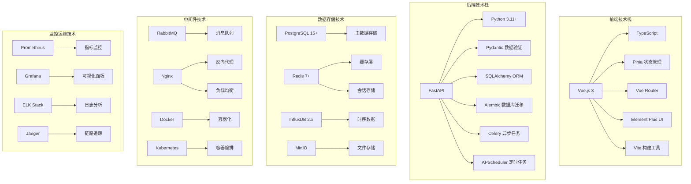
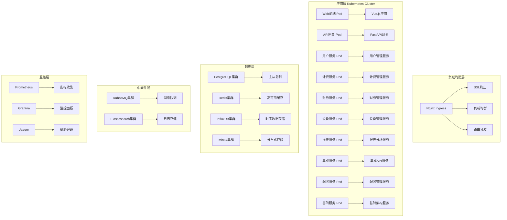
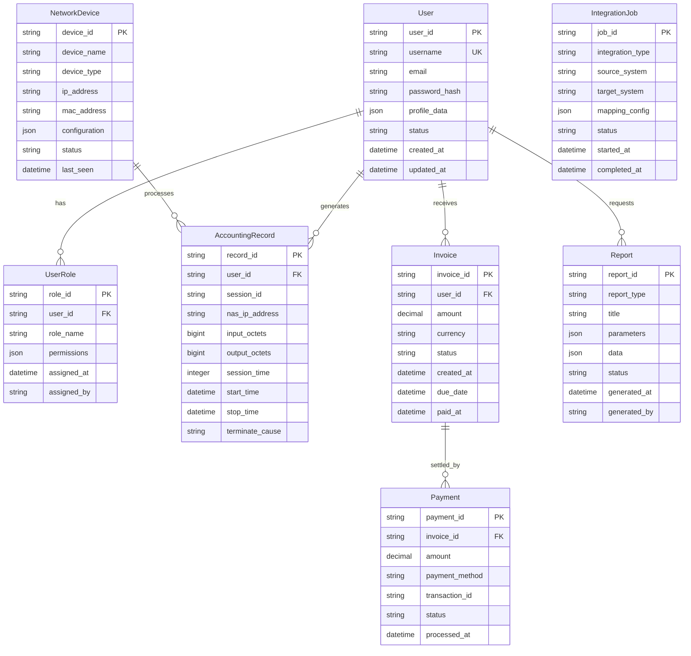
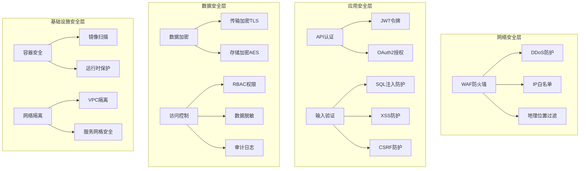
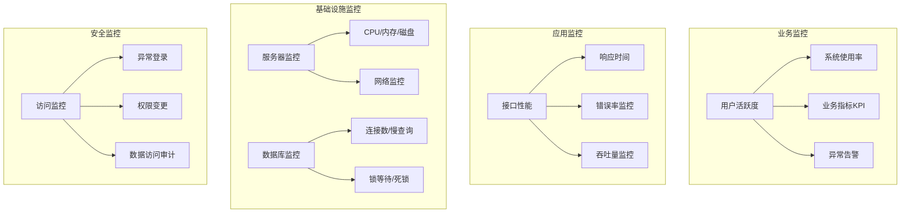

# daloRADIUS 总体系统架构设计 (Overall System Architecture Design)

## 项目概述 (Project Overview)

### 职责
daloRADIUS总体架构负责统领整个RADIUS管理平台的现代化转型，从传统的PHP单体架构演进为基于微服务和领域驱动设计的现代化企业级系统。该架构整合了八个核心业务模块，提供统一、可扩展、高性能的RADIUS网络接入管理解决方案。

### 设计目标
- **现代化架构**: 从PHP单体应用迁移到Python/FastAPI + Vue.js的现代化技术栈
- **企业级能力**: 提供高可用、高性能、高安全性的企业级RADIUS管理能力
- **模块化设计**: 基于DDD的清晰模块边界，支持独立开发、部署和扩展
- **平台化能力**: 支持多租户、多区域、多环境的平台化运营
- **生态集成**: 与企业IT生态系统无缝集成，支持标准化的API和数据交换

## 设计原则与模式 (Design Principles & Patterns)

### SOLID原则的系统级应用
- **SRP (单一职责原则)**: 每个模块专注于一个特定的业务领域，职责界限清晰
- **OCP (开闭原则)**: 通过抽象接口和策略模式，支持功能扩展而无需修改核心代码
- **LSP (里氏替换原则)**: 所有接口实现都保证行为一致性，支持无缝替换
- **ISP (接口隔离原则)**: 提供细粒度的专用接口，避免大而全的上帝接口
- **DIP (依赖倒置原则)**: 高层模块依赖抽象，支持多种实现和技术栈切换

### 核心设计模式
- **领域驱动设计 (DDD)**: 以业务领域为中心的模块划分和设计
- **事件驱动架构**: 基于领域事件的松耦合模块间通信
- **策略模式**: 支持多种业务策略和算法的可插拔实现
- **工厂模式**: 统一的对象创建和依赖注入机制
- **观察者模式**: 事件发布订阅和实时监控告警

### 质量属性
- **KISS原则**: 保持设计简洁，优先选择简单有效的解决方案
- **YAGNI原则**: 避免过度设计，专注当前明确的业务需求
- **DRY原则**: 消除重复代码和重复设计，提高可维护性

## 总体架构视图 (Overall Architecture Views)

### 系统分层架构图

### 模块间关系图

### 技术架构图

## 核心模块架构设计 (Core Module Architecture)

### 1. 用户管理模块 (User Management Module)
**核心职责**: 完整的用户生命周期管理，包括用户注册、认证、授权、信息维护和生命周期控制

**关键特性**:
- 多源用户身份集成 (LDAP/AD/OAuth2)
- 细粒度的权限控制和角色管理
- 用户行为审计和安全监控
- 支持多租户和组织架构管理

**技术亮点**:
- 基于RBAC和ABAC的混合授权模型
- JWT令牌和Session的双重认证机制
- 用户操作的完整审计链路

### 2. 计费会计模块 (Accounting Management Module)
**核心职责**: RADIUS计费数据的收集、处理、存储和统计分析

**关键特性**:
- 实时计费数据处理和存储
- 多维度的使用统计和分析
- 计费数据的完整性验证和修复
- 支持多种计费模式和策略

**技术亮点**:
- 基于事件流的实时数据处理
- 时序数据库优化的存储方案
- 分布式计费数据聚合算法

### 3. 财务管理模块 (Financial Management Module)
**核心职责**: 企业级的财务管理，包括发票、支付、费率和收入管理

**关键特性**:
- 自动化的发票生成和管理
- 多渠道支付集成和处理
- 灵活的费率配置和计算引擎
- 完整的财务报表和分析

**技术亮点**:
- 金融级的数据精度和一致性保证
- 支付网关的统一抽象和适配
- 复杂费率规则的引擎化处理

### 4. 网络设备管理模块 (Network Device Management Module)
**核心职责**: NAS设备和热点设备的统一管理和监控

**关键特性**:
- 多厂商网络设备的统一管理
- 实时设备状态监控和告警
- 设备配置的版本控制和变更管理
- 网络拓扑可视化和分析

**技术亮点**:
- 基于SNMP和RADIUS的设备监控
- 设备配置的自动化部署和回滚
- 网络性能的实时分析和优化建议

### 5. 报表分析模块 (Reporting & Analytics Module)
**核心职责**: 业务智能和数据可视化，为运营决策提供数据支撑

**关键特性**:
- 多维度的数据分析和报表生成
- 实时仪表板和业务监控
- 预测分析和异常检测
- 自定义报表设计和调度

**技术亮点**:
- 基于机器学习的智能分析算法
- 大数据量的高性能处理能力
- 丰富的可视化组件和交互式图表

### 6. 系统集成API模块 (System Integration & API Module)
**核心职责**: 与外部系统的集成和数据交换

**关键特性**:
- 标准化的REST API和GraphQL接口
- 多格式的数据导入导出功能
- 实时数据同步和事件通知
- 第三方系统适配和集成

**技术亮点**:
- API网关的统一管理和监控
- 数据同步的冲突检测和解决
- 开放平台的生态集成能力

### 7. 配置管理模块 (Configuration Management Module)
**核心职责**: 系统配置的集中管理和环境控制

**关键特性**:
- 多环境的配置管理和隔离
- 配置变更的审批和追踪
- 动态配置更新和热重载
- 配置模板和标准化管理

**技术亮点**:
- 基于GitOps的配置版本控制
- 配置变更的影响分析和风险评估
- 多层级的配置继承和覆盖机制

### 8. 基础架构模块 (Infrastructure Foundation Module)
**核心职责**: 为所有业务模块提供基础技术能力

**关键特性**:
- 统一的认证授权框架
- 完整的日志审计体系
- 数据库连接池和事务管理
- 缓存策略和性能优化

**技术亮点**:
- 微服务架构的基础设施支撑
- 分布式事务和数据一致性保证
- 高性能的缓存和存储方案

## 部署架构设计 (Deployment Architecture)

### 容器化部署架构

### 微服务部署策略
- **蓝绿部署**: 实现零停机时间的服务更新
- **金丝雀发布**: 渐进式的新版本发布和验证
- **服务网格**: 基于Istio的服务间通信管理
- **自动伸缩**: 基于负载的动态扩缩容机制

## 数据架构设计 (Data Architecture)

### 统一数据模型

### 数据存储策略
- **主数据库 (PostgreSQL)**: 存储业务核心数据，支持ACID事务
- **缓存层 (Redis)**: 高频访问数据缓存，提升查询性能
- **时序数据库 (InfluxDB)**: 存储计费记录和监控指标
- **对象存储 (MinIO)**: 存储文件、报表和备份数据
- **搜索引擎 (Elasticsearch)**: 支持全文搜索和日志分析

## 安全架构设计 (Security Architecture)

### 多层安全防护

### 安全策略
- **零信任架构**: 所有访问都需要验证和授权
- **最小权限原则**: 用户和服务只获得必需的最小权限
- **数据分类保护**: 根据数据敏感性级别实施不同保护措施
- **安全审计**: 完整的操作审计和异常监控

## 性能与可扩展性设计 (Performance & Scalability)

### 性能优化策略
- **数据库优化**: 索引优化、分区表、读写分离
- **缓存策略**: 多级缓存、缓存预热、缓存穿透防护
- **异步处理**: 消息队列、任务调度、事件驱动
- **CDN加速**: 静态资源分发、边缘计算

### 可扩展性设计
- **水平扩展**: 无状态服务设计，支持动态扩缩容
- **垂直扩展**: 资源弹性分配，按需调整配置
- **数据分片**: 大表分片、分库分表策略
- **服务拆分**: 微服务架构，独立部署和扩展

## 监控与运维设计 (Monitoring & Operations)

### 全方位监控体系

### 运维自动化
- **CI/CD流水线**: 自动化的构建、测试、部署流程
- **配置管理**: Infrastructure as Code (IaC)
- **故障自愈**: 自动故障检测和恢复机制
- **容量规划**: 基于监控数据的容量预测和规划

## 演进路线图 (Evolution Roadmap)

### 第一阶段：基础架构迁移 (6个月)
- **目标**: 完成从PHP到Python/FastAPI的核心服务迁移
- **重点**: 用户管理、计费会计、基础架构模块
- **成果**: 新老系统并行运行，核心功能完整迁移

### 第二阶段：业务功能增强 (4个月)
- **目标**: 完成财务管理、设备管理、配置管理模块
- **重点**: 企业级功能完善，第三方系统集成
- **成果**: 功能对等并超越原系统，支持企业级应用

### 第三阶段：智能化升级 (4个月)
- **目标**: 完成报表分析、系统集成API模块
- **重点**: 数据分析、机器学习、开放平台能力
- **成果**: 智能化的数据分析和决策支持能力

### 第四阶段：平台化演进 (6个月)
- **目标**: 多租户、SaaS化改造，云原生优化
- **重点**: 平台化架构、生态集成、国际化
- **成果**: 面向云的SaaS平台，支持全球化部署

## 风险评估与缓解 (Risk Assessment & Mitigation)

### 技术风险
- **迁移风险**: 采用渐进式迁移策略，新老系统并行
- **性能风险**: 全面性能测试，容量规划和监控
- **数据风险**: 数据备份、校验、回滚机制

### 业务风险
- **功能缺失**: 功能对比清单，完整性验证
- **兼容性风险**: API版本管理，向后兼容保证
- **用户体验**: 用户培训、文档完善、技术支持

### 运营风险
- **运维复杂度**: 自动化运维、监控告警、运维文档
- **安全风险**: 安全评估、渗透测试、应急响应
- **合规风险**: 数据保护、审计要求、行业标准

## 总结 (Summary)

daloRADIUS总体系统架构设计严格遵循现代软件工程的最佳实践，通过SOLID原则、DDD设计和事件驱动架构，构建了一个高内聚、低耦合、可扩展的企业级RADIUS管理平台。

### 核心价值
1. **技术现代化**: 从传统PHP架构升级到现代Python/Vue.js技术栈
2. **架构先进性**: 微服务、容器化、云原生的架构设计
3. **业务完整性**: 覆盖RADIUS管理的全业务流程和场景
4. **企业级能力**: 高可用、高性能、高安全性的企业级特性
5. **生态开放性**: 标准化API和集成能力，支持生态建设

### 技术创新点
- **领域驱动的模块化设计**: 清晰的业务边界和模块职责
- **事件驱动的异步架构**: 高性能的异步处理和解耦设计
- **多层缓存的性能优化**: 从应用到数据的全链路性能优化
- **智能化的数据分析**: 基于机器学习的业务洞察和预测分析
- **平台化的生态能力**: 开放API和标准化集成，支持生态建设

该架构设计为daloRADIUS的现代化转型提供了清晰的技术路线图和实施指导，确保系统在满足当前业务需求的同时，具备面向未来的扩展和演进能力。