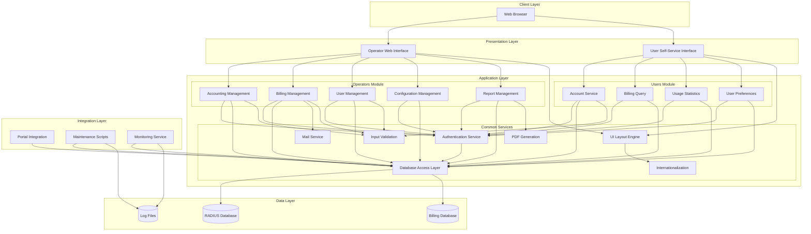
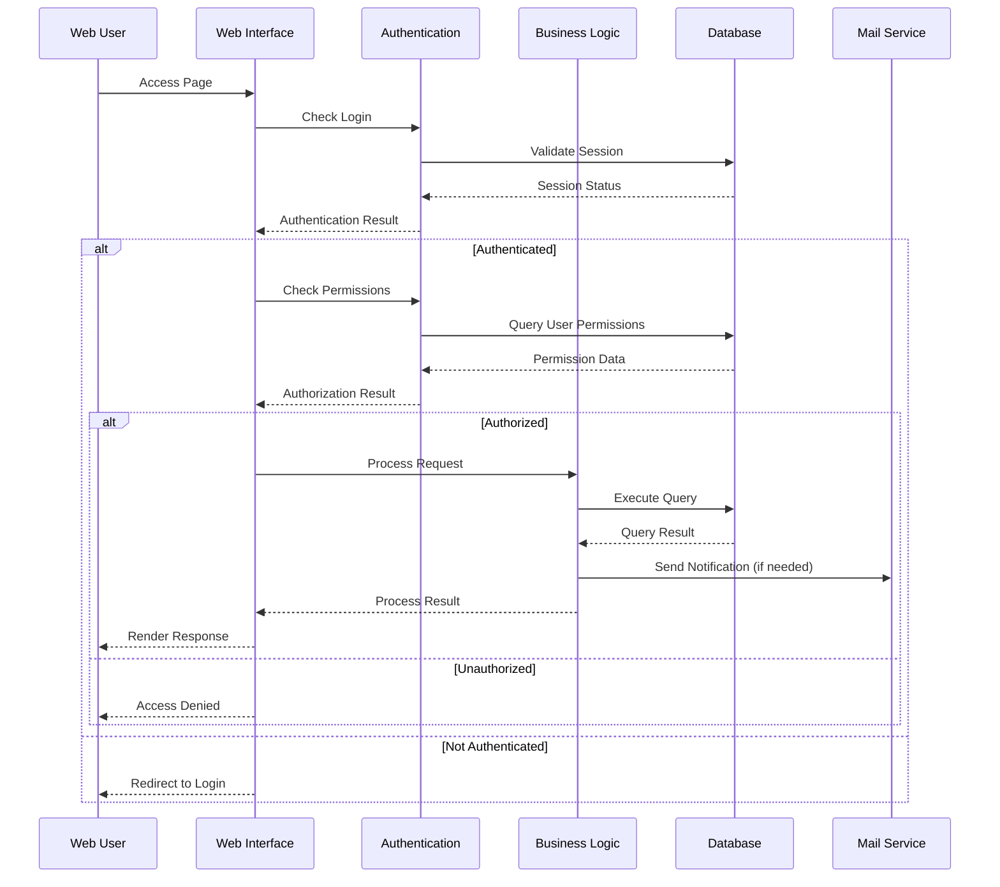
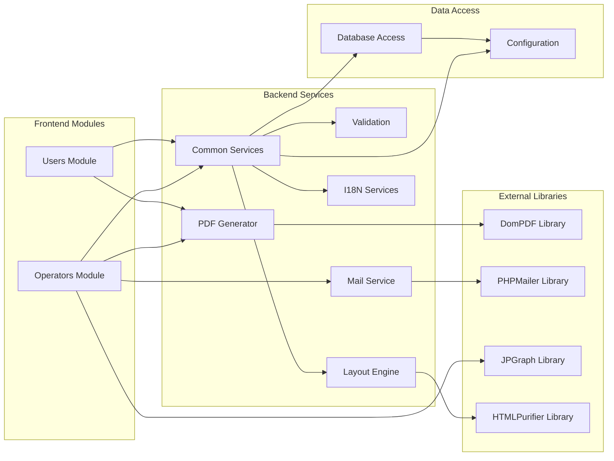

# daloradius-python 当前架构分析报告（Mermaid UML）

## 执行概述
本报告基于功能分析结果，使用 Mermaid UML 语言描述当前 daloradius-python 项目的架构设计，为Python重构提供准确的架构理解基础。

## 系统组件架构图

## 数据流架构图

## 模块依赖关系图

## 架构特征分析

### 分层架构模式
- **表示层**：Web界面直接包含PHP业务逻辑
- **业务层**：分散在各个页面文件中，缺乏统一抽象
- **数据访问层**：通过 common/includes 提供基础数据库操作
- **集成层**：contrib 目录提供第三方系统集成

### 横切关注点
- **安全性**：统一认证授权机制
- **国际化**：多语言支持
- **日志记录**：分布式日志处理
- **配置管理**：集中式配置读写

### 依赖管理
- **内部依赖**：通过文件包含实现模块依赖
- **外部依赖**：第三方库直接集成到项目中
- **配置依赖**：运行时配置读取机制

---

本架构分析为后续评审和Python架构设计提供准确的技术基础。