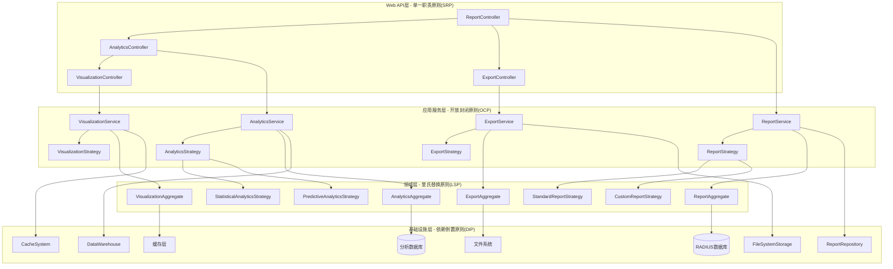

# 报表和分析模块架构设计 (Reporting & Analytics Module Design)

## 模块概述 (Module Overview)

报表和分析模块是daloRADIUS系统的业务智能核心，负责将RADIUS系统产生的大量计费和认证数据转化为有价值的业务洞察。本模块遵循SOLID原则设计，注重抽象层的设计，提供可扩展的报表生成、数据分析和可视化能力。

### 核心职责 (Core Responsibilities)
- **数据聚合与统计**: 多维度的数据汇总和统计分析
- **报表生成**: 标准化和自定义报表的生成与导出
- **数据可视化**: 图表、图形和仪表板的展示
- **业务智能**: 趋势分析、异常检测和预测分析
- **决策支持**: 为运营决策提供数据支撑

## 一、架构设计 (Architecture Design)

### SOLID原则应用



### 核心接口定义 (Core Interface Definitions)

**报表服务接口** (遵循SRP - 单一职责原则):
```python
class ReportService:
    """报表服务 - 单一职责：报表生成和管理的业务逻辑协调"""
    
    def generate_standard_report(self, report_type: ReportType, parameters: ReportParameters, operator: str) -> Report:
        """生成标准报表 - 基于预定义模板的报表生成"""
        
    def generate_custom_report(self, query_definition: QueryDefinition, operator: str) -> Report:
        """生成自定义报表 - 基于用户定义的查询条件"""
        
    def schedule_report(self, report_config: ReportConfig, schedule: ScheduleInfo, operator: str) -> ScheduledReport:
        """调度报表 - 定时自动生成和分发报表"""
        
    def get_report_history(self, report_id: str, time_range: TimeRange) -> List[ReportExecution]:
        """获取报表历史 - 报表执行记录和版本管理"""
        
    def validate_report_parameters(self, report_type: ReportType, parameters: ReportParameters) -> ValidationResult:
        """验证报表参数 - 确保报表参数的有效性和合理性"""

class AnalyticsService:
    """分析服务 - 单一职责：数据分析和洞察的业务逻辑协调"""
    
    def perform_statistical_analysis(self, dataset: Dataset, analysis_type: AnalysisType) -> AnalysisResult:
        """执行统计分析 - 描述性统计、相关性分析等"""
        
    def detect_anomalies(self, metric: Metric, detection_config: AnomalyDetectionConfig) -> List[Anomaly]:
        """异常检测 - 基于统计和机器学习的异常识别"""
        
    def generate_insights(self, analysis_context: AnalysisContext) -> List[Insight]:
        """生成业务洞察 - 基于数据分析的业务建议"""
        
    def perform_trend_analysis(self, metric: Metric, time_period: TimePeriod) -> TrendAnalysis:
        """趋势分析 - 时间序列分析和趋势预测"""
        
    def create_analytics_dashboard(self, dashboard_config: DashboardConfig, operator: str) -> Dashboard:
        """创建分析仪表板 - 多维度的实时分析展示"""

class ExportService:
    """导出服务 - 单一职责：数据导出和格式转换的业务逻辑协调"""
    
    def export_to_csv(self, data: DataSet, export_config: CSVExportConfig) -> ExportResult:
        """导出为CSV - 结构化数据的表格导出"""
        
    def export_to_pdf(self, report: Report, pdf_config: PDFExportConfig) -> ExportResult:
        """导出为PDF - 格式化报表的文档导出"""
        
    def export_to_excel(self, data: DataSet, excel_config: ExcelExportConfig) -> ExportResult:
        """导出为Excel - 多表格和图表的复合导出"""
        
    def export_to_api(self, data: DataSet, api_config: APIExportConfig) -> ExportResult:
        """导出到API - 实时数据接口和集成"""
        
    def schedule_export(self, export_config: ExportConfig, schedule: ScheduleInfo) -> ScheduledExport:
        """调度导出 - 定时自动导出和分发"""

class VisualizationService:
    """可视化服务 - 单一职责：数据可视化的业务逻辑协调"""
    
    def create_chart(self, chart_config: ChartConfig, data: DataSet) -> Chart:
        """创建图表 - 各种类型图表的生成"""
        
    def create_dashboard(self, dashboard_config: DashboardConfig, widgets: List[Widget]) -> Dashboard:
        """创建仪表板 - 多组件的综合展示面板"""
        
    def render_real_time_chart(self, chart_id: str, stream_config: StreamConfig) -> RealTimeChart:
        """渲染实时图表 - 动态数据的实时可视化"""
        
    def generate_infographic(self, infographic_config: InfographicConfig, data: DataSet) -> Infographic:
        """生成信息图 - 直观的数据故事展示"""
        
    def customize_visualization_theme(self, theme_config: ThemeConfig, operator: str) -> VisualizationTheme:
        """定制可视化主题 - 品牌化和个性化的视觉风格"""
```

**报表策略接口** (遵循OCP - 开放封闭原则):
```python
class ReportStrategy(ABC):
    """报表策略抽象 - 开放扩展：支持不同类型报表的生成策略"""
    
    @abstractmethod
    def generate_report(self, parameters: ReportParameters) -> ReportData:
        """生成报表数据 - 扩展点：实现具体报表类型的数据生成逻辑"""
        
    @abstractmethod
    def validate_parameters(self, parameters: ReportParameters) -> ValidationResult:
        """验证参数 - 扩展点：实现具体报表的参数验证规则"""
        
    @abstractmethod
    def get_supported_formats(self) -> List[ExportFormat]:
        """支持的导出格式 - 扩展点：定义报表支持的输出格式"""
        
    @abstractmethod
    def get_report_metadata(self) -> ReportMetadata:
        """报表元数据 - 扩展点：提供报表的描述和配置信息"""

# 用户使用情况报表策略
class UserUsageReportStrategy(ReportStrategy):
    def generate_report(self, parameters: ReportParameters) -> ReportData:
        """生成用户使用情况报表"""
        
        # 验证参数
        validation_result = self.validate_parameters(parameters)
        if not validation_result.is_valid:
            raise InvalidParametersError(validation_result.error_message)
        
        # 构建查询条件
        query_builder = QueryBuilder()
        
        # 时间范围过滤
        if parameters.start_date and parameters.end_date:
            query_builder.add_date_range_filter('AcctStartTime', parameters.start_date, parameters.end_date)
        
        # 用户过滤
        if parameters.username:
            query_builder.add_like_filter('username', parameters.username)
        
        # 数据聚合
        aggregations = [
            Aggregation('username', AggregationType.GROUP_BY),
            Aggregation('AcctSessionTime', AggregationType.SUM, alias='total_session_time'),
            Aggregation('AcctInputOctets', AggregationType.SUM, alias='total_upload'),
            Aggregation('AcctOutputOctets', AggregationType.SUM, alias='total_download'),
            Aggregation('RadAcctId', AggregationType.COUNT, alias='session_count')
        ]
        query_builder.add_aggregations(aggregations)
        
        # 排序
        query_builder.add_order_by('total_session_time', OrderDirection.DESC)
        
        # 执行查询
        query = query_builder.build()
        raw_data = self._data_repository.execute_query(query)
        
        # 数据处理和转换
        processed_data = self._process_usage_data(raw_data, parameters)
        
        # 计算统计指标
        statistics = self._calculate_usage_statistics(processed_data)
        
        # 构建报表数据
        report_data = ReportData(
            title="用户使用情况报表",
            description=f"时间范围: {parameters.start_date} 至 {parameters.end_date}",
            headers=['用户名', '总在线时长', '上传流量', '下载流量', '会话次数', '平均会话时长'],
            rows=processed_data,
            statistics=statistics,
            metadata=self.get_report_metadata(),
            generation_time=datetime.utcnow()
        )
        
        return report_data
    
    def validate_parameters(self, parameters: ReportParameters) -> ValidationResult:
        """验证用户使用报表参数"""
        errors = []
        
        # 验证时间范围
        if parameters.start_date and parameters.end_date:
            if parameters.start_date > parameters.end_date:
                errors.append("开始日期不能晚于结束日期")
            
            # 检查时间范围是否过大
            date_diff = (parameters.end_date - parameters.start_date).days
            if date_diff > 365:
                errors.append("查询时间范围不能超过365天")
        
        # 验证用户名格式
        if parameters.username and len(parameters.username) > 64:
            errors.append("用户名长度不能超过64个字符")
        
        # 验证分页参数
        if parameters.page_size and (parameters.page_size < 1 or parameters.page_size > 1000):
            errors.append("页面大小必须在1-1000之间")
        
        if errors:
            return ValidationResult.failure("; ".join(errors))
        
        return ValidationResult.success()
    
    def get_supported_formats(self) -> List[ExportFormat]:
        return [
            ExportFormat.CSV,
            ExportFormat.PDF,
            ExportFormat.EXCEL,
            ExportFormat.JSON
        ]
    
    def get_report_metadata(self) -> ReportMetadata:
        return ReportMetadata(
            name="user_usage_report",
            display_name="用户使用情况报表",
            description="统计用户的在线时长、流量使用和会话信息",
            category=ReportCategory.USAGE_ANALYSIS,
            tags=['用户', '使用情况', '流量', '会话'],
            parameters=[
                ParameterDefinition('start_date', ParameterType.DATE, required=False, description='开始日期'),
                ParameterDefinition('end_date', ParameterType.DATE, required=False, description='结束日期'),
                ParameterDefinition('username', ParameterType.STRING, required=False, description='用户名过滤')
            ],
            estimated_execution_time=EstimatedTime(5, TimeUnit.SECONDS),
            data_sources=['radacct']
        )
    
    def _process_usage_data(self, raw_data: List[Dict], parameters: ReportParameters) -> List[List]:
        """处理和转换使用数据"""
        processed_rows = []
        
        for row in raw_data:
            # 格式化时长显示
            total_seconds = int(row.get('total_session_time', 0))
            formatted_duration = self._format_duration(total_seconds)
            
            # 格式化流量显示
            upload_bytes = int(row.get('total_upload', 0))
            download_bytes = int(row.get('total_download', 0))
            formatted_upload = self._format_bytes(upload_bytes)
            formatted_download = self._format_bytes(download_bytes)
            
            # 计算平均会话时长
            session_count = int(row.get('session_count', 1))
            avg_session_time = total_seconds / session_count if session_count > 0 else 0
            formatted_avg_duration = self._format_duration(avg_session_time)
            
            processed_row = [
                row.get('username', ''),
                formatted_duration,
                formatted_upload,
                formatted_download,
                session_count,
                formatted_avg_duration
            ]
            processed_rows.append(processed_row)
        
        return processed_rows
    
    def _calculate_usage_statistics(self, processed_data: List[List]) -> ReportStatistics:
        """计算使用统计指标"""
        if not processed_data:
            return ReportStatistics()
        
        total_users = len(processed_data)
        total_sessions = sum(int(row[4]) for row in processed_data)
        
        # 计算流量统计（需要从原始数据重新计算）
        # 这里简化处理，实际应该从原始数据计算
        
        statistics = ReportStatistics(
            total_records=total_users,
            summary_metrics={
                'total_users': total_users,
                'total_sessions': total_sessions,
                'avg_sessions_per_user': total_sessions / total_users if total_users > 0 else 0
            }
        )
        
        return statistics

# 财务收入报表策略
class FinancialRevenueReportStrategy(ReportStrategy):
    def generate_report(self, parameters: ReportParameters) -> ReportData:
        """生成财务收入报表"""
        
        # 验证参数
        validation_result = self.validate_parameters(parameters)
        if not validation_result.is_valid:
            raise InvalidParametersError(validation_result.error_message)
        
        # 构建复合查询（涉及多个表）
        query_builder = ComplexQueryBuilder()
        
        # 主表：支付记录
        query_builder.from_table('dalopayments', alias='pay')
        
        # 关联表：用户信息
        query_builder.left_join('dalouserinfo', 'ui', 'pay.username = ui.username')
        
        # 关联表：计费计划
        query_builder.left_join('dalobillingplans', 'bp', 'pay.planId = bp.id')
        
        # 时间范围过滤
        if parameters.start_date and parameters.end_date:
            query_builder.add_date_range_filter('pay.date', parameters.start_date, parameters.end_date)
        
        # 支付状态过滤
        if hasattr(parameters, 'payment_status') and parameters.payment_status:
            query_builder.add_equals_filter('pay.status', parameters.payment_status)
        
        # 收入聚合
        aggregations = [
            Aggregation('pay.amount', AggregationType.SUM, alias='total_revenue'),
            Aggregation('pay.id', AggregationType.COUNT, alias='payment_count'),
            Aggregation('pay.amount', AggregationType.AVG, alias='avg_payment'),
            GroupByDate('pay.date', DateGroupType.MONTH, alias='payment_month')
        ]
        query_builder.add_aggregations(aggregations)
        
        # 按月份分组
        query_builder.add_group_by('payment_month')
        query_builder.add_order_by('payment_month', OrderDirection.ASC)
        
        # 执行查询
        query = query_builder.build()
        raw_data = self._data_repository.execute_query(query)
        
        # 数据处理
        processed_data = self._process_financial_data(raw_data, parameters)
        
        # 计算财务指标
        financial_metrics = self._calculate_financial_metrics(processed_data)
        
        # 构建报表数据
        report_data = ReportData(
            title="财务收入报表",
            description=f"收入统计分析 - 时间范围: {parameters.start_date} 至 {parameters.end_date}",
            headers=['月份', '总收入', '支付笔数', '平均支付金额', '收入增长率'],
            rows=processed_data,
            statistics=financial_metrics,
            metadata=self.get_report_metadata(),
            generation_time=datetime.utcnow(),
            charts=[
                self._create_revenue_trend_chart(processed_data),
                self._create_payment_distribution_chart(processed_data)
            ]
        )
        
        return report_data
    
    def _create_revenue_trend_chart(self, data: List[List]) -> ChartDefinition:
        """创建收入趋势图表"""
        return ChartDefinition(
            type=ChartType.LINE_CHART,
            title="月度收入趋势",
            x_axis_label="月份",
            y_axis_label="收入金额",
            data_series=[
                DataSeries(
                    name="总收入",
                    data=[float(row[1]) for row in data],
                    labels=[row[0] for row in data]
                )
            ],
            style=ChartStyle(
                colors=['#007bff'],
                width=800,
                height=400
            )
        )

# 网络设备性能报表策略
class NetworkDevicePerformanceReportStrategy(ReportStrategy):
    def generate_report(self, parameters: ReportParameters) -> ReportData:
        """生成网络设备性能报表"""
        
        # 验证参数
        validation_result = self.validate_parameters(parameters)
        if not validation_result.is_valid:
            raise InvalidParametersError(validation_result.error_message)
        
        # 多数据源查询
        queries = [
            self._build_nas_performance_query(parameters),
            self._build_hotspot_performance_query(parameters),
            self._build_session_quality_query(parameters)
        ]
        
        # 并行执行查询
        query_results = self._data_repository.execute_parallel_queries(queries)
        
        # 合并和关联数据
        consolidated_data = self._consolidate_performance_data(query_results)
        
        # 性能分析
        performance_analysis = self._analyze_device_performance(consolidated_data)
        
        # 构建报表数据
        report_data = ReportData(
            title="网络设备性能报表",
            description=f"设备性能分析 - 时间范围: {parameters.start_date} 至 {parameters.end_date}",
            headers=['设备名称', '设备类型', '在线用户数', '流量负载', '会话成功率', '平均响应时间', '性能评级'],
            rows=consolidated_data,
            statistics=performance_analysis,
            metadata=self.get_report_metadata(),
            generation_time=datetime.utcnow(),
            charts=[
                self._create_device_load_chart(consolidated_data),
                self._create_performance_heatmap(consolidated_data)
            ]
        )
        
        return report_data
```

**分析策略接口** (遵循OCP原则):
```python
class AnalyticsStrategy(ABC):
    """分析策略抽象 - 开放扩展：支持不同类型的数据分析算法"""
    
    @abstractmethod
    def analyze(self, dataset: Dataset, context: AnalysisContext) -> AnalysisResult:
        """执行分析 - 扩展点：实现具体的分析算法"""
        
    @abstractmethod
    def get_required_data_fields(self) -> List[str]:
        """所需数据字段 - 扩展点：定义分析所需的数据字段"""
        
    @abstractmethod
    def get_analysis_metadata(self) -> AnalysisMetadata:
        """分析元数据 - 扩展点：提供分析的描述和配置信息"""

# 统计分析策略
class StatisticalAnalyticsStrategy(AnalyticsStrategy):
    def analyze(self, dataset: Dataset, context: AnalysisContext) -> AnalysisResult:
        """执行统计分析"""
        
        # 数据预处理
        cleaned_data = self._preprocess_data(dataset)
        
        # 描述性统计
        descriptive_stats = self._calculate_descriptive_statistics(cleaned_data)
        
        # 相关性分析
        correlation_analysis = self._perform_correlation_analysis(cleaned_data, context)
        
        # 分布分析
        distribution_analysis = self._analyze_distributions(cleaned_data)
        
        # 异常值检测
        outliers = self._detect_statistical_outliers(cleaned_data)
        
        # 构建分析结果
        analysis_result = AnalysisResult(
            analysis_type=AnalysisType.STATISTICAL,
            dataset_info=dataset.get_info(),
            findings={
                'descriptive_statistics': descriptive_stats,
                'correlations': correlation_analysis,
                'distributions': distribution_analysis,
                'outliers': outliers
            },
            insights=self._generate_statistical_insights(descriptive_stats, correlation_analysis),
            recommendations=self._generate_statistical_recommendations(outliers, distribution_analysis),
            confidence_level=0.95,
            execution_time=datetime.utcnow(),
            metadata=self.get_analysis_metadata()
        )
        
        return analysis_result
    
    def _calculate_descriptive_statistics(self, data: CleanedDataset) -> DescriptiveStatistics:
        """计算描述性统计指标"""
        numeric_fields = data.get_numeric_fields()
        stats = {}
        
        for field in numeric_fields:
            field_data = data.get_field_values(field)
            stats[field] = {
                'count': len(field_data),
                'mean': statistics.mean(field_data),
                'median': statistics.median(field_data),
                'mode': statistics.mode(field_data) if field_data else None,
                'std_dev': statistics.stdev(field_data) if len(field_data) > 1 else 0,
                'variance': statistics.variance(field_data) if len(field_data) > 1 else 0,
                'min': min(field_data),
                'max': max(field_data),
                'range': max(field_data) - min(field_data),
                'quartiles': self._calculate_quartiles(field_data),
                'skewness': self._calculate_skewness(field_data),
                'kurtosis': self._calculate_kurtosis(field_data)
            }
        
        return DescriptiveStatistics(stats)
    
    def _perform_correlation_analysis(self, data: CleanedDataset, context: AnalysisContext) -> CorrelationAnalysis:
        """执行相关性分析"""
        numeric_fields = data.get_numeric_fields()
        correlation_matrix = {}
        
        # 计算皮尔逊相关系数
        for field1 in numeric_fields:
            correlation_matrix[field1] = {}
            for field2 in numeric_fields:
                values1 = data.get_field_values(field1)
                values2 = data.get_field_values(field2)
                
                if len(values1) > 1 and len(values2) > 1:
                    correlation_coeff = self._calculate_pearson_correlation(values1, values2)
                    p_value = self._calculate_correlation_significance(values1, values2)
                    
                    correlation_matrix[field1][field2] = {
                        'coefficient': correlation_coeff,
                        'p_value': p_value,
                        'significance': 'significant' if p_value < 0.05 else 'not_significant',
                        'strength': self._interpret_correlation_strength(correlation_coeff)
                    }
        
        # 识别强相关关系
        strong_correlations = self._identify_strong_correlations(correlation_matrix)
        
        return CorrelationAnalysis(
            correlation_matrix=correlation_matrix,
            strong_correlations=strong_correlations,
            methodology='pearson'
        )

# 预测分析策略
class PredictiveAnalyticsStrategy(AnalyticsStrategy):
    def analyze(self, dataset: Dataset, context: AnalysisContext) -> AnalysisResult:
        """执行预测分析"""
        
        # 时间序列数据准备
        time_series_data = self._prepare_time_series_data(dataset, context)
        
        # 趋势分析
        trend_analysis = self._perform_trend_analysis(time_series_data)
        
        # 季节性分析
        seasonality_analysis = self._analyze_seasonality(time_series_data)
        
        # 预测建模
        prediction_models = self._build_prediction_models(time_series_data, context)
        
        # 生成预测
        predictions = self._generate_predictions(prediction_models, context.forecast_horizon)
        
        # 模型评估
        model_evaluation = self._evaluate_models(prediction_models, time_series_data)
        
        # 构建分析结果
        analysis_result = AnalysisResult(
            analysis_type=AnalysisType.PREDICTIVE,
            dataset_info=dataset.get_info(),
            findings={
                'trend_analysis': trend_analysis,
                'seasonality': seasonality_analysis,
                'predictions': predictions,
                'model_performance': model_evaluation
            },
            insights=self._generate_predictive_insights(trend_analysis, predictions),
            recommendations=self._generate_predictive_recommendations(predictions, model_evaluation),
            confidence_level=model_evaluation.confidence_level,
            execution_time=datetime.utcnow(),
            metadata=self.get_analysis_metadata()
        )
        
        return analysis_result
    
    def _build_prediction_models(self, time_series_data: TimeSeriesData, context: AnalysisContext) -> List[PredictionModel]:
        """构建预测模型"""
        models = []
        
        # ARIMA模型
        arima_model = self._build_arima_model(time_series_data)
        models.append(arima_model)
        
        # 指数平滑模型
        exponential_smoothing_model = self._build_exponential_smoothing_model(time_series_data)
        models.append(exponential_smoothing_model)
        
        # 线性回归模型（如果有外部变量）
        if context.external_variables:
            linear_regression_model = self._build_linear_regression_model(time_series_data, context.external_variables)
            models.append(linear_regression_model)
        
        # 神经网络模型（对于复杂模式）
        if len(time_series_data) > 100:  # 足够的数据用于深度学习
            neural_network_model = self._build_neural_network_model(time_series_data)
            models.append(neural_network_model)
        
        return models

# 异常检测分析策略
class AnomalyDetectionStrategy(AnalyticsStrategy):
    def analyze(self, dataset: Dataset, context: AnalysisContext) -> AnalysisResult:
        """执行异常检测分析"""
        
        # 数据预处理
        preprocessed_data = self._preprocess_for_anomaly_detection(dataset)
        
        # 统计方法异常检测
        statistical_anomalies = self._detect_statistical_anomalies(preprocessed_data)
        
        # 机器学习方法异常检测
        ml_anomalies = self._detect_ml_anomalies(preprocessed_data, context)
        
        # 时间序列异常检测
        time_series_anomalies = self._detect_time_series_anomalies(preprocessed_data)
        
        # 异常聚类分析
        anomaly_clusters = self._cluster_anomalies(statistical_anomalies + ml_anomalies + time_series_anomalies)
        
        # 异常影响分析
        impact_analysis = self._analyze_anomaly_impact(anomaly_clusters, context)
        
        # 构建分析结果
        analysis_result = AnalysisResult(
            analysis_type=AnalysisType.ANOMALY_DETECTION,
            dataset_info=dataset.get_info(),
            findings={
                'statistical_anomalies': statistical_anomalies,
                'ml_anomalies': ml_anomalies,
                'time_series_anomalies': time_series_anomalies,
                'anomaly_clusters': anomaly_clusters,
                'impact_analysis': impact_analysis
            },
            insights=self._generate_anomaly_insights(anomaly_clusters, impact_analysis),
            recommendations=self._generate_anomaly_recommendations(anomaly_clusters),
            confidence_level=0.90,
            execution_time=datetime.utcnow(),
            metadata=self.get_analysis_metadata()
        )
        
        return analysis_result
```

**聚合根设计** (遵循DDD):
```python
class ReportAggregate:
    """报表聚合根 - 封装报表生成和管理的所有业务不变性"""
    
    def __init__(self, report_type: str, created_by: str):
        self.report_id: Optional[str] = None
        self.report_type = report_type
        self.title: Optional[str] = None
        self.description: Optional[str] = None
        self.parameters: Optional[ReportParameters] = None
        self.status = ReportStatus.DRAFT
        self.data: Optional[ReportData] = None
        self.execution_history: List[ReportExecution] = []
        self.schedule: Optional[ReportSchedule] = None
        self.access_control: Optional[AccessControl] = None
        self._domain_events: List[DomainEvent] = []
        self._created_by = created_by
        self._created_at = datetime.utcnow()
        self._last_modified_at = datetime.utcnow()
    
    def configure_parameters(self, parameters: ReportParameters, operator: str) -> None:
        """配置报表参数 - 确保参数的有效性和完整性"""
        
        # 验证参数完整性
        validation_result = self._validate_report_parameters(parameters)
        if not validation_result.is_valid:
            raise InvalidReportParametersError(validation_result.error_message)
        
        # 检查参数变更影响
        if self.parameters and self._has_significant_parameter_changes(self.parameters, parameters):
            # 参数发生重大变更，需要重新生成报表
            self.status = ReportStatus.DRAFT
            self._clear_cached_data()
        
        old_parameters = self.parameters
        self.parameters = parameters
        self._last_modified_at = datetime.utcnow()
        
        self._domain_events.append(ReportParametersConfiguredEvent(
            report_id=self.report_id,
            report_type=self.report_type,
            old_parameters=old_parameters,
            new_parameters=parameters,
            operator=operator
        ))
    
    def execute_report_generation(self, strategy: ReportStrategy, operator: str) -> ReportExecution:
        """执行报表生成 - 协调报表生成过程"""
        
        if self.status != ReportStatus.DRAFT and self.status != ReportStatus.SCHEDULED:
            raise InvalidReportStateError(f"Cannot execute report in status: {self.status}")
        
        # 创建执行记录
        execution = ReportExecution(
            execution_id=str(uuid.uuid4()),
            report_id=self.report_id,
            start_time=datetime.utcnow(),
            operator=operator,
            status=ExecutionStatus.RUNNING
        )
        
        try:
            # 更新报表状态
            self.status = ReportStatus.GENERATING
            
            # 执行报表生成
            report_data = strategy.generate_report(self.parameters)
            
            # 验证生成的数据
            data_validation = self._validate_generated_data(report_data)
            if not data_validation.is_valid:
                raise ReportDataValidationError(data_validation.error_message)
            
            # 更新报表数据
            self.data = report_data
            self.status = ReportStatus.COMPLETED
            
            # 完成执行记录
            execution.end_time = datetime.utcnow()
            execution.status = ExecutionStatus.SUCCESS
            execution.data_summary = report_data.get_summary()
            
        except Exception as e:
            # 处理执行失败
            self.status = ReportStatus.ERROR
            execution.end_time = datetime.utcnow()
            execution.status = ExecutionStatus.FAILED
            execution.error_message = str(e)
            
            self._domain_events.append(ReportGenerationFailedEvent(
                report_id=self.report_id,
                execution_id=execution.execution_id,
                error_message=str(e),
                operator=operator
            ))
            
            raise
        
        # 添加到执行历史
        self.execution_history.append(execution)
        
        # 发布成功事件
        self._domain_events.append(ReportGeneratedEvent(
            report_id=self.report_id,
            execution_id=execution.execution_id,
            report_type=self.report_type,
            data_summary=execution.data_summary,
            execution_time=execution.get_duration(),
            operator=operator
        ))
        
        return execution
    
    def schedule_automatic_generation(self, schedule: ReportSchedule, operator: str) -> None:
        """调度自动生成 - 设置定时报表生成"""
        
        # 验证调度配置
        schedule_validation = self._validate_schedule_configuration(schedule)
        if not schedule_validation.is_valid:
            raise InvalidScheduleConfigurationError(schedule_validation.error_message)
        
        # 检查调度冲突
        if self.schedule and self.schedule.is_active:
            raise ScheduleConflictError("Report already has an active schedule")
        
        old_schedule = self.schedule
        self.schedule = schedule
        self.status = ReportStatus.SCHEDULED
        
        self._domain_events.append(ReportScheduledEvent(
            report_id=self.report_id,
            old_schedule=old_schedule,
            new_schedule=schedule,
            operator=operator
        ))
    
    def configure_access_control(self, access_control: AccessControl, operator: str) -> None:
        """配置访问控制 - 设置报表的访问权限"""
        
        # 验证访问控制配置
        access_validation = self._validate_access_control(access_control)
        if not access_validation.is_valid:
            raise InvalidAccessControlError(access_validation.error_message)
        
        old_access_control = self.access_control
        self.access_control = access_control
        
        self._domain_events.append(ReportAccessControlConfiguredEvent(
            report_id=self.report_id,
            old_access_control=old_access_control,
            new_access_control=access_control,
            operator=operator
        ))
    
    def export_report(self, export_format: ExportFormat, export_config: ExportConfig, operator: str) -> ExportResult:
        """导出报表 - 将报表转换为指定格式"""
        
        if self.status != ReportStatus.COMPLETED:
            raise ReportNotReadyError("Report must be completed before export")
        
        if not self.data:
            raise ReportDataMissingError("Report data is missing")
        
        # 检查导出权限
        if self.access_control and not self.access_control.can_export(operator):
            raise InsufficientPermissionsError("Operator does not have export permissions")
        
        # 执行导出
        export_result = self._perform_export(self.data, export_format, export_config)
        
        self._domain_events.append(ReportExportedEvent(
            report_id=self.report_id,
            export_format=export_format,
            export_size=export_result.file_size,
            operator=operator
        ))
        
        return export_result

class AnalyticsAggregate:
    """分析聚合根 - 封装数据分析和洞察生成的所有业务不变性"""
    
    def __init__(self, analysis_type: str, created_by: str):
        self.analysis_id: Optional[str] = None
        self.analysis_type = analysis_type
        self.title: Optional[str] = None
        self.description: Optional[str] = None
        self.dataset_info: Optional[DatasetInfo] = None
        self.analysis_config: Optional[AnalysisConfig] = None
        self.results: Optional[AnalysisResult] = None
        self.insights: List[Insight] = []
        self.recommendations: List[Recommendation] = []
        self.status = AnalysisStatus.DRAFT
        self.execution_history: List[AnalysisExecution] = []
        self._domain_events: List[DomainEvent] = []
        self._created_by = created_by
        self._created_at = datetime.utcnow()
    
    def configure_analysis(self, analysis_config: AnalysisConfig, operator: str) -> None:
        """配置分析参数 - 设置分析的配置和参数"""
        
        # 验证分析配置
        config_validation = self._validate_analysis_config(analysis_config)
        if not config_validation.is_valid:
            raise InvalidAnalysisConfigError(config_validation.error_message)
        
        old_config = self.analysis_config
        self.analysis_config = analysis_config
        self.status = AnalysisStatus.CONFIGURED
        
        self._domain_events.append(AnalysisConfiguredEvent(
            analysis_id=self.analysis_id,
            analysis_type=self.analysis_type,
            old_config=old_config,
            new_config=analysis_config,
            operator=operator
        ))
    
    def execute_analysis(self, strategy: AnalyticsStrategy, dataset: Dataset, operator: str) -> AnalysisExecution:
        """执行分析 - 协调数据分析过程"""
        
        if self.status != AnalysisStatus.CONFIGURED:
            raise InvalidAnalysisStateError(f"Cannot execute analysis in status: {self.status}")
        
        # 创建执行记录
        execution = AnalysisExecution(
            execution_id=str(uuid.uuid4()),
            analysis_id=self.analysis_id,
            start_time=datetime.utcnow(),
            operator=operator,
            status=ExecutionStatus.RUNNING
        )
        
        try:
            # 更新分析状态
            self.status = AnalysisStatus.RUNNING
            
            # 验证数据集
            dataset_validation = self._validate_dataset(dataset, strategy)
            if not dataset_validation.is_valid:
                raise InvalidDatasetError(dataset_validation.error_message)
            
            # 执行分析
            analysis_context = AnalysisContext(
                config=self.analysis_config,
                dataset_info=dataset.get_info(),
                execution_context=execution
            )
            
            analysis_result = strategy.analyze(dataset, analysis_context)
            
            # 验证分析结果
            result_validation = self._validate_analysis_result(analysis_result)
            if not result_validation.is_valid:
                raise AnalysisResultValidationError(result_validation.error_message)
            
            # 更新分析数据
            self.results = analysis_result
            self.insights = analysis_result.insights
            self.recommendations = analysis_result.recommendations
            self.dataset_info = dataset.get_info()
            self.status = AnalysisStatus.COMPLETED
            
            # 完成执行记录
            execution.end_time = datetime.utcnow()
            execution.status = ExecutionStatus.SUCCESS
            execution.result_summary = analysis_result.get_summary()
            
        except Exception as e:
            # 处理执行失败
            self.status = AnalysisStatus.ERROR
            execution.end_time = datetime.utcnow()
            execution.status = ExecutionStatus.FAILED
            execution.error_message = str(e)
            
            self._domain_events.append(AnalysisExecutionFailedEvent(
                analysis_id=self.analysis_id,
                execution_id=execution.execution_id,
                error_message=str(e),
                operator=operator
            ))
            
            raise
        
        # 添加到执行历史
        self.execution_history.append(execution)
        
        # 发布成功事件
        self._domain_events.append(AnalysisCompletedEvent(
            analysis_id=self.analysis_id,
            execution_id=execution.execution_id,
            analysis_type=self.analysis_type,
            insights_count=len(self.insights),
            recommendations_count=len(self.recommendations),
            execution_time=execution.get_duration(),
            operator=operator
        ))
        
        return execution
    
    def add_custom_insight(self, insight: Insight, operator: str) -> None:
        """添加自定义洞察 - 支持人工添加业务洞察"""
        
        # 验证洞察的有效性
        insight_validation = self._validate_insight(insight)
        if not insight_validation.is_valid:
            raise InvalidInsightError(insight_validation.error_message)
        
        # 检查洞察重复性
        if self._is_duplicate_insight(insight):
            raise DuplicateInsightError("Similar insight already exists")
        
        insight.id = str(uuid.uuid4())
        insight.created_by = operator
        insight.created_at = datetime.utcnow()
        insight.source = InsightSource.MANUAL
        
        self.insights.append(insight)
        
        self._domain_events.append(CustomInsightAddedEvent(
            analysis_id=self.analysis_id,
            insight_id=insight.id,
            insight_summary=insight.get_summary(),
            operator=operator
        ))
```

## 二、实施建议与技术债务清理 (Implementation Recommendations & Technical Debt)

### 迁移策略

**阶段1: 报表抽象层建立** (3-4周)
- 创建Report和Analytics聚合根
- 实现报表策略模式和分析策略模式
- 建立数据仓库和分析引擎框架

**阶段2: 标准报表现代化** (4-5周)
- 重构现有的rep-*页面为标准报表策略
- 实现高级数据聚合和统计分析
- 添加实时报表生成和缓存机制

**阶段3: 高级分析功能** (5-6周)
- 实现预测分析和异常检测功能
- 建立机器学习分析流水线
- 添加智能洞察和建议生成

**阶段4: 可视化和导出增强** (3-4周)
- 现代化图表和可视化组件
- 实现多格式导出和API集成
- 添加交互式仪表板功能

### 风险评估与缓解措施

**高风险**:
1. **数据质量问题**: 分析结果依赖于数据质量
   - 缓解: 数据清洗、验证、质量监控

2. **性能影响**: 复杂分析可能影响系统性能
   - 缓解: 异步处理、分布式计算、结果缓存

**中风险**:
3. **分析准确性**: 统计和预测分析的准确性要求
   - 缓解: 多模型验证、置信区间、专家审核

### 技术债务清理

**报表系统现代化**:
- 消除硬编码的SQL查询和报表逻辑
- 统一报表参数验证和数据处理
- 标准化报表格式和导出机制

**分析能力提升**:
- 建立专业的数据科学分析流水线
- 实现可解释的机器学习模型
- 添加分析结果的审计和版本控制

通过应用现代软件设计原则，报表和分析模块将成为daloRADIUS的重要价值创造中心，为运营决策提供强有力的数据支撑和业务洞察。