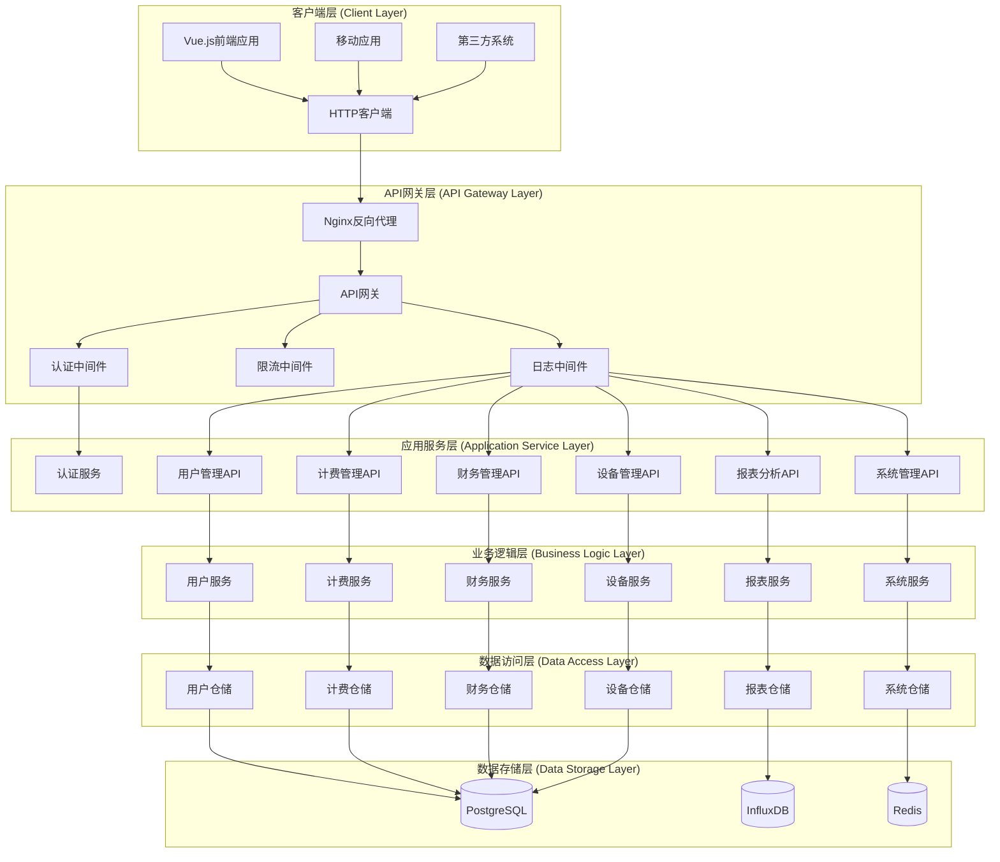
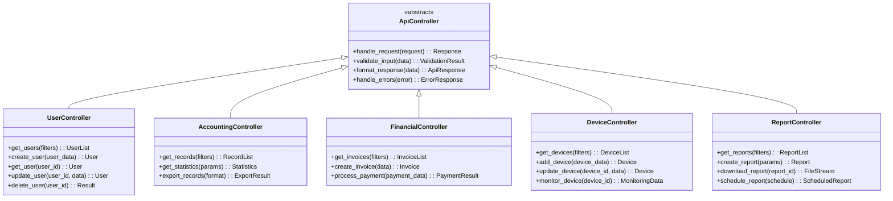
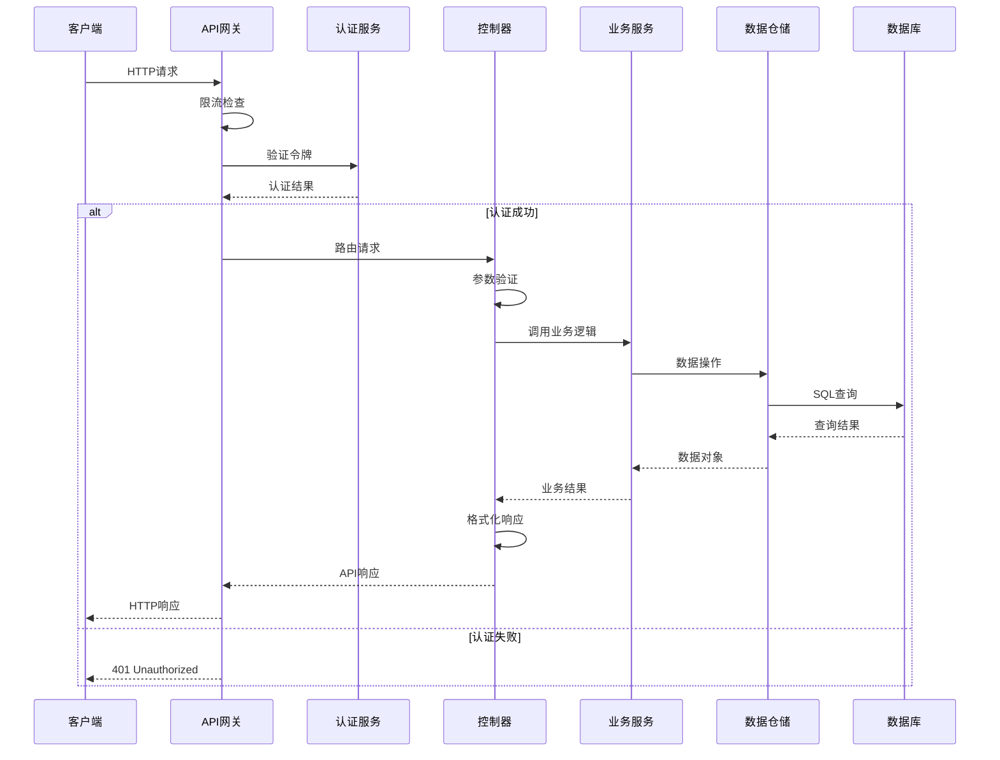
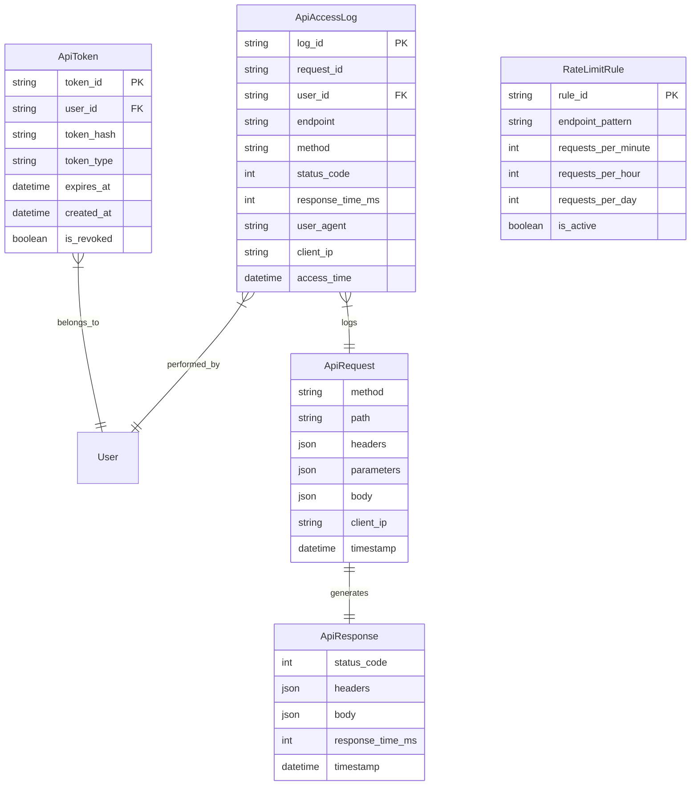

# daloRADIUS RESTful API 接口设计文档 (OpenAPI Specification)

## 模块概述 (Module Overview)

### 职责
RESTful API接口模块负责为daloRADIUS前后端分离架构提供统一、标准化的HTTP接口。该模块基于OpenAPI 3.0规范设计，遵循REST架构风格，为前端Vue.js应用和第三方系统提供完整的业务功能访问能力。

### 设计目标
- **标准化接口**: 遵循OpenAPI 3.0规范和RESTful设计原则
- **前后端分离**: 为Vue.js前端提供完整的数据和功能接口
- **安全可控**: 实现完整的认证授权和访问控制机制
- **高性能**: 支持分页、缓存、批量操作等性能优化
- **可扩展性**: 支持API版本管理和向后兼容

## 设计原则与模式 (Design Principles & Patterns)

### 原则应用
- **SRP**: 每个API端点专注于单一业务功能，职责明确
- **OCP**: 通过API版本管理支持功能扩展，不破坏现有接口
- **DIP**: API层依赖业务服务抽象，支持多种实现方式

### 设计模式
- **资源导向设计**: 以业务资源为中心的URL设计
- **分层架构**: API层、业务逻辑层、数据访问层的清晰分离
- **统一响应格式**: 标准化的成功和错误响应结构

## OpenAPI 3.0 接口规范 (OpenAPI 3.0 Specification)

```yaml
openapi: 3.0.3
info:
  title: daloRADIUS API
  description: |
    daloRADIUS网络接入管理平台的RESTful API接口
    
    本API提供完整的RADIUS管理功能，包括：
    - 用户管理和认证
    - 计费记录和统计
    - 财务管理和支付
    - 网络设备管理
    - 报表分析和数据可视化
    - 系统配置和集成
  version: 2.0.0
  contact:
    name: daloRADIUS API Support
    email: support@daloradius.com
  license:
    name: GPL v2
    url: https://www.gnu.org/licenses/gpl-2.0.html

servers:
  - url: https://api.daloradius.com/v2
    description: Production server
  - url: https://staging-api.daloradius.com/v2
    description: Staging server
  - url: http://localhost:8000/api/v2
    description: Development server

security:
  - bearerAuth: []
  - apiKeyAuth: []

components:
  securitySchemes:
    bearerAuth:
      type: http
      scheme: bearer
      bearerFormat: JWT
    apiKeyAuth:
      type: apiKey
      in: header
      name: X-API-Key

  schemas:
    # 通用响应结构
    ApiResponse:
      type: object
      properties:
        success:
          type: boolean
          description: 请求是否成功
        message:
          type: string
          description: 响应消息
        data:
          type: object
          description: 响应数据
        errors:
          type: array
          items:
            $ref: '#/components/schemas/ApiError'
        meta:
          $ref: '#/components/schemas/ResponseMeta'
      required:
        - success
        - message

    ApiError:
      type: object
      properties:
        code:
          type: string
          description: 错误代码
        field:
          type: string
          description: 错误相关字段
        message:
          type: string
          description: 错误详细描述
      required:
        - code
        - message

    ResponseMeta:
      type: object
      properties:
        timestamp:
          type: string
          format: date-time
          description: 响应时间戳
        request_id:
          type: string
          description: 请求追踪ID
        pagination:
          $ref: '#/components/schemas/Pagination'

    Pagination:
      type: object
      properties:
        page:
          type: integer
          minimum: 1
          description: 当前页码
        page_size:
          type: integer
          minimum: 1
          maximum: 100
          description: 每页记录数
        total_pages:
          type: integer
          description: 总页数
        total_records:
          type: integer
          description: 总记录数
        has_next:
          type: boolean
          description: 是否有下一页
        has_previous:
          type: boolean
          description: 是否有上一页

    # 用户管理相关模型
    User:
      type: object
      properties:
        id:
          type: string
          description: 用户唯一标识
        username:
          type: string
          description: 用户名
        email:
          type: string
          format: email
          description: 邮箱地址
        first_name:
          type: string
          description: 名字
        last_name:
          type: string
          description: 姓氏
        status:
          type: string
          enum: [active, inactive, suspended, expired]
          description: 用户状态
        created_at:
          type: string
          format: date-time
          description: 创建时间
        updated_at:
          type: string
          format: date-time
          description: 更新时间
        profile:
          $ref: '#/components/schemas/UserProfile'
      required:
        - id
        - username
        - status

    UserProfile:
      type: object
      properties:
        phone:
          type: string
          description: 电话号码
        address:
          type: string
          description: 地址
        organization:
          type: string
          description: 组织机构
        notes:
          type: string
          description: 备注信息

    UserCreateRequest:
      type: object
      properties:
        username:
          type: string
          minLength: 3
          maxLength: 64
          description: 用户名
        password:
          type: string
          minLength: 8
          description: 密码
        email:
          type: string
          format: email
          description: 邮箱地址
        first_name:
          type: string
          description: 名字
        last_name:
          type: string
          description: 姓氏
        profile:
          $ref: '#/components/schemas/UserProfile'
        groups:
          type: array
          items:
            type: string
          description: 用户组列表
      required:
        - username
        - password

    # 计费记录相关模型
    AccountingRecord:
      type: object
      properties:
        id:
          type: string
          description: 记录唯一标识
        username:
          type: string
          description: 用户名
        session_id:
          type: string
          description: 会话ID
        nas_ip_address:
          type: string
          format: ipv4
          description: NAS设备IP地址
        nas_port:
          type: integer
          description: NAS端口
        framed_ip_address:
          type: string
          format: ipv4
          description: 用户分配IP地址
        calling_station_id:
          type: string
          description: 客户端MAC地址
        called_station_id:
          type: string
          description: NAS设备MAC地址
        start_time:
          type: string
          format: date-time
          description: 会话开始时间
        stop_time:
          type: string
          format: date-time
          description: 会话结束时间
        session_time:
          type: integer
          description: 会话时长(秒)
        input_octets:
          type: integer
          format: int64
          description: 上传字节数
        output_octets:
          type: integer
          format: int64
          description: 下载字节数
        terminate_cause:
          type: string
          description: 会话终止原因
      required:
        - id
        - username
        - nas_ip_address

    # 财务管理相关模型
    Invoice:
      type: object
      properties:
        id:
          type: string
          description: 发票唯一标识
        invoice_number:
          type: string
          description: 发票号码
        user_id:
          type: string
          description: 用户ID
        amount:
          type: number
          format: decimal
          description: 发票金额
        currency:
          type: string
          description: 货币代码
        status:
          type: string
          enum: [draft, sent, paid, overdue, cancelled]
          description: 发票状态
        issue_date:
          type: string
          format: date
          description: 开票日期
        due_date:
          type: string
          format: date
          description: 到期日期
        paid_date:
          type: string
          format: date
          description: 支付日期
        items:
          type: array
          items:
            $ref: '#/components/schemas/InvoiceItem'
        notes:
          type: string
          description: 备注
      required:
        - id
        - invoice_number
        - amount
        - status

    InvoiceItem:
      type: object
      properties:
        description:
          type: string
          description: 项目描述
        quantity:
          type: number
          description: 数量
        unit_price:
          type: number
          format: decimal
          description: 单价
        total_price:
          type: number
          format: decimal
          description: 总价
      required:
        - description
        - quantity
        - unit_price

    # 网络设备相关模型
    NetworkDevice:
      type: object
      properties:
        id:
          type: string
          description: 设备唯一标识
        name:
          type: string
          description: 设备名称
        type:
          type: string
          enum: [nas, hotspot, switch, router]
          description: 设备类型
        ip_address:
          type: string
          format: ipv4
          description: 设备IP地址
        mac_address:
          type: string
          description: 设备MAC地址
        vendor:
          type: string
          description: 设备厂商
        model:
          type: string
          description: 设备型号
        location:
          type: string
          description: 设备位置
        status:
          type: string
          enum: [online, offline, maintenance, error]
          description: 设备状态
        configuration:
          type: object
          description: 设备配置信息
        last_seen:
          type: string
          format: date-time
          description: 最后在线时间
      required:
        - id
        - name
        - type
        - ip_address

    # 报表相关模型
    Report:
      type: object
      properties:
        id:
          type: string
          description: 报表唯一标识
        name:
          type: string
          description: 报表名称
        type:
          type: string
          enum: [user_usage, financial, device_performance, traffic_analysis]
          description: 报表类型
        parameters:
          type: object
          description: 报表参数
        status:
          type: string
          enum: [pending, generating, completed, failed]
          description: 报表状态
        file_url:
          type: string
          format: uri
          description: 报表文件URL
        created_at:
          type: string
          format: date-time
          description: 创建时间
        completed_at:
          type: string
          format: date-time
          description: 完成时间
      required:
        - id
        - name
        - type
        - status

tags:
  - name: Authentication
    description: 认证和授权相关接口
  - name: Users
    description: 用户管理相关接口
  - name: Accounting
    description: 计费记录相关接口
  - name: Financial
    description: 财务管理相关接口
  - name: Devices
    description: 网络设备管理相关接口
  - name: Reports
    description: 报表分析相关接口
  - name: System
    description: 系统管理相关接口

paths:
  # 认证授权接口
  /auth/login:
    post:
      tags:
        - Authentication
      summary: 用户登录
      description: 使用用户名密码进行登录认证
      requestBody:
        required: true
        content:
          application/json:
            schema:
              type: object
              properties:
                username:
                  type: string
                  description: 用户名或邮箱
                password:
                  type: string
                  description: 密码
                remember_me:
                  type: boolean
                  description: 记住登录状态
              required:
                - username
                - password
      responses:
        '200':
          description: 登录成功
          content:
            application/json:
              schema:
                allOf:
                  - $ref: '#/components/schemas/ApiResponse'
                  - type: object
                    properties:
                      data:
                        type: object
                        properties:
                          access_token:
                            type: string
                            description: 访问令牌
                          refresh_token:
                            type: string
                            description: 刷新令牌
                          expires_in:
                            type: integer
                            description: 令牌过期时间(秒)
                          user:
                            $ref: '#/components/schemas/User'
        '401':
          description: 认证失败
          content:
            application/json:
              schema:
                $ref: '#/components/schemas/ApiResponse'

  /auth/logout:
    post:
      tags:
        - Authentication
      summary: 用户登出
      description: 退出当前用户会话
      security:
        - bearerAuth: []
      responses:
        '200':
          description: 登出成功
          content:
            application/json:
              schema:
                $ref: '#/components/schemas/ApiResponse'

  /auth/refresh:
    post:
      tags:
        - Authentication
      summary: 刷新访问令牌
      description: 使用刷新令牌获取新的访问令牌
      requestBody:
        required: true
        content:
          application/json:
            schema:
              type: object
              properties:
                refresh_token:
                  type: string
                  description: 刷新令牌
              required:
                - refresh_token
      responses:
        '200':
          description: 令牌刷新成功
          content:
            application/json:
              schema:
                allOf:
                  - $ref: '#/components/schemas/ApiResponse'
                  - type: object
                    properties:
                      data:
                        type: object
                        properties:
                          access_token:
                            type: string
                          expires_in:
                            type: integer

  # 用户管理接口
  /users:
    get:
      tags:
        - Users
      summary: 获取用户列表
      description: 分页获取系统中的用户列表
      parameters:
        - name: page
          in: query
          schema:
            type: integer
            minimum: 1
            default: 1
          description: 页码
        - name: page_size
          in: query
          schema:
            type: integer
            minimum: 1
            maximum: 100
            default: 20
          description: 每页记录数
        - name: search
          in: query
          schema:
            type: string
          description: 搜索关键词
        - name: status
          in: query
          schema:
            type: string
            enum: [active, inactive, suspended, expired]
          description: 用户状态过滤
        - name: group
          in: query
          schema:
            type: string
          description: 用户组过滤
      responses:
        '200':
          description: 获取成功
          content:
            application/json:
              schema:
                allOf:
                  - $ref: '#/components/schemas/ApiResponse'
                  - type: object
                    properties:
                      data:
                        type: array
                        items:
                          $ref: '#/components/schemas/User'

    post:
      tags:
        - Users
      summary: 创建新用户
      description: 在系统中创建一个新的用户账户
      requestBody:
        required: true
        content:
          application/json:
            schema:
              $ref: '#/components/schemas/UserCreateRequest'
      responses:
        '201':
          description: 用户创建成功
          content:
            application/json:
              schema:
                allOf:
                  - $ref: '#/components/schemas/ApiResponse'
                  - type: object
                    properties:
                      data:
                        $ref: '#/components/schemas/User'
        '400':
          description: 请求参数错误
          content:
            application/json:
              schema:
                $ref: '#/components/schemas/ApiResponse'

  /users/{userId}:
    get:
      tags:
        - Users
      summary: 获取用户详情
      description: 根据用户ID获取用户的详细信息
      parameters:
        - name: userId
          in: path
          required: true
          schema:
            type: string
          description: 用户ID
      responses:
        '200':
          description: 获取成功
          content:
            application/json:
              schema:
                allOf:
                  - $ref: '#/components/schemas/ApiResponse'
                  - type: object
                    properties:
                      data:
                        $ref: '#/components/schemas/User'
        '404':
          description: 用户不存在
          content:
            application/json:
              schema:
                $ref: '#/components/schemas/ApiResponse'

    put:
      tags:
        - Users
      summary: 更新用户信息
      description: 更新指定用户的信息
      parameters:
        - name: userId
          in: path
          required: true
          schema:
            type: string
          description: 用户ID
      requestBody:
        required: true
        content:
          application/json:
            schema:
              type: object
              properties:
                email:
                  type: string
                  format: email
                first_name:
                  type: string
                last_name:
                  type: string
                status:
                  type: string
                  enum: [active, inactive, suspended, expired]
                profile:
                  $ref: '#/components/schemas/UserProfile'
      responses:
        '200':
          description: 更新成功
          content:
            application/json:
              schema:
                allOf:
                  - $ref: '#/components/schemas/ApiResponse'
                  - type: object
                    properties:
                      data:
                        $ref: '#/components/schemas/User'

    delete:
      tags:
        - Users
      summary: 删除用户
      description: 从系统中删除指定的用户
      parameters:
        - name: userId
          in: path
          required: true
          schema:
            type: string
          description: 用户ID
      responses:
        '200':
          description: 删除成功
          content:
            application/json:
              schema:
                $ref: '#/components/schemas/ApiResponse'

  # 计费记录接口
  /accounting/records:
    get:
      tags:
        - Accounting
      summary: 获取计费记录
      description: 分页获取RADIUS计费记录
      parameters:
        - name: page
          in: query
          schema:
            type: integer
            minimum: 1
            default: 1
        - name: page_size
          in: query
          schema:
            type: integer
            minimum: 1
            maximum: 100
            default: 20
        - name: username
          in: query
          schema:
            type: string
          description: 用户名过滤
        - name: nas_ip
          in: query
          schema:
            type: string
            format: ipv4
          description: NAS设备IP过滤
        - name: start_date
          in: query
          schema:
            type: string
            format: date
          description: 开始日期
        - name: end_date
          in: query
          schema:
            type: string
            format: date
          description: 结束日期
      responses:
        '200':
          description: 获取成功
          content:
            application/json:
              schema:
                allOf:
                  - $ref: '#/components/schemas/ApiResponse'
                  - type: object
                    properties:
                      data:
                        type: array
                        items:
                          $ref: '#/components/schemas/AccountingRecord'

  /accounting/statistics:
    get:
      tags:
        - Accounting
      summary: 获取计费统计
      description: 获取用户或设备的使用统计信息
      parameters:
        - name: type
          in: query
          required: true
          schema:
            type: string
            enum: [user, device, daily, monthly]
          description: 统计类型
        - name: target
          in: query
          schema:
            type: string
          description: 统计目标(用户名或设备IP)
        - name: start_date
          in: query
          schema:
            type: string
            format: date
        - name: end_date
          in: query
          schema:
            type: string
            format: date
      responses:
        '200':
          description: 获取成功
          content:
            application/json:
              schema:
                allOf:
                  - $ref: '#/components/schemas/ApiResponse'
                  - type: object
                    properties:
                      data:
                        type: object
                        properties:
                          total_sessions:
                            type: integer
                          total_time:
                            type: integer
                          total_upload:
                            type: integer
                            format: int64
                          total_download:
                            type: integer
                            format: int64
                          average_session_time:
                            type: number

  # 财务管理接口
  /financial/invoices:
    get:
      tags:
        - Financial
      summary: 获取发票列表
      description: 分页获取系统中的发票
      parameters:
        - name: page
          in: query
          schema:
            type: integer
            minimum: 1
            default: 1
        - name: page_size
          in: query
          schema:
            type: integer
            minimum: 1
            maximum: 100
            default: 20
        - name: status
          in: query
          schema:
            type: string
            enum: [draft, sent, paid, overdue, cancelled]
        - name: user_id
          in: query
          schema:
            type: string
          description: 用户ID过滤
      responses:
        '200':
          description: 获取成功
          content:
            application/json:
              schema:
                allOf:
                  - $ref: '#/components/schemas/ApiResponse'
                  - type: object
                    properties:
                      data:
                        type: array
                        items:
                          $ref: '#/components/schemas/Invoice'

    post:
      tags:
        - Financial
      summary: 创建发票
      description: 为用户创建新的发票
      requestBody:
        required: true
        content:
          application/json:
            schema:
              type: object
              properties:
                user_id:
                  type: string
                amount:
                  type: number
                  format: decimal
                currency:
                  type: string
                  default: "USD"
                due_date:
                  type: string
                  format: date
                items:
                  type: array
                  items:
                    $ref: '#/components/schemas/InvoiceItem'
                notes:
                  type: string
              required:
                - user_id
                - amount
                - items
      responses:
        '201':
          description: 发票创建成功
          content:
            application/json:
              schema:
                allOf:
                  - $ref: '#/components/schemas/ApiResponse'
                  - type: object
                    properties:
                      data:
                        $ref: '#/components/schemas/Invoice'

  # 网络设备管理接口
  /devices:
    get:
      tags:
        - Devices
      summary: 获取设备列表
      description: 分页获取网络设备列表
      parameters:
        - name: page
          in: query
          schema:
            type: integer
            minimum: 1
            default: 1
        - name: page_size
          in: query
          schema:
            type: integer
            minimum: 1
            maximum: 100
            default: 20
        - name: type
          in: query
          schema:
            type: string
            enum: [nas, hotspot, switch, router]
        - name: status
          in: query
          schema:
            type: string
            enum: [online, offline, maintenance, error]
        - name: location
          in: query
          schema:
            type: string
      responses:
        '200':
          description: 获取成功
          content:
            application/json:
              schema:
                allOf:
                  - $ref: '#/components/schemas/ApiResponse'
                  - type: object
                    properties:
                      data:
                        type: array
                        items:
                          $ref: '#/components/schemas/NetworkDevice'

    post:
      tags:
        - Devices
      summary: 添加网络设备
      description: 向系统中添加新的网络设备
      requestBody:
        required: true
        content:
          application/json:
            schema:
              type: object
              properties:
                name:
                  type: string
                type:
                  type: string
                  enum: [nas, hotspot, switch, router]
                ip_address:
                  type: string
                  format: ipv4
                mac_address:
                  type: string
                vendor:
                  type: string
                model:
                  type: string
                location:
                  type: string
                configuration:
                  type: object
              required:
                - name
                - type
                - ip_address
      responses:
        '201':
          description: 设备添加成功
          content:
            application/json:
              schema:
                allOf:
                  - $ref: '#/components/schemas/ApiResponse'
                  - type: object
                    properties:
                      data:
                        $ref: '#/components/schemas/NetworkDevice'

  # 报表分析接口
  /reports:
    get:
      tags:
        - Reports
      summary: 获取报表列表
      description: 获取系统中的报表列表
      parameters:
        - name: page
          in: query
          schema:
            type: integer
            minimum: 1
            default: 1
        - name: page_size
          in: query
          schema:
            type: integer
            minimum: 1
            maximum: 100
            default: 20
        - name: type
          in: query
          schema:
            type: string
            enum: [user_usage, financial, device_performance, traffic_analysis]
        - name: status
          in: query
          schema:
            type: string
            enum: [pending, generating, completed, failed]
      responses:
        '200':
          description: 获取成功
          content:
            application/json:
              schema:
                allOf:
                  - $ref: '#/components/schemas/ApiResponse'
                  - type: object
                    properties:
                      data:
                        type: array
                        items:
                          $ref: '#/components/schemas/Report'

    post:
      tags:
        - Reports
      summary: 创建报表
      description: 创建新的数据分析报表
      requestBody:
        required: true
        content:
          application/json:
            schema:
              type: object
              properties:
                name:
                  type: string
                type:
                  type: string
                  enum: [user_usage, financial, device_performance, traffic_analysis]
                parameters:
                  type: object
                  properties:
                    start_date:
                      type: string
                      format: date
                    end_date:
                      type: string
                      format: date
                    filters:
                      type: object
                format:
                  type: string
                  enum: [pdf, excel, csv]
                  default: pdf
              required:
                - name
                - type
                - parameters
      responses:
        '202':
          description: 报表创建请求已接受
          content:
            application/json:
              schema:
                allOf:
                  - $ref: '#/components/schemas/ApiResponse'
                  - type: object
                    properties:
                      data:
                        $ref: '#/components/schemas/Report'

  /reports/{reportId}/download:
    get:
      tags:
        - Reports
      summary: 下载报表文件
      description: 下载已完成的报表文件
      parameters:
        - name: reportId
          in: path
          required: true
          schema:
            type: string
          description: 报表ID
      responses:
        '200':
          description: 文件下载
          content:
            application/pdf:
              schema:
                type: string
                format: binary
            application/vnd.openxmlformats-officedocument.spreadsheetml.sheet:
              schema:
                type: string
                format: binary
            text/csv:
              schema:
                type: string
                format: binary
        '404':
          description: 报表不存在或未完成
          content:
            application/json:
              schema:
                $ref: '#/components/schemas/ApiResponse'

  # 系统管理接口
  /system/health:
    get:
      tags:
        - System
      summary: 系统健康检查
      description: 检查系统各组件的健康状态
      security: []  # 健康检查接口无需认证
      responses:
        '200':
          description: 系统健康
          content:
            application/json:
              schema:
                type: object
                properties:
                  status:
                    type: string
                    enum: [healthy, degraded, unhealthy]
                  timestamp:
                    type: string
                    format: date-time
                  version:
                    type: string
                  components:
                    type: object
                    properties:
                      database:
                        type: object
                        properties:
                          status:
                            type: string
                            enum: [up, down]
                          response_time:
                            type: number
                      cache:
                        type: object
                        properties:
                          status:
                            type: string
                            enum: [up, down]
                          response_time:
                            type: number
                      radius_server:
                        type: object
                        properties:
                          status:
                            type: string
                            enum: [up, down]
                          response_time:
                            type: number

  /system/stats:
    get:
      tags:
        - System
      summary: 系统统计信息
      description: 获取系统的关键统计指标
      responses:
        '200':
          description: 获取成功
          content:
            application/json:
              schema:
                allOf:
                  - $ref: '#/components/schemas/ApiResponse'
                  - type: object
                    properties:
                      data:
                        type: object
                        properties:
                          total_users:
                            type: integer
                          active_users:
                            type: integer
                          total_devices:
                            type: integer
                          online_devices:
                            type: integer
                          total_sessions_today:
                            type: integer
                          total_traffic_today:
                            type: integer
                            format: int64
```

## 架构视图 (Architectural Views)

### API架构组件图


### RESTful资源模型图


### API请求处理序列图


## 关键接口与契约 (Key Interfaces & Contracts)

### API响应接口标准
**名称**: ApiResponse  
**职责**: 统一所有API接口的响应格式，确保前后端数据交换的一致性  
**方法签名**:
```typescript
interface ApiResponse<T = any> {
  success: boolean;           // 请求是否成功
  message: string;           // 响应消息
  data?: T;                  // 响应数据
  errors?: ApiError[];       // 错误信息列表
  meta?: ResponseMeta;       // 响应元数据
}

interface ApiError {
  code: string;              // 错误代码
  field?: string;            // 错误相关字段
  message: string;           // 错误详细描述
}

interface ResponseMeta {
  timestamp: string;         // 响应时间戳
  request_id: string;        // 请求追踪ID
  pagination?: Pagination;   // 分页信息
}
```

**预期行为契约**:
- 所有API响应必须包含success和message字段
- 成功响应的success字段为true，数据放在data字段中
- 失败响应的success字段为false，错误信息放在errors数组中
- 分页接口必须在meta.pagination中提供完整的分页信息

### RESTful资源操作接口
**名称**: ResourceController  
**职责**: 定义标准的RESTful资源操作模式，确保API设计的一致性  
**方法签名**:
```python
class ResourceController(ABC):
    @abstractmethod
    def list(self, filters: Dict[str, Any], pagination: PaginationParams) -> ApiResponse:
        """获取资源列表 - GET /resources"""
        
    @abstractmethod
    def create(self, data: Dict[str, Any]) -> ApiResponse:
        """创建新资源 - POST /resources"""
        
    @abstractmethod
    def get(self, resource_id: str) -> ApiResponse:
        """获取单个资源 - GET /resources/{id}"""
        
    @abstractmethod
    def update(self, resource_id: str, data: Dict[str, Any]) -> ApiResponse:
        """更新资源 - PUT /resources/{id}"""
        
    @abstractmethod
    def delete(self, resource_id: str) -> ApiResponse:
        """删除资源 - DELETE /resources/{id}"""
```

**预期行为契约**:
- list操作支持分页、搜索、过滤等标准查询参数
- create操作成功返回201状态码和创建的资源数据
- get操作对不存在的资源返回404状态码
- update操作采用完整更新语义，支持部分字段更新
- delete操作为幂等操作，重复删除不报错

### 认证授权接口
**名称**: AuthenticationService  
**职责**: 处理API访问的认证和授权，确保接口安全性  
**方法签名**:
```python
class AuthenticationService:
    def authenticate_token(self, token: str) -> AuthenticationResult:
        """验证访问令牌的有效性"""
        
    def authorize_access(self, user: User, resource: str, action: str) -> bool:
        """检查用户是否有权限访问特定资源"""
        
    def generate_tokens(self, user: User) -> TokenPair:
        """为认证用户生成访问令牌和刷新令牌"""
        
    def refresh_token(self, refresh_token: str) -> TokenPair:
        """使用刷新令牌获取新的访问令牌"""
```

**预期行为契约**:
- 所有受保护的API端点必须验证Authorization头中的Bearer令牌
- 令牌过期或无效时返回401 Unauthorized状态码
- 权限不足时返回403 Forbidden状态码
- 刷新令牌只能使用一次，使用后自动失效

## 数据模型 (Data Model)

### API数据流模型


## 演进性与考量 (Evolution & Considerations)

### 已知限制
1. **版本管理复杂性**: 当前设计主要支持v2版本，多版本并存时的路由和兼容性处理较复杂
2. **大数据量响应**: 对于大结果集的API响应，可能面临性能和内存压力
3. **实时性限制**: 标准REST接口对实时数据推送支持有限

### 扩展方案
**基于OCP原则的扩展能力**:
- **新版本支持**: 通过URL版本控制(/v3/)添加新版本接口，不影响现有版本
- **新资源类型**: 通过实现ResourceController接口快速添加新的资源管理功能
- **认证方式扩展**: 通过策略模式支持新的认证方式(OAuth2, SAML等)
- **响应格式扩展**: 支持多种响应格式(XML, MessagePack等)

### 性能/安全考量
**性能优化**:
- 实施API响应缓存策略，减少数据库查询压力
- 使用数据库连接池和查询优化，提升数据访问性能
- 支持字段选择和数据压缩，减少网络传输开销
- 实施异步处理机制，提升复杂操作的响应性能

**安全措施**:   `
- 强制HTTPS传输，保护数据传输安全
- 实施严格的输入验证和SQL注入防护
- 使用JWT令牌和访问控制，确保API访问安全
- 完整的API访问审计和异常监控

**可靠性保障**:
- 实施分布式限流策略，防止API滥用和过载
- 提供标准的错误码和错误处理机制
- 支持API请求重试和幂等性保证
- 建立完善的API监控和告警体系

通过这个基于OpenAPI规范的RESTful接口设计，daloRADIUS将具备标准化、可扩展、高性能的API能力，为前后端分离架构和生态系统集成提供坚实的技术基础。