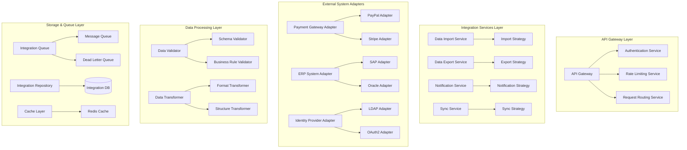
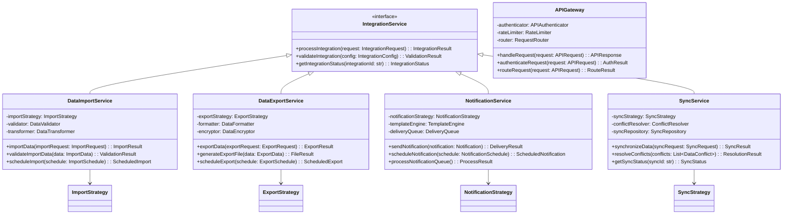
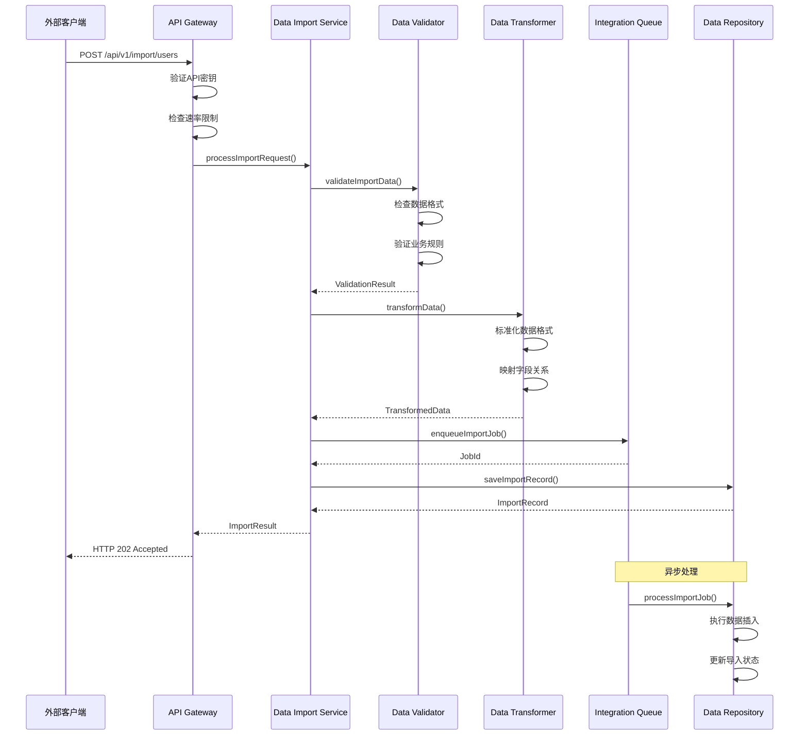
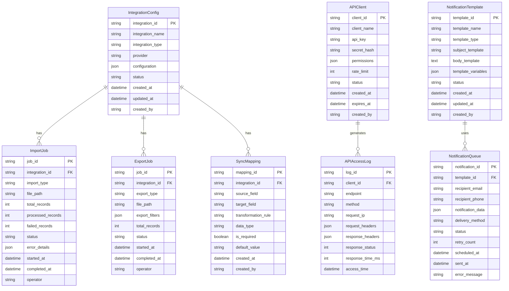

# 系统集成和API模块架构设计 (System Integration & API Module Design)

## 模块概述 (Module Overview)

### 职责
系统集成和API模块负责daloRADIUS与外部系统的数据交换、服务集成和接口管理。该模块专注于提供标准化的API接口、数据导入导出、第三方系统集成和实时数据同步能力，确保daloRADIUS能够与企业生态系统无缝集成。

### 设计目标
- **互操作性**: 提供标准化的REST API和数据交换接口
- **可扩展性**: 支持多种集成模式和第三方系统对接
- **数据一致性**: 确保跨系统数据同步的准确性和完整性
- **安全性**: 实现API访问控制、数据加密和审计追踪
- **高可用性**: 支持异步处理、重试机制和故障恢复

## 设计原则与模式 (Design Principles & Patterns)

### 原则应用
- **SRP**: 数据导入服务、导出服务、API网关、通知服务各司其职，功能职责清晰分离
- **OCP**: 通过策略模式支持新的集成协议和数据格式，无需修改核心代码
- **DIP**: 依赖抽象的集成接口，支持不同的外部系统和协议实现

### 设计模式
- **策略模式**: 用于不同的数据导入/导出格式和集成协议
- **适配器模式**: 用于适配不同第三方系统的接口差异
- **观察者模式**: 用于事件驱动的数据同步和通知机制
- **工厂模式**: 用于创建不同类型的集成连接器和数据处理器

## 架构视图 (Architectural Views)

### 组件图


### 类图


### 序列图 - 数据导入流程


## 关键接口与契约 (Key Interfaces & Contracts)

### 数据导入服务接口
**名称**: DataImportService  
**职责**: 处理外部数据的导入，包括用户数据、配置数据和计费数据的批量导入  
**方法签名**:
```python
class DataImportService:
    def import_users(self, import_request: UserImportRequest, operator: str) -> ImportResult:
        """批量导入用户数据 - 支持CSV、Excel、JSON等格式"""
        
    def import_radius_attributes(self, import_request: AttributeImportRequest, operator: str) -> ImportResult:
        """导入RADIUS属性字典 - 支持标准字典和自定义属性"""
        
    def validate_import_data(self, data: ImportData, validation_rules: ValidationRules) -> ValidationResult:
        """验证导入数据的完整性和合规性"""
        
    def preview_import(self, import_request: ImportRequest) -> ImportPreview:
        """预览导入数据，显示将要导入的记录统计"""
        
    def get_import_templates(self, import_type: ImportType) -> List[ImportTemplate]:
        """获取导入模板，帮助用户准备标准格式的数据"""
```

**预期行为契约**: 
- 导入前必须进行数据验证，验证失败则不执行导入
- 支持增量导入和全量替换两种模式
- 导入过程中发生错误时，提供详细的错误报告和回滚机制

### 数据导出服务接口
**名称**: DataExportService  
**职责**: 将系统数据导出为标准格式，支持多种输出格式和自定义查询条件  
**方法签名**:
```python
class DataExportService:
    def export_users(self, export_request: UserExportRequest, operator: str) -> ExportResult:
        """导出用户数据 - 支持过滤条件和字段选择"""
        
    def export_accounting_data(self, export_request: AccountingExportRequest, operator: str) -> ExportResult:
        """导出计费数据 - 支持时间范围和用户过滤"""
        
    def export_reports(self, export_request: ReportExportRequest, operator: str) -> ExportResult:
        """导出报表数据 - 支持CSV、PDF、Excel等格式"""
        
    def schedule_export(self, schedule_config: ExportScheduleConfig, operator: str) -> ScheduledExport:
        """调度定期导出任务"""
        
    def get_export_status(self, export_id: str) -> ExportStatus:
        """获取导出任务的执行状态和进度"""
```

**预期行为契约**:
- 大数据量导出采用分页和流式处理，避免内存溢出
- 敏感数据导出需要额外的权限验证和数据脱敏
- 导出文件支持加密和数字签名，确保数据安全

### API网关服务接口
**名称**: APIGateway  
**职责**: 提供统一的API入口，处理认证、授权、限流和路由  
**方法签名**:
```python
class APIGateway:
    def handle_api_request(self, request: APIRequest) -> APIResponse:
        """处理API请求 - 统一的请求入口点"""
        
    def authenticate_api_client(self, credentials: APICredentials) -> AuthenticationResult:
        """API客户端认证 - 支持API Key、JWT、OAuth2等方式"""
        
    def authorize_api_access(self, client: APIClient, resource: APIResource) -> AuthorizationResult:
        """API访问授权 - 基于角色和资源的访问控制"""
        
    def apply_rate_limiting(self, client: APIClient, endpoint: APIEndpoint) -> RateLimitResult:
        """应用速率限制 - 防止API滥用和DOS攻击"""
        
    def log_api_access(self, request: APIRequest, response: APIResponse) -> None:
        """记录API访问日志 - 用于审计和监控"""
```

**预期行为契约**:
- 所有API请求必须通过认证和授权验证
- 实施公平的速率限制策略，保护系统稳定性
- 提供详细的API访问日志和监控指标

### 通知服务接口
**名称**: NotificationService  
**职责**: 处理系统通知的生成、格式化和发送  
**方法签名**:
```python
class NotificationService:
    def send_welcome_notification(self, user_info: UserInfo, template_config: TemplateConfig) -> NotificationResult:
        """发送欢迎通知 - 新用户注册后的欢迎邮件"""
        
    def send_invoice_notification(self, invoice_info: InvoiceInfo, delivery_config: DeliveryConfig) -> NotificationResult:
        """发送发票通知 - 账单生成和付款提醒"""
        
    def send_system_alert(self, alert: SystemAlert, recipients: List[Recipient]) -> NotificationResult:
        """发送系统告警 - 系统异常和故障通知"""
        
    def schedule_recurring_notification(self, notification_config: RecurringNotificationConfig) -> ScheduledNotification:
        """调度周期性通知 - 定期报告和提醒"""
        
    def process_notification_queue(self) -> ProcessingResult:
        """处理通知队列 - 异步发送待发送的通知"""
```

**预期行为契约**:
- 通知发送失败时自动重试，达到最大重试次数后记录失败原因
- 支持多种通知渠道（邮件、短信、推送通知）的统一接口
- 提供通知模板管理和个性化内容生成

### 同步服务接口
**名称**: SyncService  
**职责**: 与外部系统进行数据同步，保持数据一致性  
**方法签名**:
```python
class SyncService:
    def sync_user_data(self, sync_config: UserSyncConfig, operator: str) -> SyncResult:
        """同步用户数据 - 与LDAP、AD等身份系统同步"""
        
    def sync_payment_data(self, sync_config: PaymentSyncConfig, operator: str) -> SyncResult:
        """同步支付数据 - 与支付网关和财务系统同步"""
        
    def sync_device_data(self, sync_config: DeviceSyncConfig, operator: str) -> SyncResult:
        """同步设备数据 - 与网络管理系统同步设备信息"""
        
    def resolve_sync_conflicts(self, conflicts: List[SyncConflict], resolution_strategy: ConflictResolutionStrategy) -> ResolutionResult:
        """解决同步冲突 - 处理数据不一致的情况"""
        
    def schedule_periodic_sync(self, sync_schedule: SyncSchedule, operator: str) -> ScheduledSync:
        """调度周期性同步任务"""
```

**预期行为契约**:
- 同步过程中检测和处理数据冲突，提供多种冲突解决策略
- 支持增量同步和全量同步两种模式
- 同步失败时提供详细的错误信息和恢复建议

## 数据模型 (Data Model)

### 集成实体关系图


## 演进性与考量 (Evolution & Considerations)

### 已知限制
1. **数据量限制**: 当前设计在超大数据量（千万级记录）导入导出时可能面临性能瓶颈
2. **实时性限制**: 某些同步操作采用批处理模式，无法满足严格的实时性要求
3. **协议支持**: 主要支持HTTP/REST协议，对于SOAP、GraphQL等协议支持有限

### 扩展方案
**基于OCP原则的扩展能力**:
- **新集成协议**: 通过实现IntegrationStrategy接口，支持新的集成协议（如GraphQL、gRPC）
- **新数据格式**: 通过实现DataFormatStrategy接口，支持新的数据格式（如Avro、Parquet）
- **新通知渠道**: 通过实现NotificationChannelStrategy接口，支持新的通知方式（如企业微信、钉钉）
- **新同步策略**: 通过实现SyncStrategy接口，支持新的同步算法和冲突解决机制

### 性能/安全考量
**性能优化**:
- 大数据量处理采用流式处理和分批处理机制
- 实施多级缓存策略，减少数据库访问压力
- 使用消息队列实现异步处理，提高系统响应性能

**安全措施**:
- API访问采用OAuth2.0和JWT令牌认证
- 敏感数据传输使用TLS加密
- 实施完整的审计日志记录和访问控制
- 数据导出支持字段级的脱敏和加密

**可靠性保障**:
- 实施分布式事务管理，确保数据一致性
- 提供自动故障检测和恢复机制
- 支持多种备份和恢复策略

通过这个系统集成和API模块的设计，daloRADIUS将具备强大的企业级集成能力，能够与各种外部系统无缝对接，为构建完整的企业数字化生态系统提供坚实的技术基础。