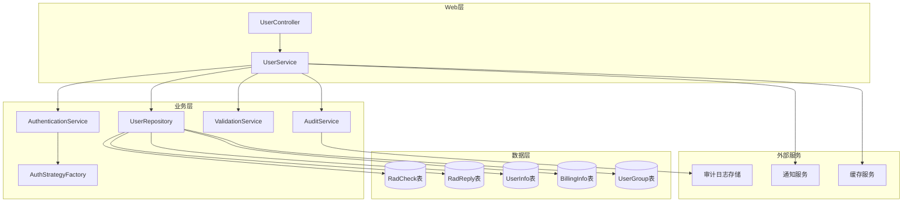
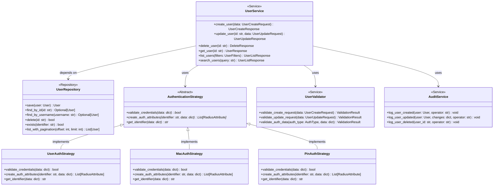
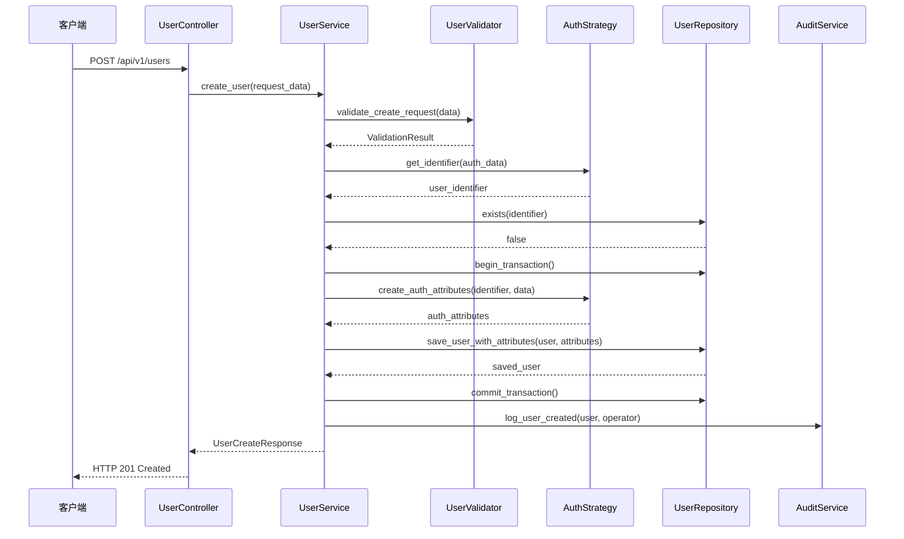
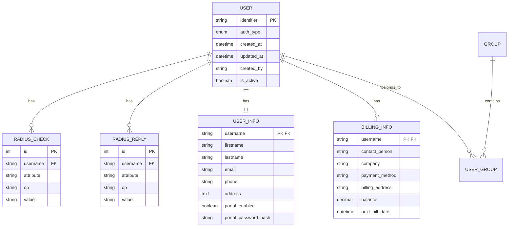

# 用户管理模块设计文档

## 一、模块概述 (Module Overview)

### 职责
用户管理模块负责RADIUS用户的完整生命周期管理，包括用户创建、查询、更新、删除以及相关的认证属性、用户组、个人信息和账单信息的统一管理。

### 设计目标
- **高内聚低耦合**: 通过领域驱动设计实现用户管理业务逻辑的集中化
- **可扩展性**: 支持多种认证类型的灵活扩展（用户名/密码、MAC地址、PIN码等）
- **数据一致性**: 通过事务机制确保跨表操作的原子性
- **安全性**: 实现完整的数据验证、权限控制和审计日志
- **性能优化**: 通过缓存策略和异步处理提升大量用户场景下的响应速度

## 二、设计原则与模式 (Design Principles & Patterns)

### 原则应用

**SRP (单一职责原则)**:
- `UserRepository`: 专注于用户数据持久化操作
- `AuthenticationService`: 专注于认证相关业务逻辑
- `UserValidator`: 专注于用户数据验证
- `AuditLogger`: 专注于操作审计记录

**OCP (开闭原则)**:
- `AuthenticationStrategy` 接口支持新认证类型的扩展
- `UserExporter` 接口支持多种用户数据导出格式
- `NotificationProvider` 接口支持多种通知方式

**DIP (依赖倒置原则)**:
- 业务服务层依赖抽象的Repository接口而非具体实现
- 通过依赖注入容器管理组件依赖关系

**KISS & YAGNI**:
- 避免过度抽象，仅为当前明确需求设计接口
- 采用简单直接的CRUD操作模式，不引入复杂的ORM映射

### 设计模式

**策略模式**: 用于处理不同认证类型的业务逻辑差异
```python
class AuthenticationStrategy(ABC):
    @abstractmethod
    def validate_credentials(self, data: dict) -> bool
    
    @abstractmethod  
    def create_auth_attributes(self, identifier: str, data: dict) -> List[RadiusAttribute]
```

**工厂模式**: 用于创建不同类型的认证策略实例
```python
class AuthenticationStrategyFactory:
    @staticmethod
    def create(auth_type: AuthType) -> AuthenticationStrategy
```

**观察者模式**: 用于用户操作事件的通知处理
```python
class UserEventPublisher:
    def publish(self, event: UserEvent) -> None
```

## 三、架构视图 (Architectural Views)

### 组件图 (Component Diagram)


### 类图 (Class Diagram)


### 序列图 (Sequence Diagram) - 用户创建流程


## 四、关键接口与契约 (Key Interfaces & Contracts)

### UserService 接口
**职责**: 用户管理的核心业务逻辑协调器
**方法签名**:
```python
class UserService:
    def create_user(self, data: UserCreateRequest, operator: str) -> UserCreateResponse:
        """创建新用户"""
        
    def update_user(self, user_id: str, data: UserUpdateRequest, operator: str) -> UserUpdateResponse:
        """更新用户信息"""
        
    def delete_user(self, user_id: str, operator: str) -> DeleteResponse:
        """删除用户及相关数据"""
        
    def get_user(self, user_id: str) -> Optional[UserResponse]:
        """获取用户详细信息"""
        
    def list_users(self, filters: UserFilters, pagination: Pagination) -> UserListResponse:
        """分页查询用户列表"""
```

**行为契约**:
- `create_user` 调用前必须确保用户标识符不存在
- `update_user` 调用前必须验证用户存在性
- 所有修改操作必须包含在数据库事务中
- 所有操作必须记录审计日志

### AuthenticationStrategy 接口
**职责**: 抽象不同认证类型的处理逻辑
**方法签名**:
```python
class AuthenticationStrategy(ABC):
    @abstractmethod
    def validate_credentials(self, data: dict) -> ValidationResult:
        """验证认证数据的有效性"""
        
    @abstractmethod
    def get_identifier(self, data: dict) -> str:
        """提取用户唯一标识符"""
        
    @abstractmethod
    def create_auth_attributes(self, identifier: str, data: dict) -> List[RadiusAttribute]:
        """创建RADIUS认证属性"""
```

**行为契约**:
- `validate_credentials` 必须在 `get_identifier` 之前调用
- `create_auth_attributes` 仅在验证通过后调用
- 所有方法都必须是幂等的

### UserRepository 接口
**职责**: 用户数据的持久化抽象层
**方法签名**:
```python
class UserRepository(ABC):
    @abstractmethod
    async def save(self, user: UserAggregate) -> UserAggregate:
        """保存用户聚合根"""
        
    @abstractmethod
    async def find_by_identifier(self, identifier: str) -> Optional[UserAggregate]:
        """根据标识符查找用户"""
        
    @abstractmethod
    async def delete_cascade(self, identifier: str) -> bool:
        """级联删除用户相关数据"""
        
    @abstractmethod
    async def exists(self, identifier: str) -> bool:
        """检查用户是否存在"""
```

**行为契约**:
- `save` 操作必须在事务上下文中执行
- `delete_cascade` 必须删除所有相关表的数据
- `find_by_identifier` 应返回完整的用户聚合对象

## 五、数据模型 (Data Model)

### 核心实体关系图


### 聚合根设计
```python
class UserAggregate:
    """用户聚合根 - 确保业务不变性"""
    
    def __init__(self, identifier: str, auth_type: AuthType):
        self.identifier = identifier
        self.auth_type = auth_type
        self.radius_attributes: List[RadiusAttribute] = []
        self.user_info: Optional[UserInfo] = None
        self.billing_info: Optional[BillingInfo] = None
        self.groups: List[UserGroup] = []
        self._domain_events: List[DomainEvent] = []
    
    def add_radius_attribute(self, attribute: RadiusAttribute) -> None:
        """添加RADIUS属性，确保业务规则"""
        
    def update_user_info(self, info: UserInfo) -> None:
        """更新用户信息，触发领域事件"""
        
    def assign_to_group(self, group: UserGroup) -> None:
        """分配用户组，验证权限"""
```

## 六、演进性与考量 (Evolution & Considerations)

### 已知限制
1. **认证类型扩展**: 当前设计假设认证类型相对稳定，新增认证类型需要实现策略接口
2. **大量用户性能**: 当用户数量超过10万时，需要考虑分库分表策略
3. **并发修改**: 当前设计未考虑乐观锁机制，高并发场景可能出现数据不一致

### 扩展方案
**新认证类型扩展**:
```python
# 通过实现接口轻松扩展
class CertificateAuthStrategy(AuthenticationStrategy):
    def validate_credentials(self, data: dict) -> ValidationResult:
        # 证书认证逻辑
        pass
        
    def create_auth_attributes(self, identifier: str, data: dict) -> List[RadiusAttribute]:
        # 证书相关属性
        pass
```

**批量操作扩展**:
```python
class UserBatchService:
    """批量用户操作服务 - 遵循OCP原则"""
    
    def bulk_create(self, users: List[UserCreateRequest]) -> BulkOperationResult:
        """批量创建用户"""
        
    def bulk_update(self, updates: List[UserUpdateRequest]) -> BulkOperationResult:
        """批量更新用户"""
```

**数据同步扩展**:
```python
class UserSynchronizer:
    """外部系统用户同步 - 通过接口扩展"""
    
    def sync_from_ldap(self, ldap_config: LDAPConfig) -> SyncResult:
        """从LDAP同步用户"""
        
    def sync_from_csv(self, csv_file: FileUpload) -> SyncResult:
        """从CSV文件导入用户"""
```

### 性能考量
**缓存策略**:
- 用户基本信息缓存（TTL: 30分钟）
- 用户组关联缓存（TTL: 1小时）
- 认证属性缓存（TTL: 15分钟）

**数据库优化**:
- `username` 字段建立唯一索引
- `auth_type` 和 `is_active` 建立复合索引
- 大表分页查询使用游标分页而非偏移分页

**异步处理**:
- 用户创建成功通知异步发送
- 批量操作使用消息队列处理
- 审计日志异步写入

### 安全考量
**数据保护**:
- 密码字段使用bcrypt哈希存储
- 个人信息字段加密存储
- 信用卡信息遵循PCI DSS标准

**访问控制**:
- 基于角色的权限控制（RBAC）
- 操作级别的权限验证
- 敏感操作需要二次确认

**审计要求**:
- 所有修改操作记录完整审计日志
- 数据访问日志保留6个月
- 关键操作支持审计追踪

---

本设计文档遵循现代软件架构最佳实践，通过清晰的接口定义和职责分离，为用户管理模块的重构提供了坚实的理论基础。设计强调简单性和可扩展性的平衡，避免过度工程化，确保系统能够稳定运行并支持未来的业务发展需求。