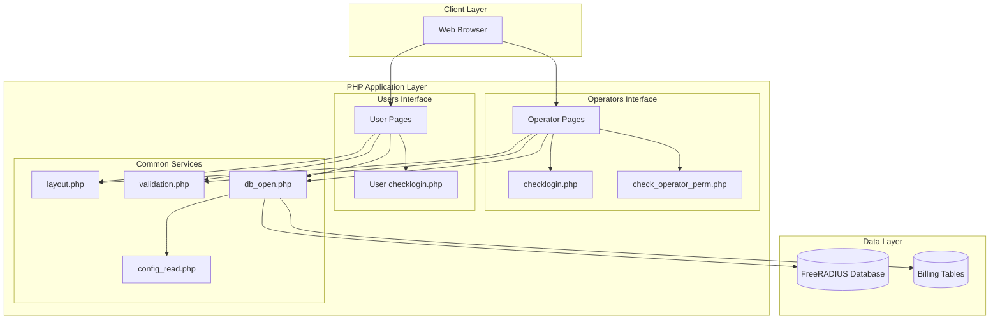
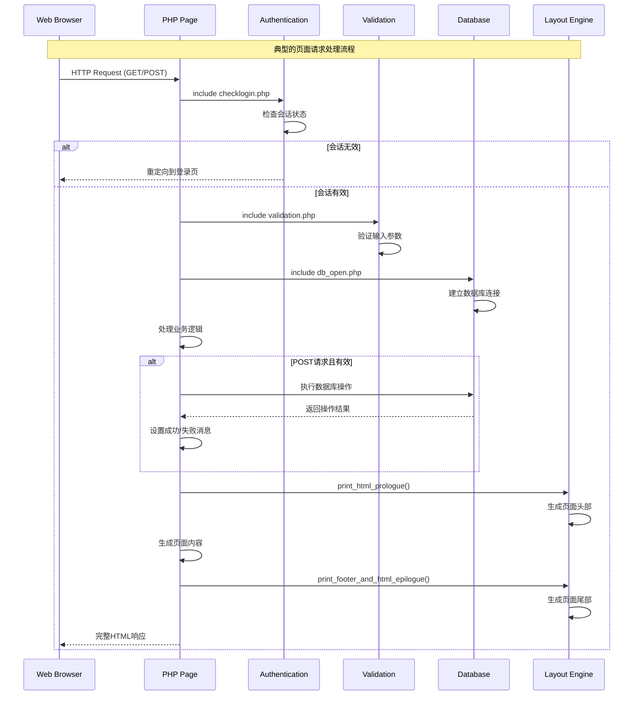
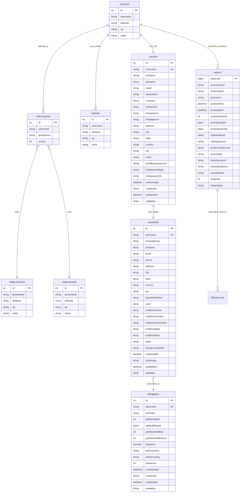

# daloRADIUS PHP版本 Web接口文档

## 模块概述 (Module Overview)

### 职责
本文档记录了当前PHP版本daloRADIUS系统的Web接口设计，基于深入的代码分析，真实反映系统的接口模式、数据结构和业务逻辑。系统采用传统的服务器端渲染模式，没有独立的REST API层，而是通过PHP页面处理HTTP请求并返回HTML响应。

### 设计目标
- **准确记录**：真实反映当前系统的接口实现
- **完整覆盖**：涵盖operators和users模块的所有关键接口
- **结构清晰**：按业务模块组织接口文档
- **便于重构**：为Python版本重构提供准确的接口参考

## 设计原则与模式 (Design Principles & Patterns)

### 核心设计模式
- **页面控制器模式**：每个PHP文件既是控制器又是视图，处理请求和渲染响应
- **表单驱动模式**：主要通过HTML表单POST提交处理业务操作
- **会话认证模式**：基于PHP Session的用户认证和权限控制
- **直接数据库访问**：无ORM层，直接使用PEAR DB进行数据库操作

### 安全机制
- **CSRF保护**：使用csrf_token防范跨站请求伪造
- **会话验证**：checklogin.php强制会话验证
- **权限检查**：check_operator_perm.php进行操作权限验证
- **输入验证**：validation.php提供数据验证规则

## 架构视图 (Architectural Views)

### 系统组件图 (Component Diagram)



### 请求处理流程图 (Sequence Diagram)



## 关键接口与契约 (Key Interfaces & Contracts)

### 认证授权接口

#### 操作员登录接口
**文件**: `app/operators/dologin.php`
**方法**: `POST`
**输入参数**:
```php
$_POST = [
    'operator_user' => string,      // 操作员用户名
    'operator_pass' => string,      // 操作员密码
    'location' => string,           // 可选，数据库位置
    'csrf_token' => string          // CSRF令牌
]
```

**处理逻辑**:
1. CSRF令牌验证
2. 用户名密码验证（查询operators表）
3. 创建会话，设置`$_SESSION['daloradius_logged_in'] = true`
4. 重定向到主页面

**输出响应**:
- 成功：重定向到`index.php`
- 失败：返回错误消息，显示登录表单

#### 用户登录接口
**文件**: `app/users/dologin.php`
**方法**: `POST`
**输入参数**:
```php
$_POST = [
    'login_user' => string,         // 用户名
    'login_password' => string,     // 密码
    'csrf_token' => string          // CSRF令牌
]
```

### 用户管理接口

#### 创建用户接口
**文件**: `app/operators/mng-new.php`
**方法**: `POST`
**输入参数**:
```php
$_POST = [
    // 认证信息
    'authType' => enum,             // "userAuth"|"macAuth"|"pincodeAuth"
    'username' => string,           // 用户名（userAuth时必需）
    'password' => string,           // 密码（userAuth时必需）
    'passwordType' => enum,         // 密码类型，从$valid_passwordTypes选择
    'macaddress' => string,         // MAC地址（macAuth时必需）
    'pincode' => string,            // PIN码（pincodeAuth时必需）
    'groups' => array,              // 用户组数组
    
    // 用户信息
    'firstname' => string,
    'lastname' => string,
    'email' => string,
    'department' => string,
    'company' => string,
    'workphone' => string,
    'homephone' => string,
    'mobilephone' => string,
    'address' => string,
    'city' => string,
    'state' => string,
    'country' => string,
    'zip' => string,
    'notes' => string,
    
    // 门户登录设置
    'portalLoginPassword' => string,
    'enableUserPortalLogin' => '1'|'0',
    'changeUserInfo' => '1'|'0',
    
    // 计费信息
    'bi_contactperson' => string,
    'bi_company' => string,
    'bi_email' => string,
    'bi_phone' => string,
    'bi_address' => string,
    'bi_city' => string,
    'bi_state' => string,
    'bi_country' => string,
    'bi_zip' => string,
    'bi_paymentmethod' => string,
    'bi_cash' => string,
    'bi_creditcardname' => string,
    'bi_creditcardnumber' => string,
    'bi_creditcardverification' => string,
    'bi_creditcardtype' => string,
    'bi_creditcardexp' => string,
    'bi_notes' => string,
    'bi_nextinvoicedue' => string,
    'bi_billdue' => string,
    
    // 自定义属性
    'dictAttributes' => array,       // 自定义RADIUS属性
    
    'csrf_token' => string
]
```

**处理逻辑**:
1. CSRF令牌验证
2. 根据authType验证必需字段
3. 检查用户是否已存在（调用user_exists()函数）
4. 插入radcheck表记录（认证信息）
5. 插入userinfo表记录（用户详细信息）
6. 插入userbillinfo表记录（计费信息）
7. 插入radusergroup表记录（用户组关联）
8. 处理自定义属性（调用handleAttributes()函数）

**输出响应**:
- 成功：显示成功消息，包含属性数量、组数量、用户信息和计费信息状态
- 失败：显示具体错误消息

#### 用户列表接口
**文件**: `app/operators/mng-list-all.php`
**方法**: `GET`
**输入参数**:
```php
$_GET = [
    'orderBy' => enum,              // 排序字段：id|fullname|username|auth|lastlogin
    'orderType' => enum,            // 排序方向：asc|desc
    'offset' => int,                // 分页偏移量（由分页组件处理）
    'rowsPerPage' => int            // 每页行数（由分页组件处理）
]
```

**查询逻辑**:
```sql
SELECT ui.id AS id, rc.username AS username, rc.value AS auth, rc.attribute,
       CONCAT(COALESCE(ui.firstname, ''), ' ', COALESCE(ui.lastname, '')) AS fullname,
       MAX(ra.acctstarttime) AS lastlogin
  FROM radcheck AS rc 
       LEFT JOIN radacct AS ra ON ra.username=rc.username, 
       userinfo AS ui
 WHERE rc.username=ui.username 
   AND (rc.attribute='Auth-Type' OR rc.attribute LIKE '%-Password')
 GROUP BY rc.username
 ORDER BY {orderBy} {orderType} 
 LIMIT {offset}, {rowsPerPage}
```

**输出响应**:
- HTML表格，包含用户ID、姓名、用户名、认证类型、最后登录时间、所属组
- 分页导航组件
- 支持按列排序

#### 编辑用户接口
**文件**: `app/operators/mng-edit.php`
**方法**: `GET`（显示表单）/ `POST`（提交修改）
**输入参数**:
```php
// GET请求
$_GET = [
    'username' => string            // 要编辑的用户名
]

// POST请求（字段与mng-new.php基本相同，但用于更新而非创建）
$_POST = [
    'username' => string,           // 不可修改，用于标识用户
    // ... 其他字段与创建用户接口相同
    'csrf_token' => string
]
```

#### 删除用户接口
**文件**: `app/operators/mng-del.php`
**方法**: `POST`
**输入参数**:
```php
$_POST = [
    // 删除单个属性
    'attribute' => string,          // 格式："{id}__{attribute_name}"
    'tablename' => enum,            // 表名：radcheck|radreply|radgroupcheck|radgroupreply
    
    // 或删除整个用户
    'username' => array|string,     // 用户名数组或单个用户名
    'delradacct' => 'yes'|'no',     // 是否同时删除会计记录
    
    // 或清除会话
    'clearSessionsUsers' => array,   // 用户名__开始时间数组
    
    'csrf_token' => string
]
```

**处理逻辑**:
1. 如果删除单个属性：检查是否为最后一个认证属性，防止删除
2. 如果删除整个用户：级联删除radcheck、radreply、userinfo、userbillinfo、radusergroup表记录
3. 根据delradacct标志决定是否删除radacct记录
4. 如果清除会话：删除指定的会话记录

### 账单管理接口

#### 创建发票接口
**文件**: `app/operators/bill-invoice-new.php`
**方法**: `POST`
**输入参数**:
```php
$_POST = [
    'user_id' => int,               // 用户ID（从userinfo表）
    'invoice_type_id' => int,       // 发票类型ID
    'invoice_status_id' => int,     // 发票状态ID
    'invoice_date' => string,       // 日期格式：YYYY-MM-DD
    'invoice_notes' => string,      // 备注
    'csrf_token' => string
]
```

**处理逻辑**:
1. 验证用户ID是否有效（查询userinfo表）
2. 验证发票类型和状态ID
3. 插入billinginvoice表
4. 调用add_invoice_items()函数添加发票项目
5. 返回新建发票ID和项目数量

#### 计费套餐管理接口
**文件**: `app/operators/bill-plans-*.php`系列文件
**主要操作**:
- `bill-plans-list.php`: 列出所有计费套餐
- `bill-plans-new.php`: 创建新套餐
- `bill-plans-edit.php`: 编辑套餐
- `bill-plans-del.php`: 删除套餐

**计费套餐数据结构**:
```php
$_POST = [
    'planName' => string,           // 套餐名称
    'planType' => enum,             // 套餐类型
    'planTimeBank' => int,          // 时间配额（秒）
    'planTrafficBank' => int,       // 流量配额（字节）
    'planBandwidthUp' => int,       // 上传带宽（kbps）
    'planBandwidthDown' => int,     // 下载带宽（kbps）
    'planPrice' => decimal,         // 价格
    'planCurrency' => string,       // 货币单位
    'planRecurring' => enum,        // 循环周期
    'planActive' => '1'|'0',        // 是否激活
    'csrf_token' => string
]
```

### 会计统计接口

#### 活跃用户查询接口
**文件**: `app/operators/acct-active.php`
**方法**: `GET`
**输入参数**:
```php
$_GET = [
    'orderBy' => enum,              // 排序字段：username|nasipaddress|acctstarttime等
    'orderType' => enum,            // 排序方向：asc|desc
    'nasipaddress' => string,       // 可选，NAS IP过滤
    'username' => string            // 可选，用户名过滤
]
```

**查询逻辑**:
```sql
SELECT username, framedipaddress, acctstarttime, acctsessiontime,
       acctinputoctets, acctoutputoctets, calledstationid, nasipaddress
  FROM radacct
 WHERE acctstoptime IS NULL OR acctstoptime = '0000-00-00 00:00:00'
   {AND nasipaddress LIKE '%nasip%'}
   {AND username LIKE '%username%'}
 ORDER BY {orderBy} {orderType}
```

#### 按日期查询会计记录接口
**文件**: `app/operators/acct-date.php`
**方法**: `GET`
**输入参数**:
```php
$_GET = [
    'username' => string,           // 用户名
    'startdate' => string,          // 开始日期 YYYY-MM-DD
    'enddate' => string,            // 结束日期 YYYY-MM-DD
    'orderBy' => enum,              // 排序字段
    'orderType' => enum             // 排序方向
]
```

#### 用户使用统计接口（Users模块）
**文件**: `app/users/acct-date.php`
**方法**: `GET`
**输入参数**:
```php
$_GET = [
    'startdate' => string,          // 开始日期
    'enddate' => string             // 结束日期
]
```

**特点**: 
- 自动使用当前登录用户（$_SESSION['login_user']）
- 用户只能查看自己的会计记录
- 数据结构与operators模块相同，但权限受限

### 报表接口

#### 在线用户报表接口
**文件**: `app/operators/rep-online.php`
**方法**: `GET`
**功能**: 显示当前在线用户列表，基于radacct表中acctstoptime为空的记录

#### 用户连接历史报表接口
**文件**: `app/operators/rep-history.php`
**方法**: `GET`
**输入参数**:
```php
$_GET = [
    'username' => string,           // 可选，用户名过滤
    'nasipaddress' => string,       // 可选，NAS IP过滤
    'startdate' => string,          // 可选，开始日期
    'enddate' => string             // 可选，结束日期
]
```

### 配置管理接口

#### 数据库配置接口
**文件**: `app/operators/config-db.php`
**方法**: `POST`
**输入参数**:
```php
$_POST = [
    'CONFIG_DB_ENGINE' => enum,     // 数据库引擎
    'CONFIG_DB_HOST' => string,     // 数据库主机
    'CONFIG_DB_PORT' => int,        // 数据库端口
    'CONFIG_DB_USER' => string,     // 数据库用户
    'CONFIG_DB_PASS' => string,     // 数据库密码
    'CONFIG_DB_NAME' => string,     // 数据库名
    'csrf_token' => string
]
```

#### 操作员管理接口
**文件**: `app/operators/config-operators-*.php`系列文件
**数据结构**:
```php
$_POST = [
    'username' => string,           // 操作员用户名
    'password' => string,           // 密码
    'firstname' => string,          // 名
    'lastname' => string,           // 姓
    'title' => string,              // 职位
    'department' => string,         // 部门
    'company' => string,            // 公司
    'phone1' => string,             // 电话1
    'phone2' => string,             // 电话2
    'email1' => string,             // 邮箱1
    'email2' => string,             // 邮箱2
    'messenger1' => string,         // 即时通讯1
    'messenger2' => string,         // 即时通讯2
    'notes' => string,              // 备注
    'csrf_token' => string
]
```

## 数据模型 (Data Model)

### 核心数据表结构



## 演进性与考量 (Evolution & Considerations)

### 已知限制

1. **无REST API设计**：当前系统采用传统的页面模式，每个PHP文件处理特定功能，缺乏统一的API接口
2. **HTML响应格式**：所有接口返回完整的HTML页面，无法支持Ajax或移动应用
3. **会话依赖**：严重依赖PHP Session，难以支持无状态的API调用
4. **数据验证分散**：验证逻辑分散在各个页面文件中，缺乏统一标准
5. **错误处理不一致**：不同页面的错误处理方式不同，没有统一的错误响应格式

### 接口模式特征

1. **多重功能页面**：多数页面同时处理GET（显示表单）和POST（处理提交）请求
2. **表单驱动**：主要业务操作通过HTML表单POST提交完成
3. **页面重定向**：成功操作后通常重定向到列表页面或主页面
4. **消息显示**：通过`$successMsg`和`$failureMsg`变量在页面上显示操作结果
5. **分页支持**：列表页面支持分页和排序，通过URL参数控制

### 数据处理特点

1. **直接SQL操作**：使用PEAR DB直接执行SQL语句，无ORM抽象
2. **手动参数绑定**：通过`$dbSocket->escapeSimple()`防止SQL注入
3. **事务处理**：复杂操作（如创建用户）涉及多表操作，但缺乏显式事务管理
4. **级联删除**：删除用户时手动删除相关表记录，保证数据一致性

### 安全考量

1. **CSRF保护**：所有POST请求都要求csrf_token验证
2. **会话验证**：每个页面都通过checklogin.php验证用户登录状态
3. **权限控制**：操作员页面通过check_operator_perm.php进行权限检查
4. **输入验证**：使用validation.php中定义的正则表达式验证用户输入
5. **输出转义**：使用htmlspecialchars()防止XSS攻击

### Python重构建议

基于当前接口分析，Python重构时需要考虑：

1. **API设计**：将页面功能分解为RESTful API接口
2. **数据模型**：使用ORM（如SQLAlchemy）替代直接SQL操作
3. **认证机制**：设计基于Token的认证替代Session
4. **错误处理**：统一的错误响应格式和异常处理机制
5. **数据验证**：使用Pydantic等库进行结构化数据验证
6. **权限系统**：设计基于角色的访问控制（RBAC）系统

---

本接口文档基于对daloRADIUS PHP版本的深入代码分析，真实反映了当前系统的接口设计和数据处理模式，为Python重构提供准确的参考依据。